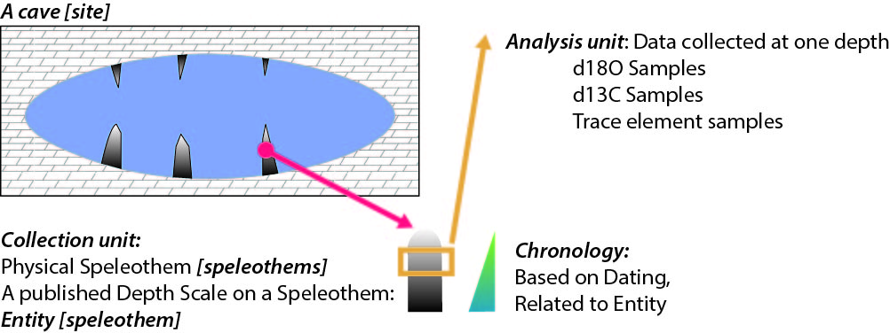

```{r setup, echo=FALSE}
options(warn = -1)
pacman::p_load(neotoma2, dplyr, ggplot2, sf, geojsonsf, leaflet, flextable, readr, stringr, tidyr, patchwork)
```

# Introduction

This document is intended to act as a primer for a new workflow using the Neotoma R package, neotoma2, in combination with the Past Global Changes Speleothem Isotopes Synthesis and AnaLysis database (PAGES [SISAL](https://pastglobalchanges.org/science/wg/sisal/intro) from hereon SISAL) .

The SISAL database has recently been implemented as a constitutent database in Neotoma and can therefore be accessed and investigated with the R package neotoma2.
The SISALv3 database can also be accessed directly at <https://doi.org/10.5287/ora-2nanwp4rk> (Kaushal et al., 2024) or through the [SISALwebapp](https://geochem.hu/SISAL_webApp/).

Some users may be working with this document as part of a workshop or self-paced through a Binder instance.
The Binder instance will run RStudio in your browser, with all the required packages installed.
If you are using this workflow on its own, or want to use the package directly, the neotoma2 package is available on CRAN by running:

``` r
install.packages('neotoma2')
library(neotoma2)
```

If you are on a Mac with ARM64 (Apple Silicon) or for the most updated version, use:

```r
remotes::install_github("NeotomaDB/neotoma2@production")
library(neotoma2)
```

Your version should be at or above `r packageVersion("neotoma2")`.

This workshop will also require other packages.
To maintain the flow of this document we've placed instructions at the end of the document in the section labelled "[Installing packages on your own](#localinstall)".
Please install these packages, and make sure they are at the lastest version.

# Learning Goals

In this tutorial you will learn:

1.  [Background](#1-background): The basics about Neotoma, SISAL and speleothem proxy interpretation
2.  [Site Searches](#2-site-searches): How to access speleothem data in neotoma - Search for sites using site names and geographic parameters.
3.  [Filter Results](#3-filter-records-tabset): Filter results using temporal and spatial parameters.
4.  [Explore Data](#4-pulling-in-sample-data): Obtain sample information for the selected datasets.
5.  [Visualize Data](#5-simple-analytics): Perform basic Stratigraphic Plotting

# Background {#1-background}

## SISAL

The Speleothem Isotopes Synthesis and AnaLysis ([SISAL](https://pastglobalchanges.org/science/wg/sisal/intro))project is an international scientific effort under the PAGES (Past Global Changes) program.
It brings together climate researchers and data contributors to compile, standardize, and analyze data from speleothems.
Since its creation, SISAL has produced several versions of a global database ([SISALv1](https://doi.org/10.5194/essd-10-1687-2018), [v1b](http://researchdata.reading.ac.uk/id/eprint/189), and [v2](https://doi.org/10.5194/essd-12-2579-2020)), focusing on stable isotope records (oxygen and carbon isotopes) and rich metadata.
The database enables investigation of climate variability across different regions and time periods; and supports comparison with climate models.
The latest release, [SISALv3](https://doi.org/10.5194/essd-16-1933-2024), has significantly expanded the database.
It includes new hydroclimate-sensitive geochemical proxies, such as trace elements (e.g., Mg/Ca, Sr/Ca, Ba/Ca, U/Ca, P/Ca) and strontium isotope ratios (⁸⁷Sr/⁸⁶Sr), providing deeper insights into past water availability and cave system processes.
The database now contains data from 365 cave sites worldwide (see figure 1), with improved metadata for environmental context (such as vegetation, geology, and land use).


### Getting Involved with SISAL

Researchers from all career stages, regions, and related fields are encouraged to participate and collaborate with SISAL.
To get involved, you can contact the SISAL Working Group [here](https://pastglobalchanges.org/science/wg/sisal/people).

If you have specific feedback or run into issues when working with the SISAL database, you can contact the SISAL-Neotoma data stewards, Nikita Kaushal ([nikitageologist\@gmail.com](mailto:nikitageologist@gmail.com){.email}) and Laura Endres ([endres\@eaps.ethz.ch](mailto:endres@eaps.ethz.ch){.email})

### Understanding Data Structure in SISAL

The Figure below illustrates the data schema of the SISAL database.
The data is organized in a set of relational tables, with the data schema showing the relationships among tables and key attributes explicitly.
The core of the database structure is the Entity table, which in most cases represents a speleothem, typically a stalagmite.
For each entity, the sample tables contain the actual measurements such as stable isotopes (e.g., δ¹⁸O, δ¹³C) and trace elements. 
Further, the Dating table contains all information required to construct age models, including radiometric dating results (e.g., ²³⁰Th, ²³⁴U content), uncertainties, and calibration methods.
These data are used to derive chronologies in the SISAL chronology table, which provides standardized interpolated and model-based ages (e.g., Bacon, OxCal, copRa) that are provided beside the original chronology.
Additional tables (e.g., Hiatus, Gap) refine or support the age-depth modelling.
Information on data types and relationships is provided in the reference table.
Sources of the data are provided in the reference table.


## Neotoma

The Neotoma Paleoecology Database is a collaborative, open-access database for Paleoecological data, including fossil pollen, plant macrofossils, charcoal, diatoms, and vertebrates.
The neotoma2 R package is the companion to the [Introduction to Neotoma presentation](https://docs.google.com/presentation/d/1Fwp5yMAvIdgYpiC04xhgV7OQZ-olZIcUiGnLfyLPUt4/edit?usp=sharing).

### Getting Help with Neotoma

If you are planning on working with Neotoma, please join us on [Slack](https://join.slack.com/t/neotomadb/shared_invite/zt-cvsv53ep-wjGeCTkq7IhP6eUNA9NxYQ) where we manage a channel specifically for questions about the R package (the *#it_r* channel, or *#it_r_es* for R help in Spanish and *#it_r_jp* in Japanese).
You may also wish to join the Neotoma community through our Google Groups mailing lists; please [see the information on our website](https://www.neotomadb.org/about/join-the-neotoma-community) to be added.

### Understanding Data Structures in Neotoma

Data in the Neotoma database itself is structured as a set of linked relationships to express different elements of paleoecological analysis:

-   space and time
    -   Where is a sample located in latitude and longitude?
    -   Where is a sample along a depth profile?
    -   What is the estimated age of that sample?
    -   What is the recorded age of elements within or adjacent to the sample?
-   observations
    -   What is being counted or measured?
    -   What units are being used?
    -   Who observed it?
-   scientific methods
    -   What statistical model was used to calculate age?
    -   What uncertainty terms are used in describing an observation?
-   conceptual data models
    -   How do observations in one sample relate to other samples within the same collection?
    -   How does an observation of a fossil relate to extant or extinct relatives?

These relationships can be complex because paleoecology is a broad and evolving discipline.
As such, the database itself is highly structured, and normalized, to allow new relationships and facts to be added, while maintaining a stable central data model.
If you want to better understand concepts within the database, you can read the [Neotoma Database Manual](https://open.neotomadb.org/manual), or take a look at [the database schema itself](https://open.neotomadb.org/dbschema).

In this workshop we want to highlight two key structural concepts:

1.  The way data is structured conceptually within Neotoma (Sites, Collection Units and Datasets).
2.  The way that this structure is adapted within the `neotoma2` R package.

### Data Structure in the Neotoma Database

{width="50%"}

{width="50%"}

Data in Neotoma is associated with **sites** -- specific locations with latitude and longitude coordinates.

Within a **site**, there may be one or more [**collection units**](https://open.neotomadb.org/manual/dataset-collection-related-tables-1.html#CollectionUnits) -- locations at which samples are physically collected within the site:

-   a cave **site** may have one or more **collection units**, cores within specific speleothem **entities**
-   an archaeological **site** may have one or more **collection units**, pits within a broader dig site
-   a pollen sampling **site** on a lake may have multiple **collection units** -- core sites within the lake basin.
-   A bog sample **site** may have multiple **collection units** -- a transect of surface samples within the bog.

Collection units may have higher resolution GPS locations than the site location, but are considered to be part of the broader site.

Data within a **collection unit** is collected at various [**analysis units**](https://open.neotomadb.org/manual/sample-related-tables-1.html#AnalysisUnits).

- 	All carbonate material at a certain depth within a speleothem (the collection unit) from a cave (the site) is an analysis unit. 
-   All sediment at 10 cm depth in the depth profile of a cutbank (the collection unit) along an oxbow lake (the site) is one analysis unit.
-   All material in a single surface sample (the collection unit) from a bog (the site) is an analysis unit.
-   All fossil remains in a buried layer from a bone pile (the collection unit) in a cave (the site) is an analysis unit.

Any data sampled within an analysis unit is grouped by the dataset type (charcoal, diatom, dinoflagellate, etc.) and aggregated into a [**sample**](https://open.neotomadb.org/manual/sample-related-tables-1.html#Samples).
The set of samples for a collection unit of a particular dataset type is then assigned to a [**dataset**](https://open.neotomadb.org/manual/dataset-collection-related-tables-1.html#Datasets).

-   A sample would be all geochemical measurements, such as $\delta ^{18}O$ (the dataset type), from a specific depth (the analysis unit) in a speleothem (the collection unit) collected in a cave (the site).
-   A sample would be all diatoms (the dataset type) extracted from sediment at 12 cm (the analysis unit) in a core (the collection unit) obtained from a lake (the site).
-   A sample would be the record of a single mammoth bone (sample and analysis unit, dataset type is vertebrate fauna) embedded in a riverbank (here the site, and collection unit).

#### Data Structures in `neotoma2` {#222-data-structures-in-neotoma2}


If we look at the [UML diagram](https://en.wikipedia.org/wiki/Unified_Modeling_Language) for the objects in the `neotoma2` R package we can see that the data structure generally mimics the structure within the database itself.
As we will see in the [Site Searches section](#2-site-searches), we can search for these objects, and begin to manipulate them (in the [Simple Analysis section](#5-simple-analytics)).

It is important to note: *within the `neotoma2` R package, most objects are `sites` objects, they just contain more or less data*.
There are a set of functions that can operate on `sites`.
As we add to `sites` objects, using `get_datasets()` or `get_downloads()`, we are able to use more of these helper functions.

## Merging SISAL and Neotoma

Merging SISAL with Neotoma brings significant benefits to the paleoclimate community.
It improves visibility to speleothem data for non-specialists and enables integrated multi-proxy, multi-archive analyses.

For those who contribute data, it increases data visibility and the likelihood of citation by a wider scientific audience.
The datasets will be well documented, quality-controlled and aligned with open data standards.
The integration also supports the inclusion of new proxies, such as pollen and biomarkers, in speleothem datasets.
Please note that in the current version, only individual SISAL entities but no composites are available in Neotoma.

# Working with neotoma2

## Site Searches {#2-site-searches}

### `get_sites()`

There are several ways to find sites in `neotoma2`, but we think of `sites` as being spatial objects primarily.
They have names, locations, and are found within the context of geopolitical units, but within the API and the package, the site itself does not have associated information about taxa, dataset types or ages.
It is simply the container into which we add that information.
So, when we search for sites we can search by:

| Parameter | Description |
|---------------------------------|---------------------------------------|
| sitename | A valid site name (case insensitive) using `%` as a wildcard. |
| siteid | A unique numeric site id from the Neotoma Database |
| loc | A bounding box vector, geoJSON or WKT string. |
| altmin | Lower altitude bound for sites. |
| altmax | Upper altitude bound for site locations. |
| database | The constituent database from which the records are pulled. |
| datasettype | The kind of dataset (see `get_tables(datasettypes)`) |
| datasetid | Unique numeric dataset identifier in Neotoma |
| doi | A valid dataset DOI in Neotoma |
| gpid | A unique numeric identifier, or text string identifying a geopolitical unit in Neotoma |
| keywords | Unique sample keywords for records in Neotoma. |
| contacts | A name or numeric id for individuals associuated with sites. |
| taxa | Unique numeric identifiers or taxon names associated with sites. |

All sites in Neotoma contain one or more datasets.
It's worth noting that the results of these search parameters may be slightly unexpected.
For example, searching for sites by sitename, latitude, or altitude will return all of the datasets for the particular site.
Searching for terms such as datasettype, datasetid or taxa will return the site, but the only datasets returned will be those matching the dataset-specific search terms.
We'll see this later.

#### Site names: `sitename="%cave%"`

We may know exactly what site we're looking for ("Wonderwerk Cave"), or have an approximate guess for the site name (for example, we know it's something like "Wonderwerk", but we're not sure how it was entered specifically), or we may want to search all sites that have a specific term, for example, *cave*.

We use the general format: `get_sites(sitename="%cave%")` for searching by name.

PostgreSQL (and the API) uses the percent sign as a wildcard.
So `"%cave%"` would pick up ["Wonderwerk Cave"](https://data.neotomadb.org/52262) for us (and also picks up "Equus Cave" and "Spring Cave shelter").
Note that the search query is also case insensitive.

```{r sitename}
Sys.setenv(APIPOINT="dev")

cave_sites <- neotoma2::get_sites(sitename = "%cave%")
plotLeaflet(cave_sites)
```


#### Location: `loc=c()`

The original `neotoma` package used a bounding box for locations, structured as a vector of latitude and longitude values: `c(xmin, ymin, xmax, ymax)`.
The `neotoma2` R package supports both this simple bounding box, but also more complex spatial objects, using the [`sf` package](https://r-spatial.github.io/sf/).
Using the `sf` package allows us to more easily work with raster and polygon data in R, and to select sites from more complex spatial objects.
The `loc` parameter works with the simple vector, [WKT](https://arthur-e.github.io/Wicket/sandbox-gmaps3.html), [geoJSON](http://geojson.io/#map=2/20.0/0.0) objects and native `sf` objects in R.

As an example of searching for sites using a location, we've created a rough representation of Africa as a polygon.
To work with this spatial object in R we also transformed the `geoJSON` element to an object for the `sf` package.
There are many other tools to work with spatial objects in R.
Regardless of how you get the data into R, `neotoma2` works with almost all objects in the `sf` package.

```{r boundingBox}
geoJSON <- '{"type": "Polygon",
        "coordinates": [[
            [-7.030,  36.011],
            [-18.807, 23.537],
            [-19.247, 10.282],
            [-9.139,  -0.211],
            [18.370, -37.546],
            [35.069, -36.352],
            [49.571, -27.097],
            [58.185,   0.755],
            [53.351,  13.807],
            [43.946,  12.008],
            [31.202,  33.629],
            [18.897,  34.648],
            [12.393,  35.583],
            [11.075,  38.184],
            [-7.030,  36.011]
          ]
        ]}'

africa_sf <- geojsonsf::geojson_sf(geoJSON)

# Note here we use the `all_data` flag to capture all the sites within the polygon.
# We're using `all_data` here because we know that the site information is relatively small
# for Africa. If we were working in a new area or with a new search we would limit the
# search size.
africa_sites <- neotoma2::get_sites(loc = africa_sf, all_data = TRUE)
```

You can always simply `plot()` the `sites` objects, but you will lose some of the geographic context.
The `plotLeaflet()` function returns a `leaflet()` map, and allows you to further customize it, or add additional spatial data (like our original bounding polygon, `sa_sf`, which works directly with the R `leaflet` package):

Note the use of the `%>%` pipe here.
If you are not familiar with this symbol, check our ["Piping in R" section](#piping-in-r) of the Appendix.

```{r plotL}
neotoma2::plotLeaflet(africa_sites) %>% 
  leaflet::addPolygons(map = ., 
                       data = africa_sf, 
                       color = "green")
```


#### `site` Object Helpers

If we look at the [data structure diagram](#222-data-structures-in-neotoma2) for the objects in the `neotoma2` R package we can see that there are a set of functions that can operate on `sites`.
As we retrieve more information for `sites` objects, using `get_datasets()` or `get_downloads()`, we are able to use more of these helper functions.

As it is, we can take advantage of functions like `summary()` to get a more complete sense of the types of data we have in `africa_sites`.
The following code gives the summary table.
We do some R magic here to change the way the data is displayed (turning it into a [`flextable()`](https://ardata-fr.github.io/flextable-book/) object), but the main piece is the `summary()` call.


```{r summary_sites}
# Give information about the sites themselves, site names & cetera.
neotoma2::summary(africa_sites) %>% 
  head() %>% 
  flextable() %>% 
  fontsize(size = 8, part = "all") %>%
  autofit() 
# Give the unique identifiers for sites, collection units and datasets found at those sites.
head(neotoma2::getids(africa_sites))   %>% 
  head() %>% 
  flextable() %>% 
  fontsize(size = 8, part = "all") %>%
  autofit() 
```


In this document we list only the first 10 records (there are more, you can use `length(datasets(africa_sites))` to see how many datasets you've got).
We can see that there are no chronologies associated with the `site` objects.
This is because, at present, we have not pulled in the `dataset` information we need.
In Neotoma, a chronology is associated with a collection unit (and that metadata is pulled by `get_datasets()` or `get_downloads()`).
All we know from `get_sites()` are the kinds of datasets we have and the location of the sites that contain the datasets.

### `get_datasets()` {#422-result}

Within Neotoma, collection units and datasets are contained within sites.
Similarly, a `sites` object contains `collectionunits` which contain `datasets`.
From the table above (Result tab in Section 3.1.3.2) we can see that some of the sites we've looked at contain pollen records, some contain geochronologic data and some contain other dataset types.
We could write something like this: `table(summary(africa_sites)$types)` to see the different datasettypes and their counts.

With a `sites` object we can directly call `get_datasets()` to pull in more metadata about the datasets.
The `get_datasets()` method also supports any of the search terms listed above in the [Site Search](#2-site-searches) section.
At any time we can use `datasets()` to get more information about any datasets that a `sites` object may contain.
Compare the output of `datasets(africa_sites)` to the output of a similar call using the following:


```{r datasetsFromSitesResult, message=FALSE}
africa_datasets <- neotoma2::get_datasets(loc = africa_sf, all_data = TRUE)

datasets(africa_datasets) %>% 
  as.data.frame() %>% 
  head() %>% 
  flextable() %>% 
  fontsize(size = 8, part = "all") %>%
  width(width = 1.2) %>%
  autofit() 
```

You can see that this provides information only about the specific dataset, not the site!
For a more complete record we can join site information from `summary()` to dataset information using `datasets()` using the `getids()` function which links sites, and all the collection units and datasets they contain.

### `filter()` Records {#3-filter-records-tabset}

If we choose to pull in information about only a single dataset type, or if there is additional filtering we want to do before we download the data, we can use the `filter()` function.
For example, if we only want sedimentary pollen records (as opposed to pollen surface samples), and want records with known chronologies, we can filter by `datasettype` and by the presence of an `age_range_young`, which would indicate that there is a chronology that defines bounds for ages within the record.

**Note**: At present filtering on some of the speleothem entity parameters isn't built into the `neotoma2` R package.
We would love to work on this with folks!

```{r downloadsCode}
africa_speleothem <- africa_datasets %>% 
  neotoma2::filter(datasettype == 'speleothem')

africa_east <- africa_datasets %>%
  neotoma2::filter(long > 20)

neotoma2::summary(africa_speleothem) %>% 
  head() %>% 
  flextable() %>% 
  fontsize(size = 8, part = "all") %>%
  autofit() 
```

We can see now that the data table looks different (comparing it to the [table above](#422-result)), and there are fewer total sites.
Again, there is no explicit chronology for these records, we need to pull down the complete download for these records, but we begin to get a sense of what kind of data we have.

### Pulling in `sample()` data {#4-pulling-in-sample-data}

Because sample data adds a lot of overhead (for some pollen data, the object that includes the dataset with samples is 20 times larger than the `dataset` alone), we try to call `get_downloads()` only after we've done our preliminary filtering.
After `get_datasets()` you have enough information to filter based on location, time bounds and dataset type.
When we move to `get_download()` we can do more fine-tuned filtering at the analysis unit or taxon level.

The following call can take some time, but we've frozen the object as an RDS data file.
You can run this command on your own, and let it run for a bit, or you can just load the object in.


```{r taxaCode}
## This line is commented out because we've already run it for you.
#africa_dl <- africa_datasets %>% get_downloads(all_data=FALSE) 

## with data=FALSE we just get the first 25 sites. 
## We can also with `limit=1000` to limit the serach to a certain number of sites.  
## Currently there is an API issue that forces us to limit the output (is currently under revision).

## Save your outputs as repeating the call may be time intensive.
#saveRDS(africa_dl, "data/africaDownload.RDS")
africa_dl <- readRDS("data/africaDownload.RDS") 

as.data.frame(africa_dl) %>% 
  head() %>% 
  flextable() %>% 
  fontsize(size = 8, part = "all") %>%
  width(width = 1.2) %>%
  autofit() 
```
Once we've downloaded, we now have information for each site about all the associated collection units, the datasets, and, for each dataset, all the samples associated with the datasets.
To extract samples all downloads we can call:


```{r allSampleCode}
allSamp <- samples(africa_dl)
```

When we've done this, we get a `data.frame` that is `r nrow(allSamp)` rows long and `r ncol(allSamp)` columns wide.
The reason the table is so wide is that we are returning data in a **long** format.
Each row contains all the information you should need to properly interpret it:

```{r colNamesAllSampResult}
colnames(allSamp)
```

For some dataset types or analyses, some of these columns may not be needed, however, for other dataset types they may be critically important.
To allow the `neotoma2` package to be as useful as possible for the community we've included as many as we can.

What is critically important to note as you work is that any variable is explicitly defined as the combination of the `variablename`, the `units`, and then `context` and `symmetry`.
This is because Neotoma contains both instrument measured data, but also faunal remains and plant element, so we might describe δ^18^O in *per mille* units, but also the left half of an oxen skull measured using MNI (minimum number of individuals).

It's also important to note that the date of a single sample is identified using the `age`, and the `agetype`, along with a pointer to the `chronology` used for the record and the uncertainty (as `ageolder` and `ageyounger` for the sample.

### Ensuring we have entity information

There are two tables associated with `SISALv3` entities if we want more information about them.
In the future we will be adding more support for speleothems in the R package, but for now we can connect the individual entity attributes to the samples table using the `speleothems.R` script that embeds some SQL magic in R.


```{r add_entityCode}
source('src/speleothems.R')
samp_w_entity <- speleothems(allSamp)
```

As we move forward we will improve the integration of entity data within Neotoma.

#### Extracting Taxa

If you want to know what has been measured in the records you can use the helper function `taxa()` on the sites object.
The `taxa()` function gives us not only the unique taxa, but two additional columns -- `sites` and `samples` -- that tell us how many sites the taxa appear in, and how many samples the taxa appear in, to help us better understand how common individual taxa are.


```{r taxa2Code, message=FALSE}
neotomatx <- africa_dl %>% neotoma2::filter(datasettype == 'speleothem') %>% taxa()
neotomatx %>% 
  head() %>% 
  flextable() %>% 
  fontsize(size = 8, part = "all")  %>%
  width(width = 1.2) %>%
  autofit() 
```

#### Understanding Taxonomies in Neotoma {.unnumbered}

Taxonomies in Neotoma are not as straightforward as we might expect.
Taxonomic identification in paleoecology can be complex, impacted by the morphology of the object we are trying to identify, the condition of the palynomorph, the expertise of the analyst, and many other conditions.
You can read more about concepts of taxonomy within Neotoma in the Neotoma Manual's [section on Taxonomic concepts](https://open.neotomadb.org/manual/database-design-concepts.html#taxonomy-and-synonymy).

We use the unique identifiers (*e.g.*, `taxonid`, `siteid`, `analysisunitid`) throughout the package, since they help us to link between records.
The `taxonid` values returned by the `taxa()` call can be linked to the `taxonid` column in the `samples()` table.
This allows us to build taxon harmonization tables if we choose to.
You may also note that the `taxonname` is in the field `variablename`.
Individual sample counts are reported in Neotoma as [`variables`](https://open.neotomadb.org/manual/taxonomy-related-tables-1.html#Variables).
A "variable" may be either a species, something like laboratory measurements, or a non-organic proxy, like charcoal or XRF measurements, and includes the units of measurement and the value.

For SISAL speleothems, the available taxons are either related to the dating table (230Th, 232Th, 238U measurements) or to geochemical measurements of stable isotopes ($\delta^{18}O,\delta^{13}C$) and trace elements (Ba/Ca,Mg/Ca,Sr/Ca,U/Ca,P/Ca,Sr88/Sr86).

## Simple Analytics

### Stratigraphic Plotting {#5-simple-analytics}

To plot a strategraphic diargram we are only interested in one site and in one dataset.
By looking at the summary of downloads we can see that Lake Solsø has two collection units that both have a pollen record.
Let us look at the SOLSOE81 collection unit, which is the second download.
To get the samples from just that one collection unit by specifying that you want only the samples from the second download.

We can use packages like `rioja` to do stratigraphic plotting for a single record, but first we need to do some different data management.
Although we could do harmonization again we're going to simply take the taxa at a single site and plot them in a stratigraphic diagram.
However, if you would like to plot multiple sites and you want them to have harmonized taxa we have provided examples on how to do both.

#### Raw Taxon

```{r stratiplotrawCode, message = FALSE}
# Get a particular site, in this case we are simply subsetting the
# `africa_dl` object to get only speleothems:
plottingSite <- africa_dl %>%
  neotoma2::filter(datasettype == 'speleothem')

# Select a singular site by choosing a number in the plottingSite (here: Cango Cave).
# Select only isotope data measured on speleothems by choosing the ecologicalgroup ITOP and convert to a "wide"
# table, using proportions. The first column will be "age".
# This turns our "long" table into a "wide" table:
values <- plottingSite[[1]] %>%
  samples() %>%
  toWide(ecologicalgroup = c("ITOP"),
         unit = c("per mille"),
         groupby = "age",
         elementtype = NA,
         operation = "sum") %>%
  arrange(age) %>% na.omit()

values %>% 
  head() %>% 
  flextable() %>% 
  fontsize(size = 8, part = "all") %>%
  autofit() 
```

Hopefully the code is pretty straightforward.
The `toWide()` function provides you with significant control over the taxa, units and other elements of your data before you get them into the wide matrix (`depth` by `taxon`) that most statistical tools such as the `vegan` package or `rioja` use.

To plot the data we can use `ggplot`.

#### Isotope Values from a single entity


```{r plotIsotopesCode, message=FALSE, warning=FALSE, out.width='90%'}

# Make sure age is in descending order (younger to older)
values <- values %>% arrange(desc(age))

# d18O plot (top)
p1 <- ggplot(values, aes(x = age, y = δ18O)) +
  geom_line(color = "steelblue") +
  #scale_x_reverse() +
  theme_minimal() +
  labs(y = expression(delta^{18}*O*" ("*"\u2030"*")"), x = NULL)

# d13C plot (bottom)
p2 <- ggplot(values, aes(x = age, y = δ13C)) +
  geom_line(color = "darkgreen") +
  #scale_x_reverse() +
  theme_minimal() +
  labs(y = expression(delta^{13}*C* "("*"\u2030"*")"), x = "Age (years BP)")

# Combine the two plots and add a title
(p1 / p2) + plot_annotation(title = paste('Data from',plottingSite[[1]]$sitename))
```

### Multi-proxy Analysis
Here, data from speleothems is combined with pollen data in Neotoma, e.g. comparison of speleothem isotope data and Ficus pollen on the African continent. Please note, that due to the ongoing update of the neotoma2 API only the first 25 sites were downloaded, so the datasets shown here are limited. 


```{r sillyploteval, warning = FALSE}

spSamp <- allSamp %>%
  filter(ecologicalgroup %in% c('TRSH', 'ITOP')) %>%
  filter(units %in% c('per mille', 'NISP'))
  
spPct <- spSamp %>%
  group_by(sitename, depth) %>%
  mutate(val = ifelse(units == 'NISP', value / sum(value), value)) %>%
  ungroup() %>%
  filter(variablename %in% c('δ13C', 'δ18O', 'Ficus'))

ggplot(spPct, aes(x = val, y = age)) +
  theme(legend.position="none") +
  geom_path() +
  facet_wrap(~variablename, scale = 'free_x') +
  ylim(c(0, 250000))
```

# Conclusion

So, we've done a lot in this example.
We've (1) searched for sites using site names and geographic parameters, (2) filtered results using temporal and spatial parameters, (3) obtained sample information for the selected datasets and (4) performed basic analysis and compared speleothem to pollen data.
Hopefully you can use these examples as templates for your own future work, or as a building block for something new and cool!

# Appendix Sections

## Funding sources
The implementation of the speleothem database SISAL to Neotoma has been supported by the ETH Domain Open Research Data program. 

## Installing packages on your own {#localinstall}

We use several packages in this document, including `leaflet`, `sf` and others.

We load the packages using the `pacman` package, which will automatically install the packages if they do not currently exist in your set of packages.

```{r setupFake, eval=FALSE} 
options(warn = -1) -->

pacman::p_load(neotoma2, dplyr, ggplot2, sf, geojsonsf, leaflet, terra, flextable, readr, stringr) 
```

Note that R is sensitive to the order in which packages are loaded.

Using `neotoma2::` tells R explicitly that you want to use the `neotoma2` package to run a particular function. 

So, for a function like `filter()`, which exists in other packages such as `dplyr`, you may see an error that looks like: 

``` bash 
Error in UseMethod("filter") :  
no applicable method for 'filter' applied to an object of class "sites"
 ``` 
 
In that case it's likely that the wrong package is trying to run `filter()`, and so explicitly adding `dplyr::` or `neotoma2::` in front of the function name (i.e., `neotoma2::filter()`)is good practice.

<!-- Edit June 27: Due to the current neotoma2 API updates the following section is currently commented out. -->
<!-- ## Piping in `R` {#piping-in-r} -->

<!-- Piping is a technique that simplifies the process of chaining multiple operations on a data object. -->

<!-- It involves using either of these operators: `|>` or `%>%`. -->

<!-- `|>` is a base R operator while `%>%` comes from the `tidyverse` ecosystem in R. -->

<!-- In `neotoma2` we use `%>%`. -->

<!-- The pipe operator works as a real-life pipe, which carries water from one location to another. -->

<!-- In programming, the output of the function on the left-hand side of the pipe is taken as the initial argument for the function on the right-hand side of the pipe. -->

<!-- It helps by making code easier to write and read. -->


<!-- Without using pipes you can use the `neotoma2` R package to retrieve a site and then plot it by doing: -->

<!-- ``` r -->

<!-- # Retrieve the site -->

<!-- plot_site <- neotoma2::get_sites(sitename = "%ø%") -->

<!-- # Plot the site -->

<!-- neotoma2::plotLeaflet(object = plot_site) -->

<!-- ``` -->

<!-- This would create a variable `plot_site` that we will not need any more, but it was necessary so that we could pass it to the `plotLeaflet` function. -->

<!-- With the pipe (`%>%`) we do not need to create the variable, we can just rewrite our code. -->

<!-- Notice that `plotLeaflet()` doesn't need the `object` argument because the response of `get_sites(sitename = "%ø%")` gets passed directly into the function. -->

<!-- #### Code -->

<!-- ```{r piping code, eval=FALSE} -->

<!-- # get_sites and pipe. The `object` parameter for plotLeaflet will be the -->

<!-- # result of the `get_sites()` function. -->

<!-- get_sites(sitename = "%ø%") %>% -->

<!--   plotLeaflet()> -->

<!-- ``` -->

<!-- #### Result -->

<!-- ```{r piping result, echo=FALSE} -->

<!-- # get_sites and pipe -->

<!-- get_sites(sitename = "%ø%") %>% -->

<!--   plotLeaflet() -->

<!-- ``` -->

## Potential Proxy data interpretation

Table 1 presents examples of proxy interpretations along with their corresponding references.
While this table serves as a reliable foundation for understanding the possible applications of the proxies, the SISAL WG notes that it is not exhaustive.
Interpretations can vary with timescale, and a multiproxy approach is often necessary for comprehensive analysis.


