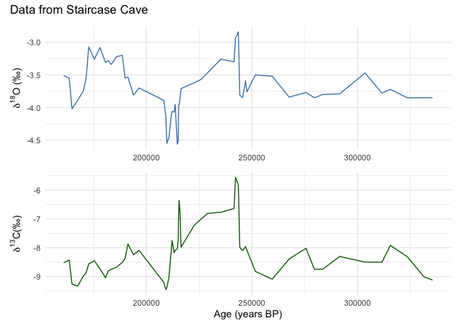
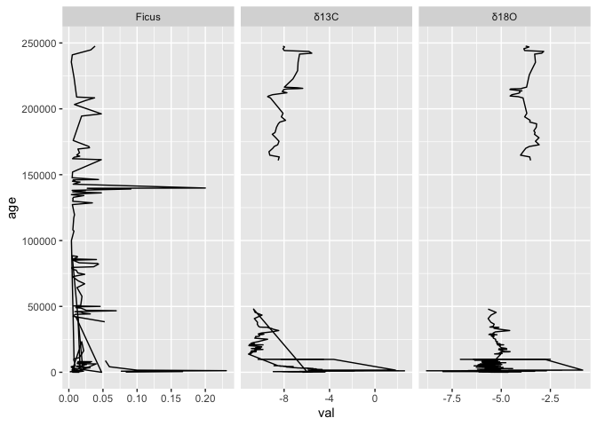

# Introduction

This document is intended to act as a primer for a new workflow using the Neotoma R package, neotoma2, in combination with the Past Global Changes Speleothem Isotopes Synthesis and AnaLysis database (PAGES [SISAL](https://pastglobalchanges.org/science/wg/sisal/intro) from hereon SISAL) .

The SISAL database has recently been implemented as a constitutent database in Neotoma and can therefore be accessed and investigated with the R package neotoma2.
The SISALv3 database can also be accessed directly at <https://doi.org/10.5287/ora-2nanwp4rk> (Kaushal et al., 2024) or through the [SISALwebapp](https://geochem.hu/SISAL_webApp/).

Some users may be working with this document as part of a workshop or self-paced through a Binder instance.
The Binder instance will run RStudio in your browser, with all the required packages installed.
If you are using this workflow on its own, or want to use the package directly, the neotoma2 package is available on CRAN by running:

``` r
#install.packages('neotoma2') # normally
remotes::install_github("NeotomaDB/neotoma2@dev") #current turn-around
library(neotoma2)
```

Your version should be at or above 1.0.6.

This workshop will also require other packages.
To maintain the flow of this document we've placed instructions at the end of the document in the section labelled "[Installing packages on your own](#localinstall)".
Please install these packages, and make sure they are at the lastest version.

# Learning Goals

In this tutorial you will learn:

1.  [Background](#1-background): The basics about Neotoma, SISAL and speleothem proxy interpretation
2.  [Site Searches](#2-site-searches): How to access speleothem data in neotoma - Search for sites using site names and geographic parameters.
3.  [Filter Results](#3-filter-records-tabset): Filter results using temporal and spatial parameters.
4.  [Explore Data](#4-pulling-in-sample-data): Obtain sample information for the selected datasets.
5.  [Visualize Data](#5-simple-analytics): Perform basic Stratigraphic Plotting

# Background {#1-background}

## SISAL

The Speleothem Isotopes Synthesis and AnaLysis ([SISAL](https://pastglobalchanges.org/science/wg/sisal/intro))project is an international scientific effort under the PAGES (Past Global Changes) program.
It brings together climate researchers and data contributors to compile, standardize, and analyze data from speleothems.
Since its creation, SISAL has produced several versions of a global database ([SISALv1](https://doi.org/10.5194/essd-10-1687-2018), [v1b](http://researchdata.reading.ac.uk/id/eprint/189), and [v2](https://doi.org/10.5194/essd-12-2579-2020)), focusing on stable isotope records (oxygen and carbon isotopes) and rich metadata.
The database enables investigation of climate variability across different regions and time periods; and supports comparison with climate models.
The latest release, [SISALv3](https://doi.org/10.5194/essd-16-1933-2024), has significantly expanded the database.
It includes new hydroclimate-sensitive geochemical proxies, such as trace elements (e.g., Mg/Ca, Sr/Ca, Ba/Ca, U/Ca, P/Ca) and strontium isotope ratios (⁸⁷Sr/⁸⁶Sr), providing deeper insights into past water availability and cave system processes.
The database now contains data from 365 cave sites worldwide (see figure 1), with improved metadata for environmental context (such as vegetation, geology, and land use).


### Getting Involved with SISAL

Researchers from all career stages, regions, and related fields are encouraged to participate and collaborate with SISAL.
To get involved, you can contact the SISAL Working Group [here](https://pastglobalchanges.org/science/wg/sisal/people).

If you have specific feedback or run into issues when working with the SISAL database, you can contact the SISAL-Neotoma data stewards, Nikita Kaushal ([nikitageologist\@gmail.com](mailto:nikitageologist@gmail.com){.email}) and Laura Endres ([endres\@eaps.ethz.ch](mailto:endres@eaps.ethz.ch){.email})

### Understanding Data Structure in SISAL

The Figure below illustrates the data schema of the SISAL database.
The data is organized in a set of relational tables, with the data schema showing the relationships among tables and key attributes explicitly.
The core of the database structure is the Entity table, which in most cases represents a speleothem, typically a stalagmite.
For each entity, the sample tables contain the actual measurements such as stable isotopes (e.g., δ¹⁸O, δ¹³C) and trace elements. 
Further, the Dating table contains all information required to construct age models, including radiometric dating results (e.g., ²³⁰Th, ²³⁴U content), uncertainties, and calibration methods.
These data are used to derive chronologies in the SISAL chronology table, which provides standardized interpolated and model-based ages (e.g., Bacon, OxCal, copRa) that are provided beside the original chronology.
Additional tables (e.g., Hiatus, Gap) refine or support the age-depth modelling.
Information on data types and relationships is provided in the reference table.
Sources of the data are provided in the reference table.


## Neotoma

The Neotoma Paleoecology Database is a collaborative, open-access database for Paleoecological data, including fossil pollen, plant macrofossils, charcoal, diatoms, and vertebrates.
The neotoma2 R package is the companion to the [Introduction to Neotoma presentation](https://docs.google.com/presentation/d/1Fwp5yMAvIdgYpiC04xhgV7OQZ-olZIcUiGnLfyLPUt4/edit?usp=sharing).

### Getting Help with Neotoma

If you are planning on working with Neotoma, please join us on [Slack](https://join.slack.com/t/neotomadb/shared_invite/zt-cvsv53ep-wjGeCTkq7IhP6eUNA9NxYQ) where we manage a channel specifically for questions about the R package (the *#it_r* channel, or *#it_r_es* for R help in Spanish and *#it_r_jp* in Japanese).
You may also wish to join the Neotoma community through our Google Groups mailing lists; please [see the information on our website](https://www.neotomadb.org/about/join-the-neotoma-community) to be added.

### Understanding Data Structures in Neotoma

Data in the Neotoma database itself is structured as a set of linked relationships to express different elements of paleoecological analysis:

-   space and time
    -   Where is a sample located in latitude and longitude?
    -   Where is a sample along a depth profile?
    -   What is the estimated age of that sample?
    -   What is the recorded age of elements within or adjacent to the sample?
-   observations
    -   What is being counted or measured?
    -   What units are being used?
    -   Who observed it?
-   scientific methods
    -   What statistical model was used to calculate age?
    -   What uncertainty terms are used in describing an observation?
-   conceptual data models
    -   How do observations in one sample relate to other samples within the same collection?
    -   How does an observation of a fossil relate to extant or extinct relatives?

These relationships can be complex because paleoecology is a broad and evolving discipline.
As such, the database itself is highly structured, and normalized, to allow new relationships and facts to be added, while maintaining a stable central data model.
If you want to better understand concepts within the database, you can read the [Neotoma Database Manual](https://open.neotomadb.org/manual), or take a look at [the database schema itself](https://open.neotomadb.org/dbschema).

In this workshop we want to highlight two key structural concepts:

1.  The way data is structured conceptually within Neotoma (Sites, Collection Units and Datasets).
2.  The way that this structure is adapted within the `neotoma2` R package.

### Data Structure in the Neotoma Database

{width="50%"}

{width="50%"}

Data in Neotoma is associated with **sites** -- specific locations with latitude and longitude coordinates.

Within a **site**, there may be one or more [**collection units**](https://open.neotomadb.org/manual/dataset-collection-related-tables-1.html#CollectionUnits) -- locations at which samples are physically collected within the site:

-   a cave **site** may have one or more **collection units**, cores within specific speleothem **entities**
-   an archaeological **site** may have one or more **collection units**, pits within a broader dig site
-   a pollen sampling **site** on a lake may have multiple **collection units** -- core sites within the lake basin.
-   A bog sample **site** may have multiple **collection units** -- a transect of surface samples within the bog.

Collection units may have higher resolution GPS locations than the site location, but are considered to be part of the broader site.

Data within a **collection unit** is collected at various [**analysis units**](https://open.neotomadb.org/manual/sample-related-tables-1.html#AnalysisUnits).

- 	All carbonate material at a certain depth within a speleothem (the collection unit) from a cave (the site) is an analysis unit. 
-   All sediment at 10 cm depth in the depth profile of a cutbank (the collection unit) along an oxbow lake (the site) is one analysis unit.
-   All material in a single surface sample (the collection unit) from a bog (the site) is an analysis unit.
-   All fossil remains in a buried layer from a bone pile (the collection unit) in a cave (the site) is an analysis unit.

Any data sampled within an analysis unit is grouped by the dataset type (charcoal, diatom, dinoflagellate, etc.) and aggregated into a [**sample**](https://open.neotomadb.org/manual/sample-related-tables-1.html#Samples).
The set of samples for a collection unit of a particular dataset type is then assigned to a [**dataset**](https://open.neotomadb.org/manual/dataset-collection-related-tables-1.html#Datasets).

-   A sample would be all geochemical measurements, such as $\delta ^{18}O$ (the dataset type), from a specific depth (the analysis unit) in a speleothem (the collection unit) collected in a cave (the site).
-   A sample would be all diatoms (the dataset type) extracted from sediment at 12 cm (the analysis unit) in a core (the collection unit) obtained from a lake (the site).
-   A sample would be the record of a single mammoth bone (sample and analysis unit, dataset type is vertebrate fauna) embedded in a riverbank (here the site, and collection unit).

#### Data Structures in `neotoma2` {#222-data-structures-in-neotoma2}


If we look at the [UML diagram](https://en.wikipedia.org/wiki/Unified_Modeling_Language) for the objects in the `neotoma2` R package we can see that the data structure generally mimics the structure within the database itself.
As we will see in the [Site Searches section](#2-site-searches), we can search for these objects, and begin to manipulate them (in the [Simple Analysis section](#5-simple-analytics)).

It is important to note: *within the `neotoma2` R package, most objects are `sites` objects, they just contain more or less data*.
There are a set of functions that can operate on `sites`.
As we add to `sites` objects, using `get_datasets()` or `get_downloads()`, we are able to use more of these helper functions.

## Merging SISAL and Neotoma

Merging SISAL with Neotoma brings significant benefits to the paleoclimate community.
It improves visibility to speleothem data for non-specialists and enables integrated multi-proxy, multi-archive analyses.

For those who contribute data, it increases data visibility and the likelihood of citation by a wider scientific audience.
The datasets will be well documented, quality-controlled and aligned with open data standards.
The integration also supports the inclusion of new proxies, such as pollen and biomarkers, in speleothem datasets.
Please note that in the current version, only individual SISAL entities but no composites are available in Neotoma.

# Working with neotoma2

## Site Searches {#2-site-searches}

### `get_sites()`

There are several ways to find sites in `neotoma2`, but we think of `sites` as being spatial objects primarily.
They have names, locations, and are found within the context of geopolitical units, but within the API and the package, the site itself does not have associated information about taxa, dataset types or ages.
It is simply the container into which we add that information.
So, when we search for sites we can search by:

| Parameter | Description |
|---------------------------------|---------------------------------------|
| sitename | A valid site name (case insensitive) using `%` as a wildcard. |
| siteid | A unique numeric site id from the Neotoma Database |
| loc | A bounding box vector, geoJSON or WKT string. |
| altmin | Lower altitude bound for sites. |
| altmax | Upper altitude bound for site locations. |
| database | The constituent database from which the records are pulled. |
| datasettype | The kind of dataset (see `get_tables(datasettypes)`) |
| datasetid | Unique numeric dataset identifier in Neotoma |
| doi | A valid dataset DOI in Neotoma |
| gpid | A unique numeric identifier, or text string identifying a geopolitical unit in Neotoma |
| keywords | Unique sample keywords for records in Neotoma. |
| contacts | A name or numeric id for individuals associuated with sites. |
| taxa | Unique numeric identifiers or taxon names associated with sites. |

All sites in Neotoma contain one or more datasets.
It's worth noting that the results of these search parameters may be slightly unexpected.
For example, searching for sites by sitename, latitude, or altitude will return all of the datasets for the particular site.
Searching for terms such as datasettype, datasetid or taxa will return the site, but the only datasets returned will be those matching the dataset-specific search terms.
We'll see this later.

#### Site names: `sitename="%cave%"` {.tabset}

We may know exactly what site we're looking for ("Wonderwerk Cave"), or have an approximate guess for the site name (for example, we know it's something like "Wonderwerk", but we're not sure how it was entered specifically), or we may want to search all sites that have a specific term, for example, *cave*.

We use the general format: `get_sites(sitename="%cave%")` for searching by name.

PostgreSQL (and the API) uses the percent sign as a wildcard.
So `"%cave%"` would pick up ["Wonderwerk Cave"](https://data.neotomadb.org/52262) for us (and also picks up "Equus Cave" and "Spring Cave shelter").
Note that the search query is also case insensitive.

##### Code


``` r
Sys.setenv(APIPOINT="dev")

cave_sites <- neotoma2::get_sites(sitename = "%cave%")
plotLeaflet(cave_sites)
```

##### Result


```{=html}
<div class="leaflet html-widget html-fill-item" id="htmlwidget-89d2f175077f39ac32a6" style="width:672px;height:480px;"></div>
<script type="application/json" data-for="htmlwidget-89d2f175077f39ac32a6">{"x":{"options":{"crs":{"crsClass":"L.CRS.EPSG3857","code":null,"proj4def":null,"projectedBounds":null,"options":{}}},"calls":[{"method":"addTiles","args":["https://{s}.tile.openstreetmap.org/{z}/{x}/{y}.png",null,null,{"minZoom":0,"maxZoom":18,"tileSize":256,"subdomains":"abc","errorTileUrl":"","tms":false,"noWrap":false,"zoomOffset":0,"zoomReverse":false,"opacity":1,"zIndex":1,"detectRetina":false,"attribution":"&copy; <a href=\"https://openstreetmap.org/copyright/\">OpenStreetMap<\/a>,  <a href=\"https://opendatacommons.org/licenses/odbl/\">ODbL<\/a>"}]},{"method":"addCircleMarkers","args":[[37.36667,50.18833,35,35.86667,44.28139,41.75,42.61667,43.86667,44.86667,38.83333,38.08611,36.45833,36.29028,37.86667,38.85194,42.76667,40.78389,40.91691,38.9,38.73333,43.36667,39,49.63611,37,38.06667,35.5,36.69444,34.72944,41.75,39.33333,38.86667,39.36667,31.86667,31.86667,31.86667,31.86667,30.58667,30.25,29.25,30.61667,29.88333,30.46667,29.81667,29.98333,31.86667,29.89139,31.86667,44.11667,41.5,41.56667,44.61667,44.08333,44,43.36667,36.61667,36.61667,38.86667,38.72917,43.86667,39.5,42.70417,43.36667,32.86667,42.23333,42.11667,41.61667,42.63333,46.75,45.16575,47.08333,45.61667,38,39.5,39.75,31,29.5,31.86667,40.86667,40.86667,44.86667,30.61667,30.61667,30.61667,30.61667,30.61667,29.86667,31.11667,29.75,29.75,30.75,29.61667,31.95578,31.95578,38.36667,39.61667,39.61667,31.61667,29.86667,44.45,35.83778,35.77778,37.5,37.5,36,35.36667,35,36.11667,36,38.06667,40.36667,38.61667,38.61667,38.11667,37.11667,38.36667,36.86667,36,38.5,35,37.11667,36.75,37.5,36.75,36.75,37.31278,37.5,37.25,37.25,37.25,36.75,39.11667,38.36667,38.86667,43.11667,37,40.61667,41.36667,36.5,40.11667,36.1,36,39.25,43.25,43.25,43.25,43.25,43.25,38.31778,36.1,32.33333,41.61667,32.36667,31.61667,40.36667,36.2,32.36667,32.37361,31.91667,34.86667,34.86667,31.4745,35.36667,46.5,38.9,38.9,35.25833,36,36,36,36,40.20222,36,56.27639,39.96167,33.86667,32.11667,32.18333,32.25,32.25,32.25,32,32.11667,39.75,34.75,35.36667,35.41667,34.86667,34.75,38.15167,38.86667,35.41667,34.03333,46.36667,43.6037,44.36667,44.36667,39,44.75,40,29.11667,29.11667,29.25,29.03333,29.61667,43.5,40.25,39.75,40.25,39.36667,42,42,38.75,38.75,38.75,38.86667,38.08333,38.11667,38.11667,38.61667,38.61667,38.25,38.61667,38.61667,38.75,38.36667,39.11667,39,39,38.86667,38.25,39.11667,39.36667,38.86667,38.08333,39,39,39.11667,39.11667,39.36667,38.86667,38.86667,38.86667,39,37.54333,39,39,39,39.11667,39.36667,38.61667,38.75,45.68333,36.25,36,36,36,35.86667,36.11667,36.11667,36.25,37.75,36.11667,37.86667,37.86667,37.96722,36.61667,36.05528,38.36667,36.57083,36.45,41.35972,44.75,41.61667,40.86667,36.61667,37.25,38.61667,37.11667,37.18333,37.87361,39.22083,41.18333,37,38.60278,36.61667,37.25,36.53278,35,39.18333,39,39.75,39.36667,44,40.36667,37.72333,37.93889,37.77361,37.75222,38.59306,37.11667,36.61667,37.61667,39.36667,36.82083,35.86667,38.25,38.11667,36.75,37.61667,37.25,37.36667,37.25,38.25,37.61667,37.86667,37.61667,37.75,37.61667,37.75,37.75,37.75,37.75,37.75,37.75,37.75,37.75,37.25,37.11667,37.11667,37.11667,37.25,37.11667,37.61667,38.11667,34.86667,38.11667,38.39667,38.13861,37.80667,41,36.86667,36,36,36,36,32.11667,37.71722,37.75,37.75,38,47,46.86667,47,39.11667,46.5,39.18333,39,39.33333,39.25,36.58333,36.16597,31.88889,35.76509,37.78111,39.40412,49.86528,40.9171,43.55702,37.166566,43.7593,65.80073399999999,38.82488,37.00072,32.2025,36.99917,37.24361,37.75056,35.00833,47.32667,38.56944,65.8,65.8,34.36861,34.875,21.88836,49.78194,51.06076,35.16667,34.99417,28.875,43.31694,40.00028,40.12444,49.475,38.90389,37.71722,43.5,45.65,44.01667,36.9647,34.50028,39.21917,36.46667,35.36194,37.17528,56.2,67.13333,56.21667,56.25,55.00778,56.16667,56.16667,45.5,61.43556,45.47167,42.56667,35.68333,37.875,32.19056,36.57306,49.47083,41.00028,38.71667,55.75,41.625,50.4,36.94056,41.875,66.91667,40.10306,35.96583,31.55806,50.41667,43.58111,40.71556,64.3,36.08333,36.5,36.49972,36.35833,36.48611,36.22417,38.91028,36.95,40.12444,38.00028,38.6,38.57722,57.16943,38.6,47.46562,67.13306,67.13306,67.13167,41.15833,65.8,35.77889,40.44583,30.35,39.03333,43.40139,51.81694,42.605,42.724,42.75717,42.58667,42.27183,42.72583,42.86733,43.00833,43.10567,43.13567,43.25667,43.40767,42.751462,29.927158,37.6167,38.38488,37.653868,42.606244,-31.98135,10.76,1.5,-32.31389,-27.84583,-27.6,34.05111,-32.32139,-40.5297,-19.997,38.4345,27.0516,27.08168,16.7,18.26722,44.66722,34.5251,37.107,38.947,42.76171,-38.32,34.25,36.78611,37.1475,37.14799,37.51556,38.01239,36.62222,37.14667,42.42944,45.78917,56.33333,55.9,56.36728,50.40417,50.40167,50.36306,50.37472,50.6235,30.13333,38.7756,39.33333,36.1982,36.1982,36.1982,36.1982,42.15499,34.7,49.2324,49.45403,44.91865,52.05,52.123,51.05,52.98,53.3,50.324,50.2192,50.2084,50.2964,50.2044,50.2044,50.19560000000001,50.19560000000001,50.195,50.1762,50.3376,50.1624,50.2342,51.4937,-0.6634,-0.75,36.691,37.18744,36.98817,36.98817,36.98817,37.14667,36.78611,37.1475,38.01239,36.62222,37.51556,37.14799,25.36538,42.98,47.4333,22.95,-34.05,42.87,1.25,30.7903,45.8188,29.2289,32.5,-16.1503,44.4,46.6847,23.0833,46.13,41.4167,17.1667,26.23,36.534,-14.37,45.8188,30.7903,1.25,50.6875,22.95,12.5866,35.84,49,47.4333,33.9558,16.2086,50.6875,-33.41,29.0333,42.87,46.7833,30.7903,43.1878,-11.27,-14.37,29.2289,-34.2071,47.26,20.16,-34.2071,-14.37,36.4333,9.174099999999999,-11.27,43.1878,30.7903,-19.4,30.7903,29.0333,4.03,43.2962,36.59,33.9558,-11.27,44.0049,46.95,42.87,-33.41,35.23,30.7903,-16.1503,-33.3925,47.7,-12.6182,40.0333,22.55,45.6678,30.7903,9.49,-35.7,45.43,42.87,43.5937,-12.6182,-11.27,64.89,50.4244,40.7925,42.87,-34.083,29.0167,30.7903,40.9488,25.25,36.4333,48.4667,-16.1503,25.4833,16.6769,43.4008,45,-16.1503,4.15,1.25,43.1878,50.6875,42.87,-12.3344,50.4244,40.4498,24.2,24.2,25.2833,33.95,-17.03,46.75,-25.37,-36.27,33.3722,46.1333,40.804,31.667,27.2,31.667,29.5,-27.2247,31.667,51.3675,25.2622,-36.27,-12.3819,31.667,29.6822,47.2501,47.08,-17.03,43.4,null],[-110.86667,-114.51833,-101.86667,-93,-112.91528,-105.36667,-105.61667,-107.61667,-108.11667,-79.28333000000001,-79.65694000000001,-82.46666999999999,-85.37361,-92.25,-92.28055999999999,-114.21667,-122.28083,-122.23787,-91.56667,-91.75,-112.61667,-113,-114.64,-81.86667,-79.89167,-86.86667,-82.47139,-87.79222,-115.36667,-114.08333,-114.11667,-118.61667,-106,-104.75,-104.75,-104.86667,-98.63667,-99.86667,-100.36667,-98.25,-98.61667,-100.55,-101.55,-101.1,-104.75,-101.44,-104.75,-107.28333,-105.5,-105.51667,-106.58333,-107.31667,-107.11667,-108.25,-96.36667,-96.36667,-92.25,-105.86139,-107.5,-91.75,-91.41388999999999,-91.86667,-101.75,-90.93333,-90.36667,-91.5,-91.29722,-109,-108.3552,-112.28333,-108.36667,-104.75,-105.11667,-105.11667,-104.11667,-98.86667,-94.61667,-104.75,-104.75,-108.4,-97.61667,-97.61667,-97.61667,-97.61667,-97.61667,-101.11667,-98.75,-101.45,-101.36667,-99.25,-98.36667,-106.02632,-106.02632,-107.11667,-107.11667,-107.11667,-104.11667,-101.36667,-109.75,-84.94583,-85.55583,-83.75,-83.75,-85.25,-84.11667,-85.86667,-89.11667,-85.75,-79.89167,-78.25,-78.75,-78.5,-79.11667,-81.5,-78.75,-81,-82.86667,-78.86667,-86,-81.5,-81.86667,-80.11667,-81.86667,-82.5,-80.64639,-79.75,-80.75,-80.75,-80.75,-81.5,-78,-78.25,-78.25,-90.61667,-115,-114,-113.11667,-111.83333,-116,-113.93333,-113.86667,-114.11667,-121,-121,-121,-121,-121,-110.20222,-113.93333,-112.23333,-119.11667,-110.75,-110.61667,-109.26667,-114.86667,-104.75,-104.48194,-108.5,-106.75,-106.75,-108.4337,-115.5,-118.5,-114.05,-114.05,-106.4,-111.95,-111.95,-111.95,-111,-119.27917,-111.95,-120.9375,-118.55694,-108.5,-104.36667,-106.6,-104.61667,-106.5,-104.5,-106.5,-107.75,-115.61667,-116.61667,-115.5,-115.5,-115.5,-116.61667,-120.47667,-120.86667,-115.5,-120.3,-121.75,-112.3914,-114.11667,-122.36667,-110.75,-117,-111.75,-82,-82,-81.86667,-82.08333,-82.5,-122.25,-119.36667,-118.61667,-119.25,-114.5,-122.11667,-122.11667,-85.61667,-85.61667,-85.61667,-85.5,-86.11667,-86.25,-86.25,-86.11667,-86,-86.5,-86.61667,-86.5,-86.5,-86.36667,-86.61667,-86.61667,-86.61667,-86.61667,-86.11667,-86.61667,-85.61667,-85.61667,-86.11667,-86.61667,-85.5,-85.5,-85.5,-85.86667,-85.5,-85.5,-86.61667,-86.61667,-80.39888999999999,-86.61667,-86.61667,-86.61667,-86.61667,-86.61667,-85.5,-85.5,-86.73333,-92.75,-94.36667,-94.25,-93.36667,-93,-93.75,-93.61667,-93.61667,-93.75,-93.75,-93.25,-91.86667,-93.31806,-92.86667,-92.93277999999999,-90.5,-82.60556,-82.21666999999999,-74.36360999999999,-92.86667,-73.86667,-83.36667,-82.5,-77.25,-78.5,-86,-86.05,-84.74722,-82.26889,-81.67167000000001,-92.25,-79.36888999999999,-83.11667,-85.86667,-84.94389,-85.25,-82.8,-82.61667,-82.61667,-82.5,-91.61667,-78.36667,-80.53333000000001,-80.39583,-89.89167,-89.87444000000001,-90.21666999999999,-91.11667,-93,-92.25,-91.61667,-91.26667,-93,-93.25,-91.11667,-91.86667,-92.5,-93.36667,-93.75,-93.36667,-92.86667,-89.75,-91.75,-92,-92.11667,-92,-92.25,-92.11667,-92.11667,-92.11667,-92.11667,-92.36667,-92.11667,-92.11667,-91.36667,-91.36667,-91.36667,-91.11667,-91.36667,-91.36667,-89.86667,-91.11667,-85.75,-91.11667,-90.25389,-90.14528,-89.45806,-111,-112,-112,-112.11667,-112.11667,-112.11667,-104.5,-80.43722,-92.5,-92.5,-79.58333,-120,-119.86667,-120,-114.08333,-118.61667,-117,-116.5,-114.16667,-114.11667,-118.81667,-115.59797,-106.14583,-94.74021999999999,-79.92944,-118.6124,-127.09083,-122.2318,-112.62882,-86.17037000000001,-92.2371,-163.451176,-106.8688,-102.776292,-104.48556,-109.04028,-109.24861,-109.50056,-109.375,0.47528,-79.36417,-163.21667,-163.21667,-84.93416999999999,-85.25,-159.41878,-125.98611,-115.25792,-86.08360999999999,-85.34944,-82.55,-113.51944,-116.12528,-111.62556,-126.4375,-79.73193999999999,-80.44889000000001,-70.91667,-75.78333000000001,-80.16667,-92.498,-111.50028,-113.92417,-81.84999999999999,-86.20944,-113.28917,-133.58333,-140.78333,-133.6,-133.5,-132.97778,-133.5,-133.5,-77.01000000000001,-155.41167,-75.85028,-74.46666999999999,-85.78333000000001,-80.375,-104.66667,-82.93944,-126.44583,-115.50028,-79.3125,-134,-111.625,-126.96667,-115.56139,-113.875,-142.75,-75.425,-115.50028,-110.45472,-126.95,-103.41444,-122.58556,-146.25,-112.13333,-82.25,-86.45,-84.13333,-82.18889,-84.09139,-79.72528,-90.81667,-111.62556,-114.87528,-79.28333000000001,-79.36360999999999,-170.24998,-79.36667,-116.60215,-140.79778,-140.79778,-140.79472,-112.875,-163.21667,-87.46693999999999,-111.75056,-97.75,-92.33333,-113.02306,-3.09306,-120.42383,-120.5425,-120.55233,-120.367,-120.352,-120.73533,-120.80417,-120.77017,-120.85267,-121.07317,-121.15567,-121.242,-120.578126,-99.424588,-91.83329999999999,-90.3922,-89.836094,-73.977666,127.081098,47.3,36,18.36278,23.55528,24.61,46.645,18.33,144.7747,21.3248,-28.19117,-104.7774,-101.632,-93.41667,-97.14917,6.14944,-86.8947,-93.327,-107.299,-120.55382,141.41,-109.25,127.96889,129.03639,128.55089,128.45278,127.65076,128.03861,128.54167,19.17778,13.59056,-133.59167,-134.3,-132.12077,-126.92778,-127.32778,-126.87889,-126.76833,-127.96837,-99.54167,-120.5274,-114.08333,-112.316,-112.316,-112.316,-112.316,-90.66442000000001,-87.90000000000001,-125.4165,-125.73332,-110.36147,-116.77,-116.966,-114.867,-118.358,-117.8,-127.234,-127.4048,-127.0442,-127.0442,-127.42,-127.42,-127.3748,-127.5278,-127.5968,-127.4081,-127.2128,-127.2128,-127.5284,-116.134682,-90.434,-90.26900000000001,-78.788,-86.10344000000001,128.38169,128.38169,128.38169,128.54167,127.96889,129.03639,127.65076,128.03861,128.45278,128.55089,-76.51967999999999,-4.37,9.8667,104.8167,22.39,81.75,29.82,77.7764,15.6783,107.9036,119.17,-44.6281,21.65,7.7819,57.35,11.03,31.9333,54.0833,-77.16,32.1056,-44.28,15.6783,77.7764,29.82,8.2058,104.8167,54.3543,52,7,9.8667,-4.2461,-89.0735,8.2058,22.34,107.1833,81.75,8.2667,77.7764,-0.2678,-75.79000000000001,-44.28,107.9036,22.0899,9.52,-87.56999999999999,22.0899,-44.28,4.5667,-79.6164,-75.79000000000001,-0.2678,77.7764,17.8833,77.7764,107.1833,114.8,-4.3937,-118.82,-4.2461,-75.79000000000001,15.0388,10.55,81.75,22.34,57.42,77.7764,-44.6281,22.2147,18.84,-41.0184,-114.7833,-83.84,0.5133,77.7764,37.66,148.5,0.78,81.75,25.9597,-41.0184,-75.79000000000001,14.16,11.0203,-0.4492,81.75,115.05,107.1833,77.7764,0.5127,91.86669999999999,4.5667,20.5,-44.6281,107.9,-89.0925,12.9619,22.6,-44.6281,114.86,29.82,-0.2678,8.2058,81.75,-41.6043,11.0203,39.5365,103.36,103.36,108.0833,35.65,125,7.81,20.7,175.08,-86.36669999999999,18.1167,-122.304,110.4333,106.1667,110.4333,115.5,-49.1569,110.4333,7.6647,91.8817,175.08,-41.5733,110.4333,106.2881,9.666700000000001,11.67,125,-4.53,null],10,null,null,{"interactive":true,"draggable":false,"keyboard":true,"title":"","alt":"","zIndexOffset":0,"opacity":1,"riseOnHover":true,"riseOffset":250,"stroke":true,"color":"#03F","weight":5,"opacity.1":0.5,"fill":true,"fillColor":"#03F","fillOpacity":0.2},{"showCoverageOnHover":true,"zoomToBoundsOnClick":true,"spiderfyOnMaxZoom":true,"removeOutsideVisibleBounds":true,"spiderLegPolylineOptions":{"weight":1.5,"color":"#222","opacity":0.5},"freezeAtZoom":false},null,["<b>Bechan Cave<\/b><br><b>Description:<\/b> Large sandstone cave. Physiography: canyon lands. Surrounding vegetation: open juniper woodland.<br><a href=http://apps.neotomadb.org/explorer/?siteids=244>Explorer Link<\/a>","<b>January Cave [EbPp-Vp]<\/b><br><b>Description:<\/b> Cave. Physiography: SSW facing slope of Plateau Mountain. Surrounding vegetation: Picea/Abies/Pinus.<br><a href=http://apps.neotomadb.org/explorer/?siteids=1135>Explorer Link<\/a>","<b>Canyon City Club Cave [A251]<\/b><br><b>Description:<\/b> NA<br><a href=http://apps.neotomadb.org/explorer/?siteids=3540>Explorer Link<\/a>","<b>Peccary Cave<\/b><br><b>Description:<\/b> NA<br><a href=http://apps.neotomadb.org/explorer/?siteids=3546>Explorer Link<\/a>","<b>Jaguar Cave [Cave No. 2]<\/b><br><b>Description:<\/b> NA<br><a href=http://apps.neotomadb.org/explorer/?siteids=3549>Explorer Link<\/a>","<b>Bell Cave [48AB304]<\/b><br><b>Description:<\/b> NA<br><a href=http://apps.neotomadb.org/explorer/?siteids=3551>Explorer Link<\/a>","<b>Little Box Elder Cave [48CO287]<\/b><br><b>Description:<\/b> NA<br><a href=http://apps.neotomadb.org/explorer/?siteids=3552>Explorer Link<\/a>","<b>Little Canyon Creek Cave [48WA323]<\/b><br><b>Description:<\/b> NA<br><a href=http://apps.neotomadb.org/explorer/?siteids=3553>Explorer Link<\/a>","<b>Natural Trap Cave<\/b><br><b>Description:<\/b> NA<br><a href=http://apps.neotomadb.org/explorer/?siteids=3554>Explorer Link<\/a>","<b>Eagle Cave [Eagle Rock Cave]<\/b><br><b>Description:<\/b> NA<br><a href=http://apps.neotomadb.org/explorer/?siteids=3559>Explorer Link<\/a>","<b>Clark's Cave<\/b><br><b>Description:<\/b> NA<br><a href=http://apps.neotomadb.org/explorer/?siteids=3561>Explorer Link<\/a>","<b>Baker Bluff Cave<\/b><br><b>Description:<\/b> NA<br><a href=http://apps.neotomadb.org/explorer/?siteids=3562>Explorer Link<\/a>","<b>Robinson Cave<\/b><br><b>Description:<\/b> NA<br><a href=http://apps.neotomadb.org/explorer/?siteids=3563>Explorer Link<\/a>","<b>Bat Cave (US:Missouri:Pulaski)<\/b><br><b>Description:<\/b> NA<br><a href=http://apps.neotomadb.org/explorer/?siteids=3565>Explorer Link<\/a>","<b>Brynjulfson Cave #1<\/b><br><b>Description:<\/b> NA<br><a href=http://apps.neotomadb.org/explorer/?siteids=3566>Explorer Link<\/a>","<b>Wilson Butte Cave [10Je6]<\/b><br><b>Description:<\/b> NA<br><a href=http://apps.neotomadb.org/explorer/?siteids=3567>Explorer Link<\/a>","<b>Potter Creek Cave [5357,1055]<\/b><br><b>Description:<\/b> NA<br><a href=http://apps.neotomadb.org/explorer/?siteids=3568>Explorer Link<\/a>","<b>Samwell Cave<\/b><br><b>Description:<\/b> NA<br><a href=http://apps.neotomadb.org/explorer/?siteids=3569>Explorer Link<\/a>","<b>Graham Cave<\/b><br><b>Description:<\/b> NA<br><a href=http://apps.neotomadb.org/explorer/?siteids=3577>Explorer Link<\/a>","<b>Arnold Research Cave [23CY64]<\/b><br><b>Description:<\/b> NA<br><a href=http://apps.neotomadb.org/explorer/?siteids=3578>Explorer Link<\/a>","<b>Middle Butte Cave<\/b><br><b>Description:<\/b> NA<br><a href=http://apps.neotomadb.org/explorer/?siteids=3585>Explorer Link<\/a>","<b>Crystal Ball Cave<\/b><br><b>Description:<\/b> NA<br><a href=http://apps.neotomadb.org/explorer/?siteids=3586>Explorer Link<\/a>","<b>Eagle Cave [DjPp-100]<\/b><br><b>Description:<\/b> NA<br><a href=http://apps.neotomadb.org/explorer/?siteids=3587>Explorer Link<\/a>","<b>Loop Creek Quarry Cave<\/b><br><b>Description:<\/b> NA<br><a href=http://apps.neotomadb.org/explorer/?siteids=3590>Explorer Link<\/a>","<b>Back Creek Cave 1<\/b><br><b>Description:<\/b> NA<br><a href=http://apps.neotomadb.org/explorer/?siteids=3591>Explorer Link<\/a>","<b>Cheek Bend Cave [40MU261]<\/b><br><b>Description:<\/b> NA<br><a href=http://apps.neotomadb.org/explorer/?siteids=3593>Explorer Link<\/a>","<b>Darty Cave<\/b><br><b>Description:<\/b> NA<br><a href=http://apps.neotomadb.org/explorer/?siteids=3595>Explorer Link<\/a>","<b>Bell Cave [ACb-2]<\/b><br><b>Description:<\/b> NA<br><a href=http://apps.neotomadb.org/explorer/?siteids=3601>Explorer Link<\/a>","<b>Deer Creek Cave [EL-25]<\/b><br><b>Description:<\/b> NA<br><a href=http://apps.neotomadb.org/explorer/?siteids=3607>Explorer Link<\/a>","<b>Smith Creek Cave [26WP46]<\/b><br><b>Description:<\/b> NA<br><a href=http://apps.neotomadb.org/explorer/?siteids=3644>Explorer Link<\/a>","<b>Snake Creek Burial Cave<\/b><br><b>Description:<\/b> NA<br><a href=http://apps.neotomadb.org/explorer/?siteids=3645>Explorer Link<\/a>","<b>Hidden Cave [NV-Ch-16 (Berkeley)] [26CH16]<\/b><br><b>Description:<\/b> NA<br><a href=http://apps.neotomadb.org/explorer/?siteids=3647>Explorer Link<\/a>","<b>Ceremonial Cave<\/b><br><b>Description:<\/b> NA<br><a href=http://apps.neotomadb.org/explorer/?siteids=3654>Explorer Link<\/a>","<b>Williams Cave<\/b><br><b>Description:<\/b> NA<br><a href=http://apps.neotomadb.org/explorer/?siteids=3670>Explorer Link<\/a>","<b>Dust Cave [C-09]<\/b><br><b>Description:<\/b> NA<br><a href=http://apps.neotomadb.org/explorer/?siteids=3676>Explorer Link<\/a>","<b>Lower Sloth Cave<\/b><br><b>Description:<\/b> NA<br><a href=http://apps.neotomadb.org/explorer/?siteids=3677>Explorer Link<\/a>","<b>Miller's Cave<\/b><br><b>Description:<\/b> NA<br><a href=http://apps.neotomadb.org/explorer/?siteids=3684>Explorer Link<\/a>","<b>Schulze Cave<\/b><br><b>Description:<\/b> NA<br><a href=http://apps.neotomadb.org/explorer/?siteids=3685>Explorer Link<\/a>","<b>Rattlesnake Cave [40434]<\/b><br><b>Description:<\/b> NA<br><a href=http://apps.neotomadb.org/explorer/?siteids=3687>Explorer Link<\/a>","<b>Longhorn Cavern<\/b><br><b>Description:<\/b> NA<br><a href=http://apps.neotomadb.org/explorer/?siteids=3688>Explorer Link<\/a>","<b>Cave Without A Name<\/b><br><b>Description:<\/b> NA<br><a href=http://apps.neotomadb.org/explorer/?siteids=3689>Explorer Link<\/a>","<b>Felton Cave<\/b><br><b>Description:<\/b> NA<br><a href=http://apps.neotomadb.org/explorer/?siteids=3690>Explorer Link<\/a>","<b>Eagle Cave [41VV167]<\/b><br><b>Description:<\/b> NA<br><a href=http://apps.neotomadb.org/explorer/?siteids=3691>Explorer Link<\/a>","<b>Baker Cave [41VV213]<\/b><br><b>Description:<\/b> NA<br><a href=http://apps.neotomadb.org/explorer/?siteids=3692>Explorer Link<\/a>","<b>Upper Sloth Cave [TTu-Tex-2]<\/b><br><b>Description:<\/b> NA<br><a href=http://apps.neotomadb.org/explorer/?siteids=3693>Explorer Link<\/a>","<b>Hinds Cave [41VV456]<\/b><br><b>Description:<\/b> NA<br><a href=http://apps.neotomadb.org/explorer/?siteids=3694>Explorer Link<\/a>","<b>Pratt Cave [TMM-41172]<\/b><br><b>Description:<\/b> NA<br><a href=http://apps.neotomadb.org/explorer/?siteids=3696>Explorer Link<\/a>","<b>Daughtery Cave [48WA302]<\/b><br><b>Description:<\/b> NA<br><a href=http://apps.neotomadb.org/explorer/?siteids=3698>Explorer Link<\/a>","<b>Tina-Ann's Cave [48AB398]<\/b><br><b>Description:<\/b> NA<br><a href=http://apps.neotomadb.org/explorer/?siteids=3701>Explorer Link<\/a>","<b>Horned Owl Cave [48AB305]<\/b><br><b>Description:<\/b> NA<br><a href=http://apps.neotomadb.org/explorer/?siteids=3716>Explorer Link<\/a>","<b>Bentzen Kaufman Cave [48SH301]<\/b><br><b>Description:<\/b> NA<br><a href=http://apps.neotomadb.org/explorer/?siteids=3719>Explorer Link<\/a>","<b>Leigh Cave [48WA304]<\/b><br><b>Description:<\/b> NA<br><a href=http://apps.neotomadb.org/explorer/?siteids=3745>Explorer Link<\/a>","<b>Rice Cave [48WA363]<\/b><br><b>Description:<\/b> NA<br><a href=http://apps.neotomadb.org/explorer/?siteids=3769>Explorer Link<\/a>","<b>Birdshead Cave [48FR54]<\/b><br><b>Description:<\/b> NA<br><a href=http://apps.neotomadb.org/explorer/?siteids=3792>Explorer Link<\/a>","<b>Copperhead Cave [34OS85]<\/b><br><b>Description:<\/b> NA<br><a href=http://apps.neotomadb.org/explorer/?siteids=3852>Explorer Link<\/a>","<b>Birdnest Cave [34os133]<\/b><br><b>Description:<\/b> NA<br><a href=http://apps.neotomadb.org/explorer/?siteids=3858>Explorer Link<\/a>","<b>Brynjulfson Cave #2<\/b><br><b>Description:<\/b> NA<br><a href=http://apps.neotomadb.org/explorer/?siteids=3864>Explorer Link<\/a>","<b>Porcupine Cave<\/b><br><b>Description:<\/b> NA<br><a href=http://apps.neotomadb.org/explorer/?siteids=3890>Explorer Link<\/a>","<b>Spring Creek Cave [48WA1]<\/b><br><b>Description:<\/b> NA<br><a href=http://apps.neotomadb.org/explorer/?siteids=3902>Explorer Link<\/a>","<b>Cave [23MN796]<\/b><br><b>Description:<\/b> NA<br><a href=http://apps.neotomadb.org/explorer/?siteids=3907>Explorer Link<\/a>","<b>Fence Cave Local Fauna<\/b><br><b>Description:<\/b> NA<br><a href=http://apps.neotomadb.org/explorer/?siteids=4025>Explorer Link<\/a>","<b>Coldwater Cave<\/b><br><b>Description:<\/b> NA<br><a href=http://apps.neotomadb.org/explorer/?siteids=4053>Explorer Link<\/a>","<b>Fingerprint Cave<\/b><br><b>Description:<\/b> NA<br><a href=http://apps.neotomadb.org/explorer/?siteids=4058>Explorer Link<\/a>","<b>Hadfield's Cave [13JN3]<\/b><br><b>Description:<\/b> NA<br><a href=http://apps.neotomadb.org/explorer/?siteids=4064>Explorer Link<\/a>","<b>Michel's Cave [13JK90]<\/b><br><b>Description:<\/b> NA<br><a href=http://apps.neotomadb.org/explorer/?siteids=4065>Explorer Link<\/a>","<b>Woodpecker Cave [13JH202]<\/b><br><b>Description:<\/b> NA<br><a href=http://apps.neotomadb.org/explorer/?siteids=4066>Explorer Link<\/a>","<b>Willard Cave<\/b><br><b>Description:<\/b> NA<br><a href=http://apps.neotomadb.org/explorer/?siteids=4070>Explorer Link<\/a>","<b>Montana Ice Cave [KU-MT-41]<\/b><br><b>Description:<\/b> NA<br><a href=http://apps.neotomadb.org/explorer/?siteids=4101>Explorer Link<\/a>","<b>False Cougar Cave<\/b><br><b>Description:<\/b> The fossils come from sediments in a limestone cave located near the summit of East Pryor Mountain at the head of a southwest trending canyon<br><a href=http://apps.neotomadb.org/explorer/?siteids=4107>Explorer Link<\/a>","<b>Blacktail Cave [24LC151]<\/b><br><b>Description:<\/b> NA<br><a href=http://apps.neotomadb.org/explorer/?siteids=4118>Explorer Link<\/a>","<b>Pictograph Cave [Inscription Cave] [24YL1]<\/b><br><b>Description:<\/b> NA<br><a href=http://apps.neotomadb.org/explorer/?siteids=4122>Explorer Link<\/a>","<b>Chamber Cave<\/b><br><b>Description:<\/b> NA<br><a href=http://apps.neotomadb.org/explorer/?siteids=4124>Explorer Link<\/a>","<b>Graeber Cave<\/b><br><b>Description:<\/b> NA<br><a href=http://apps.neotomadb.org/explorer/?siteids=4127>Explorer Link<\/a>","<b>Hall-Woodland Cave [5JF9]<\/b><br><b>Description:<\/b> NA<br><a href=http://apps.neotomadb.org/explorer/?siteids=4128>Explorer Link<\/a>","<b>Fowlkes Cave<\/b><br><b>Description:<\/b> NA<br><a href=http://apps.neotomadb.org/explorer/?siteids=4211>Explorer Link<\/a>","<b>Scorpion Cave [41ME7]<\/b><br><b>Description:<\/b> NA<br><a href=http://apps.neotomadb.org/explorer/?siteids=4213>Explorer Link<\/a>","<b>Monk's Cave [41RK84]<\/b><br><b>Description:<\/b> NA<br><a href=http://apps.neotomadb.org/explorer/?siteids=4231>Explorer Link<\/a>","<b>Woodland Cave<\/b><br><b>Description:<\/b> NA<br><a href=http://apps.neotomadb.org/explorer/?siteids=4233>Explorer Link<\/a>","<b>Fire Cave<\/b><br><b>Description:<\/b> NA<br><a href=http://apps.neotomadb.org/explorer/?siteids=4234>Explorer Link<\/a>","<b>Bottleneck Cave [48BH206]<\/b><br><b>Description:<\/b> NA<br><a href=http://apps.neotomadb.org/explorer/?siteids=4243>Explorer Link<\/a>","<b>Laubach Cave No. 5 [Inner Space Cavern]<\/b><br><b>Description:<\/b> NA<br><a href=http://apps.neotomadb.org/explorer/?siteids=4246>Explorer Link<\/a>","<b>Laubach Cave No. 4 [Inner Space Cavern]<\/b><br><b>Description:<\/b> NA<br><a href=http://apps.neotomadb.org/explorer/?siteids=4247>Explorer Link<\/a>","<b>Laubach Cave No. 3 [Inner Space Cavern] [41343]<\/b><br><b>Description:<\/b> NA<br><a href=http://apps.neotomadb.org/explorer/?siteids=4248>Explorer Link<\/a>","<b>Laubach Cave No. 2 [Inner Space Cavern] [40722]<\/b><br><b>Description:<\/b> NA<br><a href=http://apps.neotomadb.org/explorer/?siteids=4249>Explorer Link<\/a>","<b>Laubach Cave No. 1 [Inner Space Cavern] [40673]<\/b><br><b>Description:<\/b> NA<br><a href=http://apps.neotomadb.org/explorer/?siteids=4250>Explorer Link<\/a>","<b>Fern Cave<\/b><br><b>Description:<\/b> NA<br><a href=http://apps.neotomadb.org/explorer/?siteids=4251>Explorer Link<\/a>","<b>Clamp Cave<\/b><br><b>Description:<\/b> NA<br><a href=http://apps.neotomadb.org/explorer/?siteids=4252>Explorer Link<\/a>","<b>Centipede Cave [41VV191]<\/b><br><b>Description:<\/b> NA<br><a href=http://apps.neotomadb.org/explorer/?siteids=4253>Explorer Link<\/a>","<b>Damp Cave [41VV189]<\/b><br><b>Description:<\/b> NA<br><a href=http://apps.neotomadb.org/explorer/?siteids=4254>Explorer Link<\/a>","<b>Zesch Cave<\/b><br><b>Description:<\/b> Zesch Cave is located in the Llano uplift region of the Edwards Plateau. The cave is currently a dome-shaped room with a single\r\nentrance situated roughly central to the cavern and 6 m above\r\n a Holocene debris cone.<br><a href=http://apps.neotomadb.org/explorer/?siteids=4255>Explorer Link<\/a>","<b>Friesenhahn Cave<\/b><br><b>Description:<\/b> Southeastern edge of the Edwards Plateau in Bexar County<br><a href=http://apps.neotomadb.org/explorer/?siteids=4257>Explorer Link<\/a>","<b>Hueco Mountains Cave 9<\/b><br><b>Description:<\/b> NA<br><a href=http://apps.neotomadb.org/explorer/?siteids=4258>Explorer Link<\/a>","<b>Hueco Mountains Cave 10<\/b><br><b>Description:<\/b> NA<br><a href=http://apps.neotomadb.org/explorer/?siteids=4259>Explorer Link<\/a>","<b>Haystack Cave [5GN189]<\/b><br><b>Description:<\/b> NA<br><a href=http://apps.neotomadb.org/explorer/?siteids=4266>Explorer Link<\/a>","<b>LaSunder Cave<\/b><br><b>Description:<\/b> NA<br><a href=http://apps.neotomadb.org/explorer/?siteids=4269>Explorer Link<\/a>","<b>Thursday Morning Cave<\/b><br><b>Description:<\/b> NA<br><a href=http://apps.neotomadb.org/explorer/?siteids=4271>Explorer Link<\/a>","<b>Brooks Cave<\/b><br><b>Description:<\/b> NA<br><a href=http://apps.neotomadb.org/explorer/?siteids=4281>Explorer Link<\/a>","<b>Murrah Cave<\/b><br><b>Description:<\/b> NA<br><a href=http://apps.neotomadb.org/explorer/?siteids=4283>Explorer Link<\/a>","<b>Mummy Cave<\/b><br><b>Description:<\/b> NA<br><a href=http://apps.neotomadb.org/explorer/?siteids=4314>Explorer Link<\/a>","<b>Grassy Cove Saltpeter Cave<\/b><br><b>Description:<\/b> NA<br><a href=http://apps.neotomadb.org/explorer/?siteids=4334>Explorer Link<\/a>","<b>Big Bone Cave<\/b><br><b>Description:<\/b> NA<br><a href=http://apps.neotomadb.org/explorer/?siteids=4335>Explorer Link<\/a>","<b>Big Ash Cave<\/b><br><b>Description:<\/b> NA<br><a href=http://apps.neotomadb.org/explorer/?siteids=4378>Explorer Link<\/a>","<b>Little Ash Cave<\/b><br><b>Description:<\/b> NA<br><a href=http://apps.neotomadb.org/explorer/?siteids=4379>Explorer Link<\/a>","<b>Johnson Cave<\/b><br><b>Description:<\/b> NA<br><a href=http://apps.neotomadb.org/explorer/?siteids=4401>Explorer Link<\/a>","<b>The Lost Sea [Craighead Caverns]<\/b><br><b>Description:<\/b> NA<br><a href=http://apps.neotomadb.org/explorer/?siteids=4403>Explorer Link<\/a>","<b>Sinking Cove Cave<\/b><br><b>Description:<\/b> NA<br><a href=http://apps.neotomadb.org/explorer/?siteids=4407>Explorer Link<\/a>","<b>Jewel Cave<\/b><br><b>Description:<\/b> NA<br><a href=http://apps.neotomadb.org/explorer/?siteids=4408>Explorer Link<\/a>","<b>Cove Hollow Cave<\/b><br><b>Description:<\/b> NA<br><a href=http://apps.neotomadb.org/explorer/?siteids=4409>Explorer Link<\/a>","<b>Back Creek Cave #2<\/b><br><b>Description:<\/b> NA<br><a href=http://apps.neotomadb.org/explorer/?siteids=4415>Explorer Link<\/a>","<b>Frankstown Cave<\/b><br><b>Description:<\/b> NA<br><a href=http://apps.neotomadb.org/explorer/?siteids=4420>Explorer Link<\/a>","<b>Virginia Caverns<\/b><br><b>Description:<\/b> NA<br><a href=http://apps.neotomadb.org/explorer/?siteids=4422>Explorer Link<\/a>","<b>Ruffner's Cave #2<\/b><br><b>Description:<\/b> NA<br><a href=http://apps.neotomadb.org/explorer/?siteids=4423>Explorer Link<\/a>","<b>Glade Cave<\/b><br><b>Description:<\/b> NA<br><a href=http://apps.neotomadb.org/explorer/?siteids=4426>Explorer Link<\/a>","<b>Crab Orchard Cave<\/b><br><b>Description:<\/b> NA<br><a href=http://apps.neotomadb.org/explorer/?siteids=4428>Explorer Link<\/a>","<b>Bill Neff Cave [Susan's Big Mouth Cave]<\/b><br><b>Description:<\/b> NA<br><a href=http://apps.neotomadb.org/explorer/?siteids=4429>Explorer Link<\/a>","<b>Gardner's Cave [CM6421]<\/b><br><b>Description:<\/b> NA<br><a href=http://apps.neotomadb.org/explorer/?siteids=4430>Explorer Link<\/a>","<b>Cedar Creek Cave<\/b><br><b>Description:<\/b> NA<br><a href=http://apps.neotomadb.org/explorer/?siteids=4488>Explorer Link<\/a>","<b>Cedar Hill Cave<\/b><br><b>Description:<\/b> NA<br><a href=http://apps.neotomadb.org/explorer/?siteids=4492>Explorer Link<\/a>","<b>Little Salt River Cave<\/b><br><b>Description:<\/b> NA<br><a href=http://apps.neotomadb.org/explorer/?siteids=4493>Explorer Link<\/a>","<b>Gillespie's Cliff Cave<\/b><br><b>Description:<\/b> NA<br><a href=http://apps.neotomadb.org/explorer/?siteids=4495>Explorer Link<\/a>","<b>Holston Vista Cave<\/b><br><b>Description:<\/b> NA<br><a href=http://apps.neotomadb.org/explorer/?siteids=4496>Explorer Link<\/a>","<b>Shires Saltpeter Cave<\/b><br><b>Description:<\/b> NA<br><a href=http://apps.neotomadb.org/explorer/?siteids=4498>Explorer Link<\/a>","<b>Will Farley's Cave<\/b><br><b>Description:<\/b> NA<br><a href=http://apps.neotomadb.org/explorer/?siteids=4499>Explorer Link<\/a>","<b>Winding Stairs Cave<\/b><br><b>Description:<\/b> NA<br><a href=http://apps.neotomadb.org/explorer/?siteids=4500>Explorer Link<\/a>","<b>Cliff Cave #2 (Stratum B)<\/b><br><b>Description:<\/b> NA<br><a href=http://apps.neotomadb.org/explorer/?siteids=4501>Explorer Link<\/a>","<b>Arcadia Cave #1 and #2<\/b><br><b>Description:<\/b> NA<br><a href=http://apps.neotomadb.org/explorer/?siteids=4503>Explorer Link<\/a>","<b>Pembroke Railroad Cave #2<\/b><br><b>Description:<\/b> NA<br><a href=http://apps.neotomadb.org/explorer/?siteids=4504>Explorer Link<\/a>","<b>Pembroke Railroad Cave #1<\/b><br><b>Description:<\/b> NA<br><a href=http://apps.neotomadb.org/explorer/?siteids=4505>Explorer Link<\/a>","<b>Klotz Quarry Cave #5<\/b><br><b>Description:<\/b> NA<br><a href=http://apps.neotomadb.org/explorer/?siteids=4506>Explorer Link<\/a>","<b>Smythe County Unnamed Cave<\/b><br><b>Description:<\/b> NA<br><a href=http://apps.neotomadb.org/explorer/?siteids=4507>Explorer Link<\/a>","<b>Clark County Cave<\/b><br><b>Description:<\/b> NA<br><a href=http://apps.neotomadb.org/explorer/?siteids=4508>Explorer Link<\/a>","<b>Spurey Cave<\/b><br><b>Description:<\/b> NA<br><a href=http://apps.neotomadb.org/explorer/?siteids=4511>Explorer Link<\/a>","<b>Skyline Caverns<\/b><br><b>Description:<\/b> NA<br><a href=http://apps.neotomadb.org/explorer/?siteids=4512>Explorer Link<\/a>","<b>Castle Rock Cave<\/b><br><b>Description:<\/b> NA<br><a href=http://apps.neotomadb.org/explorer/?siteids=4522>Explorer Link<\/a>","<b>Mormon Mountain Cave [V6702A]<\/b><br><b>Description:<\/b> NA<br><a href=http://apps.neotomadb.org/explorer/?siteids=4573>Explorer Link<\/a>","<b>Danger Cave [42TO13]<\/b><br><b>Description:<\/b> NA<br><a href=http://apps.neotomadb.org/explorer/?siteids=4577>Explorer Link<\/a>","<b>Hogup Cave<\/b><br><b>Description:<\/b> NA<br><a href=http://apps.neotomadb.org/explorer/?siteids=4578>Explorer Link<\/a>","<b>Stanton's Cave [Ariz C:5:3]<\/b><br><b>Description:<\/b> NA<br><a href=http://apps.neotomadb.org/explorer/?siteids=4586>Explorer Link<\/a>","<b>Mineral Hill Cave<\/b><br><b>Description:<\/b> NA<br><a href=http://apps.neotomadb.org/explorer/?siteids=4587>Explorer Link<\/a>","<b>Vulture Cave<\/b><br><b>Description:<\/b> NA<br><a href=http://apps.neotomadb.org/explorer/?siteids=4588>Explorer Link<\/a>","<b>Muav Caves<\/b><br><b>Description:<\/b> NA<br><a href=http://apps.neotomadb.org/explorer/?siteids=4589>Explorer Link<\/a>","<b>Kachina Cave [26WH13 (Berkeley)] [26WP69]<\/b><br><b>Description:<\/b> NA<br><a href=http://apps.neotomadb.org/explorer/?siteids=4590>Explorer Link<\/a>","<b>Fort Rock Cave [35LK1]<\/b><br><b>Description:<\/b> NA<br><a href=http://apps.neotomadb.org/explorer/?siteids=4594>Explorer Link<\/a>","<b>Connley Cave No. 3 [35LK50/3]<\/b><br><b>Description:<\/b> NA<br><a href=http://apps.neotomadb.org/explorer/?siteids=4595>Explorer Link<\/a>","<b>Connley Cave No. 4 [35LK50/4]<\/b><br><b>Description:<\/b> NA<br><a href=http://apps.neotomadb.org/explorer/?siteids=4596>Explorer Link<\/a>","<b>Connley Cave No. 5 [35LK50/5]<\/b><br><b>Description:<\/b> NA<br><a href=http://apps.neotomadb.org/explorer/?siteids=4597>Explorer Link<\/a>","<b>Connley Cave No. 6 [35LK50/6]<\/b><br><b>Description:<\/b> NA<br><a href=http://apps.neotomadb.org/explorer/?siteids=4598>Explorer Link<\/a>","<b>Cowboy Cave [45WN420]<\/b><br><b>Description:<\/b> NA<br><a href=http://apps.neotomadb.org/explorer/?siteids=4599>Explorer Link<\/a>","<b>Rampart Cave<\/b><br><b>Description:<\/b> NA<br><a href=http://apps.neotomadb.org/explorer/?siteids=4606>Explorer Link<\/a>","<b>Ventana Cave [AZ Z:12:5]<\/b><br><b>Description:<\/b> NA<br><a href=http://apps.neotomadb.org/explorer/?siteids=4675>Explorer Link<\/a>","<b>Last Supper Cave [26HU102]<\/b><br><b>Description:<\/b> NA<br><a href=http://apps.neotomadb.org/explorer/?siteids=4680>Explorer Link<\/a>","<b>Deadman Cave<\/b><br><b>Description:<\/b> NA<br><a href=http://apps.neotomadb.org/explorer/?siteids=4684>Explorer Link<\/a>","<b>Papago Springs Cave<\/b><br><b>Description:<\/b> NA<br><a href=http://apps.neotomadb.org/explorer/?siteids=4685>Explorer Link<\/a>","<b>Thorne Cave<\/b><br><b>Description:<\/b> NA<br><a href=http://apps.neotomadb.org/explorer/?siteids=4689>Explorer Link<\/a>","<b>Gypsum Cave<\/b><br><b>Description:<\/b> NA<br><a href=http://apps.neotomadb.org/explorer/?siteids=4690>Explorer Link<\/a>","<b>Burnet Cave<\/b><br><b>Description:<\/b> NA<br><a href=http://apps.neotomadb.org/explorer/?siteids=4693>Explorer Link<\/a>","<b>Dry Cave<\/b><br><b>Description:<\/b> NA<br><a href=http://apps.neotomadb.org/explorer/?siteids=4694>Explorer Link<\/a>","<b>Howell's Ridge Cave [UTEP32]<\/b><br><b>Description:<\/b> NA<br><a href=http://apps.neotomadb.org/explorer/?siteids=4696>Explorer Link<\/a>","<b>Isleta Cave No. 1 [UTEP42]<\/b><br><b>Description:<\/b> NA<br><a href=http://apps.neotomadb.org/explorer/?siteids=4697>Explorer Link<\/a>","<b>Isleta Cave No. 2 [UTEP46]<\/b><br><b>Description:<\/b> NA<br><a href=http://apps.neotomadb.org/explorer/?siteids=4698>Explorer Link<\/a>","<b>U-Bar Cave [LA5689]<\/b><br><b>Description:<\/b> NA<br><a href=http://apps.neotomadb.org/explorer/?siteids=4703>Explorer Link<\/a>","<b>Mescal Cave [SBC1.10.12]<\/b><br><b>Description:<\/b> NA<br><a href=http://apps.neotomadb.org/explorer/?siteids=4710>Explorer Link<\/a>","<b>Ash Cave [45WW61]<\/b><br><b>Description:<\/b> NA<br><a href=http://apps.neotomadb.org/explorer/?siteids=4714>Explorer Link<\/a>","<b>Owl Cave 1<\/b><br><b>Description:<\/b> NA<br><a href=http://apps.neotomadb.org/explorer/?siteids=4720>Explorer Link<\/a>","<b>Owl Cave 2<\/b><br><b>Description:<\/b> NA<br><a href=http://apps.neotomadb.org/explorer/?siteids=4721>Explorer Link<\/a>","<b>Sandia Cave<\/b><br><b>Description:<\/b> NA<br><a href=http://apps.neotomadb.org/explorer/?siteids=4722>Explorer Link<\/a>","<b>Tse'an Bida Cave Midden 1C<\/b><br><b>Description:<\/b> NA<br><a href=http://apps.neotomadb.org/explorer/?siteids=4734>Explorer Link<\/a>","<b>Tse'an Bida Cave Midden 3<\/b><br><b>Description:<\/b> NA<br><a href=http://apps.neotomadb.org/explorer/?siteids=4735>Explorer Link<\/a>","<b>Tse'an Bida Cave Midden 4<\/b><br><b>Description:<\/b> NA<br><a href=http://apps.neotomadb.org/explorer/?siteids=4736>Explorer Link<\/a>","<b>Tse'an Bida Cave Midden 6b<\/b><br><b>Description:<\/b> NA<br><a href=http://apps.neotomadb.org/explorer/?siteids=4737>Explorer Link<\/a>","<b>Fish Bone Cave<\/b><br><b>Description:<\/b> NA<br><a href=http://apps.neotomadb.org/explorer/?siteids=4740>Explorer Link<\/a>","<b>Tse'an Bida Cave<\/b><br><b>Description:<\/b> NA<br><a href=http://apps.neotomadb.org/explorer/?siteids=4760>Explorer Link<\/a>","<b>Charlie Lake Cave [HbRf39]<\/b><br><b>Description:<\/b> NA<br><a href=http://apps.neotomadb.org/explorer/?siteids=4766>Explorer Link<\/a>","<b>Lovelock Cave [26CH18]<\/b><br><b>Description:<\/b> The fossil fleas come from bat guano excavated from the floor of the cave.The species are associated with cliff swallows.<br><a href=http://apps.neotomadb.org/explorer/?siteids=4769>Explorer Link<\/a>","<b>Tularosa Cave<\/b><br><b>Description:<\/b> NA<br><a href=http://apps.neotomadb.org/explorer/?siteids=4779>Explorer Link<\/a>","<b>New Cave<\/b><br><b>Description:<\/b> NA<br><a href=http://apps.neotomadb.org/explorer/?siteids=4833>Explorer Link<\/a>","<b>Shelter Cave<\/b><br><b>Description:<\/b> Shelter Cave is located in the southern Organ Mountains of Dona Ana, Co., NM. . . . tortoise midden<br><a href=http://apps.neotomadb.org/explorer/?siteids=4834>Explorer Link<\/a>","<b>Hermit's Cave<\/b><br><b>Description:<\/b> NA<br><a href=http://apps.neotomadb.org/explorer/?siteids=4866>Explorer Link<\/a>","<b>Conkling Cavern [Beasley Cave] [LACM 10091]<\/b><br><b>Description:<\/b> NA<br><a href=http://apps.neotomadb.org/explorer/?siteids=4867>Explorer Link<\/a>","<b>Dark Canyon Cave<\/b><br><b>Description:<\/b> NA<br><a href=http://apps.neotomadb.org/explorer/?siteids=4868>Explorer Link<\/a>","<b>Anthony Cave [MALB 29]<\/b><br><b>Description:<\/b> NA<br><a href=http://apps.neotomadb.org/explorer/?siteids=4874>Explorer Link<\/a>","<b>Baldy Peak Cave [MALB 29]<\/b><br><b>Description:<\/b> NA<br><a href=http://apps.neotomadb.org/explorer/?siteids=4875>Explorer Link<\/a>","<b>Newark Cave [26WP107]<\/b><br><b>Description:<\/b> NA<br><a href=http://apps.neotomadb.org/explorer/?siteids=4883>Explorer Link<\/a>","<b>Newberry Cave [SBr-199]<\/b><br><b>Description:<\/b> NA<br><a href=http://apps.neotomadb.org/explorer/?siteids=4884>Explorer Link<\/a>","<b>Antelope Cave [SBC1.10.10]<\/b><br><b>Description:<\/b> NA<br><a href=http://apps.neotomadb.org/explorer/?siteids=4885>Explorer Link<\/a>","<b>Kokoweef Cave [SBC1.11.13]<\/b><br><b>Description:<\/b> NA<br><a href=http://apps.neotomadb.org/explorer/?siteids=4886>Explorer Link<\/a>","<b>Mitchell Caverns [LACM 3497]<\/b><br><b>Description:<\/b> NA<br><a href=http://apps.neotomadb.org/explorer/?siteids=4887>Explorer Link<\/a>","<b>Schuiling Cave [LACM 1123]<\/b><br><b>Description:<\/b> NA<br><a href=http://apps.neotomadb.org/explorer/?siteids=4888>Explorer Link<\/a>","<b>Mercer Cave [UCMPV67108]<\/b><br><b>Description:<\/b> NA<br><a href=http://apps.neotomadb.org/explorer/?siteids=4895>Explorer Link<\/a>","<b>Hawver Cave [UCMP 1069]<\/b><br><b>Description:<\/b> NA<br><a href=http://apps.neotomadb.org/explorer/?siteids=4896>Explorer Link<\/a>","<b>Quien Sabe Cave [UCRRV64-34]<\/b><br><b>Description:<\/b> NA<br><a href=http://apps.neotomadb.org/explorer/?siteids=4925>Explorer Link<\/a>","<b>Daisy Cave [SMI-261]<\/b><br><b>Description:<\/b> NA<br><a href=http://apps.neotomadb.org/explorer/?siteids=4936>Explorer Link<\/a>","<b>Layser Cave [45LE223]<\/b><br><b>Description:<\/b> NA<br><a href=http://apps.neotomadb.org/explorer/?siteids=4975>Explorer Link<\/a>","<b>Wasden Site [Owl Cave]<\/b><br><b>Description:<\/b> The site is located between the Idaho National Laboratory and Idaho Falls, Idaho and lies at an elevation of about 1432m above sea level. This general area falls within the Lava Fields and Eastern Snake River Basalt Plain Level IV ecoregion identified by the United States Environmental Protection Agency for the Snake River Plain (McGrath et al., 2002).<br><a href=http://apps.neotomadb.org/explorer/?siteids=5027>Explorer Link<\/a>","<b>Quill Cave [10CR197]<\/b><br><b>Description:<\/b> NA<br><a href=http://apps.neotomadb.org/explorer/?siteids=5040>Explorer Link<\/a>","<b>Cascadia Cave [35LIN11]<\/b><br><b>Description:<\/b> NA<br><a href=http://apps.neotomadb.org/explorer/?siteids=5057>Explorer Link<\/a>","<b>Clyde's Cavern [42EM177]<\/b><br><b>Description:<\/b> NA<br><a href=http://apps.neotomadb.org/explorer/?siteids=5059>Explorer Link<\/a>","<b>Robinette Rockshelter [Robinette Cave] [35BA3]<\/b><br><b>Description:<\/b> NA<br><a href=http://apps.neotomadb.org/explorer/?siteids=5072>Explorer Link<\/a>","<b>Spotten Cave [42UT104]<\/b><br><b>Description:<\/b> NA<br><a href=http://apps.neotomadb.org/explorer/?siteids=5075>Explorer Link<\/a>","<b>Dixie Lime Cave #1<\/b><br><b>Description:<\/b> NA<br><a href=http://apps.neotomadb.org/explorer/?siteids=5094>Explorer Link<\/a>","<b>Dixie Lime Cave #2<\/b><br><b>Description:<\/b> NA<br><a href=http://apps.neotomadb.org/explorer/?siteids=5095>Explorer Link<\/a>","<b>Mefford Cave I<\/b><br><b>Description:<\/b> NA<br><a href=http://apps.neotomadb.org/explorer/?siteids=5172>Explorer Link<\/a>","<b>Eichelberger Cave<\/b><br><b>Description:<\/b> NA<br><a href=http://apps.neotomadb.org/explorer/?siteids=5173>Explorer Link<\/a>","<b>Surprise Cave [Gravely No. 3] [8AL72]<\/b><br><b>Description:<\/b> NA<br><a href=http://apps.neotomadb.org/explorer/?siteids=5200>Explorer Link<\/a>","<b>Rigdon's Horse Pasture Cave [35LA39]<\/b><br><b>Description:<\/b> NA<br><a href=http://apps.neotomadb.org/explorer/?siteids=5209>Explorer Link<\/a>","<b>Kramer Cave [Falcon Hill-Kramer Cave] [26WA196]<\/b><br><b>Description:<\/b> NA<br><a href=http://apps.neotomadb.org/explorer/?siteids=5213>Explorer Link<\/a>","<b>Humboldt Cave<\/b><br><b>Description:<\/b> NA<br><a href=http://apps.neotomadb.org/explorer/?siteids=5252>Explorer Link<\/a>","<b>Crypt Cave<\/b><br><b>Description:<\/b> NA<br><a href=http://apps.neotomadb.org/explorer/?siteids=5257>Explorer Link<\/a>","<b>Labor-of-Love Cave<\/b><br><b>Description:<\/b> NA<br><a href=http://apps.neotomadb.org/explorer/?siteids=5258>Explorer Link<\/a>","<b>Klamath Shoal Midden [Salt Cave Locality Site 7] [35KL21]<\/b><br><b>Description:<\/b> NA<br><a href=http://apps.neotomadb.org/explorer/?siteids=5264>Explorer Link<\/a>","<b>Big Boulder Village [Salt Cave Locality Site 4] [35KL18]<\/b><br><b>Description:<\/b> NA<br><a href=http://apps.neotomadb.org/explorer/?siteids=5265>Explorer Link<\/a>","<b>Deputy Cave<\/b><br><b>Description:<\/b> NA<br><a href=http://apps.neotomadb.org/explorer/?siteids=5312>Explorer Link<\/a>","<b>Paris Spring Cave<\/b><br><b>Description:<\/b> NA<br><a href=http://apps.neotomadb.org/explorer/?siteids=5313>Explorer Link<\/a>","<b>Jesse Tate Cave<\/b><br><b>Description:<\/b> NA<br><a href=http://apps.neotomadb.org/explorer/?siteids=5314>Explorer Link<\/a>","<b>Cox Cave<\/b><br><b>Description:<\/b> NA<br><a href=http://apps.neotomadb.org/explorer/?siteids=5315>Explorer Link<\/a>","<b>Horse Pit Cave<\/b><br><b>Description:<\/b> NA<br><a href=http://apps.neotomadb.org/explorer/?siteids=5321>Explorer Link<\/a>","<b>Passenger Pigeon Cave<\/b><br><b>Description:<\/b> NA<br><a href=http://apps.neotomadb.org/explorer/?siteids=5322>Explorer Link<\/a>","<b>Devil's Staircase Pit Cave<\/b><br><b>Description:<\/b> NA<br><a href=http://apps.neotomadb.org/explorer/?siteids=5323>Explorer Link<\/a>","<b>Waterfall Cave<\/b><br><b>Description:<\/b> NA<br><a href=http://apps.neotomadb.org/explorer/?siteids=5325>Explorer Link<\/a>","<b>Suicide Cave<\/b><br><b>Description:<\/b> NA<br><a href=http://apps.neotomadb.org/explorer/?siteids=5326>Explorer Link<\/a>","<b>Megenity Peccary Cave<\/b><br><b>Description:<\/b> NA<br><a href=http://apps.neotomadb.org/explorer/?siteids=5327>Explorer Link<\/a>","<b>Connelly Cave<\/b><br><b>Description:<\/b> NA<br><a href=http://apps.neotomadb.org/explorer/?siteids=5328>Explorer Link<\/a>","<b>McCart Pit Cave<\/b><br><b>Description:<\/b> NA<br><a href=http://apps.neotomadb.org/explorer/?siteids=5329>Explorer Link<\/a>","<b>Carcass Crypt Cave<\/b><br><b>Description:<\/b> NA<br><a href=http://apps.neotomadb.org/explorer/?siteids=5331>Explorer Link<\/a>","<b>Stroud Cave<\/b><br><b>Description:<\/b> NA<br><a href=http://apps.neotomadb.org/explorer/?siteids=5332>Explorer Link<\/a>","<b>Hidden Pit Cave<\/b><br><b>Description:<\/b> NA<br><a href=http://apps.neotomadb.org/explorer/?siteids=5333>Explorer Link<\/a>","<b>Beetree Cave<\/b><br><b>Description:<\/b> NA<br><a href=http://apps.neotomadb.org/explorer/?siteids=5336>Explorer Link<\/a>","<b>Trap Door Cave<\/b><br><b>Description:<\/b> NA<br><a href=http://apps.neotomadb.org/explorer/?siteids=5337>Explorer Link<\/a>","<b>Sullivan's Cave<\/b><br><b>Description:<\/b> NA<br><a href=http://apps.neotomadb.org/explorer/?siteids=5339>Explorer Link<\/a>","<b>King Leo Pit Cave<\/b><br><b>Description:<\/b> NA<br><a href=http://apps.neotomadb.org/explorer/?siteids=5340>Explorer Link<\/a>","<b>Thundermug Bone Cave<\/b><br><b>Description:<\/b> NA<br><a href=http://apps.neotomadb.org/explorer/?siteids=5341>Explorer Link<\/a>","<b>Flat Rock Cave<\/b><br><b>Description:<\/b> NA<br><a href=http://apps.neotomadb.org/explorer/?siteids=5342>Explorer Link<\/a>","<b>North Vernon Cave<\/b><br><b>Description:<\/b> NA<br><a href=http://apps.neotomadb.org/explorer/?siteids=5343>Explorer Link<\/a>","<b>North Jim Cave<\/b><br><b>Description:<\/b> NA<br><a href=http://apps.neotomadb.org/explorer/?siteids=5344>Explorer Link<\/a>","<b>Brinegar's Cave<\/b><br><b>Description:<\/b> NA<br><a href=http://apps.neotomadb.org/explorer/?siteids=5346>Explorer Link<\/a>","<b>Muscatatuck Caverns<\/b><br><b>Description:<\/b> NA<br><a href=http://apps.neotomadb.org/explorer/?siteids=5347>Explorer Link<\/a>","<b>Faultz Cave<\/b><br><b>Description:<\/b> NA<br><a href=http://apps.neotomadb.org/explorer/?siteids=5348>Explorer Link<\/a>","<b>Horsethief Cave<\/b><br><b>Description:<\/b> NA<br><a href=http://apps.neotomadb.org/explorer/?siteids=5349>Explorer Link<\/a>","<b>Dead Man's Cave<\/b><br><b>Description:<\/b> NA<br><a href=http://apps.neotomadb.org/explorer/?siteids=5350>Explorer Link<\/a>","<b>Crawl Cave<\/b><br><b>Description:<\/b> NA<br><a href=http://apps.neotomadb.org/explorer/?siteids=5351>Explorer Link<\/a>","<b>Henchman Cave<\/b><br><b>Description:<\/b> NA<br><a href=http://apps.neotomadb.org/explorer/?siteids=5352>Explorer Link<\/a>","<b>Batey Cave<\/b><br><b>Description:<\/b> NA<br><a href=http://apps.neotomadb.org/explorer/?siteids=5353>Explorer Link<\/a>","<b>Mill Cave<\/b><br><b>Description:<\/b> NA<br><a href=http://apps.neotomadb.org/explorer/?siteids=5354>Explorer Link<\/a>","<b>Patton Cave<\/b><br><b>Description:<\/b> NA<br><a href=http://apps.neotomadb.org/explorer/?siteids=5355>Explorer Link<\/a>","<b>Rock East Cave<\/b><br><b>Description:<\/b> NA<br><a href=http://apps.neotomadb.org/explorer/?siteids=5356>Explorer Link<\/a>","<b>Small Dull Cave<\/b><br><b>Description:<\/b> NA<br><a href=http://apps.neotomadb.org/explorer/?siteids=5357>Explorer Link<\/a>","<b>Showcase Pit Cave<\/b><br><b>Description:<\/b> NA<br><a href=http://apps.neotomadb.org/explorer/?siteids=5358>Explorer Link<\/a>","<b>Galyan Pit Cave<\/b><br><b>Description:<\/b> NA<br><a href=http://apps.neotomadb.org/explorer/?siteids=5359>Explorer Link<\/a>","<b>Porter's Cave<\/b><br><b>Description:<\/b> NA<br><a href=http://apps.neotomadb.org/explorer/?siteids=5360>Explorer Link<\/a>","<b>Kent Cave<\/b><br><b>Description:<\/b> NA<br><a href=http://apps.neotomadb.org/explorer/?siteids=5361>Explorer Link<\/a>","<b>Wilson Cave<\/b><br><b>Description:<\/b> NA<br><a href=http://apps.neotomadb.org/explorer/?siteids=5362>Explorer Link<\/a>","<b>Burnt Bluff Cave [B-95]<\/b><br><b>Description:<\/b> NA<br><a href=http://apps.neotomadb.org/explorer/?siteids=5370>Explorer Link<\/a>","<b>Cave Hollow<\/b><br><b>Description:<\/b> NA<br><a href=http://apps.neotomadb.org/explorer/?siteids=5371>Explorer Link<\/a>","<b>Hulet Cave [3WA16]<\/b><br><b>Description:<\/b> NA<br><a href=http://apps.neotomadb.org/explorer/?siteids=5422>Explorer Link<\/a>","<b>Thomas Cave [3WA62]<\/b><br><b>Description:<\/b> NA<br><a href=http://apps.neotomadb.org/explorer/?siteids=5429>Explorer Link<\/a>","<b>Cobb Cave [3NW6]<\/b><br><b>Description:<\/b> NA<br><a href=http://apps.neotomadb.org/explorer/?siteids=5430>Explorer Link<\/a>","<b>Hale Cave [3NW4]<\/b><br><b>Description:<\/b> NA<br><a href=http://apps.neotomadb.org/explorer/?siteids=5431>Explorer Link<\/a>","<b>Ash Cave [3MA12]<\/b><br><b>Description:<\/b> NA<br><a href=http://apps.neotomadb.org/explorer/?siteids=5434>Explorer Link<\/a>","<b>Denny Cave [3MA6]<\/b><br><b>Description:<\/b> NA<br><a href=http://apps.neotomadb.org/explorer/?siteids=5435>Explorer Link<\/a>","<b>Fanning Cave [3MA5]<\/b><br><b>Description:<\/b> NA<br><a href=http://apps.neotomadb.org/explorer/?siteids=5436>Explorer Link<\/a>","<b>Bryant Cave [23SR230]<\/b><br><b>Description:<\/b> NA<br><a href=http://apps.neotomadb.org/explorer/?siteids=5468>Explorer Link<\/a>","<b>Turner Cave [3MA20]<\/b><br><b>Description:<\/b> NA<br><a href=http://apps.neotomadb.org/explorer/?siteids=5470>Explorer Link<\/a>","<b>Cave Knob Mound [23HI149]<\/b><br><b>Description:<\/b> NA<br><a href=http://apps.neotomadb.org/explorer/?siteids=5485>Explorer Link<\/a>","<b>Tick Creek Cave [23PH145]<\/b><br><b>Description:<\/b> NA<br><a href=http://apps.neotomadb.org/explorer/?siteids=5507>Explorer Link<\/a>","<b>Blackwell Cave [23HI172]<\/b><br><b>Description:<\/b> NA<br><a href=http://apps.neotomadb.org/explorer/?siteids=5508>Explorer Link<\/a>","<b>Zoo Cave<\/b><br><b>Description:<\/b> NA<br><a href=http://apps.neotomadb.org/explorer/?siteids=5524>Explorer Link<\/a>","<b>Hurricane River Cave<\/b><br><b>Description:<\/b> NA<br><a href=http://apps.neotomadb.org/explorer/?siteids=5527>Explorer Link<\/a>","<b>Crankshaft Cave<\/b><br><b>Description:<\/b> NA<br><a href=http://apps.neotomadb.org/explorer/?siteids=5528>Explorer Link<\/a>","<b>Bear Town Cave<\/b><br><b>Description:<\/b> NA<br><a href=http://apps.neotomadb.org/explorer/?siteids=5665>Explorer Link<\/a>","<b>Guy Wilson Cave<\/b><br><b>Description:<\/b> NA<br><a href=http://apps.neotomadb.org/explorer/?siteids=5666>Explorer Link<\/a>","<b>Dutchess Quarry Caves<\/b><br><b>Description:<\/b> Small caves that developed in Paleozoic dolomitic limestone on the northwest side of Mount Lookout.<br><a href=http://apps.neotomadb.org/explorer/?siteids=5667>Explorer Link<\/a>","<b>Lee Mill Cave<\/b><br><b>Description:<\/b> NA<br><a href=http://apps.neotomadb.org/explorer/?siteids=5688>Explorer Link<\/a>","<b>Rabuilt Cave [PKE 4-1]<\/b><br><b>Description:<\/b> NA<br><a href=http://apps.neotomadb.org/explorer/?siteids=5694>Explorer Link<\/a>","<b>Sheriden Pit [Indian Trail Caverns]<\/b><br><b>Description:<\/b> NA<br><a href=http://apps.neotomadb.org/explorer/?siteids=5708>Explorer Link<\/a>","<b>Lane Cave<\/b><br><b>Description:<\/b> NA<br><a href=http://apps.neotomadb.org/explorer/?siteids=5724>Explorer Link<\/a>","<b>Meadowview Cave<\/b><br><b>Description:<\/b> NA<br><a href=http://apps.neotomadb.org/explorer/?siteids=5725>Explorer Link<\/a>","<b>Comer's Cave<\/b><br><b>Description:<\/b> NA<br><a href=http://apps.neotomadb.org/explorer/?siteids=5726>Explorer Link<\/a>","<b>Mammoth Cave [15ED1]<\/b><br><b>Description:<\/b> NA<br><a href=http://apps.neotomadb.org/explorer/?siteids=5733>Explorer Link<\/a>","<b>Salts Cave<\/b><br><b>Description:<\/b> NA<br><a href=http://apps.neotomadb.org/explorer/?siteids=5734>Explorer Link<\/a>","<b>Welsh Cave [15WD13]<\/b><br><b>Description:<\/b> NA<br><a href=http://apps.neotomadb.org/explorer/?siteids=5736>Explorer Link<\/a>","<b>Chesser Cave<\/b><br><b>Description:<\/b> NA<br><a href=http://apps.neotomadb.org/explorer/?siteids=5758>Explorer Link<\/a>","<b>Krill Cave<\/b><br><b>Description:<\/b> NA<br><a href=http://apps.neotomadb.org/explorer/?siteids=5760>Explorer Link<\/a>","<b>Plummer Cave<\/b><br><b>Description:<\/b> NA<br><a href=http://apps.neotomadb.org/explorer/?siteids=5769>Explorer Link<\/a>","<b>New Trout Cave<\/b><br><b>Description:<\/b> NA<br><a href=http://apps.neotomadb.org/explorer/?siteids=5782>Explorer Link<\/a>","<b>Ely Cave [Gilley]<\/b><br><b>Description:<\/b> NA<br><a href=http://apps.neotomadb.org/explorer/?siteids=5800>Explorer Link<\/a>","<b>Lone Star Peccary Cave [24589]<\/b><br><b>Description:<\/b> NA<br><a href=http://apps.neotomadb.org/explorer/?siteids=5845>Explorer Link<\/a>","<b>Jaguar Cave [Wolf River Cave]<\/b><br><b>Description:<\/b> NA<br><a href=http://apps.neotomadb.org/explorer/?siteids=5848>Explorer Link<\/a>","<b>Little Airplane Cave [Pitchfork Cave/Tumbling Shoals Cave]<\/b><br><b>Description:<\/b> NA<br><a href=http://apps.neotomadb.org/explorer/?siteids=5849>Explorer Link<\/a>","<b>Peter's Cave<\/b><br><b>Description:<\/b> NA<br><a href=http://apps.neotomadb.org/explorer/?siteids=5878>Explorer Link<\/a>","<b>Echo Cave/Indian Cave [Cantor's Caves]<\/b><br><b>Description:<\/b> NA<br><a href=http://apps.neotomadb.org/explorer/?siteids=5879>Explorer Link<\/a>","<b>Kettle Hill Cave<\/b><br><b>Description:<\/b> NA<br><a href=http://apps.neotomadb.org/explorer/?siteids=5882>Explorer Link<\/a>","<b>Ash Cave<\/b><br><b>Description:<\/b> NA<br><a href=http://apps.neotomadb.org/explorer/?siteids=5883>Explorer Link<\/a>","<b>LaMoille Cave [21WN1]<\/b><br><b>Description:<\/b> NA<br><a href=http://apps.neotomadb.org/explorer/?siteids=5886>Explorer Link<\/a>","<b>Gromiller Cave [36BL1]<\/b><br><b>Description:<\/b> NA<br><a href=http://apps.neotomadb.org/explorer/?siteids=5896>Explorer Link<\/a>","<b>Windy Mouth Cave<\/b><br><b>Description:<\/b> NA<br><a href=http://apps.neotomadb.org/explorer/?siteids=5913>Explorer Link<\/a>","<b>Cabble Cave<\/b><br><b>Description:<\/b> NA<br><a href=http://apps.neotomadb.org/explorer/?siteids=5916>Explorer Link<\/a>","<b>Berome Moore Cave<\/b><br><b>Description:<\/b> NA<br><a href=http://apps.neotomadb.org/explorer/?siteids=6031>Explorer Link<\/a>","<b>Crevice Cave [L'Hote Cave/Gorman Cave]<\/b><br><b>Description:<\/b> NA<br><a href=http://apps.neotomadb.org/explorer/?siteids=6032>Explorer Link<\/a>","<b>Cherokee Cave<\/b><br><b>Description:<\/b> Cherokee Cave, which nearly filled the cavern at one time, was initially excavated to create a cool storage room underneath the old Lemp Brewery in St. Louis.  The chamber later became a dance hall and theater.  As such, it is entered via a spiral stair case.<br><a href=http://apps.neotomadb.org/explorer/?siteids=6033>Explorer Link<\/a>","<b>Little Bluff Cave<\/b><br><b>Description:<\/b> NA<br><a href=http://apps.neotomadb.org/explorer/?siteids=6035>Explorer Link<\/a>","<b>Ozark Underground Laboratory [Tumbling Creek Cave/Bear Cave]<\/b><br><b>Description:<\/b> NA<br><a href=http://apps.neotomadb.org/explorer/?siteids=6036>Explorer Link<\/a>","<b>West Cave<\/b><br><b>Description:<\/b> NA<br><a href=http://apps.neotomadb.org/explorer/?siteids=6043>Explorer Link<\/a>","<b>Jerry Long Cave<\/b><br><b>Description:<\/b> NA<br><a href=http://apps.neotomadb.org/explorer/?siteids=6048>Explorer Link<\/a>","<b>Kelly Hollow Cave<\/b><br><b>Description:<\/b> NA<br><a href=http://apps.neotomadb.org/explorer/?siteids=6049>Explorer Link<\/a>","<b>New Cave [Crystal Dome Caverns]<\/b><br><b>Description:<\/b> NA<br><a href=http://apps.neotomadb.org/explorer/?siteids=6050>Explorer Link<\/a>","<b>Elisha Estes Cave [Forthview Cave]<\/b><br><b>Description:<\/b> NA<br><a href=http://apps.neotomadb.org/explorer/?siteids=6051>Explorer Link<\/a>","<b>Nameless Cave [Dickson Cave]<\/b><br><b>Description:<\/b> NA<br><a href=http://apps.neotomadb.org/explorer/?siteids=6052>Explorer Link<\/a>","<b>Double Drop Cave<\/b><br><b>Description:<\/b> NA<br><a href=http://apps.neotomadb.org/explorer/?siteids=6053>Explorer Link<\/a>","<b>Mary Lawson Cave<\/b><br><b>Description:<\/b> NA<br><a href=http://apps.neotomadb.org/explorer/?siteids=6054>Explorer Link<\/a>","<b>Big Cave<\/b><br><b>Description:<\/b> NA<br><a href=http://apps.neotomadb.org/explorer/?siteids=6056>Explorer Link<\/a>","<b>Jones Cave #1<\/b><br><b>Description:<\/b> NA<br><a href=http://apps.neotomadb.org/explorer/?siteids=6057>Explorer Link<\/a>","<b>Mousetrap Cave<\/b><br><b>Description:<\/b> NA<br><a href=http://apps.neotomadb.org/explorer/?siteids=6058>Explorer Link<\/a>","<b>Jacobs Cave<\/b><br><b>Description:<\/b> NA<br><a href=http://apps.neotomadb.org/explorer/?siteids=6059>Explorer Link<\/a>","<b>Klump Cave<\/b><br><b>Description:<\/b> NA<br><a href=http://apps.neotomadb.org/explorer/?siteids=6060>Explorer Link<\/a>","<b>Mill Creek Cave<\/b><br><b>Description:<\/b> NA<br><a href=http://apps.neotomadb.org/explorer/?siteids=6061>Explorer Link<\/a>","<b>Berry Cave<\/b><br><b>Description:<\/b> NA<br><a href=http://apps.neotomadb.org/explorer/?siteids=6062>Explorer Link<\/a>","<b>Bushwhacker Cave<\/b><br><b>Description:<\/b> NA<br><a href=http://apps.neotomadb.org/explorer/?siteids=6064>Explorer Link<\/a>","<b>Cox Cave<\/b><br><b>Description:<\/b> NA<br><a href=http://apps.neotomadb.org/explorer/?siteids=6065>Explorer Link<\/a>","<b>Great Spirit Cave [Inca Cave/Maxey Cave]<\/b><br><b>Description:<\/b> NA<br><a href=http://apps.neotomadb.org/explorer/?siteids=6066>Explorer Link<\/a>","<b>Grempczynski Cave #1<\/b><br><b>Description:<\/b> NA<br><a href=http://apps.neotomadb.org/explorer/?siteids=6067>Explorer Link<\/a>","<b>Lipscomb Cave<\/b><br><b>Description:<\/b> NA<br><a href=http://apps.neotomadb.org/explorer/?siteids=6068>Explorer Link<\/a>","<b>Piquet Cave [Davis Cave/Fruit Farm Cave/Clemmons Creek Cave]<\/b><br><b>Description:<\/b> NA<br><a href=http://apps.neotomadb.org/explorer/?siteids=6069>Explorer Link<\/a>","<b>Onyx Cave<\/b><br><b>Description:<\/b> NA<br><a href=http://apps.neotomadb.org/explorer/?siteids=6070>Explorer Link<\/a>","<b>Richland Cave [Onyx Cave/Richland Onyx Cave]<\/b><br><b>Description:<\/b> NA<br><a href=http://apps.neotomadb.org/explorer/?siteids=6071>Explorer Link<\/a>","<b>Rollins Cave #2<\/b><br><b>Description:<\/b> NA<br><a href=http://apps.neotomadb.org/explorer/?siteids=6072>Explorer Link<\/a>","<b>Roubidoux Cave [Indian Cave/Kraft Cave]<\/b><br><b>Description:<\/b> NA<br><a href=http://apps.neotomadb.org/explorer/?siteids=6073>Explorer Link<\/a>","<b>Bat Cave (US:Missouri:Shannon)<\/b><br><b>Description:<\/b> NA<br><a href=http://apps.neotomadb.org/explorer/?siteids=6074>Explorer Link<\/a>","<b>Larkin Ford Cave [Barrell Cave]<\/b><br><b>Description:<\/b> NA<br><a href=http://apps.neotomadb.org/explorer/?siteids=6075>Explorer Link<\/a>","<b>Leatherwood Cave<\/b><br><b>Description:<\/b> NA<br><a href=http://apps.neotomadb.org/explorer/?siteids=6076>Explorer Link<\/a>","<b>Powder Mill Creek Cave<\/b><br><b>Description:<\/b> NA<br><a href=http://apps.neotomadb.org/explorer/?siteids=6077>Explorer Link<\/a>","<b>Round Spring Cavern<\/b><br><b>Description:<\/b> NA<br><a href=http://apps.neotomadb.org/explorer/?siteids=6078>Explorer Link<\/a>","<b>Wind Cave<\/b><br><b>Description:<\/b> NA<br><a href=http://apps.neotomadb.org/explorer/?siteids=6079>Explorer Link<\/a>","<b>Tom Moore Cave<\/b><br><b>Description:<\/b> NA<br><a href=http://apps.neotomadb.org/explorer/?siteids=6081>Explorer Link<\/a>","<b>Merkel Cave [23WA61]<\/b><br><b>Description:<\/b> NA<br><a href=http://apps.neotomadb.org/explorer/?siteids=6090>Explorer Link<\/a>","<b>Russell Cave<\/b><br><b>Description:<\/b> NA<br><a href=http://apps.neotomadb.org/explorer/?siteids=6116>Explorer Link<\/a>","<b>Wet Hollow Cave [23FR143]<\/b><br><b>Description:<\/b> NA<br><a href=http://apps.neotomadb.org/explorer/?siteids=6120>Explorer Link<\/a>","<b>Meyer Cave<\/b><br><b>Description:<\/b> NA<br><a href=http://apps.neotomadb.org/explorer/?siteids=6180>Explorer Link<\/a>","<b>Couch Cave [Babar Cave]<\/b><br><b>Description:<\/b> NA<br><a href=http://apps.neotomadb.org/explorer/?siteids=6182>Explorer Link<\/a>","<b>Peter's Cave [24BI-1]<\/b><br><b>Description:<\/b> NA<br><a href=http://apps.neotomadb.org/explorer/?siteids=6229>Explorer Link<\/a>","<b>Porcupine Cave<\/b><br><b>Description:<\/b> NA<br><a href=http://apps.neotomadb.org/explorer/?siteids=6325>Explorer Link<\/a>","<b>Grand Canyon-Sandblast Cave<\/b><br><b>Description:<\/b> NA<br><a href=http://apps.neotomadb.org/explorer/?siteids=6355>Explorer Link<\/a>","<b>Tse'An Kaetan Cave-Grand Canyon<\/b><br><b>Description:<\/b> NA<br><a href=http://apps.neotomadb.org/explorer/?siteids=6356>Explorer Link<\/a>","<b>Skull Cave<\/b><br><b>Description:<\/b> NA<br><a href=http://apps.neotomadb.org/explorer/?siteids=6358>Explorer Link<\/a>","<b>Skylight Cave<\/b><br><b>Description:<\/b> NA<br><a href=http://apps.neotomadb.org/explorer/?siteids=6359>Explorer Link<\/a>","<b>Stevens Cave<\/b><br><b>Description:<\/b> NA<br><a href=http://apps.neotomadb.org/explorer/?siteids=6360>Explorer Link<\/a>","<b>Muskox Cave<\/b><br><b>Description:<\/b> NA<br><a href=http://apps.neotomadb.org/explorer/?siteids=6364>Explorer Link<\/a>","<b>Organ-Hendricks Cave<\/b><br><b>Description:<\/b> NA<br><a href=http://apps.neotomadb.org/explorer/?siteids=6365>Explorer Link<\/a>","<b>Perkins Cave<\/b><br><b>Description:<\/b> NA<br><a href=http://apps.neotomadb.org/explorer/?siteids=6381>Explorer Link<\/a>","<b>Carroll Cave [VP-689]<\/b><br><b>Description:<\/b> NA<br><a href=http://apps.neotomadb.org/explorer/?siteids=6382>Explorer Link<\/a>","<b>Bobcat Cave<\/b><br><b>Description:<\/b> NA<br><a href=http://apps.neotomadb.org/explorer/?siteids=6391>Explorer Link<\/a>","<b>Cedar Cave<\/b><br><b>Description:<\/b> NA<br><a href=http://apps.neotomadb.org/explorer/?siteids=6408>Explorer Link<\/a>","<b>Duck Cave [45GR60]<\/b><br><b>Description:<\/b> NA<br><a href=http://apps.neotomadb.org/explorer/?siteids=6409>Explorer Link<\/a>","<b>Crabtree Cave [45KT73]<\/b><br><b>Description:<\/b> NA<br><a href=http://apps.neotomadb.org/explorer/?siteids=6410>Explorer Link<\/a>","<b>Arch Cave<\/b><br><b>Description:<\/b> NA<br><a href=http://apps.neotomadb.org/explorer/?siteids=6414>Explorer Link<\/a>","<b>Seed Cave [45FR46]<\/b><br><b>Description:<\/b> NA<br><a href=http://apps.neotomadb.org/explorer/?siteids=6420>Explorer Link<\/a>","<b>Toquima Cave [Potts Cave]<\/b><br><b>Description:<\/b> NA<br><a href=http://apps.neotomadb.org/explorer/?siteids=6435>Explorer Link<\/a>","<b>Butler Ranch Cave [NY303]<\/b><br><b>Description:<\/b> NA<br><a href=http://apps.neotomadb.org/explorer/?siteids=6436>Explorer Link<\/a>","<b>Council Hall Cave [26WP229]<\/b><br><b>Description:<\/b> NA<br><a href=http://apps.neotomadb.org/explorer/?siteids=6443>Explorer Link<\/a>","<b>Cathedral Cave<\/b><br><b>Description:<\/b> NA<br><a href=http://apps.neotomadb.org/explorer/?siteids=6447>Explorer Link<\/a>","<b>Bear Den Cave<\/b><br><b>Description:<\/b> The cave site is accessible via a crawlway, a cave passage within a marble formation, and faces north-northwest. The cave opening lies in the Yucca Creek watershed, about 30 meteres above the streambed. There are two rooms in the cave.<br><a href=http://apps.neotomadb.org/explorer/?siteids=9645>Explorer Link<\/a>","<b>Cave Spring<\/b><br><b>Description:<\/b> Spring<br><a href=http://apps.neotomadb.org/explorer/?siteids=9683>Explorer Link<\/a>","<b>Picture Cave<\/b><br><b>Description:<\/b> Picture Cave is a cave located in the Hueco Mountains within El Paso Co., TX. Current vegetation is Chihuahuan desert scrub.<br><a href=http://apps.neotomadb.org/explorer/?siteids=10040>Explorer Link<\/a>","<b>Gittin Down Mountain Cave<\/b><br><b>Description:<\/b> Site is located about 6.5 miles west-southwest of Stilwel in Adair County, OK. There are 6 different entrances to this cave, which hosts over a mile of horizontal passages. The tooth was found 350 feet from an entrance.<br><a href=http://apps.neotomadb.org/explorer/?siteids=10126>Explorer Link<\/a>","<b>Island Ford Cave<\/b><br><b>Description:<\/b> The cave has a large opening near US Route 60 and Interstate 64, a large front room and smaller subsequent spaces. The cave is a popular location for recreational cave exploring.<br><a href=http://apps.neotomadb.org/explorer/?siteids=10127>Explorer Link<\/a>","<b>Hidden Cave<\/b><br><b>Description:<\/b> NA<br><a href=http://apps.neotomadb.org/explorer/?siteids=10337>Explorer Link<\/a>","<b>Port Eliza Cave<\/b><br><b>Description:<\/b> Raised sea cave on west coast of Vancouver Island; 60 meter long cave; fossil material possibly preserved under subglacial lake.<br><a href=http://apps.neotomadb.org/explorer/?siteids=10398>Explorer Link<\/a>","<b>Samwel Cave<\/b><br><b>Description:<\/b> Samwel Cave is located on the eastern edge of the McCloud River of Shasta Lake in the McCloud Limestone.<br><a href=http://apps.neotomadb.org/explorer/?siteids=10533>Explorer Link<\/a>","<b>Rattlesnake Cave<\/b><br><b>Description:<\/b> Collapsed lava tube. Surrounding vegetation: Sagebrush, perennial grasses, shrubs.<br><a href=http://apps.neotomadb.org/explorer/?siteids=11561>Explorer Link<\/a>","<b>Bat Cave<\/b><br><b>Description:<\/b> NA<br><a href=http://apps.neotomadb.org/explorer/?siteids=11842>Explorer Link<\/a>","<b>Tyson Spring Cave<\/b><br><b>Description:<\/b> Solution cavern in the Driftless Area of southeastern Minnesota formed in Ordovician limestoneof the Galena group. Cave is a relatively large, low-gradient, dendritic conduit.<br><a href=http://apps.neotomadb.org/explorer/?siteids=13312>Explorer Link<\/a>","<b>Trail Creek Caves, [BEN-001]<\/b><br><b>Description:<\/b> Trail Creek Caves are located in the northern Seward Peninsula, part of the large unglaciated region known as eastern Beringia that was isolated from the rest of North America by the coalescence of the Laurentide and Cordilleran Ice sheets during the last glaciation. Trail Creek has incised a steep sided valley into meta-limestones near the top of the Inmachuk River divide. The northwest side of this valley is a steep slope of limestone talus interspersed with free-standing tors and exposed outcrops. At least thirteen small caves occur within these tors and outcrops. The caves lie in what is currently the shrub tundra zone to the west of the current spruce limit.<br><a href=http://apps.neotomadb.org/explorer/?siteids=13712>Explorer Link<\/a>","<b>Cement Creek Cave<\/b><br><b>Description:<\/b> Cement Creek Cave, in the Upper Gunnison Basin, is a solution cavity within a discontinuous outcrop of Leadville limestone, (Paleozoic, Middle Mississippian age).<br><a href=http://apps.neotomadb.org/explorer/?siteids=13755>Explorer Link<\/a>","<b>Spring PL2 SE [Cave Spring]<\/b><br><b>Description:<\/b> Spring<br><a href=http://apps.neotomadb.org/explorer/?siteids=13826>Explorer Link<\/a>","<b>Big Manhole Cave [BLM-NM-060-001]<\/b><br><b>Description:<\/b> NA<br><a href=http://apps.neotomadb.org/explorer/?siteids=14330>Explorer Link<\/a>","<b>Atlatl Cave<\/b><br><b>Description:<\/b> NA<br><a href=http://apps.neotomadb.org/explorer/?siteids=14334>Explorer Link<\/a>","<b>Allen Canyon Cave<\/b><br><b>Description:<\/b> NA<br><a href=http://apps.neotomadb.org/explorer/?siteids=14337>Explorer Link<\/a>","<b>Fishmouth Cave<\/b><br><b>Description:<\/b> NA<br><a href=http://apps.neotomadb.org/explorer/?siteids=14340>Explorer Link<\/a>","<b>Lyman Cave [Lyman Lake]<\/b><br><b>Description:<\/b> NA<br><a href=http://apps.neotomadb.org/explorer/?siteids=14341>Explorer Link<\/a>","<b>Caves d'Amont<\/b><br><b>Description:<\/b> Riverine. Physiography: 400m from Vieux Cher river. Surrounding vegetation: cultivated fields and forests.<br><a href=http://apps.neotomadb.org/explorer/?siteids=15936>Explorer Link<\/a>","<b>Wormhole Cave<\/b><br><b>Description:<\/b> NA<br><a href=http://apps.neotomadb.org/explorer/?siteids=15985>Explorer Link<\/a>","<b>Trail Creek Cave 2 [AKBEN001]<\/b><br><b>Description:<\/b> NA<br><a href=http://apps.neotomadb.org/explorer/?siteids=16024>Explorer Link<\/a>","<b>Trail Creek Cave B [AKBEN001]<\/b><br><b>Description:<\/b> NA<br><a href=http://apps.neotomadb.org/explorer/?siteids=16030>Explorer Link<\/a>","<b>Yarbrough Cave<\/b><br><b>Description:<\/b> NA<br><a href=http://apps.neotomadb.org/explorer/?siteids=16064>Explorer Link<\/a>","<b>Un-named Cave, Lookout Mountain<\/b><br><b>Description:<\/b> NA<br><a href=http://apps.neotomadb.org/explorer/?siteids=16084>Explorer Link<\/a>","<b>Makauwahi Cave<\/b><br><b>Description:<\/b> The fossils come from lacustrine and bog sediments preserved within a sinkhole which had formed in Pleistocene carbonate eolinites. The oldest fossils predate the appearance of Polynesians in Hawaii. The younger ones represent the Polynesian phase of colonization of the island. No specimens were found in deposits identified as post-european colonization.<br><a href=http://apps.neotomadb.org/explorer/?siteids=16191>Explorer Link<\/a>","<b>Windy Link Pot Cave [DkSl-VP]<\/b><br><b>Description:<\/b> NA<br><a href=http://apps.neotomadb.org/explorer/?siteids=16203>Explorer Link<\/a>","<b>Rat's Nest Cave<\/b><br><b>Description:<\/b> Rats Nest Cave is a natural trap on Grotto Mountain near Exshaw, Alberta, about 6 km east of Canmore. Cave system is 4 km long. Bone deposits occur in the pit entrance, which is 250 m above the Bow River.<br><a href=http://apps.neotomadb.org/explorer/?siteids=16382>Explorer Link<\/a>","<b>Rowark Cave<\/b><br><b>Description:<\/b> NA<br><a href=http://apps.neotomadb.org/explorer/?siteids=16402>Explorer Link<\/a>","<b>Ruby Falls Cave [Lookout Cave]<\/b><br><b>Description:<\/b> NA<br><a href=http://apps.neotomadb.org/explorer/?siteids=16404>Explorer Link<\/a>","<b>Saber Tooth Cave<\/b><br><b>Description:<\/b> NA<br><a href=http://apps.neotomadb.org/explorer/?siteids=16410>Explorer Link<\/a>","<b>Scaredy Cat Cave [10MA143]<\/b><br><b>Description:<\/b> NA<br><a href=http://apps.neotomadb.org/explorer/?siteids=16419>Explorer Link<\/a>","<b>Serendipity Cave [6-1362]<\/b><br><b>Description:<\/b> NA<br><a href=http://apps.neotomadb.org/explorer/?siteids=16423>Explorer Link<\/a>","<b>Wood's Hole Cave<\/b><br><b>Description:<\/b> NA<br><a href=http://apps.neotomadb.org/explorer/?siteids=16430>Explorer Link<\/a>","<b>Yaksis Cave [DiSo-16]<\/b><br><b>Description:<\/b> NA<br><a href=http://apps.neotomadb.org/explorer/?siteids=16431>Explorer Link<\/a>","<b>South Spring Cave<\/b><br><b>Description:<\/b> NA<br><a href=http://apps.neotomadb.org/explorer/?siteids=16491>Explorer Link<\/a>","<b>Organ Cave<\/b><br><b>Description:<\/b> NA<br><a href=http://apps.neotomadb.org/explorer/?siteids=16583>Explorer Link<\/a>","<b>Kelso Cave [AjGx-VP]<\/b><br><b>Description:<\/b> west of Milton, Ontario in Lockport Formation of the Niagara Escarpment<br><a href=http://apps.neotomadb.org/explorer/?siteids=16728>Explorer Link<\/a>","<b>LaFleche Cave [BjFw-VP]<\/b><br><b>Description:<\/b> Outaouais region, about 27 km north of Gatineau, western Québec<br><a href=http://apps.neotomadb.org/explorer/?siteids=16762>Explorer Link<\/a>","<b>Elba Cave [BaHb-VP]<\/b><br><b>Description:<\/b> Mono Cliffs Provincial Park, Niagara Escarpment, Dufferin County, Ontario. Elba Cave is a fissure deposit in the Mono Cliffs Provincial Park, Dufferin County, Niagara Escarpment, south-central Ontario.<br><a href=http://apps.neotomadb.org/explorer/?siteids=16763>Explorer Link<\/a>","<b>Cat Track Cave<\/b><br><b>Description:<\/b> cave in south-central Missouri<br><a href=http://apps.neotomadb.org/explorer/?siteids=16764>Explorer Link<\/a>","<b>Catclaw Cave [UALP 68125]<\/b><br><b>Description:<\/b> located in Black Canyon of the Colorado River. 15 miles downstream from Hoover. Dam and 1 mile upstream from United States Geodetic Survey Cable #17. Cave no underwate of Lake Mohave<br><a href=http://apps.neotomadb.org/explorer/?siteids=16765>Explorer Link<\/a>","<b>Baker Creek Cave [252]<\/b><br><b>Description:<\/b> NA<br><a href=http://apps.neotomadb.org/explorer/?siteids=17178>Explorer Link<\/a>","<b>Lake Hole Cave [40JN159]<\/b><br><b>Description:<\/b> Cherokee National Forest, Johnson. County, Tennessee<br><a href=http://apps.neotomadb.org/explorer/?siteids=17507>Explorer Link<\/a>","<b>Bishop Cave<\/b><br><b>Description:<\/b> NA<br><a href=http://apps.neotomadb.org/explorer/?siteids=17842>Explorer Link<\/a>","<b>Black Cave<\/b><br><b>Description:<\/b> NA<br><a href=http://apps.neotomadb.org/explorer/?siteids=17844>Explorer Link<\/a>","<b>Blowing in the Wind Cave [AKIKR-VP]<\/b><br><b>Description:<\/b> NA<br><a href=http://apps.neotomadb.org/explorer/?siteids=17847>Explorer Link<\/a>","<b>Blue Fish Caves I-III<\/b><br><b>Description:<\/b> NA<br><a href=http://apps.neotomadb.org/explorer/?siteids=17849>Explorer Link<\/a>","<b>Kushtaka Cave Black Bear [AKPET410]<\/b><br><b>Description:<\/b> coast den cave on Prince of Wales Island, Petersburg quadrangle, southeastern Alaska<br><a href=http://apps.neotomadb.org/explorer/?siteids=18148>Explorer Link<\/a>","<b>El Capitan Cave [AKIKR-VP][PET-190]<\/b><br><b>Description:<\/b> coastal den cave on Prince of Wales Island, Petersburg quadrangle, southeastern Alaska<br><a href=http://apps.neotomadb.org/explorer/?siteids=18229>Explorer Link<\/a>","<b>Enigma Cave [AKCRG442]<\/b><br><b>Description:<\/b> complete skeleton in a natural trap on Dall Island, Craig quadrangle, southeastern Alaska<br><a href=http://apps.neotomadb.org/explorer/?siteids=18238>Explorer Link<\/a>","<b>Bumper Cave [AKPET407]<\/b><br><b>Description:<\/b> Prince of Wales Island, Petersburg quadrangle, southeastern Alaska<br><a href=http://apps.neotomadb.org/explorer/?siteids=18517>Explorer Link<\/a>","<b>Devil's Canopy Cave [AKPET221]<\/b><br><b>Description:<\/b> Silty deposit in a cave on Prince of Wales Island, Petersburg quadrangle, southeastern Alaska. <br><a href=http://apps.neotomadb.org/explorer/?siteids=18518>Explorer Link<\/a>","<b>Bonnechere Caves<\/b><br><b>Description:<\/b> Delorme Site Codes; Land, 17; Physical, 4; Sediment, S; Aquatic, A<br><a href=http://apps.neotomadb.org/explorer/?siteids=18976>Explorer Link<\/a>","<b>Cave 1, Lime Hills [AKLIM002]<\/b><br><b>Description:<\/b> at the eastern extremity of the Lime Hills, about 527 m asl, Lime Hills quadrangle, southwestern Alaska<br><a href=http://apps.neotomadb.org/explorer/?siteids=19096>Explorer Link<\/a>","<b>Caverne de la Mine [Mine Cave]<\/b><br><b>Description:<\/b> Located 20 km NE of Ottawa on the Eardley Escarpment, in Gatineau Park, Québec. Cave has a rock sheltler and vertical entrances, within the cave is a pit that functioned as a natural trap. Upper 100 cm of pit infill was studied by Carrier (1989) - it contains a relatively recent fauna dating back to about 5000 BP. Deschamps studied the mammals from the bottom 70 cm of infill, which dates between 8230 ± 80 BP and 5020 ± 70 BP.<br><a href=http://apps.neotomadb.org/explorer/?siteids=19922>Explorer Link<\/a>","<b>Gebhards Cave<\/b><br><b>Description:<\/b> NA<br><a href=http://apps.neotomadb.org/explorer/?siteids=19923>Explorer Link<\/a>","<b>Cumberland Caverns<\/b><br><b>Description:<\/b> 1.8 miles west of Shellsford on the south sope of Cardwell Mountain.<br><a href=http://apps.neotomadb.org/explorer/?siteids=21121>Explorer Link<\/a>","<b>Buckeye Creek Cave<\/b><br><b>Description:<\/b> NA<br><a href=http://apps.neotomadb.org/explorer/?siteids=21315>Explorer Link<\/a>","<b>Lechuguilla Cave<\/b><br><b>Description:<\/b> NA<br><a href=http://apps.neotomadb.org/explorer/?siteids=21387>Explorer Link<\/a>","<b>Little Rockhouse Cave<\/b><br><b>Description:<\/b> NA<br><a href=http://apps.neotomadb.org/explorer/?siteids=21441>Explorer Link<\/a>","<b>Loon Cave [DiSo-9]<\/b><br><b>Description:<\/b> NA<br><a href=http://apps.neotomadb.org/explorer/?siteids=21493>Explorer Link<\/a>","<b>Mad Chipmunk Cave<\/b><br><b>Description:<\/b> NA<br><a href=http://apps.neotomadb.org/explorer/?siteids=21509>Explorer Link<\/a>","<b>Mandy Walters Cave<\/b><br><b>Description:<\/b> NA<br><a href=http://apps.neotomadb.org/explorer/?siteids=21523>Explorer Link<\/a>","<b>Nautilus Cave [AKCRG462]<\/b><br><b>Description:<\/b> NA<br><a href=http://apps.neotomadb.org/explorer/?siteids=22034>Explorer Link<\/a>","<b>Nielson's Well Cave<\/b><br><b>Description:<\/b> NA<br><a href=http://apps.neotomadb.org/explorer/?siteids=22046>Explorer Link<\/a>","<b>Pellucidar Cave<\/b><br><b>Description:<\/b> NA<br><a href=http://apps.neotomadb.org/explorer/?siteids=22073>Explorer Link<\/a>","<b>Pintwater Cave<\/b><br><b>Description:<\/b> NA<br><a href=http://apps.neotomadb.org/explorer/?siteids=22083>Explorer Link<\/a>","<b>Pole Creek Cave [42Bo001V]<\/b><br><b>Description:<\/b> NA<br><a href=http://apps.neotomadb.org/explorer/?siteids=22195>Explorer Link<\/a>","<b>Porcupine Cave 1 [AKBEN-VP]<\/b><br><b>Description:<\/b> NA<br><a href=http://apps.neotomadb.org/explorer/?siteids=22210>Explorer Link<\/a>","<b>Port Kennedy Cave<\/b><br><b>Description:<\/b> NA<br><a href=http://apps.neotomadb.org/explorer/?siteids=22217>Explorer Link<\/a>","<b>Potosi Mine Cave, Potosi Mountain 2A-2 Spring Range [1547]<\/b><br><b>Description:<\/b> NA<br><a href=http://apps.neotomadb.org/explorer/?siteids=22363>Explorer Link<\/a>","<b>Pyeatt Cave [UALP 71]<\/b><br><b>Description:<\/b> NA<br><a href=http://apps.neotomadb.org/explorer/?siteids=22367>Explorer Link<\/a>","<b>Resonance Cave<\/b><br><b>Description:<\/b> NA<br><a href=http://apps.neotomadb.org/explorer/?siteids=22390>Explorer Link<\/a>","<b>Salamander Cave<\/b><br><b>Description:<\/b> NA<br><a href=http://apps.neotomadb.org/explorer/?siteids=22409>Explorer Link<\/a>","<b>Stony Gulch Cave<\/b><br><b>Description:<\/b> NA<br><a href=http://apps.neotomadb.org/explorer/?siteids=22416>Explorer Link<\/a>","<b>Tanana River Cave<\/b><br><b>Description:<\/b> NA<br><a href=http://apps.neotomadb.org/explorer/?siteids=22425>Explorer Link<\/a>","<b>Coconino Cavern [UALP 48]<\/b><br><b>Description:<\/b> NA<br><a href=http://apps.neotomadb.org/explorer/?siteids=22461>Explorer Link<\/a>","<b>Carrier Quarry Cave Local Fauna<\/b><br><b>Description:<\/b> This is a quarry-cave site located just west of Hickory Tree on Big Spring Road at Hatcher Creek.<br><a href=http://apps.neotomadb.org/explorer/?siteids=22490>Explorer Link<\/a>","<b>Cave of the Skulls<\/b><br><b>Description:<\/b> NA<br><a href=http://apps.neotomadb.org/explorer/?siteids=22496>Explorer Link<\/a>","<b>Claiborne Cave<\/b><br><b>Description:<\/b> NA<br><a href=http://apps.neotomadb.org/explorer/?siteids=22504>Explorer Link<\/a>","<b>Freeman Cox Cave<\/b><br><b>Description:<\/b> NA<br><a href=http://apps.neotomadb.org/explorer/?siteids=22505>Explorer Link<\/a>","<b>Hill Cave<\/b><br><b>Description:<\/b>  East Shore of Norris Reservoir about 2 miles above Norris Dam. Elevation 1040 feet.<br><a href=http://apps.neotomadb.org/explorer/?siteids=22520>Explorer Link<\/a>","<b>Bowden Cave System<\/b><br><b>Description:<\/b> Bowdebm 10 miles east of Elkins with the cave entrance 75 feet above Shavers Fork River.<br><a href=http://apps.neotomadb.org/explorer/?siteids=22527>Explorer Link<\/a>","<b>Granite Quarry Cave [23CT36]<\/b><br><b>Description:<\/b> Left bank of the Current River. FAUNMAP locational precision 'Quadrangle in center of county' (Big Spring quadrangle, 7.5 min).<br><a href=http://apps.neotomadb.org/explorer/?siteids=22535>Explorer Link<\/a>","<b>Helmet Crawl Cave<\/b><br><b>Description:<\/b> BYU-ESM 932<br><a href=http://apps.neotomadb.org/explorer/?siteids=22538>Explorer Link<\/a>","<b>Hendries Cave [26PLn5]<\/b><br><b>Description:<\/b> NA<br><a href=http://apps.neotomadb.org/explorer/?siteids=22539>Explorer Link<\/a>","<b>Cave Mountain Cave<\/b><br><b>Description:<\/b> NA<br><a href=http://apps.neotomadb.org/explorer/?siteids=22544>Explorer Link<\/a>","<b>Hoffman School Cave<\/b><br><b>Description:<\/b> 8 km south of Franklin, West Virginia (on Circleville Quad., USGS 15' series). 13.6 km S of Mandy Walters Cave on Thorn Creek, 4 km above its confluence with the South Branch Potomac River between Horner Mountain and Neds Mountain.<br><a href=http://apps.neotomadb.org/explorer/?siteids=22545>Explorer Link<\/a>","<b>Qagnax̂ Cave<\/b><br><b>Description:<\/b> Lava tube cave on St. Paul Island. The main room consists of a single large chamber 15 m in diameter and 12 m high connected to two smaller passages blocked by roof fall. All specimens were found on the cave floor.<br><a href=http://apps.neotomadb.org/explorer/?siteids=22546>Explorer Link<\/a>","<b>Hamilton Cave<\/b><br><b>Description:<\/b> NA<br><a href=http://apps.neotomadb.org/explorer/?siteids=22552>Explorer Link<\/a>","<b>Cave Lake<\/b><br><b>Description:<\/b> NA<br><a href=http://apps.neotomadb.org/explorer/?siteids=23319>Explorer Link<\/a>","<b>Bluefish Cave 1 [MgVO-1]<\/b><br><b>Description:<\/b> NA<br><a href=http://apps.neotomadb.org/explorer/?siteids=23598>Explorer Link<\/a>","<b>Bluefish Cave 2 [MgVo-2]<\/b><br><b>Description:<\/b> NA<br><a href=http://apps.neotomadb.org/explorer/?siteids=23599>Explorer Link<\/a>","<b>Bluefish Cave 3 [MgVo-3]<\/b><br><b>Description:<\/b> NA<br><a href=http://apps.neotomadb.org/explorer/?siteids=23600>Explorer Link<\/a>","<b>Cathedral Cave<\/b><br><b>Description:<\/b> NA<br><a href=http://apps.neotomadb.org/explorer/?siteids=23603>Explorer Link<\/a>","<b>Trail Creek Cave 9 [AKBEN001]<\/b><br><b>Description:<\/b> NA<br><a href=http://apps.neotomadb.org/explorer/?siteids=23642>Explorer Link<\/a>","<b>Town Cave #2<\/b><br><b>Description:<\/b> NA<br><a href=http://apps.neotomadb.org/explorer/?siteids=23644>Explorer Link<\/a>","<b>American Fork Canyon Cave [42Ut014V]<\/b><br><b>Description:<\/b> NA<br><a href=http://apps.neotomadb.org/explorer/?siteids=23663>Explorer Link<\/a>","<b>Fyllan Cave Local Fauna [TMM40682]<\/b><br><b>Description:<\/b> Small solution cavities north wall of Murchison Quarry about 6.7 m from top of quarry. Cavity is 1.3mH x 2.1 m W x 1 m from front to back. The rest of the cave is gone.<br><a href=http://apps.neotomadb.org/explorer/?siteids=23665>Explorer Link<\/a>","<b>Lawson Cave<\/b><br><b>Description:<\/b>  bottle-shaped solution fissure in limestone bluff that acts as a natural trap<br><a href=http://apps.neotomadb.org/explorer/?siteids=23678>Explorer Link<\/a>","<b>Bobcat Cave [10BM56]<\/b><br><b>Description:<\/b> Bobcat Cave is a partially collapsef lava tube located between Wilson Butte Cave and Owl Cave on the Snake River Plain.Used as cold storage for bison meat.<br><a href=http://apps.neotomadb.org/explorer/?siteids=23679>Explorer Link<\/a>","<b>Ogof Draenen cave<\/b><br><b>Description:<\/b> Cave. Physiography: Narrow outcrop of Carboniferous scarp. Surrounding vegetation: Forest.<br><a href=http://apps.neotomadb.org/explorer/?siteids=26057>Explorer Link<\/a>","<b>Paisley Caves surface sample<\/b><br><b>Description:<\/b> The present shrub-steppe vegetation of the Northern Great Basin is created in part by the arid ‘rain shadow’ on the eastern side of the nearby Cascade Mountain Range. The resulting effect is a climate with hot, dry summers, cold winters and a short growing season. The major vegetation consists of various bunch grasses such as Festuca idahoensis, Poa secunda and Pseudoroegneria spicata mixed with three main species of sagebrush, A. arbuscula, A. rigida and Artemisia tridentata. Much of the area has exposed soils.Surface sample #1 is surrounded by Artemisia grassland. Cedar scrub is located at a distance of 8 km. <br><a href=http://apps.neotomadb.org/explorer/?siteids=26645>Explorer Link<\/a>","<b>Paisley Caves surface sample<\/b><br><b>Description:<\/b> The present shrub-steppe vegetation of the Northern Great Basin is created in part by the arid ‘rain shadow’ on the eastern side of the nearby Cascade Mountain Range. The resulting effect is a climate with hot, dry summers, cold winters and a short growing season. The major vegetation consists of various bunch grasses such as Festuca idahoensis, Poa secunda and Pseudoroegneria spicata mixed with three main species of sagebrush, A. arbuscula, A. rigida and Artemisia tridentata. Much of the area has exposed soils.\r\n\r\nSurrounding vegetation at site: Artemisia steppe. 9.7 km to Juniper in the mountains.<br><a href=http://apps.neotomadb.org/explorer/?siteids=26646>Explorer Link<\/a>","<b>Paisley Caves surface sample<\/b><br><b>Description:<\/b> The present shrub-steppe vegetation of the Northern Great Basin is created in part by the arid ‘rain shadow’ on the eastern side of the nearby Cascade Mountain Range. The resulting effect is a climate with hot, dry summers, cold winters and a short growing season. The major vegetation consists of various bunch grasses such as Festuca idahoensis, Poa secunda and Pseudoroegneria spicata mixed with three main species of sagebrush, A. arbuscula, A. rigida and Artemisia tridentata. Much of the area has exposed soils.\r\n\r\nVegetation surrounding site is Artemisia grassland. <br><a href=http://apps.neotomadb.org/explorer/?siteids=26647>Explorer Link<\/a>","<b>Paisley Caves surface sample<\/b><br><b>Description:<\/b> The present shrub-steppe vegetation of the Northern Great Basin is created in part by the arid ‘rain shadow’ on the eastern side of the nearby Cascade Mountain Range. The resulting effect is a climate with hot, dry summers, cold winters and a short growing season. The major vegetation consists of various bunch grasses such as Festuca idahoensis, Poa secunda and Pseudoroegneria spicata mixed with three main species of sagebrush, A. arbuscula, A. rigida and Artemisia tridentata. Much of the area has exposed soils.\r\n\r\nSite is surrounded by Artemisia grassland. 16 km to Juniper.<br><a href=http://apps.neotomadb.org/explorer/?siteids=26648>Explorer Link<\/a>","<b>Paisley Caves surface sample<\/b><br><b>Description:<\/b> The present shrub-steppe vegetation of the Northern Great Basin is created in part by the arid ‘rain shadow’ on the eastern side of the nearby Cascade Mountain Range. The resulting effect is a climate with hot, dry summers, cold winters and a short growing season. The major vegetation consists of various bunch grasses such as Festuca idahoensis, Poa secunda and Pseudoroegneria spicata mixed with three main species of sagebrush, A. arbuscula, A. rigida and Artemisia tridentata. Much of the area has exposed soils.\r\n\r\nSite surrounded by Artemisia grassland with Juniper present. 1.6 km to Pine.<br><a href=http://apps.neotomadb.org/explorer/?siteids=26649>Explorer Link<\/a>","<b>Paisley Caves surface sample<\/b><br><b>Description:<\/b> The present shrub-steppe vegetation of the Northern Great Basin is created in part by the arid ‘rain shadow’ on the eastern side of the nearby Cascade Mountain Range. The resulting effect is a climate with hot, dry summers, cold winters and a short growing season. The major vegetation consists of various bunch grasses such as Festuca idahoensis, Poa secunda and Pseudoroegneria spicata mixed with three main species of sagebrush, A. arbuscula, A. rigida and Artemisia tridentata. Much of the area has exposed soils.\r\n\r\nVegetation surrounding the site is dominated by grass and farmland. Pine, willow, and oak are nearby. <br><a href=http://apps.neotomadb.org/explorer/?siteids=26650>Explorer Link<\/a>","<b>Paisley Caves surface sample<\/b><br><b>Description:<\/b> The present shrub-steppe vegetation of the Northern Great Basin is created in part by the arid ‘rain shadow’ on the eastern side of the nearby Cascade Mountain Range. The resulting effect is a climate with hot, dry summers, cold winters and a short growing season. The major vegetation consists of various bunch grasses such as Festuca idahoensis, Poa secunda and Pseudoroegneria spicata mixed with three main species of sagebrush, A. arbuscula, A. rigida and Artemisia tridentata. Much of the area has exposed soils.\r\n\r\nSite is located in an area of some cedar and grass. There is Pine within 91 m.<br><a href=http://apps.neotomadb.org/explorer/?siteids=26652>Explorer Link<\/a>","<b>Paisley Caves surface sample<\/b><br><b>Description:<\/b> The present shrub-steppe vegetation of the Northern Great Basin is created in part by the arid ‘rain shadow’ on the eastern side of the nearby Cascade Mountain Range. The resulting effect is a climate with hot, dry summers, cold winters and a short growing season. The major vegetation consists of various bunch grasses such as Festuca idahoensis, Poa secunda and Pseudoroegneria spicata mixed with three main species of sagebrush, A. arbuscula, A. rigida and Artemisia tridentata. Much of the area has exposed soils.\r\n\r\nSite is located in an area with grass, Artemisia, Cedar, and Asteraceae. There is Pine within 46 m. <br><a href=http://apps.neotomadb.org/explorer/?siteids=26653>Explorer Link<\/a>","<b>Paisley Caves surface sample<\/b><br><b>Description:<\/b> The present shrub-steppe vegetation of the Northern Great Basin is created in part by the arid ‘rain shadow’ on the eastern side of the nearby Cascade Mountain Range. The resulting effect is a climate with hot, dry summers, cold winters and a short growing season. The major vegetation consists of various bunch grasses such as Festuca idahoensis, Poa secunda and Pseudoroegneria spicata mixed with three main species of sagebrush, A. arbuscula, A. rigida and Artemisia tridentata. Much of the area has exposed soils.\r\n\r\nSite is located in an area of grass, Asteraceae, and small Cedars. There is no visible Pine. Large Juniper is located 8 km away.<br><a href=http://apps.neotomadb.org/explorer/?siteids=26654>Explorer Link<\/a>","<b>Paisley Caves surface sample<\/b><br><b>Description:<\/b> The present shrub-steppe vegetation of the Northern Great Basin is created in part by the arid ‘rain shadow’ on the eastern side of the nearby Cascade Mountain Range. The resulting effect is a climate with hot, dry summers, cold winters and a short growing season. The major vegetation consists of various bunch grasses such as Festuca idahoensis, Poa secunda and Pseudoroegneria spicata mixed with three main species of sagebrush, A. arbuscula, A. rigida and Artemisia tridentata. Much of the area has exposed soils.\r\n\r\nAsteraceae and grasses surround the site. Juniper is .8 km away.<br><a href=http://apps.neotomadb.org/explorer/?siteids=26655>Explorer Link<\/a>","<b>Paisley Caves surface sample<\/b><br><b>Description:<\/b> The present shrub-steppe vegetation of the Northern Great Basin is created in part by the arid ‘rain shadow’ on the eastern side of the nearby Cascade Mountain Range. The resulting effect is a climate with hot, dry summers, cold winters and a short growing season. The major vegetation consists of various bunch grasses such as Festuca idahoensis, Poa secunda and Pseudoroegneria spicata mixed with three main species of sagebrush, A. arbuscula, A. rigida and Artemisia tridentata. Much of the area has exposed soils.\r\n\r\nSite is surrounded by Asteraceae, grasses, Artemisia, and small wildflowers. Pine and Juniper are 6 km distant. <br><a href=http://apps.neotomadb.org/explorer/?siteids=26656>Explorer Link<\/a>","<b>Paisley Caves surface sample<\/b><br><b>Description:<\/b> The present shrub-steppe vegetation of the Northern Great Basin is created in part by the arid ‘rain shadow’ on the eastern side of the nearby Cascade Mountain Range. The resulting effect is a climate with hot, dry summers, cold winters and a short growing season. The major vegetation consists of various bunch grasses such as Festuca idahoensis, Poa secunda and Pseudoroegneria spicata mixed with three main species of sagebrush, A. arbuscula, A. rigida and Artemisia tridentata. Much of the area has exposed soils.\r\n\r\nSite is surrounded by Pine, grasses, and unidentified shrubs (bushes).<br><a href=http://apps.neotomadb.org/explorer/?siteids=26657>Explorer Link<\/a>","<b>Paisley Cave 2<\/b><br><b>Description:<\/b> The Paisley Caves are in a basalt ridge on the southeastern end of the Summer Lake basin in Oregon. Cave 2 is approximately 7 m deep by 6 m wide. The surrounding shrub-steppe vegetation consists of various bunch grasses (Festuca idahoensis, Poa secunda, and Pseudoroegneria spicata) mixed with three main species of sagebrush (Artemisia arbuscula, A. rigida, and A. tridentata). Much of the area has exposed soils.<br><a href=http://apps.neotomadb.org/explorer/?siteids=26659>Explorer Link<\/a>","<b>Hall's Cave<\/b><br><b>Description:<\/b> Hall's Cave is located near the southern edge of the Edwards Plateau, which consists of calcareous Cretaceous rocks. The entrance of the cave is a single shaft that has apparently widened by collapse. Surrounding vegetation: The area around Hall's Cave is an open woodland. The arboreal vegetation is dominated by Quercus fusiformis and Q. buckleyi, though other woody species in the area include Morus rubra, Juniperus ashei, Crataegus, and Ilex decidua. In the vicinity of the cave, most grasses observed are Aristida oligantha and A. wrightii, which are primarily a response to overgrazing.<br><a href=http://apps.neotomadb.org/explorer/?siteids=26921>Explorer Link<\/a>","<b>Little Beaver Cave<\/b><br><b>Description:<\/b> NA<br><a href=http://apps.neotomadb.org/explorer/?siteids=27429>Explorer Link<\/a>","<b>Heinze Cave<\/b><br><b>Description:<\/b> NA<br><a href=http://apps.neotomadb.org/explorer/?siteids=27430>Explorer Link<\/a>","<b>Autolite Cave<\/b><br><b>Description:<\/b> Talus cone at the bottom of a 120 ft deep sinkhole.<br><a href=http://apps.neotomadb.org/explorer/?siteids=27431>Explorer Link<\/a>","<b>Diddly Cave<\/b><br><b>Description:<\/b> NA<br><a href=http://apps.neotomadb.org/explorer/?siteids=27496>Explorer Link<\/a>","<b>Madura cave<\/b><br><b>Description:<\/b> NA<br><a href=http://apps.neotomadb.org/explorer/?siteids=27514>Explorer Link<\/a>","<b>Hayla Cave<\/b><br><b>Description:<\/b> Limestone Cave. Physiography: Karst highlands. Surrounding vegetation: Evergreen scrub.<br><a href=http://apps.neotomadb.org/explorer/?siteids=27841>Explorer Link<\/a>","<b>Matupi cave<\/b><br><b>Description:<\/b> Limestone Cave. Physiography: Mountainous Horst Formation. Surrounding vegetation: Equatorial rain forest.<br><a href=http://apps.neotomadb.org/explorer/?siteids=28099>Explorer Link<\/a>","<b>Elands Bay Cave<\/b><br><b>Description:<\/b> Cave 42-45 m asml, nearby vegetation characterized as Seaward Dune Sanveld vegetation (halophytic species and woody shrubs)<br><a href=http://apps.neotomadb.org/explorer/?siteids=28125>Explorer Link<\/a>","<b>Wonderwerk Cave<\/b><br><b>Description:<\/b> Cave. Surrounding vegetation: Open shrub-bushveld.<br><a href=http://apps.neotomadb.org/explorer/?siteids=28161>Explorer Link<\/a>","<b>Equus Cave (coprolites)<\/b><br><b>Description:<\/b> Cave. Surrounding vegetation: Low savanna.<br><a href=http://apps.neotomadb.org/explorer/?siteids=28162>Explorer Link<\/a>","<b>Wezmeh cave<\/b><br><b>Description:<\/b> Cave (0.0045ha). Physiography: valley in footfills of Qazivand Mountain. Surrounding vegetation: dry farming of cereals, shrubs.<br><a href=http://apps.neotomadb.org/explorer/?siteids=28200>Explorer Link<\/a>","<b>Spring Cave shelter<\/b><br><b>Description:<\/b> inconspicuous archaeological shelter situated at the base of a series of steep sandstone cliffs on Bobbejaansberg.<br><a href=http://apps.neotomadb.org/explorer/?siteids=28219>Explorer Link<\/a>","<b>Cave Bay Cave<\/b><br><b>Description:<\/b> Within the embayment in front of the entrance is a steep sandy slope down to the shore supporting shrubland about 2 m high of Melaleuca ericifolia, Banksia marginata, Correa alba and Leucopogon parvzjlorus. Minor shrubs include Calytrix tetragona, Leptospermum\r\nscoparium, L. laevigatum, Melaleuca squarrosa, Casuarina monilifera, Monotoca\r\n?elliptica, Cyathodes juniperina, Leucopogon ericoides, Epacris impressa and Sprengelia\r\nincarnata. Beneath the shrub cover are scattered tufts of Poa poiformis, Hypochoeris\r\nsp., Pteridium esculentum and Tetragonia implexicoma while Billardiera IongiJIora\r\nscrambles in the lower shrubs. Beneath the cave overhang plants are scattered and\r\nstunted, although Poa poiformis, Correa alba, Salicornia quinquefiora and Tetragonia implexicoma are common, and occasional plants of Disphyma australe, Scivpus nodosus\r\nand Hypochoeris sp. are also present up to 4 m inside the drip line. Only a few moss\r\ntufts occur on the walls, and the roof and floor are bare within the cave. The nearest\r\nEucalyptus nitida woodland occurs on the top of the cliff above the cave, although\r\neucalypts are scattered along the escarpment to the north. The coastal shrubland has obviously been burnt frequently; some eucalypts could probably obtain a foothold\r\nnearer the cave in time.<br><a href=http://apps.neotomadb.org/explorer/?siteids=28236>Explorer Link<\/a>","<b>DROTSKY'S CAVE<\/b><br><b>Description:<\/b> Dolomite marble Cave. Physiography: Marble Hills with sand dunes. Surrounding vegetation: Xerophytic Thorn scrub.<br><a href=http://apps.neotomadb.org/explorer/?siteids=28289>Explorer Link<\/a>","<b>Lagoa do Caveiro<\/b><br><b>Description:<\/b> partly overgrown crater lake<br><a href=http://apps.neotomadb.org/explorer/?siteids=28397>Explorer Link<\/a>","<b>Jimenez Cave<\/b><br><b>Description:<\/b> Jimenez Cave (Cueva de Jimenez) lies in a Chihuahuan desert scrub community, 14 km southeast of Jimenez.<br><a href=http://apps.neotomadb.org/explorer/?siteids=29103>Explorer Link<\/a>","<b>Frightful Cave<\/b><br><b>Description:<\/b> Frightful Cave (Spanish: Cueva Espantosa) is a pre-Columbian archaeological site located in the state of Coahuila in northern Mexico. It was occupied on several occasions during the Archaic period by what seem to be nomadic hunter-gatherer groups and is an important source of archaeological evidence concerning the ancient desert tradition of the Central Mexican highlands<br><a href=http://apps.neotomadb.org/explorer/?siteids=29397>Explorer Link<\/a>","<b>Santa Marta Cave<\/b><br><b>Description:<\/b> Cave located in the Central Depression of Chiapas, in southern Mexico. This is a particularly important region for understanding the cultural diversity and origin of agricultrual practices in the Americas. In particular, it has yielded abundant and systematically-analyzed archaeological and palaeoecological evidence\r\nwith secure contexts that span potential periods of climatic change during the Pleistocene-Holocene transition, the Younger Dryas and the 8.2 ka event.\r\n\r\nAt the lowest altitude, 400 masl, the vegetation is dominated by deciduous and medium sub-deciduous tropical and sub-tropical forests and savanna. Tree species include nanche (Byrsonima crassifolia),\r\nsandpaper tree (Curatella americana) and acacia (Acacia pennatula). Where there is a greater humidity, mainly at middle elevations above 800 masl, tropical semi-evergreen forests with the presence of some C4\r\ngrasses. Over 1500 masl, vegetation is dominated by oak (Quercus) and\r\npine (Pinus) forests. As a consequence of this mosaic of environments, the area is an important refuge for a vast diversity of animal species<br><a href=http://apps.neotomadb.org/explorer/?siteids=30336>Explorer Link<\/a>","<b>Coxcatlan Cave<\/b><br><b>Description:<\/b> Coxcatlan Cave is a north-facing, dry rockshelter site in the southern portion of the Tehuacan Valley along the alluvial slopes of the Sierra Madre Oriental. The cave is several meters above the valley floor on a low bluff. The shelter extends approximately 30 m in length and 8 m in width.<br><a href=http://apps.neotomadb.org/explorer/?siteids=30405>Explorer Link<\/a>","<b>Les Caves<\/b><br><b>Description:<\/b> Small sedge mire. Physiography: subsidence depression. Surrounding vegetation:  hedges and meadows.<br><a href=http://apps.neotomadb.org/explorer/?siteids=30455>Explorer Link<\/a>","<b>Cave Springs Cave<\/b><br><b>Description:<\/b> Cave Springs Cave is a 3371 m long limestone cave and is well mapped. \r\nThe dominant bat species occupying the cave is the gray bat (Myotis grisescens Howell).<br><a href=http://apps.neotomadb.org/explorer/?siteids=30459>Explorer Link<\/a>","<b>Riverbluff Cave<\/b><br><b>Description:<\/b> Riverbluff Cave is a single passage cave between Ward Branch and the James River. The cave was discovered in 2001 when a road construction crew blasted into a large room near one of the cave's former natural entrances.<br><a href=http://apps.neotomadb.org/explorer/?siteids=30643>Explorer Link<\/a>","<b>Signature Cave<\/b><br><b>Description:<\/b> Signature Cave is located in a small valley, Ute Gulch, that drains into Spring Creek in Gunnison National Forest.The environment surrounding the cave today is typical subalpine forest dominated by Engelmann spruce and aspen. Gooseberry (Ribes sp.) covers the slope immediately below the cave entrance, while willow (Salix sp.) is common along the stream banks. Many species of shrubs including sagebrush and cliffrose (Purshia sp.), miner’s lettuce (Claytonia sp.), Indian paintbrush (Castilleja chromosa), and numerous grasses and other flowering plants also occur near the stream and on the slopes along and above the valley bottom.<br><a href=http://apps.neotomadb.org/explorer/?siteids=30924>Explorer Link<\/a>","<b>Paisley Caves<\/b><br><b>Description:<\/b> Paisley Caves are a series of 8 caves/rockshelters located on the west face of 5-Mile Butte. The butte is located within the southeast area of the Summer Lake basin, itself a part of the greater Chewaucan Basin graben, and is a faultblock hill composed of Miocene scoraceous basalt.The caves were formed by sustained wave action of pluvial Lake Chewaucan ~17 kya. The endorheic lake receeded as a result of  no longer being fed by the Chewaucan River after ~11.3 kya, and increased evapotranspiration and temperatures during the early Holocene. Previous analysis of lake sediments showed an unconformity caused by deflation ~75 kya, indicating that the lake had dessicated completely at least once before the LGM.<br><a href=http://apps.neotomadb.org/explorer/?siteids=31057>Explorer Link<\/a>","<b>Bridgewater Caves South<\/b><br><b>Description:<\/b> Displacement of Plio-Pleistocene dune limestones along the Kanawinka Fault gave rise to what is now the Kanawinka escarpment, relayed south by the Moleside, Kentbruck, Swan Lake and Bridgewater scarps.<br><a href=http://apps.neotomadb.org/explorer/?siteids=31287>Explorer Link<\/a>","<b>Screaming Neotoma Cave<\/b><br><b>Description:<\/b> Travertine pitfall trap. Cave sediments deposited in Quaternary travertine (collapsed spring mound) unconformably overlying the Triassic Chinle Formation.<br><a href=http://apps.neotomadb.org/explorer/?siteids=31295>Explorer Link<\/a>","<b>Simbog-gul Cave<\/b><br><b>Description:<\/b> Cave<br><a href=http://apps.neotomadb.org/explorer/?siteids=31412>Explorer Link<\/a>","<b>Sinryeong-gul Cave<\/b><br><b>Description:<\/b> Cave<br><a href=http://apps.neotomadb.org/explorer/?siteids=31413>Explorer Link<\/a>","<b>Daeya-gul Cave<\/b><br><b>Description:<\/b> Cave<br><a href=http://apps.neotomadb.org/explorer/?siteids=31414>Explorer Link<\/a>","<b>Kwangcheon-seon-gul Cave<\/b><br><b>Description:<\/b> Cave<br><a href=http://apps.neotomadb.org/explorer/?siteids=31415>Explorer Link<\/a>","<b>Chilsibri-gul Cave<\/b><br><b>Description:<\/b> Cave<br><a href=http://apps.neotomadb.org/explorer/?siteids=31417>Explorer Link<\/a>","<b>Mosan-gul Cave<\/b><br><b>Description:<\/b> Cave<br><a href=http://apps.neotomadb.org/explorer/?siteids=31418>Explorer Link<\/a>","<b>Yongdam-gul Cave<\/b><br><b>Description:<\/b> Cave<br><a href=http://apps.neotomadb.org/explorer/?siteids=31419>Explorer Link<\/a>","<b>Sutimska Jama cave<\/b><br><b>Description:<\/b> Sinkhole.<br><a href=http://apps.neotomadb.org/explorer/?siteids=31450>Explorer Link<\/a>","<b>S. Giovanni di Duino (Karst cave VG226)<\/b><br><b>Description:<\/b> Cave, permnanent fresh water.<br><a href=http://apps.neotomadb.org/explorer/?siteids=31457>Explorer Link<\/a>","<b>Shuká Káa (On Your Knees Cave) [PET-408]<\/b><br><b>Description:<\/b> Prince of Wales Island is the largest\r\nisland in Southeast Alaska. On Your Knees Cave is located on the northern tip of Prince of Wales Island within the Tongass National Forest. Its location is approximately one km from the coast. Originally, the entrance of the cave was obstructed by large rocks and soil that had fallen from the cliff above, and covered with vegetation. After the obstructions were cleared, the small entrance later gave the cave its name. Inside is a long tunnel with an extremely low ceiling with old bear dens throughout.<br><a href=http://apps.neotomadb.org/explorer/?siteids=31528>Explorer Link<\/a>","<b>Colander Cave<\/b><br><b>Description:<\/b> Coronation Island is a U.S. Forest Service designated wilderness area off the coast of Prince of Wales Island on the outer coast of southeast Alaska.<br><a href=http://apps.neotomadb.org/explorer/?siteids=32016>Explorer Link<\/a>","<b>Lawyers Cave (Phalanges Phreatic Tube)<\/b><br><b>Description:<\/b> Lawyers Cave is a 10 m long horizontal tube with an entrance at each end.<br><a href=http://apps.neotomadb.org/explorer/?siteids=32017>Explorer Link<\/a>","<b>Ursus Cave (EcSr-47)<\/b><br><b>Description:<\/b> Ursus Cave is a natural trap that was exposed by road construction.<br><a href=http://apps.neotomadb.org/explorer/?siteids=32021>Explorer Link<\/a>","<b>Kya-wah-yew Cave (EcSt-2)<\/b><br><b>Description:<\/b> Kya-wah-yew Cave is an inactive vadose passage. <br><a href=http://apps.neotomadb.org/explorer/?siteids=32022>Explorer Link<\/a>","<b>Dreamtime Cave<\/b><br><b>Description:<\/b> Dreamtime Cave specimens come from a large dry entrance chamber.<br><a href=http://apps.neotomadb.org/explorer/?siteids=32023>Explorer Link<\/a>","<b>Grad Cave<\/b><br><b>Description:<\/b> Grad Cave is a series of inactive passages<br><a href=http://apps.neotomadb.org/explorer/?siteids=32024>Explorer Link<\/a>","<b>Gooseberry Cave<\/b><br><b>Description:<\/b> Gooseberry Cave is a series of inactive passages<br><a href=http://apps.neotomadb.org/explorer/?siteids=32025>Explorer Link<\/a>","<b>Hall's Cave<\/b><br><b>Description:<\/b> NA<br><a href=http://apps.neotomadb.org/explorer/?siteids=32027>Explorer Link<\/a>","<b>Crystal Caverns<\/b><br><b>Description:<\/b> The cave is formed within limestone of the Calaveras Complex.<br><a href=http://apps.neotomadb.org/explorer/?siteids=32446>Explorer Link<\/a>","<b>Combustion Cave<\/b><br><b>Description:<\/b> This cave in Smith Creek Canyon, northern Snake Range, consists of a single tube-like passage extending horizontally into a limestone cliff for about 30 m.<br><a href=http://apps.neotomadb.org/explorer/?siteids=32447>Explorer Link<\/a>","<b>GRCA Cave CC:5:1<\/b><br><b>Description:<\/b> Cave CC:5:1 is a large cave located at 1,155 m elevation on a cliff face in a side canyon tributary. The entrance is on a sheer cliff (extremely exposed to height). Although access today is restricted to rope entry and\r\nflight, there appears to have been a narrow ledge in the past that permitted foot access into the cave, though only to the most agile animal climbers. Floor deposits are predominantly ceiling rubble, but there is an occasional packrat midden and small deposits of Oreamnos harringtoni (Harrington’s mountain goat) dung.<br><a href=http://apps.neotomadb.org/explorer/?siteids=32451>Explorer Link<\/a>","<b>GRCA Cave CC:5:2<\/b><br><b>Description:<\/b> Cave CC:5:2 is actually a series of five small, adjacent entrances into one small cave system, all on a highly exposed cliff face in a side canyon. Access was probably restricted to birds, packrats, and mountain goats. Packrat middens and some Gymnogyps (condor) remains suggest ancient condor nests occur in the locality. The cave entrances are\r\nlikely roosting areas for raptors, although there is little evidence of such use. \r\n<br><a href=http://apps.neotomadb.org/explorer/?siteids=32452>Explorer Link<\/a>","<b>GRCA Cave CC:5:3<\/b><br><b>Description:<\/b> Cave CC:5:3 is located in a canyon tributary to the Colorado River and is positioned on a sheer cliff face. Entrance into the cave is not possible for humans today without ropes and technical\r\nclimbing hardware. It is most likely that there existed a narrow ledge of rock that permitted the most agile of climbers access into the cave during the Pleistocene. The entrance room is a small chamber containing an area of floor sediments and unindurated packrat midden. <br><a href=http://apps.neotomadb.org/explorer/?siteids=32453>Explorer Link<\/a>","<b>GRCA Cave CC:5:5<\/b><br><b>Description:<\/b> This is a small, single-chambered cavern located on a cliff face along a side canyon. A moderate talus slope provides easy access to the entrance of the cave from a plateau area immediately above and would permit entry to a variety of nimble ungulates. The chamber has a moderate-sized entrance, permitting entry for all except the largest herbivores. Indurated (urine-cemented) packrat middens are common in the corners and along the walls of the cave. <br><a href=http://apps.neotomadb.org/explorer/?siteids=32454>Explorer Link<\/a>","<b>Duhme Cave<\/b><br><b>Description:<\/b> Duhme Cave is a site rich in both late Holocene and late glacial fossil micromammals. The pit serves as a natural death trap for a variety of animals.<br><a href=http://apps.neotomadb.org/explorer/?siteids=32455>Explorer Link<\/a>","<b>Little Bear Cave [ACb-3]<\/b><br><b>Description:<\/b> The cave is approximately 70 m long and 15 m wide, developed in exposed Tuscumbia Limestone.<br><a href=http://apps.neotomadb.org/explorer/?siteids=32761>Explorer Link<\/a>","<b>Clayoquot Plateau (Marmot Cave)<\/b><br><b>Description:<\/b> Marmot Cave is a narrow karst landform cave extending about 12 m into fractured rock. <br><a href=http://apps.neotomadb.org/explorer/?siteids=32765>Explorer Link<\/a>","<b>Mariner Mountain (Mariner Cave)<\/b><br><b>Description:<\/b> Granite rock shelter situated on the east side of Mariner Mountain.<br><a href=http://apps.neotomadb.org/explorer/?siteids=32767>Explorer Link<\/a>","<b>Lamar Cave<\/b><br><b>Description:<\/b> Lamar cave is located in a sagebrush grassland\r\nwithin an area of relatively high relief (1800 m to  2200 m), characterized by a mosaic of open and forested habitats and controlled by extreme inter and intra-annual climatic fluctuations. The xeric and mesic open habitats are dominated by sagebrush (Artemisia spp.) and grasses (Gramineae), respectively, while the closed to sparse forest is composed\r\n of Douglas fir (Pseudotsuga menziesii) on north\r\nfacing slopes and aspen (Populus tremuloides) in moister swales.<br><a href=http://apps.neotomadb.org/explorer/?siteids=32843>Explorer Link<\/a>","<b>Brazeau Cave<\/b><br><b>Description:<\/b> Brazeau cave has a large entrance at the base of a cliff, 100 m above the valley floor.<br><a href=http://apps.neotomadb.org/explorer/?siteids=32844>Explorer Link<\/a>","<b> Goat’s Nest Cave<\/b><br><b>Description:<\/b> Goat’s Nest Cave is a short, linear cave situated on a cliff face near the headwaters of the North Saskatchewan River. <br><a href=http://apps.neotomadb.org/explorer/?siteids=32845>Explorer Link<\/a>","<b>Moose Mountain Cave<\/b><br><b>Description:<\/b> The entrance to the cave is large, prominent, south facing, and situated high above the valley below.<br><a href=http://apps.neotomadb.org/explorer/?siteids=32846>Explorer Link<\/a>","<b>Ice Trap Cave<\/b><br><b>Description:<\/b> The entrance to the cave is situated above treeline.  The cave is still being explored, but is currently known to be greater than 3 km in length and at least 347m deep.<br><a href=http://apps.neotomadb.org/explorer/?siteids=32847>Explorer Link<\/a>","<b>Disaster Point Cave<\/b><br><b>Description:<\/b> Cave is located in the foothills of the Rocky Mountains in Jasper National Park. The\r\n cave has a vertical drop-in extending approximately 30+ m with two entrances each positioned at the bottom of neighboring bowl-shaped depressions. That structure suggests that the cave acts not only as a natural trap,\r\n but also as a funnel for sediments eroding from higher areas surrounding the entrance.<br><a href=http://apps.neotomadb.org/explorer/?siteids=32848>Explorer Link<\/a>","<b>Burnt Toast Cave<\/b><br><b>Description:<\/b> Cave site on Vancouver Island<br><a href=http://apps.neotomadb.org/explorer/?siteids=32885>Explorer Link<\/a>","<b>Atluck Oxbow Cave<\/b><br><b>Description:<\/b> Cave site located on Vancouver Island<br><a href=http://apps.neotomadb.org/explorer/?siteids=32886>Explorer Link<\/a>","<b>Sparkle Cave<\/b><br><b>Description:<\/b> Cave site on Vancouver Island<br><a href=http://apps.neotomadb.org/explorer/?siteids=32891>Explorer Link<\/a>","<b>Tunnel Vision Cave<\/b><br><b>Description:<\/b> Cave site on Vancouver Island<br><a href=http://apps.neotomadb.org/explorer/?siteids=32892>Explorer Link<\/a>","<b>Pixie Pockets Cave<\/b><br><b>Description:<\/b> Cave site on Vancouver Island<br><a href=http://apps.neotomadb.org/explorer/?siteids=32893>Explorer Link<\/a>","<b>Reconn Cave<\/b><br><b>Description:<\/b> Cave site on Vancouver Island<br><a href=http://apps.neotomadb.org/explorer/?siteids=32894>Explorer Link<\/a>","<b>Haphazard Cave<\/b><br><b>Description:<\/b> Cave site on Vancouver Island<br><a href=http://apps.neotomadb.org/explorer/?siteids=32895>Explorer Link<\/a>","<b>Papua Cave<\/b><br><b>Description:<\/b> Cave site on Vancouver Island<br><a href=http://apps.neotomadb.org/explorer/?siteids=32896>Explorer Link<\/a>","<b>Hot Dignity Cave<\/b><br><b>Description:<\/b> Cave site on Vancouver Island<br><a href=http://apps.neotomadb.org/explorer/?siteids=32897>Explorer Link<\/a>","<b>LRW Cave<\/b><br><b>Description:<\/b> Cave site on Vancouver Island<br><a href=http://apps.neotomadb.org/explorer/?siteids=32898>Explorer Link<\/a>","<b>Gooding Cove Cave<\/b><br><b>Description:<\/b> Cave site on Vancouver Island<br><a href=http://apps.neotomadb.org/explorer/?siteids=32899>Explorer Link<\/a>","<b>Klaskish Cave<\/b><br><b>Description:<\/b> Cave site on Vancouver Island<br><a href=http://apps.neotomadb.org/explorer/?siteids=32900>Explorer Link<\/a>","<b>Yoyo Cave<\/b><br><b>Description:<\/b> Cave site on Vancouver Island<br><a href=http://apps.neotomadb.org/explorer/?siteids=32901>Explorer Link<\/a>","<b>Sheep Catcher Cave<\/b><br><b>Description:<\/b> Walk-in entrance leads to a steep drop off into the dark zone of the cave.<br><a href=http://apps.neotomadb.org/explorer/?siteids=33042>Explorer Link<\/a>","<b>Isla Santa Cruz Cave Number 4<\/b><br><b>Description:<\/b> Vertebrate bone collection<br><a href=http://apps.neotomadb.org/explorer/?siteids=33139>Explorer Link<\/a>","<b>Isla Santa Cruz André's Cave<\/b><br><b>Description:<\/b> Fossil bone assemblage<br><a href=http://apps.neotomadb.org/explorer/?siteids=33142>Explorer Link<\/a>","<b>Cumberland Bone Cave<\/b><br><b>Description:<\/b> Limestone cave discovered in a railroad cut near Cumberland, Maryland.<br><a href=http://apps.neotomadb.org/explorer/?siteids=33227>Explorer Link<\/a>","<b>Mammoth Cave<\/b><br><b>Description:<\/b> Mammoth Cave National Park was formally established in 1941. Located in the central Kentucky counties of Barren, Edmonson, and\r\n Hart, the principal feature of the Park is Mammoth Cave, the world's longest mapped cave system.<br><a href=http://apps.neotomadb.org/explorer/?siteids=33304>Explorer Link<\/a>","<b>Gosu Cave<\/b><br><b>Description:<\/b> Danyang, Gosu Cave<br><a href=http://apps.neotomadb.org/explorer/?siteids=35020>Explorer Link<\/a>","<b>Gosu Cave<\/b><br><b>Description:<\/b> Danyang, Gosu Cave<br><a href=http://apps.neotomadb.org/explorer/?siteids=35431>Explorer Link<\/a>","<b>Gosu Cave<\/b><br><b>Description:<\/b> Danyang, Gosu Cave<br><a href=http://apps.neotomadb.org/explorer/?siteids=35505>Explorer Link<\/a>","<b>Yongdam-Gul Cave<\/b><br><b>Description:<\/b> Yongdam-gul Cave, at Byeolli-dong, Hadong-myeon, Yeongweol-gun, Kangweon-do, South Korea.<br><a href=http://apps.neotomadb.org/explorer/?siteids=35615>Explorer Link<\/a>","<b>Simbog-Gul Cave<\/b><br><b>Description:<\/b> Simbog-gul Cave, at Kumdae-ri, Yeonpung-myeon, Koesan-gun, Chungcheong-puk-do, South Korea.<br><a href=http://apps.neotomadb.org/explorer/?siteids=35616>Explorer Link<\/a>","<b>Sinryeong-Gul Cave<\/b><br><b>Description:<\/b> Sinryeong-gul Cave, at Baegsan-ri, Changseon-eub, Samcheog-gun, Kangweon-do, South Korea.<br><a href=http://apps.neotomadb.org/explorer/?siteids=35647>Explorer Link<\/a>","<b>Chilsibri-Gul Cave<\/b><br><b>Description:<\/b> Chilsibri-gul Cave, at Pungchon, Sabug-myeon, Jeongseon-gun, Kangweondo, South Korea.<br><a href=http://apps.neotomadb.org/explorer/?siteids=35770>Explorer Link<\/a>","<b>Mosan-Gul Cave<\/b><br><b>Description:<\/b> Mosan-gul Cave, at Kwansan-ri, Ka'eun-myeon, Mun’gyeong-gun, Kyeongsang-puk-do, South Korea.<br><a href=http://apps.neotomadb.org/explorer/?siteids=35804>Explorer Link<\/a>","<b>Kwangcheon-Seon-Gul Cave<\/b><br><b>Description:<\/b> Kwangcheon-seon-gul Cave, at Kwangcheon-ri, Daehwa-myeon, Pyeongchang- gun, Kangweon-do, South Korea.<br><a href=http://apps.neotomadb.org/explorer/?siteids=35849>Explorer Link<\/a>","<b>Daeya-Gul Cave<\/b><br><b>Description:<\/b> Daeya-gul Cave, at Jinbyeol-ri, Hadong-myeon, Yeongweol-gun, Kangweon-do, South Korea.<br><a href=http://apps.neotomadb.org/explorer/?siteids=35881>Explorer Link<\/a>","<b>Garden Cave<\/b><br><b>Description:<\/b> Shallow flank margin cave in a seaward-facing cliff.<br><a href=http://apps.neotomadb.org/explorer/?siteids=36142>Explorer Link<\/a>","<b>Cobre Cave<\/b><br><b>Description:<\/b> 259<br><a href=http://apps.neotomadb.org/explorer/?siteids=36273>Explorer Link<\/a>","<b>Schneckenloch Cave<\/b><br><b>Description:<\/b> 105<br><a href=http://apps.neotomadb.org/explorer/?siteids=36274>Explorer Link<\/a>","<b>Jiangjun Cave<\/b><br><b>Description:<\/b> 317<br><a href=http://apps.neotomadb.org/explorer/?siteids=36278>Explorer Link<\/a>","<b>Herolds Bay Cave<\/b><br><b>Description:<\/b> 314<br><a href=http://apps.neotomadb.org/explorer/?siteids=36280>Explorer Link<\/a>","<b>Kesang Cave<\/b><br><b>Description:<\/b> 2<br><a href=http://apps.neotomadb.org/explorer/?siteids=36281>Explorer Link<\/a>","<b>Matupi Cave<\/b><br><b>Description:<\/b> 329<br><a href=http://apps.neotomadb.org/explorer/?siteids=36282>Explorer Link<\/a>","<b>Bittoo Cave<\/b><br><b>Description:<\/b> 1<br><a href=http://apps.neotomadb.org/explorer/?siteids=36283>Explorer Link<\/a>","<b>Nova Grgosova Cave<\/b><br><b>Description:<\/b> 334<br><a href=http://apps.neotomadb.org/explorer/?siteids=36284>Explorer Link<\/a>","<b>Furong Cave<\/b><br><b>Description:<\/b> 80<br><a href=http://apps.neotomadb.org/explorer/?siteids=36286>Explorer Link<\/a>","<b>Hulu Cave<\/b><br><b>Description:<\/b> 6<br><a href=http://apps.neotomadb.org/explorer/?siteids=36287>Explorer Link<\/a>","<b>Lapa Sem Fim Cave<\/b><br><b>Description:<\/b> 24<br><a href=http://apps.neotomadb.org/explorer/?siteids=36288>Explorer Link<\/a>","<b>Ceremosnja Cave<\/b><br><b>Description:<\/b> 76<br><a href=http://apps.neotomadb.org/explorer/?siteids=36289>Explorer Link<\/a>","<b>Beatus Cave<\/b><br><b>Description:<\/b> 185<br><a href=http://apps.neotomadb.org/explorer/?siteids=36290>Explorer Link<\/a>","<b>Hoti Cave<\/b><br><b>Description:<\/b> 152<br><a href=http://apps.neotomadb.org/explorer/?siteids=36291>Explorer Link<\/a>","<b>Cesare Battisti Cave<\/b><br><b>Description:<\/b> 187<br><a href=http://apps.neotomadb.org/explorer/?siteids=36293>Explorer Link<\/a>","<b>Sofular Cave<\/b><br><b>Description:<\/b> 141<br><a href=http://apps.neotomadb.org/explorer/?siteids=36294>Explorer Link<\/a>","<b>Defore Cave<\/b><br><b>Description:<\/b> 170<br><a href=http://apps.neotomadb.org/explorer/?siteids=36295>Explorer Link<\/a>","<b>Abaco Island Cave<\/b><br><b>Description:<\/b> 70<br><a href=http://apps.neotomadb.org/explorer/?siteids=36299>Explorer Link<\/a>","<b>Dim Cave<\/b><br><b>Description:<\/b> 79<br><a href=http://apps.neotomadb.org/explorer/?siteids=36301>Explorer Link<\/a>","<b>Lapa Grande Cave<\/b><br><b>Description:<\/b> 23<br><a href=http://apps.neotomadb.org/explorer/?siteids=36302>Explorer Link<\/a>","<b>Nova Grgosova Cave<\/b><br><b>Description:<\/b> 334<br><a href=http://apps.neotomadb.org/explorer/?siteids=36304>Explorer Link<\/a>","<b>Bittoo Cave<\/b><br><b>Description:<\/b> 1<br><a href=http://apps.neotomadb.org/explorer/?siteids=36305>Explorer Link<\/a>","<b>Matupi Cave<\/b><br><b>Description:<\/b> 329<br><a href=http://apps.neotomadb.org/explorer/?siteids=36306>Explorer Link<\/a>","<b>Herbstlabyrinth Cave<\/b><br><b>Description:<\/b> 313<br><a href=http://apps.neotomadb.org/explorer/?siteids=36308>Explorer Link<\/a>","<b>Jiangjun Cave<\/b><br><b>Description:<\/b> 317<br><a href=http://apps.neotomadb.org/explorer/?siteids=36310>Explorer Link<\/a>","<b>Hoq Cave<\/b><br><b>Description:<\/b> 253<br><a href=http://apps.neotomadb.org/explorer/?siteids=36311>Explorer Link<\/a>","<b>Gol-E-Zard Cave<\/b><br><b>Description:<\/b> 270<br><a href=http://apps.neotomadb.org/explorer/?siteids=36312>Explorer Link<\/a>","<b>B7 Cave<\/b><br><b>Description:<\/b> 258<br><a href=http://apps.neotomadb.org/explorer/?siteids=36313>Explorer Link<\/a>","<b>Schneckenloch Cave<\/b><br><b>Description:<\/b> 105<br><a href=http://apps.neotomadb.org/explorer/?siteids=36314>Explorer Link<\/a>","<b>Chaara Cave<\/b><br><b>Description:<\/b> 215<br><a href=http://apps.neotomadb.org/explorer/?siteids=36315>Explorer Link<\/a>","<b>Yok Balum Cave<\/b><br><b>Description:<\/b> 107<br><a href=http://apps.neotomadb.org/explorer/?siteids=36316>Explorer Link<\/a>","<b>Herbstlabyrinth Cave<\/b><br><b>Description:<\/b> 313<br><a href=http://apps.neotomadb.org/explorer/?siteids=36318>Explorer Link<\/a>","<b>Efflux Cave<\/b><br><b>Description:<\/b> 307<br><a href=http://apps.neotomadb.org/explorer/?siteids=36319>Explorer Link<\/a>","<b>Yangkou Cave<\/b><br><b>Description:<\/b> 5<br><a href=http://apps.neotomadb.org/explorer/?siteids=36320>Explorer Link<\/a>","<b>Kesang Cave<\/b><br><b>Description:<\/b> 2<br><a href=http://apps.neotomadb.org/explorer/?siteids=36321>Explorer Link<\/a>","<b>Neotektonik Cave<\/b><br><b>Description:<\/b> 333<br><a href=http://apps.neotomadb.org/explorer/?siteids=36324>Explorer Link<\/a>","<b>Bittoo Cave<\/b><br><b>Description:<\/b> 1<br><a href=http://apps.neotomadb.org/explorer/?siteids=36325>Explorer Link<\/a>","<b>Ostolo Cave<\/b><br><b>Description:<\/b> 335<br><a href=http://apps.neotomadb.org/explorer/?siteids=36326>Explorer Link<\/a>","<b>Huagapo Cave<\/b><br><b>Description:<\/b> 277<br><a href=http://apps.neotomadb.org/explorer/?siteids=36328>Explorer Link<\/a>","<b>Lapa Grande Cave<\/b><br><b>Description:<\/b> 23<br><a href=http://apps.neotomadb.org/explorer/?siteids=36329>Explorer Link<\/a>","<b>Furong Cave<\/b><br><b>Description:<\/b> 80<br><a href=http://apps.neotomadb.org/explorer/?siteids=36330>Explorer Link<\/a>","<b>Staircase Cave<\/b><br><b>Description:<\/b> 279<br><a href=http://apps.neotomadb.org/explorer/?siteids=36331>Explorer Link<\/a>","<b>Klaus Cramer Cave<\/b><br><b>Description:<\/b> 197<br><a href=http://apps.neotomadb.org/explorer/?siteids=36335>Explorer Link<\/a>","<b>Chan Hol Cave<\/b><br><b>Description:<\/b> 188<br><a href=http://apps.neotomadb.org/explorer/?siteids=36336>Explorer Link<\/a>","<b>Staircase Cave<\/b><br><b>Description:<\/b> 279<br><a href=http://apps.neotomadb.org/explorer/?siteids=36337>Explorer Link<\/a>","<b>Lapa Grande Cave<\/b><br><b>Description:<\/b> 23<br><a href=http://apps.neotomadb.org/explorer/?siteids=36338>Explorer Link<\/a>","<b>Gueldaman Cave<\/b><br><b>Description:<\/b> 81<br><a href=http://apps.neotomadb.org/explorer/?siteids=36339>Explorer Link<\/a>","<b>Chilibrillo Cave<\/b><br><b>Description:<\/b> 78<br><a href=http://apps.neotomadb.org/explorer/?siteids=36340>Explorer Link<\/a>","<b>Huagapo Cave<\/b><br><b>Description:<\/b> 277<br><a href=http://apps.neotomadb.org/explorer/?siteids=36341>Explorer Link<\/a>","<b>Ostolo Cave<\/b><br><b>Description:<\/b> 335<br><a href=http://apps.neotomadb.org/explorer/?siteids=36342>Explorer Link<\/a>","<b>Bittoo Cave<\/b><br><b>Description:<\/b> 1<br><a href=http://apps.neotomadb.org/explorer/?siteids=36343>Explorer Link<\/a>","<b>Dante Cave<\/b><br><b>Description:<\/b> 99<br><a href=http://apps.neotomadb.org/explorer/?siteids=36344>Explorer Link<\/a>","<b>Bittoo Cave<\/b><br><b>Description:<\/b> 1<br><a href=http://apps.neotomadb.org/explorer/?siteids=36346>Explorer Link<\/a>","<b>Yangkou Cave<\/b><br><b>Description:<\/b> 5<br><a href=http://apps.neotomadb.org/explorer/?siteids=36349>Explorer Link<\/a>","<b>Bukit Assam Cave<\/b><br><b>Description:<\/b> 116<br><a href=http://apps.neotomadb.org/explorer/?siteids=36351>Explorer Link<\/a>","<b>El Soplao Cave<\/b><br><b>Description:<\/b> 261<br><a href=http://apps.neotomadb.org/explorer/?siteids=36352>Explorer Link<\/a>","<b>Crystal Cave<\/b><br><b>Description:<\/b> 273<br><a href=http://apps.neotomadb.org/explorer/?siteids=36353>Explorer Link<\/a>","<b>Chaara Cave<\/b><br><b>Description:<\/b> 215<br><a href=http://apps.neotomadb.org/explorer/?siteids=36355>Explorer Link<\/a>","<b>Huagapo Cave<\/b><br><b>Description:<\/b> 277<br><a href=http://apps.neotomadb.org/explorer/?siteids=36356>Explorer Link<\/a>","<b>Strašna Peć Cave<\/b><br><b>Description:<\/b> 264<br><a href=http://apps.neotomadb.org/explorer/?siteids=36358>Explorer Link<\/a>","<b>Klapferloch Cave<\/b><br><b>Description:<\/b> 101<br><a href=http://apps.neotomadb.org/explorer/?siteids=36359>Explorer Link<\/a>","<b>Kesang Cave<\/b><br><b>Description:<\/b> 2<br><a href=http://apps.neotomadb.org/explorer/?siteids=36360>Explorer Link<\/a>","<b>Efflux Cave<\/b><br><b>Description:<\/b> 307<br><a href=http://apps.neotomadb.org/explorer/?siteids=36361>Explorer Link<\/a>","<b>Pir Ghar Cave<\/b><br><b>Description:<\/b> 337<br><a href=http://apps.neotomadb.org/explorer/?siteids=36364>Explorer Link<\/a>","<b>Bittoo Cave<\/b><br><b>Description:<\/b> 1<br><a href=http://apps.neotomadb.org/explorer/?siteids=36365>Explorer Link<\/a>","<b>Lapa Sem Fim Cave<\/b><br><b>Description:<\/b> 24<br><a href=http://apps.neotomadb.org/explorer/?siteids=36366>Explorer Link<\/a>","<b>Cango Cave<\/b><br><b>Description:<\/b> 74<br><a href=http://apps.neotomadb.org/explorer/?siteids=36367>Explorer Link<\/a>","<b>Leány Cave<\/b><br><b>Description:<\/b> 84<br><a href=http://apps.neotomadb.org/explorer/?siteids=36368>Explorer Link<\/a>","<b>Paixão Cave<\/b><br><b>Description:<\/b> 113<br><a href=http://apps.neotomadb.org/explorer/?siteids=36369>Explorer Link<\/a>","<b>Goshute Cave<\/b><br><b>Description:<\/b> 194<br><a href=http://apps.neotomadb.org/explorer/?siteids=36370>Explorer Link<\/a>","<b>Santo Tomas Cave<\/b><br><b>Description:<\/b> 177<br><a href=http://apps.neotomadb.org/explorer/?siteids=36374>Explorer Link<\/a>","<b>Bourgeois–Delaunay Cave<\/b><br><b>Description:<\/b> 73<br><a href=http://apps.neotomadb.org/explorer/?siteids=36375>Explorer Link<\/a>","<b>Bittoo Cave<\/b><br><b>Description:<\/b> 1<br><a href=http://apps.neotomadb.org/explorer/?siteids=36378>Explorer Link<\/a>","<b>Goda Mea Cave<\/b><br><b>Description:<\/b> 309<br><a href=http://apps.neotomadb.org/explorer/?siteids=36381>Explorer Link<\/a>","<b>Harrie Wood Cave<\/b><br><b>Description:<\/b> 311<br><a href=http://apps.neotomadb.org/explorer/?siteids=36382>Explorer Link<\/a>","<b>Villars Cave<\/b><br><b>Description:<\/b> 4<br><a href=http://apps.neotomadb.org/explorer/?siteids=36383>Explorer Link<\/a>","<b>Kesang Cave<\/b><br><b>Description:<\/b> 2<br><a href=http://apps.neotomadb.org/explorer/?siteids=36385>Explorer Link<\/a>","<b>Bulgarian Orlova Chuka Cave<\/b><br><b>Description:<\/b> 263<br><a href=http://apps.neotomadb.org/explorer/?siteids=36386>Explorer Link<\/a>","<b>Paixão Cave<\/b><br><b>Description:<\/b> 113<br><a href=http://apps.neotomadb.org/explorer/?siteids=36389>Explorer Link<\/a>","<b>Huagapo Cave<\/b><br><b>Description:<\/b> 277<br><a href=http://apps.neotomadb.org/explorer/?siteids=36390>Explorer Link<\/a>","<b>Korallgrottan Cave<\/b><br><b>Description:<\/b> 102<br><a href=http://apps.neotomadb.org/explorer/?siteids=36391>Explorer Link<\/a>","<b>Bleßberg Cave<\/b><br><b>Description:<\/b> 262<br><a href=http://apps.neotomadb.org/explorer/?siteids=36392>Explorer Link<\/a>","<b>Molinos Cave<\/b><br><b>Description:<\/b> 109<br><a href=http://apps.neotomadb.org/explorer/?siteids=36394>Explorer Link<\/a>","<b>Kesang Cave<\/b><br><b>Description:<\/b> 2<br><a href=http://apps.neotomadb.org/explorer/?siteids=36396>Explorer Link<\/a>","<b>Golgotha Cave<\/b><br><b>Description:<\/b> 310<br><a href=http://apps.neotomadb.org/explorer/?siteids=36397>Explorer Link<\/a>","<b>Heifeng Cave<\/b><br><b>Description:<\/b> 312<br><a href=http://apps.neotomadb.org/explorer/?siteids=36398>Explorer Link<\/a>","<b>Bittoo Cave<\/b><br><b>Description:<\/b> 1<br><a href=http://apps.neotomadb.org/explorer/?siteids=36400>Explorer Link<\/a>","<b>Meravelles Cave<\/b><br><b>Description:<\/b> 330<br><a href=http://apps.neotomadb.org/explorer/?siteids=36401>Explorer Link<\/a>","<b>Wah Shikhar Cave<\/b><br><b>Description:<\/b> 64<br><a href=http://apps.neotomadb.org/explorer/?siteids=36403>Explorer Link<\/a>","<b>Gueldaman Cave<\/b><br><b>Description:<\/b> 81<br><a href=http://apps.neotomadb.org/explorer/?siteids=36405>Explorer Link<\/a>","<b>Baradla Cave<\/b><br><b>Description:<\/b> 71<br><a href=http://apps.neotomadb.org/explorer/?siteids=36406>Explorer Link<\/a>","<b>Lapa Sem Fim Cave<\/b><br><b>Description:<\/b> 24<br><a href=http://apps.neotomadb.org/explorer/?siteids=36407>Explorer Link<\/a>","<b>Yamen Cave<\/b><br><b>Description:<\/b> 178<br><a href=http://apps.neotomadb.org/explorer/?siteids=36408>Explorer Link<\/a>","<b>Chen Ha Cave<\/b><br><b>Description:<\/b> 189<br><a href=http://apps.neotomadb.org/explorer/?siteids=36411>Explorer Link<\/a>","<b>Frasassi Cave System - Grotta Grande Del Vento<\/b><br><b>Description:<\/b> 193<br><a href=http://apps.neotomadb.org/explorer/?siteids=36413>Explorer Link<\/a>","<b>Ascunsa Cave<\/b><br><b>Description:<\/b> 72<br><a href=http://apps.neotomadb.org/explorer/?siteids=36415>Explorer Link<\/a>","<b>Lapa Sem Fim Cave<\/b><br><b>Description:<\/b> 24<br><a href=http://apps.neotomadb.org/explorer/?siteids=36416>Explorer Link<\/a>","<b>Whiterock Cave<\/b><br><b>Description:<\/b> 65<br><a href=http://apps.neotomadb.org/explorer/?siteids=36418>Explorer Link<\/a>","<b>Matupi Cave<\/b><br><b>Description:<\/b> 329<br><a href=http://apps.neotomadb.org/explorer/?siteids=36420>Explorer Link<\/a>","<b>Ostolo Cave<\/b><br><b>Description:<\/b> 335<br><a href=http://apps.neotomadb.org/explorer/?siteids=36421>Explorer Link<\/a>","<b>Herbstlabyrinth Cave<\/b><br><b>Description:<\/b> 313<br><a href=http://apps.neotomadb.org/explorer/?siteids=36422>Explorer Link<\/a>","<b>Kesang Cave<\/b><br><b>Description:<\/b> 2<br><a href=http://apps.neotomadb.org/explorer/?siteids=36423>Explorer Link<\/a>","<b>Lapa Doce Cave<\/b><br><b>Description:<\/b> 103<br><a href=http://apps.neotomadb.org/explorer/?siteids=36427>Explorer Link<\/a>","<b>Bleßberg Cave<\/b><br><b>Description:<\/b> 262<br><a href=http://apps.neotomadb.org/explorer/?siteids=36428>Explorer Link<\/a>","<b>Akcakale Cave<\/b><br><b>Description:<\/b> 257<br><a href=http://apps.neotomadb.org/explorer/?siteids=36429>Explorer Link<\/a>","<b>Xiaobailong Cave<\/b><br><b>Description:<\/b> 127<br><a href=http://apps.neotomadb.org/explorer/?siteids=36430>Explorer Link<\/a>","<b>Xiaobailong Cave<\/b><br><b>Description:<\/b> 127<br><a href=http://apps.neotomadb.org/explorer/?siteids=36433>Explorer Link<\/a>","<b>Dongge Cave<\/b><br><b>Description:<\/b> 39<br><a href=http://apps.neotomadb.org/explorer/?siteids=36435>Explorer Link<\/a>","<b>Jeita Cave<\/b><br><b>Description:<\/b> 11<br><a href=http://apps.neotomadb.org/explorer/?siteids=36436>Explorer Link<\/a>","<b>Ball Gown Cave<\/b><br><b>Description:<\/b> 13<br><a href=http://apps.neotomadb.org/explorer/?siteids=36438>Explorer Link<\/a>","<b>Sieben Hengste Cave<\/b><br><b>Description:<\/b> 55<br><a href=http://apps.neotomadb.org/explorer/?siteids=36439>Explorer Link<\/a>","<b>Sudwala Cave<\/b><br><b>Description:<\/b> 348<br><a href=http://apps.neotomadb.org/explorer/?siteids=36440>Explorer Link<\/a>","<b>Ruakuri Cave<\/b><br><b>Description:<\/b> 165<br><a href=http://apps.neotomadb.org/explorer/?siteids=36442>Explorer Link<\/a>","<b>Desoto Caverns<\/b><br><b>Description:<\/b> 37<br><a href=http://apps.neotomadb.org/explorer/?siteids=36443>Explorer Link<\/a>","<b>Abaliget Cave<\/b><br><b>Description:<\/b> 31<br><a href=http://apps.neotomadb.org/explorer/?siteids=36444>Explorer Link<\/a>","<b>Lake Shasta Cave<\/b><br><b>Description:<\/b> 363<br><a href=http://apps.neotomadb.org/explorer/?siteids=36446>Explorer Link<\/a>","<b>Sanbao Cave<\/b><br><b>Description:<\/b> 140<br><a href=http://apps.neotomadb.org/explorer/?siteids=36448>Explorer Link<\/a>","<b>Dark Cave<\/b><br><b>Description:<\/b> 216<br><a href=http://apps.neotomadb.org/explorer/?siteids=36451>Explorer Link<\/a>","<b>Sanbao Cave<\/b><br><b>Description:<\/b> 140<br><a href=http://apps.neotomadb.org/explorer/?siteids=36452>Explorer Link<\/a>","<b>E'Mei Cave<\/b><br><b>Description:<\/b> 217<br><a href=http://apps.neotomadb.org/explorer/?siteids=36455>Explorer Link<\/a>","<b>Botuverá Cave<\/b><br><b>Description:<\/b> 144<br><a href=http://apps.neotomadb.org/explorer/?siteids=36457>Explorer Link<\/a>","<b>Sanbao Cave<\/b><br><b>Description:<\/b> 140<br><a href=http://apps.neotomadb.org/explorer/?siteids=36459>Explorer Link<\/a>","<b>Bunker Cave<\/b><br><b>Description:<\/b> 117<br><a href=http://apps.neotomadb.org/explorer/?siteids=36460>Explorer Link<\/a>","<b>Mawmluh Cave<\/b><br><b>Description:<\/b> 12<br><a href=http://apps.neotomadb.org/explorer/?siteids=36461>Explorer Link<\/a>","<b>Ruakuri Cave<\/b><br><b>Description:<\/b> 165<br><a href=http://apps.neotomadb.org/explorer/?siteids=36464>Explorer Link<\/a>","<b>Diva Cave<\/b><br><b>Description:<\/b> 38<br><a href=http://apps.neotomadb.org/explorer/?siteids=36465>Explorer Link<\/a>","<b>Sanbao Cave<\/b><br><b>Description:<\/b> 140<br><a href=http://apps.neotomadb.org/explorer/?siteids=36466>Explorer Link<\/a>","<b>Shizi Cave<\/b><br><b>Description:<\/b> 347<br><a href=http://apps.neotomadb.org/explorer/?siteids=36467>Explorer Link<\/a>","<b>Baschg Cave<\/b><br><b>Description:<\/b> 15<br><a href=http://apps.neotomadb.org/explorer/?siteids=36468>Explorer Link<\/a>","<b>Spannagel Cave<\/b><br><b>Description:<\/b> 58<br><a href=http://apps.neotomadb.org/explorer/?siteids=36469>Explorer Link<\/a>","<b>Ball Gown Cave<\/b><br><b>Description:<\/b> 13<br><a href=http://apps.neotomadb.org/explorer/?siteids=36470>Explorer Link<\/a>","<b>Pindal Cave<\/b><br><b>Description:<\/b> 87<br><a href=http://apps.neotomadb.org/explorer/?siteids=36471>Explorer Link<\/a>","<b>NA<\/b><br><b>Description:<\/b> NA<br><a href=http://apps.neotomadb.org/explorer/?siteids=NA>Explorer Link<\/a>"],null,null,{"interactive":false,"permanent":false,"direction":"auto","opacity":1,"offset":[0,0],"textsize":"10px","textOnly":false,"className":"","sticky":true},null]}],"limits":{"lat":[-40.5297,67.13333],"lng":[-170.24998,175.08]}},"evals":[],"jsHooks":[]}</script>
```

#### Location: `loc=c()` {.tabset}

The original `neotoma` package used a bounding box for locations, structured as a vector of latitude and longitude values: `c(xmin, ymin, xmax, ymax)`.
The `neotoma2` R package supports both this simple bounding box, but also more complex spatial objects, using the [`sf` package](https://r-spatial.github.io/sf/).
Using the `sf` package allows us to more easily work with raster and polygon data in R, and to select sites from more complex spatial objects.
The `loc` parameter works with the simple vector, [WKT](https://arthur-e.github.io/Wicket/sandbox-gmaps3.html), [geoJSON](http://geojson.io/#map=2/20.0/0.0) objects and native `sf` objects in R.

As an example of searching for sites using a location, we've created a rough representation of Africa as a polygon.
To work with this spatial object in R we also transformed the `geoJSON` element to an object for the `sf` package.
There are many other tools to work with spatial objects in R.
Regardless of how you get the data into R, `neotoma2` works with almost all objects in the `sf` package.


``` r
geoJSON <- '{"type": "Polygon",
        "coordinates": [[
            [-7.030,  36.011],
            [-18.807, 23.537],
            [-19.247, 10.282],
            [-9.139,  -0.211],
            [18.370, -37.546],
            [35.069, -36.352],
            [49.571, -27.097],
            [58.185,   0.755],
            [53.351,  13.807],
            [43.946,  12.008],
            [31.202,  33.629],
            [18.897,  34.648],
            [12.393,  35.583],
            [11.075,  38.184],
            [-7.030,  36.011]
          ]
        ]}'

africa_sf <- geojsonsf::geojson_sf(geoJSON)

# Note here we use the `all_data` flag to capture all the sites within the polygon.
# We're using `all_data` here because we know that the site information is relatively small
# for Africa. If we were working in a new area or with a new search we would limit the
# search size.
africa_sites <- neotoma2::get_sites(loc = africa_sf, all_data = TRUE)
```

You can always simply `plot()` the `sites` objects, but you will lose some of the geographic context.
The `plotLeaflet()` function returns a `leaflet()` map, and allows you to further customize it, or add additional spatial data (like our original bounding polygon, `sa_sf`, which works directly with the R `leaflet` package):

##### Code

Note the use of the `%>%` pipe here.
If you are not familiar with this symbol, check our ["Piping in R" section](#piping-in-r) of the Appendix.


``` r
neotoma2::plotLeaflet(africa_sites) %>% 
  leaflet::addPolygons(map = ., 
                       data = africa_sf, 
                       color = "green")
```

##### Result


```{=html}
<div class="leaflet html-widget html-fill-item" id="htmlwidget-b030676ba31cd740ded7" style="width:672px;height:480px;"></div>
<script type="application/json" data-for="htmlwidget-b030676ba31cd740ded7">{"x":{"options":{"crs":{"crsClass":"L.CRS.EPSG3857","code":null,"proj4def":null,"projectedBounds":null,"options":{}}},"calls":[{"method":"addTiles","args":["https://{s}.tile.openstreetmap.org/{z}/{x}/{y}.png",null,null,{"minZoom":0,"maxZoom":18,"tileSize":256,"subdomains":"abc","errorTileUrl":"","tms":false,"noWrap":false,"zoomOffset":0,"zoomReverse":false,"opacity":1,"zIndex":1,"detectRetina":false,"attribution":"&copy; <a href=\"https://openstreetmap.org/copyright/\">OpenStreetMap<\/a>,  <a href=\"https://opendatacommons.org/licenses/odbl/\">ODbL<\/a>"}]},{"method":"addCircleMarkers","args":[[31.3,31.10833,31.125,31.21667,-3.43333,-3.30782,-3.31422,-3.32369,36.81825,36.72631,36.72595,36.601358,36.5975,36.6,37.15,37.148646,37.15294,37.13333,36.14333,5.934466,5.925018,15.26667,-0.43619,36.81833,16.20611,20.74917,36.80333,35.08333,-3.229196,11.179412,32.9,35.21278,-23.66348,-23.58367,1.52,-23.66502,-23.67567,-23.67992,7.86667,1.48667,6.958,0.343984,0.347692,0.376438,-28.53103,-28.490736,35.17722,36.63389,-23.05598,1.12096,0.5477,7.30114,7.30214,7.26164,5.26833,6.70417,-0.430246,-32.42389,-7.1222,-7.14533,-0.14531,-11.29433,14.6468,-0.271,-34.01322800000001,-34.35415,-4.292,-19.778756,-32.44,-32.44667,-22.88889,-3.45,-10.01833,-32.4007,-3.51385,-4.74201,-4.7662,-33.994446,-6.633748,-19.04167,7.31667,10.39556,7.25,-9.334488,-2.71667,-4.19,-16.03333,13.30694,-2.9,-1.11667,35.0175,35.02278,35.12833,33.47361,33.55056,33.06806,5.85,-3.15833,-19.16667,0.95,-34.648,13.30833,1.1,-1.28333,-25.83333,10.76,-22.89583,-6.417354,19.26,-1.2,-32.14139,-29.18333,1.5,-32.31389,-24.43,6.87798,-27.84583,-27.6,29.47083,29.85278,-32.1,-30.13333,-25.41667,-30.15,21.37,-32.32139,7.13333,-30.13472,-4.96667,-22.63333,-1.08194,-3.91667,-3.83556,18.16667,13.25278,13.21722,25.93333,15.95,-31.15,0.66639,-19.997,13.38333,1.13333,13.68,-22.95,7.81667,7.61667,-31.15,-28.81667,-4.075,-1.43583,14.03333,-1.41083,7.5,1.83333,15.35,4,-1.08,4.55,3.75222,3.80139,15.75,15.16667,-27.74167,-18.91667,1.38806,0.8833299999999999,-3.35833,0.04793,0.75,13.1,-2.55,0.41667,20.31667,18.01667,19.03,7.6,7.7,-1.48333,-2.27111,-1.4,-2.5,-28.14861,13.31367,-4.27,-28.48671,-0.58,0.3,-2.53333,-19.78333,-30.15,6.44306,-12.87639,15.14913,-22.12513,-2.91667,-2.71191,16.52513,-27.66,14.5975,-3.48569,0.36642,16.3,-28.51667,3.7,4.45,-30.31202,-29.60083,-28.76667,-8.41972,13.73333,14.91667,6.535,11.35,0.242066,-17.47667,36.79556,-33.53,35.09306,25.405,25.81278,6.08927,-12.2167,5.56604,-12.582,3.51694,7.15,-27.34417,-28.23333,-34.04589,-3.17431,-2.91458,6.495,-0.1672,-3.31667,-0.97778,7.0625,-25.40821,34.86833,34.83887,-1.11523,-1.13083,-1.04943,-0.375,-34.2078,-34.05,1.25,1.25,33.9558,-33.41,-34.2071,-34.2071,36.4333,-19.4,33.9558,-33.41,-15.53,-33.3925,-15.53,9.49,36.4333,1.25,-25.37,-15.5784,null],[31.6,31.71667,31.86667,32.03333,29.61667,37.68392,37.71247,37.68653,8.77474,8.709709999999999,8.708959999999999,8.396094,8.39472,8.4,9.1,9.097978000000001,9.0984,9.08333,-2.62111,10.243308,10.242784,-16.8,35.799776,8.33333,-15.882124,-18.58083,8.25389,7.6,36.89502,41.77536,-5.35,-3.25833,15.26802,15.06566,30.575,15.33466,15.36519,15.37752,39.36667,30.715,39.788,29.96691,29.886226,29.893348,28.47147,28.415452,-2.43861,5.34917,43.58707,13.17029,12.85014,-1.16494,-1.18061,-1.15006,-2.69389,-1.31833,29.55015,18.49444,37.62053,37.63133,37.30171,34.43583,-0.4876,37.545,22.903354,21.53545,37.92283,46.918804,19.16,19.14861,31.0405,29.53333,34.18667,18.47406,15.35116,11.84659,11.86641,22.640128,29.926054,46.78333,13.73333,12.12972,13.58333,33.75559,29.96667,29.31026,45.85,10.94944,29.98333,29.9,-4.99278,-5.20694,-5.43861,-5.13861,-4.99472,-4.99833,10.05,30.58333,17.91667,34.56667,19.505,11.03694,34.56694,29.8,28.33333,47.3,30.32667,29.554718,26.18,29.81,18.30917,25.75,36,18.36278,28.74333,39.86152,23.55528,24.61,30.63722,31.2375,19.06667,25.01667,28.03333,25.08333,29.31,18.33,39.76667,25.01722,29.36667,17.08333,29.75833,29.68333,12.80417,26.65,11.56889,11.55083,-12.21667,18.45,25.06667,30.27583,21.3248,14.75,34.6,16.55,29.4,39.33333,38.61667,25.01667,17.23333,15.38333,31.59278,16.31667,31.77611,38.5,31.16667,-16.71667,36.08333,29.75,6.43333,10.06861,10.75,-16.5,-16.86667,31.325,46.66667,31.71333,30.37778,30.38333,37.52887,36.33333,15.63333,29,30.26667,8.98333,27.15,20.31,38.55,38.6,29.71667,28.66028,29.83333,28.55,32.51861,11.077,12,32.15885,33.27,33.33333,28.76667,46.91667,25.08333,2.57917,45.09028,-16.90928,43.40634,35.83333,37.55435,2.18726,23.01,13.0083,35.34819,36.7221,18.55,28.41667,36.98333,9.2689,26.35529,29.265,26.06667,32.72167,16.5,-17.5,2.37833,39.71667,36.108428,48.50861,8.78444,23.76,-1.86167,8.40667,8.134169999999999,10.34855,34.63338,10.58191,49.15,5.56694,2.43333,32.61217,29.58333,18.4851,37.51828,37.50647,2.38806,37.21043,37.7,33.45528,38.09583,28.08191,-6.25944,-6.2889,33.9191,33.94633,33.79613,36.0822,22.0876,22.39,29.82,29.82,-4.2461,22.34,22.0899,22.0899,4.5667,17.8833,-4.2461,22.34,46.88,22.2147,46.88,37.66,4.5667,29.82,20.7,46.7344,null],10,null,null,{"interactive":true,"draggable":false,"keyboard":true,"title":"","alt":"","zIndexOffset":0,"opacity":1,"riseOnHover":true,"riseOffset":250,"stroke":true,"color":"#03F","weight":5,"opacity.1":0.5,"fill":true,"fillColor":"#03F","fillOpacity":0.2},{"showCoverageOnHover":true,"zoomToBoundsOnClick":true,"spiderfyOnMaxZoom":true,"removeOutsideVisibleBounds":true,"spiderLegPolylineOptions":{"weight":1.5,"color":"#222","opacity":0.5},"freezeAtZoom":false},null,["<b>Nile Delta S2<\/b><br><b>Description:<\/b> Physiography: Nile Delta.<br><a href=http://apps.neotomadb.org/explorer/?siteids=1744>Explorer Link<\/a>","<b>Nile Delta S6<\/b><br><b>Description:<\/b> Physiography: Nile Delta.<br><a href=http://apps.neotomadb.org/explorer/?siteids=1745>Explorer Link<\/a>","<b>Nile Delta S7<\/b><br><b>Description:<\/b> Physiography: Nile Delta.<br><a href=http://apps.neotomadb.org/explorer/?siteids=1746>Explorer Link<\/a>","<b>Nile Delta S8<\/b><br><b>Description:<\/b> Physiography: Nile Delta.<br><a href=http://apps.neotomadb.org/explorer/?siteids=1747>Explorer Link<\/a>","<b>Rusaka Swamp<\/b><br><b>Description:<\/b> Raised mire, drained for agriculture. Physiography: Burundi highlands. Surrounding vegetation: sweet potato, bean, and manihot fields.<br><a href=http://apps.neotomadb.org/explorer/?siteids=2233>Explorer Link<\/a>","<b>Lake Challa Savannah<\/b><br><b>Description:<\/b> Savanna dominated by Acacia nilotica and A. senegal. Site is located ~500 m northwest of Lake Challa.<br><a href=http://apps.neotomadb.org/explorer/?siteids=13802>Explorer Link<\/a>","<b>Lake Challa Lakeshore<\/b><br><b>Description:<\/b> Evergreen forest along east shore of Lake Challa with Sorindeia madagascariensis, Ficus sycomorus, and Trichilia emetica.<br><a href=http://apps.neotomadb.org/explorer/?siteids=13814>Explorer Link<\/a>","<b>Lake Challa Crater Rim<\/b><br><b>Description:<\/b> Site is located on the crater rim. The upper part of the inner crater slope is dry forest occurs with succulents such as Euphorbia quinquecostata and deciduous species such as Commiphora baluensis and Haplocoelum foliolosum dominating the tree layer. The outer crater slopes are covered with dry savanna woodlands, with a lower and more open canopy dominated by stunted, fruit tree-like appearance of the woody species mainly belonging to Combretaceae, Burseraceae and Anacardiaceae.<br><a href=http://apps.neotomadb.org/explorer/?siteids=13815>Explorer Link<\/a>","<b>Dar Fatma<\/b><br><b>Description:<\/b> Peaty marsh. Physiography: Several bowls in peak area. Surrounding vegetation: Oakwood Q.suber Erica Agrimonia Calycoto.<br><a href=http://apps.neotomadb.org/explorer/?siteids=15750>Explorer Link<\/a>","<b>Beni M'tir<\/b><br><b>Description:<\/b> Marsh. Physiography: Depression. Surrounding vegetation: Mixed oakwood Quercus Erica Arbutus Cist.<br><a href=http://apps.neotomadb.org/explorer/?siteids=15751>Explorer Link<\/a>","<b>Beni M'tir<\/b><br><b>Description:<\/b> Marsh. Physiography: Depression. Surrounding vegetation: Mixed oakwood Quercus Erica Arbutus Cist.<br><a href=http://apps.neotomadb.org/explorer/?siteids=15752>Explorer Link<\/a>","<b>Kef Eddbaâ<\/b><br><b>Description:<\/b> Little bog. Surrounding vegetation: Grove of Zeen oak (Quercus canariensis Willd).<br><a href=http://apps.neotomadb.org/explorer/?siteids=15756>Explorer Link<\/a>","<b>Djebel El Ghorra<\/b><br><b>Description:<\/b> Vegetation formation: Humid.<br><a href=http://apps.neotomadb.org/explorer/?siteids=15757>Explorer Link<\/a>","<b>Ouinet Ennessours<\/b><br><b>Description:<\/b> Little bog on a mountain crest. Physiography: Peak area. Surrounding vegetation: Degraded oakwood with pasture.<br><a href=http://apps.neotomadb.org/explorer/?siteids=15758>Explorer Link<\/a>","<b>Abiare<\/b><br><b>Description:<\/b> Bog. Surrounding vegetation: Matorral with cultivated Pinus pinea.<br><a href=http://apps.neotomadb.org/explorer/?siteids=15759>Explorer Link<\/a>","<b>Majen El Orbi<\/b><br><b>Description:<\/b> Marsh with peaty border. Physiography: Depression. Surrounding vegetation: Myrtus Erica Pistacia Phillyrea Arbutus.<br><a href=http://apps.neotomadb.org/explorer/?siteids=15761>Explorer Link<\/a>","<b>Majen El Orbi<\/b><br><b>Description:<\/b> Marsh with peaty border. Physiography: Depression. Surrounding vegetation: Myrtus Erica Pistacia Phillyrea Arbutus.<br><a href=http://apps.neotomadb.org/explorer/?siteids=15762>Explorer Link<\/a>","<b>Majen Ben H'mida<\/b><br><b>Description:<\/b> Peaty zone. Physiography: Clearing dominated by Pteridium aquilinum. Surrounding vegetation: Quercus Erica Arbutus Myrtus Pistacia.<br><a href=http://apps.neotomadb.org/explorer/?siteids=15811>Explorer Link<\/a>","<b>MD95-2043<\/b><br><b>Description:<\/b> Marine deep site. Physiography: Alboran basin.<br><a href=http://apps.neotomadb.org/explorer/?siteids=16514>Explorer Link<\/a>","<b>Bambili 1<\/b><br><b>Description:<\/b> Crater lake<br><a href=http://apps.neotomadb.org/explorer/?siteids=23662>Explorer Link<\/a>","<b>Bambili 2<\/b><br><b>Description:<\/b> Bambili upper crater (swamp)<br><a href=http://apps.neotomadb.org/explorer/?siteids=23664>Explorer Link<\/a>","<b>Diogo<\/b><br><b>Description:<\/b> Niayes interdune depression. Physiography: Sand and red dunes. Surrounding vegetation: Hygrophile vegetation in interdune.<br><a href=http://apps.neotomadb.org/explorer/?siteids=23750>Explorer Link<\/a>","<b>Enapuiyapui Swamp<\/b><br><b>Description:<\/b> Site is a high elevation fen covered by Cyperaceae and Poaceae with patches of Juncaceae. Indiginous forest was dominated by Croton, Dombeya, Ficus, Juniperus, Olea, Podocarpus, Polyscias, Prunus, and Schefflea, of which minor pockets remain. Area is now dominated by plantaions with Juniperus procera, Pinus patula, Cupressus lusitanica, and Corymbia maculata. Site is situated on the Mau Escarpment that forms part of the western face of the Great Rift Valley.<br><a href=http://apps.neotomadb.org/explorer/?siteids=23773>Explorer Link<\/a>","<b>Garaat El-Ouez<\/b><br><b>Description:<\/b> Marsh. Physiography: Depression. Vegetation formation: Thermo-mediterranean climate.<br><a href=http://apps.neotomadb.org/explorer/?siteids=23779>Explorer Link<\/a>","<b>Lake Guiers<\/b><br><b>Description:<\/b> Lake Guiers is located in a depression between Pleistocene dunes of Ogolian age at the mouth of the Ferlo River, a former tributary of the Senegal River, which current feeds the lake via the Taoué channel. The lake is natural, but today is highly controlled by dams. An initial dam was built in 1916 to prevent saltwater inflow. Currently, water level is regulated by the Richard-Toll dam on the north and Keur Momar Sarr's Dike on the south. The upland vegetation is Sahelian savanna with Acacia raddiana, A. seyal, A. senegal, Balanites aegyptiaca, species of the Capparidaceae, Combretaceae, and Poaceae. Shoreline floodplain vegetation includes Tamarix senegalensis, Typha australis, Jussiaea repens, Phragmites vulgaris, Pycreus mudtii, Vetiveria nigritana. Nymphaea lotus and Pistia stratiotes grow in oopen water.<br><a href=http://apps.neotomadb.org/explorer/?siteids=23782>Explorer Link<\/a>","<b>ODP Site 658<\/b><br><b>Description:<\/b> Site 658 is located on the continental slope 160 km west of Cap Blanc.<br><a href=http://apps.neotomadb.org/explorer/?siteids=23783>Explorer Link<\/a>","<b>Bourdim<\/b><br><b>Description:<\/b> Marsh. Physiography: Littoral wetland complex. Vegetation formation: Thermo-mediterranean climate.<br><a href=http://apps.neotomadb.org/explorer/?siteids=23784>Explorer Link<\/a>","<b>Oumm el-Khaled<\/b><br><b>Description:<\/b> Marsh. Physiography: Calcareous rang: synclinal valley. Surrounding vegetation: Alfa steppe. Vegetation formation: Saharan sub-dersert.<br><a href=http://apps.neotomadb.org/explorer/?siteids=23785>Explorer Link<\/a>","<b>Small Momela Lake<\/b><br><b>Description:<\/b> Alkaline lake located on the eastern flank of Mt. Meru (Mt. Ujamaa) formed by a lahar ~8000 cal yr BP. Vegetation immediatly surrounding the lake is evergreen forest with Olea hochstetteri and Diospyros abysinnica. Regional vegetation is grassland and mixed scrub.<br><a href=http://apps.neotomadb.org/explorer/?siteids=23814>Explorer Link<\/a>","<b>Lake Abhé<\/b><br><b>Description:<\/b> Large hypersaline lake lying on the Ethiopia-Djibouti border. Lake surface area has decreased by two thirds since 1940, forming 11,500 ha of salt flats to the southwest.<br><a href=http://apps.neotomadb.org/explorer/?siteids=23815>Explorer Link<\/a>","<b>Tigalmamine<\/b><br><b>Description:<\/b> Lake in a cedar forest.\r\nPhysiography: Middle Atlas.\r\nSurrounding vegetation: Cedar forest. Vegetation formation: Cedar forest.<br><a href=http://apps.neotomadb.org/explorer/?siteids=23816>Explorer Link<\/a>","<b>Ifri Oudadane<\/b><br><b>Description:<\/b> Rock shelter. Physiography: Coastal shelter. Surrounding vegetation: Small Pinus, Juniperus, Quercus, wild Olea.\r\nVegetation formation: Mediterranean climate, maquiaforest.<br><a href=http://apps.neotomadb.org/explorer/?siteids=23817>Explorer Link<\/a>","<b>Albitrunca Cliff<\/b><br><b>Description:<\/b> Site is located in the Kuiseb River valley in the Namib Desert. Surrounding vegetation: Dense woodland along the river composed of Acacia erioloba and A. albida, Tamarix usneoides, Salvadora persica, Euclea pseudobenus, and Ziziphus mucronata.<br><a href=http://apps.neotomadb.org/explorer/?siteids=23821>Explorer Link<\/a>","<b>Dassie Rock [Whale Rock]<\/b><br><b>Description:<\/b> Whale rock shelter located in the Kuiseb River valley in the Namib Desert. Surrounding vegetation: Dense woodland along the river composed of Acacia erioloba and A. albida, Tamarix usneoides, Salvadora persica, Euclea pseudobenus, and Ziziphus mucronata.<br><a href=http://apps.neotomadb.org/explorer/?siteids=23827>Explorer Link<\/a>","<b>Lake Albert WHOI core 3PC<\/b><br><b>Description:<\/b> Exoreic Lake. Surrounding vegetation: Savanna.<br><a href=http://apps.neotomadb.org/explorer/?siteids=23828>Explorer Link<\/a>","<b>Harubes<\/b><br><b>Description:<\/b> Site is located in the Kuiseb River valley in the Namib Desert. Surrounding vegetation: Dense woodland along the river composed of Acacia erioloba and A. albida, Tamarix usneoides, Salvadora persica, Euclea pseudobenus, and Ziziphus mucronata.<br><a href=http://apps.neotomadb.org/explorer/?siteids=23835>Explorer Link<\/a>","<b>Sling Cliff<\/b><br><b>Description:<\/b> Site is located in the Kuiseb River valley in the Namib Desert. Surrounding vegetation: Dense woodland along the river composed of Acacia erioloba and A. albida, Tamarix usneoides, Salvadora persica, Euclea pseudobenus, and Ziziphus mucronata.<br><a href=http://apps.neotomadb.org/explorer/?siteids=23836>Explorer Link<\/a>","<b>Stone Age Site<\/b><br><b>Description:<\/b> Site is located in the Kuiseb River valley in the Namib Desert. Surrounding vegetation: Dense woodland along the river composed of Acacia erioloba and A. albida, Tamarix usneoides, Salvadora persica, Euclea pseudobenus, and Ziziphus mucronata.<br><a href=http://apps.neotomadb.org/explorer/?siteids=23837>Explorer Link<\/a>","<b>Badda bog<\/b><br><b>Description:<\/b> High altitude mire dominated by tussock-forming species (probably Cyperaceae) lying within a formerly glaciated valley on Mt. Badda in the Arussi Mountains. Site surrounded by Alchemilla scrub.<br><a href=http://apps.neotomadb.org/explorer/?siteids=23931>Explorer Link<\/a>","<b>Lake Albert WHOI core 2PC<\/b><br><b>Description:<\/b> Exoreic Lake. Surrounding vegetation: Savanna.<br><a href=http://apps.neotomadb.org/explorer/?siteids=23936>Explorer Link<\/a>","<b>Danka Valley Bog<\/b><br><b>Description:<\/b> High altitude mire dominated by tussock-forming species (probably Cyperaceae) lying within a formerly glaciated Danka Valley in the Bale Mountains. Site surrounded by Ericaceous scrub.<br><a href=http://apps.neotomadb.org/explorer/?siteids=23937>Explorer Link<\/a>","<b>Mahoma Lake<\/b><br><b>Description:<\/b> Kettle lake in the lower Mubuku-Bujuku Valley situated in a complex of termino-lateral Mahoma moraines. Physiography: Glacial lake. Surrounding vegetation: Arundinacea forest at the boundary of the bamboo zone of the montaine forest belt and the ericaceous belt. Smaller numbers of Podocarpus and Rapanea trees are prominant in the local vegetation.<br><a href=http://apps.neotomadb.org/explorer/?siteids=23946>Explorer Link<\/a>","<b>Kitandara Lake<\/b><br><b>Description:<\/b> Moraine dammed or rock depression lake in the Ruwenzori Mountains, formed during the Omurubaho glaciation. The lake lies just below the upper tree heather. Most of the catchment is alpine vegetation. <br><a href=http://apps.neotomadb.org/explorer/?siteids=23947>Explorer Link<\/a>","<b>Bujuku Lake<\/b><br><b>Description:<\/b> Lake possibly dammed by a landslide in the upper Bujuku valley in the Ruwenzori Mountains. Lake lies just above the upper limit of tree heather. Vegetation around the lake dominated by Alchemilla, Helichrysum and aborescent Dendrosenecio.<br><a href=http://apps.neotomadb.org/explorer/?siteids=23949>Explorer Link<\/a>","<b>Craigrossie<\/b><br><b>Description:<\/b> Site is an anomalously wet, organic sequence of sediments belonging to a +10-m terrace on the north side of the Little Caledon River. Sediments derived from local swamps, floods, or slack water. Surrounding vegetation is grassland.<br><a href=http://apps.neotomadb.org/explorer/?siteids=23950>Explorer Link<\/a>","<b>Elim Swamp<\/b><br><b>Description:<\/b> Swamp deposits in a small north-bacin basin, 80 cm below the top of the slope. Surrounding vegetation: grassland.<br><a href=http://apps.neotomadb.org/explorer/?siteids=23951>Explorer Link<\/a>","<b>El Zafrín<\/b><br><b>Description:<\/b> Archaeological site. Physiography: Little mediterranean island.<br><a href=http://apps.neotomadb.org/explorer/?siteids=24180>Explorer Link<\/a>","<b>Afalou Bou Rhummel<\/b><br><b>Description:<\/b> Coastal shelter. Physiography: Filling cave. Surrounding vegetation: Mediterranean shrubs.<br><a href=http://apps.neotomadb.org/explorer/?siteids=26011>Explorer Link<\/a>","<b>Lake Andolonomby<\/b><br><b>Description:<\/b> Hypersaline pond behind a continuous dune ridge. Surrounding vegetation: Arid bushland and short grassland, with a few Fabaceae trees. Located about 1 km inland from the seacoast.<br><a href=http://apps.neotomadb.org/explorer/?siteids=26573>Explorer Link<\/a>","<b>Belinga<\/b><br><b>Description:<\/b> Rain forest.<br><a href=http://apps.neotomadb.org/explorer/?siteids=26584>Explorer Link<\/a>","<b>Makokou<\/b><br><b>Description:<\/b> Rain forest near the Ivindo river.<br><a href=http://apps.neotomadb.org/explorer/?siteids=26585>Explorer Link<\/a>","<b>Kogyae Plot 3 (Savannah plot)<\/b><br><b>Description:<\/b> 1 ha plot in savannah vegetation. Dominated by Bridelia ferruginea, Pterocarpus erinaceus,and Uapaca togoensis. Vegetation types following White (1983) are Sudanian woodland, Guineo-Congolian secondary grassland, and wooded grassland. Understory comprises tall (>1 m) grasses and forbs (Asteraceae).<br><a href=http://apps.neotomadb.org/explorer/?siteids=26635>Explorer Link<\/a>","<b>Kogyae Plot 2 (Transition plot)<\/b><br><b>Description:<\/b> 1 ha plot in savannah-forest transition vegetation. Dominated by Sterculia tragacantha, Pterocarpus erinaceus, and Maranthes polyandra. Vegetation types following White (1983) are Guineo–Congolian transition woodland and Sudanian Woodland, with some secondary Guineo–Congolian secondary grassland and wooded grassland.<br><a href=http://apps.neotomadb.org/explorer/?siteids=26636>Explorer Link<\/a>","<b>Kogyae Plot 1 (Forest plot)<\/b><br><b>Description:<\/b> 1 ha plot in forest vegetation. Dominated by Cola gigantea, Sterculia tragacantha, and Dacryodes klaineana. Understory of Zingiberaceae, Costaceae, and Marantaceae. Vegetation types following White (1983) are drier peripheral semi-evergreen rainforest and Guineo-Congolian transition woodland, with some Sudanian transitional woodland elements, including Ceiba pentandra.<br><a href=http://apps.neotomadb.org/explorer/?siteids=26637>Explorer Link<\/a>","<b>Ankasa (ANK02)<\/b><br><b>Description:<\/b> 1 ha plot in the Ankasa Nature Preserve. Wet evergreen rainforest. Most abundant taxa are Drypetes aylmeri and Cynometra anata. Herbaceous plants include Psychotria, Zingiberaceae, Orchidaceae, and Commelinaceae.<br><a href=http://apps.neotomadb.org/explorer/?siteids=26639>Explorer Link<\/a>","<b>Bobiri (BOB01)<\/b><br><b>Description:<\/b> 1 ha plot in the in the Bobiri Strict Nature Preserve. Vegetation is moist semi-deciduous rainforest. Vegetation type following White (1983) is Drier peripheral semi-evergreen Guineo-Congolian rain forest. Dominated by Celtis mildbraedii and Funtumia elastica.<br><a href=http://apps.neotomadb.org/explorer/?siteids=26640>Explorer Link<\/a>","<b>Lake Edward<\/b><br><b>Description:<\/b> Open water offshore of coast, Lake Edward is permanently anoxic below 80 m depth and periodically anoxic below 40 m depth, and is considered a eutrophic system<br><a href=http://apps.neotomadb.org/explorer/?siteids=26660>Explorer Link<\/a>","<b>Klaarfontein Springs<\/b><br><b>Description:<\/b> Following field reconnaissance, a series of artesian springs on the farm Klaarfontein was identified as a potential source of organic sediments. Located approximately 3 km upstream from the key Velorenvlei coring site at Grootdrift, the Klaarfontein Springs are located in an inconspicuous valley alcove among the rolling hills on the northeastern shore of Verlorenvlei. The principal spring feeds a small perennial\r\nstream and marsh system that drains perpendicularly to the Verlorenvlei River. Somewhat below the elevation of the main road to Elands Bay, three supplementary springs breach the surface and contribute to the boggy colluvial-alluvial marsh that protrudes towards an indistinct junction with the Verlorenvlei River. The lobe-shaped marsh remains perched above the river and is mantled by reeds and sedges including: Typha latifolia, Juncus\r\nkraussii, Cyperus fastigiatus, Cyperus marginatus and Scirpus fluvitans, while Phragmites australis occupies the deeper standing water along the vlei transition itself at the southern end of the site.<br><a href=http://apps.neotomadb.org/explorer/?siteids=26661>Explorer Link<\/a>","<b>Deva-Deva<\/b><br><b>Description:<\/b> Deva-Deva is central to the Lukwangule Plateau, being situated within a longitudinal valley dominated by grassland and small forest patches.<br><a href=http://apps.neotomadb.org/explorer/?siteids=26662>Explorer Link<\/a>","<b>Kitumbako<\/b><br><b>Description:<\/b> Kitumbako is located within a small valley, relatively close to the forest margin, while Deva-Deva is more central to the plateau, being situated within a longi- tudinal valley dominated by grassland and small forest patches.<br><a href=http://apps.neotomadb.org/explorer/?siteids=26663>Explorer Link<\/a>","<b>Oblong Tarn, Mt Kenya, Kenya<\/b><br><b>Description:<\/b> Afroalpine periglacial lake<br><a href=http://apps.neotomadb.org/explorer/?siteids=26664>Explorer Link<\/a>","<b>Lake Malawi MAL05-1<\/b><br><b>Description:<\/b> Rift lake that borders Mozambique, Malawi, and Tanzania.  Surrounded mostly by miombo woodland as well as Afromontane forest and grassland in the higher elevations above 1500 masl.<br><a href=http://apps.neotomadb.org/explorer/?siteids=26665>Explorer Link<\/a>","<b>Mare d'Oursi<\/b><br><b>Description:<\/b> NA<br><a href=http://apps.neotomadb.org/explorer/?siteids=26666>Explorer Link<\/a>","<b>RUMUIKU<\/b><br><b>Description:<\/b> Swamp located within the montane zone of Mt. Kenya<br><a href=http://apps.neotomadb.org/explorer/?siteids=26667>Explorer Link<\/a>","<b>Vankervelsvlei<\/b><br><b>Description:<\/b> Vankervelsvlei is situated on the landward edge of the Wilderness embayment.\r\nThe wetland is a ~0.5 km2 irregularshaped depression surrounded by a lithified aeolian barrier dune. Vankervelsvlei most probably originated as an openwater nearcoastal\r\nback barrier lake formed behind the Landward barrier at some point after the dune's stabilisation within MIS 9 e MIS7 and persisted as a doline in response to solution of interstitial calcium carbonate (Irving and Meadows, 1997). The  epression filled over time with the  ccumulation of organic material and variations in the amount and type of aquatic vegetation growing in and around the water body. There is no open water currently present as the surface of the wetland is completely covered by a dense mat of Cyperaceous vegetation extending to a depth of roughly two metres below the surface (Irving, 1998). Vankervelsvlei is an ombrotrophic system with no surface inflows or outlets and is fed exclusively by rainfall. As the wetland is currently located within the year round rainfall zone and receives a total average amount of 900 mm y-1, it is continually recharged.<br><a href=http://apps.neotomadb.org/explorer/?siteids=26668>Explorer Link<\/a>","<b>Rietvlei-Still Bay<\/b><br><b>Description:<\/b> The sediment core analysed for this study was extracted from Rietvlei, an elongated\r\nwetland (approximately 3.5km long and 100m wide) situated on the Riversdale Plain about 8 km east of the town of Still Bay.<br><a href=http://apps.neotomadb.org/explorer/?siteids=26669>Explorer Link<\/a>","<b>Mt Shengena<\/b><br><b>Description:<\/b> Kwasebuge is a small (~1 ha) peat bog on the Chomesuji Plateau, ~400 m from the western slopes of Mt Shengena. The vertically accumulating peat bog is fed hydrologically by a small stream channel and drainage from surrounding slopes (perched). Kwasebuge is situated within a mosaic of 1–2.5 m tall Erica spp. heath and Sporobolus grassland, in close proximity to the current lower montane forest boundary.<br><a href=http://apps.neotomadb.org/explorer/?siteids=26670>Explorer Link<\/a>","<b>Lake Tritrivakely<\/b><br><b>Description:<\/b> Maar occupied by a marshy lake. Physiography: trachyte and rhyolite domes.\r\nDepending on the seasonal and interannual climatic fluctuations, its varies from a small lake with circumneutral water to an acidic bog with Cyperaceae hummocks and water holes. Water level fluctuations ranged over 1.8 m during 1995–1997.<br><a href=http://apps.neotomadb.org/explorer/?siteids=26677>Explorer Link<\/a>","<b>Driehoek Vlei<\/b><br><b>Description:<\/b> Upland wetland site within the Driehoek Valley in the central Cederberg Mountain range, southwestern Cape, South Africa. Vegetation is mountain fynbos.<br><a href=http://apps.neotomadb.org/explorer/?siteids=26737>Explorer Link<\/a>","<b>Sneeuberg Vlei<\/b><br><b>Description:<\/b> Sneeuberg Vlei is situated on the upper Sneeuberg plateau (below Sneeuberg peak), in the central Cederberg, southwestern Cape.<br><a href=http://apps.neotomadb.org/explorer/?siteids=26739>Explorer Link<\/a>","<b>Malahlapanga<\/b><br><b>Description:<\/b> Spring-fed sediment basins, smaller than 50 m in diameter. Spring-fed.<br><a href=http://apps.neotomadb.org/explorer/?siteids=26755>Explorer Link<\/a>","<b>Kashiru Swamp<\/b><br><b>Description:<\/b> High altitude peat bog. Physiography: Swamp valley. Local vegetation: Xyris, Sphagnum, Eriocaulon, Drosera, Cyperus denudatus, Juncus, Helichrysum, and Alchemilla. It lies in the humid montane forest belt. Most of the area today is agricultural with sweet potatoes, beans, manihot, bananas, coffee, and tea.<br><a href=http://apps.neotomadb.org/explorer/?siteids=27021>Explorer Link<\/a>","<b>Lake Malawi MAL05-2<\/b><br><b>Description:<\/b> Rift lake that borders Mozambique, Malawi, and Tanzania.  Surrounded mostly by miombo woodland as well as Afromontane forest and grassland in the higher elevations above 1500 masl.<br><a href=http://apps.neotomadb.org/explorer/?siteids=27027>Explorer Link<\/a>","<b>Grootdrift - Verlorenvlei<\/b><br><b>Description:<\/b> Grootdrift is located ~15 km inland of the coast, within the Verlorenvlei catchment, west coast South Africa.\r\n\r\nSeven sediment cores were extracted from a shore to shore transect across the riverine-lacustrine transition at Grootdrift.\r\nThe south bank core, demarcated as GDV1 and two cores derived from within the shallow-waters of the marsh, GDV2 and GDV4 were subsampled for radiocarbon dating and pollen analysis.<br><a href=http://apps.neotomadb.org/explorer/?siteids=27148>Explorer Link<\/a>","<b>Bois de Bilanko<\/b><br><b>Description:<\/b> Depression on Plateaux Batéké ~2 km in diameter, occupied by swamp forest. Surrounding vegetation is shrub savanna. The main herbaceous species are Loudetia simplex, Trachypogon thollonii, Loudetia demeusii, and Andropogon schirensis. Common tree species are Bridelia ferrugain, Hymenocardia acida, and Annana arenaria. Forest of Millelia laurentii, Pentaclethra eetveldeana and Parinari excelsa occupy the bottom of the valleys, swamps, and river borders. The center of the depression is occupied by hydromorphic forest of Syzygium with rafts of Poaceae and Cyperaceae.<br><a href=http://apps.neotomadb.org/explorer/?siteids=27149>Explorer Link<\/a>","<b>CORAF<\/b><br><b>Description:<\/b> Coastal plain of Pointe Noire, a sandy formation 3-6 km wide, with an altitude of 20-25 m.  The Coraf-t deposit consists of a peat layer, the top of which, located approximately at sea level, is usually buried under the beach sand. Surrounding vegetation: Savanna with Loudetia arundinacea and thickets of Manilkara lacera. Locally, Symphonia globulifera swamp forests are present along rivcrs and in flooded areas.<br><a href=http://apps.neotomadb.org/explorer/?siteids=27159>Explorer Link<\/a>","<b>Songolo<\/b><br><b>Description:<\/b> Valley. Physiography: Estuarian valley, right bank of the Songolo River. Surrounding vegetation: Swampy herbaceous dominated by Cyperus. Trees include Raphia, Alstonia and especially Mangifera indica and Elaeis guineensis.<br><a href=http://apps.neotomadb.org/explorer/?siteids=27167>Explorer Link<\/a>","<b>Eilandvlei<\/b><br><b>Description:<\/b> Eilandvlei is the westernmost lake within the Wilderness Embayment and owes its name to the aeolianite island near the centre.<br><a href=http://apps.neotomadb.org/explorer/?siteids=27168>Explorer Link<\/a>","<b>Lake Tanganyika<\/b><br><b>Description:<\/b> Open water offshore of coast, Lake Tanganyika is permanently anoxic below 150 m depth and is considered an oligotrophic system.<br><a href=http://apps.neotomadb.org/explorer/?siteids=27348>Explorer Link<\/a>","<b>Lake Kavitaha<\/b><br><b>Description:<\/b> Lava-barrier lake. Physiography: Volcanic highlands. Surrounding vegetation: Wooded grassland. Maximum depth of 16 m. Located below the outlet of Lake Itasy and lies 13 km southeast of Ampasanbarzimba, an site containing fossils.<br><a href=http://apps.neotomadb.org/explorer/?siteids=27409>Explorer Link<\/a>","<b>Mbalang [M4]<\/b><br><b>Description:<\/b> Lake Mbalang is located 15 km east of the town of Ngaundéré in Central Cameroon.\r\nThe lake lies today in the wooded Sudanian savannah zone, characterized by the presence of two main trees: Daniella oliveri (Caesalpiniaceae) and Lophira lanceolata (Ochnaceae).<br><a href=http://apps.neotomadb.org/explorer/?siteids=27416>Explorer Link<\/a>","<b>Lake Tilla<\/b><br><b>Description:<\/b> Lake Tilla is located in the Biu Plateau, 10 km south-west of the town of Biu. The inside walls are partly composed of massive columnar-jointed basalt and overlying tephra rings. Lake is fed by groundwater. Vegetation dominated by Poaceae, Asteraceae, Amaranthaceae, and Fabaceae<br><a href=http://apps.neotomadb.org/explorer/?siteids=27424>Explorer Link<\/a>","<b>Tizong [T2]<\/b><br><b>Description:<\/b> Lake Tizong is locates 8 km south of Ngaoundere. It extends over 0.8 km2 and has a maximum water depth of 48 m. Its watershed extends to about 1.8 km2 and is an ancient volcanic crater reaching 1260 m asl.<br><a href=http://apps.neotomadb.org/explorer/?siteids=27428>Explorer Link<\/a>","<b>Lake Masoko<\/b><br><b>Description:<\/b> Volcanic crater lake. Surrounding vegetation: wetter Zambezian miombo woodlands.<br><a href=http://apps.neotomadb.org/explorer/?siteids=27499>Explorer Link<\/a>","<b>Ndurumu Swamp<\/b><br><b>Description:<\/b> Swamp. Surrounding vegetation: Cultural vegetation.<br><a href=http://apps.neotomadb.org/explorer/?siteids=27508>Explorer Link<\/a>","<b>Lake Tanganyika [north basin]<\/b><br><b>Description:<\/b> Rift lake. Physiography: Surrounding by high altitude landscape. Surrounding vegetation: deciduous bushland.<br><a href=http://apps.neotomadb.org/explorer/?siteids=27509>Explorer Link<\/a>","<b>Lake Mitsinjo<\/b><br><b>Description:<\/b> Lake Mitsinjo is a shallow dendritic lake south of Mitsinjo village, located in a drowned valley.\r\nSurrounding vegetation: Grasslands intermixed with the palm Medemia nobilis. Small patches of gallery forest occur locally along shallow\r\nrivers.<br><a href=http://apps.neotomadb.org/explorer/?siteids=27515>Explorer Link<\/a>","<b>Bal Lake<\/b><br><b>Description:<\/b> Manga Grasslands are located to the north\r\nof the Yobe river complex in the border\r\nregion of Nigeria and Niger.\r\nBal lake is a permanent  waterbody - fringing marginal. Physiography: Interdune Depression. Surrounding vegetation: Reedswamp (Phragmites sp.) and palm woodland dominated by Hyphaene thebaica and Phoenix dactylifera.<br><a href=http://apps.neotomadb.org/explorer/?siteids=27528>Explorer Link<\/a>","<b>Nyamuswaga Valley<\/b><br><b>Description:<\/b> Valley occupied by Cyperus papyrus. Physiography: Swamp valley. Surrounding vegetation: Anthropogenic vegetation.<br><a href=http://apps.neotomadb.org/explorer/?siteids=27551>Explorer Link<\/a>","<b>Ahakagyezi Swamp<\/b><br><b>Description:<\/b> Swamp valley. Set within a\r\npatchwork of cleared, cultivated and terraced fields in which taxa locally associated with infertile and degraded soils, Surrounding natural vegetation: Syzygium forest marginal zone of sedges.\r\n\r\nPublication does not list any substantial hiatuses, no hiatuses were inferred from chronology<br><a href=http://apps.neotomadb.org/explorer/?siteids=27552>Explorer Link<\/a>","<b>Aansser peat bog<\/b><br><b>Description:<\/b> Floating bog. Physiography: foot of mountain Jbel Tirizene. Surrounding vegetation: cultivated land and poplars.<br><a href=http://apps.neotomadb.org/explorer/?siteids=27556>Explorer Link<\/a>","<b>Bab El Karn<\/b><br><b>Description:<\/b> Mire. Physiography: mountain. Surrounding vegetation: forest.<br><a href=http://apps.neotomadb.org/explorer/?siteids=27557>Explorer Link<\/a>","<b>Dayet M'Had<\/b><br><b>Description:<\/b> Marsh. Physiography: west part of Rif Mountains. Surrounding vegetation: forest Pinus halepensis.<br><a href=http://apps.neotomadb.org/explorer/?siteids=27558>Explorer Link<\/a>","<b>Ras El Ma<\/b><br><b>Description:<\/b> Marsh in wetland. Physiography: Mountain. Surrounding vegetation: Cedrus atl. forest, Olea,Quercus,Pinus.<br><a href=http://apps.neotomadb.org/explorer/?siteids=27561>Explorer Link<\/a>","<b>Lake Hachlaf<\/b><br><b>Description:<\/b> Lake. Physiography: Mountain. Surrounding vegetation: holm oak forest with Cedrus and Pinus.<br><a href=http://apps.neotomadb.org/explorer/?siteids=27562>Explorer Link<\/a>","<b>Lake Sidi Ali<\/b><br><b>Description:<\/b> Karstic lake. Physiography: Basin in a polje along a fault-line. Surrounding vegetation: Cedrus atl, Quercus rot, Juniperus thu..<br><a href=http://apps.neotomadb.org/explorer/?siteids=27563>Explorer Link<\/a>","<b>Shum Laka<\/b><br><b>Description:<\/b> rockshelter<br><a href=http://apps.neotomadb.org/explorer/?siteids=27676>Explorer Link<\/a>","<b>Mukibongo Valley<\/b><br><b>Description:<\/b> Large valley with Cyperus papyrus. Surrounding vegetation: Anthropogenic forest.<br><a href=http://apps.neotomadb.org/explorer/?siteids=27684>Explorer Link<\/a>","<b>Lake Otjikoto<\/b><br><b>Description:<\/b> Large sinkhole in dolomite. Surrounding vegetation: Montane savanna and karsveld.<br><a href=http://apps.neotomadb.org/explorer/?siteids=27685>Explorer Link<\/a>","<b>Laboot Swamp<\/b><br><b>Description:<\/b> Swamp on southern side of Mt Elgon<br><a href=http://apps.neotomadb.org/explorer/?siteids=27697>Explorer Link<\/a>","<b>Pearly Beach<\/b><br><b>Description:<\/b> The Pearly Beach wetland complex is situated on a low-lying undulating coastal plain that is bounded to the north by Bredasdorp Group limestone (calcarenite) ridges and Table Mountain Group sandstone outcrops of the Peninsula Formation (Malan 1990)\r\n\r\nIn 2007, a sediment core (Pearly Beach 1 -PB1), was extracted from wetlands 2 km north of the coastal town of Pearly Beach, ~200 km southeast of Cape Town.\r\n\r\n - taken from Quick et al. (2021).<br><a href=http://apps.neotomadb.org/explorer/?siteids=27699>Explorer Link<\/a>","<b>Kajemarum Oasis<\/b><br><b>Description:<\/b> Seasonal (playa) waterbody. Physiography: Interdune depression. Surrounding vegetation: Reedswamp and palm woodland (depression).<br><a href=http://apps.neotomadb.org/explorer/?siteids=27707>Explorer Link<\/a>","<b>Lake Kimili<\/b><br><b>Description:<\/b> Lake.<br><a href=http://apps.neotomadb.org/explorer/?siteids=27757>Explorer Link<\/a>","<b>Muchoya Swamp<\/b><br><b>Description:<\/b> Tussock-forming sedge Pycreus nigricans. Physiography: Swamp Valley. Surrounding vegetation: Woodland with Erica, Lobelia, Myrica. Set within Echuya bamboo forest<br><a href=http://apps.neotomadb.org/explorer/?siteids=27813>Explorer Link<\/a>","<b>Rietvlei<\/b><br><b>Description:<\/b> swamp<br><a href=http://apps.neotomadb.org/explorer/?siteids=27815>Explorer Link<\/a>","<b>Hayla Cave<\/b><br><b>Description:<\/b> Limestone Cave. Physiography: Karst highlands. Surrounding vegetation: Evergreen scrub.<br><a href=http://apps.neotomadb.org/explorer/?siteids=27841>Explorer Link<\/a>","<b>Tate Vondo<\/b><br><b>Description:<\/b> Surrounding vegetation: Exotic Pinus plantations.<br><a href=http://apps.neotomadb.org/explorer/?siteids=27842>Explorer Link<\/a>","<b>Lake Tanganyika [LTBP cores]<\/b><br><b>Description:<\/b> Open water offshore of coast, Lake Tanganyika is permanently anoxic below 150 m depth and is considered an oligotrophic system.<br><a href=http://apps.neotomadb.org/explorer/?siteids=27849>Explorer Link<\/a>","<b>Oyo<\/b><br><b>Description:<\/b> Deflationary depression. Physiography: Evaporite basin. Surrounding vegetation: absent.<br><a href=http://apps.neotomadb.org/explorer/?siteids=28030>Explorer Link<\/a>","<b>Katenga Swamp<\/b><br><b>Description:<\/b> Surrounding vegetation: Woodland and dry pasture.<br><a href=http://apps.neotomadb.org/explorer/?siteids=28032>Explorer Link<\/a>","<b>Muisbosskerm se Groot Sloot section<\/b><br><b>Description:<\/b> Sparsely vegetated dune cordon, Seaward Dune Sandveld type vegetation (mainly succulents). Native vegetation cleared for agricultural crops. Agricultural trench revealed peat layer of Typha fibers in sediments below.<br><a href=http://apps.neotomadb.org/explorer/?siteids=28034>Explorer Link<\/a>","<b>Deelpan Meriba 1<\/b><br><b>Description:<\/b> Pan.<br><a href=http://apps.neotomadb.org/explorer/?siteids=28062>Explorer Link<\/a>","<b>Matupi cave<\/b><br><b>Description:<\/b> Limestone Cave. Physiography: Mountainous Horst Formation. Surrounding vegetation: Equatorial rain forest.<br><a href=http://apps.neotomadb.org/explorer/?siteids=28099>Explorer Link<\/a>","<b>Elands Bay Cave<\/b><br><b>Description:<\/b> Cave 42-45 m asml, nearby vegetation characterized as Seaward Dune Sanveld vegetation (halophytic species and woody shrubs)<br><a href=http://apps.neotomadb.org/explorer/?siteids=28125>Explorer Link<\/a>","<b>Wonderkrater<\/b><br><b>Description:<\/b> Spring. Surrounding vegetation: Plain Bushveld.\r\n\r\nPublication does not list any substantial hiatuses, but a potential hiatus could be inferred from the chronology between 23,000 and 20,000 BP<br><a href=http://apps.neotomadb.org/explorer/?siteids=28126>Explorer Link<\/a>","<b>Garba Guracha Lake<\/b><br><b>Description:<\/b> NA<br><a href=http://apps.neotomadb.org/explorer/?siteids=28156>Explorer Link<\/a>","<b>Wonderwerk Cave<\/b><br><b>Description:<\/b> Cave. Surrounding vegetation: Open shrub-bushveld.<br><a href=http://apps.neotomadb.org/explorer/?siteids=28161>Explorer Link<\/a>","<b>Equus Cave (coprolites)<\/b><br><b>Description:<\/b> Cave. Surrounding vegetation: Low savanna.<br><a href=http://apps.neotomadb.org/explorer/?siteids=28162>Explorer Link<\/a>","<b>Lake Qarun<\/b><br><b>Description:<\/b> Saline lake. Physiography: depression. Surrounding vegetation: cultivated fields.<br><a href=http://apps.neotomadb.org/explorer/?siteids=28166>Explorer Link<\/a>","<b>Saqqara<\/b><br><b>Description:<\/b> Floodplain. Physiography: Nile valley. Surrounding vegetation: cultivated fields.<br><a href=http://apps.neotomadb.org/explorer/?siteids=28167>Explorer Link<\/a>","<b>Pakhuis Pass<\/b><br><b>Description:<\/b> Hyrax middens. Surrounding vegetation: Xeric shrubland.<br><a href=http://apps.neotomadb.org/explorer/?siteids=28191>Explorer Link<\/a>","<b>Upper Section Pond<\/b><br><b>Description:<\/b> Terrace.<br><a href=http://apps.neotomadb.org/explorer/?siteids=28195>Explorer Link<\/a>","<b>Pretoria Saltpan<\/b><br><b>Description:<\/b> Crater lake. Physiography: Crater in the Bushveld complex. Surrounding vegetation: Sourish mixed Bushveld.<br><a href=http://apps.neotomadb.org/explorer/?siteids=28196>Explorer Link<\/a>","<b>Gutter<\/b><br><b>Description:<\/b> Terrace<br><a href=http://apps.neotomadb.org/explorer/?siteids=28199>Explorer Link<\/a>","<b>Selima<\/b><br><b>Description:<\/b> Desert oasis. Partly vegetated depression extending NW-SE for 7 km along the base of a 90 m high escarpement of Mesozoic sandstone. Two tree species (Hyphaene thebaica and introduced Phoenix dactylifera), one shrub (Tamarix nilotica) and a few grasses and rushes occur in the oasis.<br><a href=http://apps.neotomadb.org/explorer/?siteids=28203>Explorer Link<\/a>","<b>Spring Cave shelter<\/b><br><b>Description:<\/b> inconspicuous archaeological shelter situated at the base of a series of steep sandstone cliffs on Bobbejaansberg.<br><a href=http://apps.neotomadb.org/explorer/?siteids=28219>Explorer Link<\/a>","<b>Tamsaa Swamp<\/b><br><b>Description:<\/b> Small swamp. Surrounding vegetation: forest upper limit.The area is located near the upper forest limit dominated by Juniperus, Hagenia and Hypericum. The swamp vegetation contains Cyperaceae, Juncus and Alchemilla.<br><a href=http://apps.neotomadb.org/explorer/?siteids=28220>Explorer Link<\/a>","<b>Channel 2<\/b><br><b>Description:<\/b> Terrace.<br><a href=http://apps.neotomadb.org/explorer/?siteids=28221>Explorer Link<\/a>","<b>Lake Tanganyika [SD cores]<\/b><br><b>Description:<\/b> Rift lake. Surrounding vegetation: Miombo Woodland.<br><a href=http://apps.neotomadb.org/explorer/?siteids=28222>Explorer Link<\/a>","<b>Windhoek<\/b><br><b>Description:<\/b> Spring deposit. Physiography: Towards the present day busness district.<br><a href=http://apps.neotomadb.org/explorer/?siteids=28223>Explorer Link<\/a>","<b>Mubwindi swamp<\/b><br><b>Description:<\/b> Swamp at the confluence of 4 valleys. Physiography: Forest and Cyperus on the margin. Surrounding vegetation: Swamp forest.<br><a href=http://apps.neotomadb.org/explorer/?siteids=28224>Explorer Link<\/a>","<b>Kuruyange<\/b><br><b>Description:<\/b> Peatbog. Physiography: Watershed of the White Nile System. Surrounding vegetation: Pasture.<br><a href=http://apps.neotomadb.org/explorer/?siteids=28226>Explorer Link<\/a>","<b>Lake Sinnda<\/b><br><b>Description:<\/b> Lake with marginal vegetation. Physiography: Probably Karstic lake. Surrounding vegetation: Antropic vegetation is dominant.<br><a href=http://apps.neotomadb.org/explorer/?siteids=28227>Explorer Link<\/a>","<b>Bir Atrun<\/b><br><b>Description:<\/b> Lake surrounded by low bedrock hills. Physiography: The surrounging landscape is dune fields. Surrounding vegetation: desert (isolated tree:Acacia or Tamarix).<br><a href=http://apps.neotomadb.org/explorer/?siteids=28238>Explorer Link<\/a>","<b>Kaigama<\/b><br><b>Description:<\/b> Semipermanent lake in dune depression. Physiography: dunefield /erg. Surrounding vegetation: grassland with scattered trees.<br><a href=http://apps.neotomadb.org/explorer/?siteids=28247>Explorer Link<\/a>","<b>Kuluwu Oasis<\/b><br><b>Description:<\/b> Semipermanent lake in dune depression. Physiography: dunefield /erg. Surrounding vegetation: grassland with scattered trees.<br><a href=http://apps.neotomadb.org/explorer/?siteids=28248>Explorer Link<\/a>","<b>Chemchane Sebkha 1<\/b><br><b>Description:<\/b> Depression bounded in the north by erg. Physiography: Inconsilidated sands and silts. Surrounding vegetation: Desert-type.<br><a href=http://apps.neotomadb.org/explorer/?siteids=28249>Explorer Link<\/a>","<b>South-west Fourtchiak<\/b><br><b>Description:<\/b> NA<br><a href=http://apps.neotomadb.org/explorer/?siteids=28251>Explorer Link<\/a>","<b>Hughdale Farm<\/b><br><b>Description:<\/b> This vegetation community comprises a mixture\r\nof grasses and small shrubs that include Asteraceae.\r\nTypical grass species include Themeda triandra, Festuca\r\ncosta, F. scabra and Elionurus mutica. Along streams,\r\nCyperus marginatus and Phragmites australis occur.\r\nO’Connor and Bredenkamp (1997) places the vegetation\r\nof the Blydefontein area into the Monocymbium\r\nceresiiforme—Tristachya leucothrix grassland. On higher slopes karroid and fynbos taxa are found, e.g.\r\nElytropappus rhinocerotis, Erica caffra, Cliffortia species, Restionaceae species, Passerina montana, Pentzia\r\ncooperi, Anthospermum spathulatum, and Clutia polifolia.<br><a href=http://apps.neotomadb.org/explorer/?siteids=28252>Explorer Link<\/a>","<b>Fort Portal<\/b><br><b>Description:<\/b> NA<br><a href=http://apps.neotomadb.org/explorer/?siteids=28286>Explorer Link<\/a>","<b>DROTSKY'S CAVE<\/b><br><b>Description:<\/b> Dolomite marble Cave. Physiography: Marble Hills with sand dunes. Surrounding vegetation: Xerophytic Thorn scrub.<br><a href=http://apps.neotomadb.org/explorer/?siteids=28289>Explorer Link<\/a>","<b>Lake Chad Basin<\/b><br><b>Description:<\/b> Lake Chad basin -- not within the modern lake<br><a href=http://apps.neotomadb.org/explorer/?siteids=28291>Explorer Link<\/a>","<b>Koitoboss Bog<\/b><br><b>Description:<\/b> Bog.<br><a href=http://apps.neotomadb.org/explorer/?siteids=28292>Explorer Link<\/a>","<b>Lodoba<\/b><br><b>Description:<\/b> Surrounding vegetation: Acacia thicket.<br><a href=http://apps.neotomadb.org/explorer/?siteids=28293>Explorer Link<\/a>","<b>Scot<\/b><br><b>Description:<\/b> Swampy basin. Surrounding vegetation: Bushveld.<br><a href=http://apps.neotomadb.org/explorer/?siteids=28294>Explorer Link<\/a>","<b>Dega Sala swamp<\/b><br><b>Description:<\/b> Swamp. Surrounding vegetation: Ericaceous belt (Ericaceae shrub ).\r\n\r\nPaper states a hiatus occurs at 100 cm depth, with the hiatus lasting between 1800 to 950 yrs BP. Ages extrapolated from sedimentation rates.<br><a href=http://apps.neotomadb.org/explorer/?siteids=28296>Explorer Link<\/a>","<b>Lake Abiyata II<\/b><br><b>Description:<\/b> Small, closed, saline-alkaline lake. Surrounding vegetation: Acacia combretum degraded open woodland.<br><a href=http://apps.neotomadb.org/explorer/?siteids=28298>Explorer Link<\/a>","<b>Base Section<\/b><br><b>Description:<\/b> Karroid Merxmuellera Mountain Veld is the vegetation type covering the Blydefontein basin. The vegetation community comprises a mixture of grasses and small shrubs that include Asteraceae.<br><a href=http://apps.neotomadb.org/explorer/?siteids=28299>Explorer Link<\/a>","<b>Eksteenfontein<\/b><br><b>Description:<\/b> Spring deposit. Surrounding vegetation: Succulent Karoo.<br><a href=http://apps.neotomadb.org/explorer/?siteids=28300>Explorer Link<\/a>","<b>Ngamakala Pound<\/b><br><b>Description:<\/b> Swampy depression covered by Sphagnum. Physiography: Swampy depression. Surrounding vegetation: Swampy vegetation.\r\nGuineo-Congolian lowland rain forest and\r\nsecondary grassland<br><a href=http://apps.neotomadb.org/explorer/?siteids=28301>Explorer Link<\/a>","<b>Lake Ikimba<\/b><br><b>Description:<\/b> NA<br><a href=http://apps.neotomadb.org/explorer/?siteids=28302>Explorer Link<\/a>","<b>Kamala<\/b><br><b>Description:<\/b> Surrounding vegetation: Acacia thicket.<br><a href=http://apps.neotomadb.org/explorer/?siteids=28303>Explorer Link<\/a>","<b>Kiizi Marsh<\/b><br><b>Description:<\/b> NA<br><a href=http://apps.neotomadb.org/explorer/?siteids=28304>Explorer Link<\/a>","<b>Lake Langeno<\/b><br><b>Description:<\/b> Lake. Physiography: Ethiopian rift. Surrounding vegetation: semi-evergreen bushland.<br><a href=http://apps.neotomadb.org/explorer/?siteids=28305>Explorer Link<\/a>","<b>Lake Albert (ou Lake Mobutu Sese Seko)<\/b><br><b>Description:<\/b> Fresh-water lake. Surrounding vegetation: Lakeshore in Victoria regional mosaic.<br><a href=http://apps.neotomadb.org/explorer/?siteids=28306>Explorer Link<\/a>","<b>Lompoul<\/b><br><b>Description:<\/b> Niayes interdune depression. Physiography: Sand and red dunes. Surrounding vegetation: Guinean gallery forest.<br><a href=http://apps.neotomadb.org/explorer/?siteids=28307>Explorer Link<\/a>","<b>Lake Turkana<\/b><br><b>Description:<\/b> Closed lake. Physiography: Located in the East African Rift valley. Surrounding vegetation: Subdesertic steppe with Acacia.<br><a href=http://apps.neotomadb.org/explorer/?siteids=28308>Explorer Link<\/a>","<b>Mubwindi swamp II<\/b><br><b>Description:<\/b> Swamp at the confluence of 4 valleys. Physiography: Forest and Cyperus on the margin. Surrounding vegetation: Swamp forest.<br><a href=http://apps.neotomadb.org/explorer/?siteids=28309>Explorer Link<\/a>","<b>Eastern Niger Delta<\/b><br><b>Description:<\/b> Creek in the salt water mangrove swamp. Physiography: Estuarine creek. Surrounding vegetation: Secondary forest and magrove swamp forest.<br><a href=http://apps.neotomadb.org/explorer/?siteids=28310>Explorer Link<\/a>","<b>Lake Ossa<\/b><br><b>Description:<\/b> Lake with Echinochloa floating belt. Surrounding vegetation: Atlantical coastal rain forest.<br><a href=http://apps.neotomadb.org/explorer/?siteids=28311>Explorer Link<\/a>","<b>Lake Ossa 2<\/b><br><b>Description:<\/b> Lake with echinochloa floating belt. Surrounding vegetation: Atlantic coastal rain forest.<br><a href=http://apps.neotomadb.org/explorer/?siteids=28312>Explorer Link<\/a>","<b>Potou<\/b><br><b>Description:<\/b> Peat bog. Surrounding vegetation: guinean gallery forest.<br><a href=http://apps.neotomadb.org/explorer/?siteids=28313>Explorer Link<\/a>","<b>Touba N'Diaye<\/b><br><b>Description:<\/b> Surrounding vegetation: Guinean gallery forest.<br><a href=http://apps.neotomadb.org/explorer/?siteids=28314>Explorer Link<\/a>","<b>Voordrag<\/b><br><b>Description:<\/b> Colluvial succession. Surrounding vegetation: Patchwork of grassland and woodland.<br><a href=http://apps.neotomadb.org/explorer/?siteids=28315>Explorer Link<\/a>","<b>Ampasambazimba<\/b><br><b>Description:<\/b> Wet meadow, formerly a lava-barrier lake. Physiography: volcanic highlands. Surrounding vegetation: Aristida grasslands and cultivated fields (mango and eucalyptus)<br><a href=http://apps.neotomadb.org/explorer/?siteids=28316>Explorer Link<\/a>","<b>Matembe Marsh<\/b><br><b>Description:<\/b> Valley.<br><a href=http://apps.neotomadb.org/explorer/?siteids=28319>Explorer Link<\/a>","<b>Hima - Kibale<\/b><br><b>Description:<\/b> NA<br><a href=http://apps.neotomadb.org/explorer/?siteids=28322>Explorer Link<\/a>","<b>Sanzu Swamp<\/b><br><b>Description:<\/b> Swamp valley. Surrounding vegetation: Anthropogenic vegetation.<br><a href=http://apps.neotomadb.org/explorer/?siteids=28323>Explorer Link<\/a>","<b>Sacred Lake<\/b><br><b>Description:<\/b> northeast flank of Mt Kenya, in montane rainforest<br><a href=http://apps.neotomadb.org/explorer/?siteids=28326>Explorer Link<\/a>","<b>Crescent Island Crater Lake<\/b><br><b>Description:<\/b> Dense bushland dominated by Rhus natalensis and open vegetation dominated by Senecio hadiensis and Cynodon dactylon. Riparian\r\nvegetation is dominated by Acacia xanthophloea<br><a href=http://apps.neotomadb.org/explorer/?siteids=28344>Explorer Link<\/a>","<b>Kouka<\/b><br><b>Description:<\/b> Steppe-like savanna with a low density of trees. Hyphaene thebatca ocasionally forms dense stands. Surrounding vegetation: Acacia thicket.<br><a href=http://apps.neotomadb.org/explorer/?siteids=28346>Explorer Link<\/a>","<b>Kamiranzovu swamp<\/b><br><b>Description:<\/b> Large flat swamp. Surrounding vegetation: Forest with Syzygium cordatum.<br><a href=http://apps.neotomadb.org/explorer/?siteids=28349>Explorer Link<\/a>","<b>Lake Wandakara<\/b><br><b>Description:<\/b> Volcanic crater lake<br><a href=http://apps.neotomadb.org/explorer/?siteids=28350>Explorer Link<\/a>","<b>Adrar Bous<\/b><br><b>Description:<\/b> NA<br><a href=http://apps.neotomadb.org/explorer/?siteids=28351>Explorer Link<\/a>","<b>El Atrun<\/b><br><b>Description:<\/b> Surrounding vegetation: Isolated Capparis, Acacia, Tamarix.<br><a href=http://apps.neotomadb.org/explorer/?siteids=28352>Explorer Link<\/a>","<b>Lake Yoa<\/b><br><b>Description:<\/b> between Tibesti and Ennedi massifs, Sahara<br><a href=http://apps.neotomadb.org/explorer/?siteids=28360>Explorer Link<\/a>","<b>Lake Abijata<\/b><br><b>Description:<\/b> NA<br><a href=http://apps.neotomadb.org/explorer/?siteids=28384>Explorer Link<\/a>","<b>Lake Abiyata I<\/b><br><b>Description:<\/b> Rift Lake. Physiography: East african rift. Surrounding vegetation: herbaceous cover.<br><a href=http://apps.neotomadb.org/explorer/?siteids=28385>Explorer Link<\/a>","<b>Kiguhu<\/b><br><b>Description:<\/b> Swamp.<br><a href=http://apps.neotomadb.org/explorer/?siteids=28389>Explorer Link<\/a>","<b>Musisi-Karashoma<\/b><br><b>Description:<\/b> Surrounding vegetation: Forest (Parc national de Kahuzi-Biéga).<br><a href=http://apps.neotomadb.org/explorer/?siteids=28390>Explorer Link<\/a>","<b>Rugezi<\/b><br><b>Description:<\/b> Swamp.<br><a href=http://apps.neotomadb.org/explorer/?siteids=28391>Explorer Link<\/a>","<b>Mukukwe<\/b><br><b>Description:<\/b> Swamp in alluvial valley. Physiography: swampy valley. Surrounding vegetation: Savanna.<br><a href=http://apps.neotomadb.org/explorer/?siteids=28392>Explorer Link<\/a>","<b>Mfabeni swamp<\/b><br><b>Description:<\/b> NA<br><a href=http://apps.neotomadb.org/explorer/?siteids=28398>Explorer Link<\/a>","<b>Jikariya<\/b><br><b>Description:<\/b> Jikariya Lake in Manga Grasslands in interdune depression<br><a href=http://apps.neotomadb.org/explorer/?siteids=28404>Explorer Link<\/a>","<b>Kitina Lake<\/b><br><b>Description:<\/b> Lake. Surrounding vegetation: Swamp forest with papyrus on the margin.<br><a href=http://apps.neotomadb.org/explorer/?siteids=28406>Explorer Link<\/a>","<b>Lake Eteza<\/b><br><b>Description:<\/b> Lake dessicated during season of coring<br><a href=http://apps.neotomadb.org/explorer/?siteids=28407>Explorer Link<\/a>","<b>Lake Victoria I<\/b><br><b>Description:<\/b> Lake in a cristal sag.<br><a href=http://apps.neotomadb.org/explorer/?siteids=28497>Explorer Link<\/a>","<b>Pilkington Bay<\/b><br><b>Description:<\/b> Lake Victoria, Pilkington Bay<br><a href=http://apps.neotomadb.org/explorer/?siteids=28509>Explorer Link<\/a>","<b>Kalwira<\/b><br><b>Description:<\/b> Swamp closely located to Lake Kivu. Secondary vegetation dominated  by savannahs or forest regrowth at various stages (groves). \r\nAfromontane relict forest remains on a narrow strip of the ridge<br><a href=http://apps.neotomadb.org/explorer/?siteids=28522>Explorer Link<\/a>","<b>Lake Tritrivakely I<\/b><br><b>Description:<\/b> Volcanic crater lake. Physiography: Rolling volcanic terrain. Surrounding vegetation: Grassland and cultivation. Local vegetation: Cyperus and Juncus.<br><a href=http://apps.neotomadb.org/explorer/?siteids=28523>Explorer Link<\/a>","<b>Blydefontein Stream Mouth 97<\/b><br><b>Description:<\/b> Terrace.\r\nGrasslands dominated by Themeda triandra, Festuca costa, F. scabra and Elionurus mutica. Along streams, Cyperus marginatus and Phragmites australis occur.\r\nMonocymbium ceresiiforme—Tristachya leucothrix grassland.<br><a href=http://apps.neotomadb.org/explorer/?siteids=28524>Explorer Link<\/a>","<b>Goho<\/b><br><b>Description:<\/b> Lagoon of Porto-Novo<br><a href=http://apps.neotomadb.org/explorer/?siteids=28525>Explorer Link<\/a>","<b>Bounei<\/b><br><b>Description:<\/b> Baie de Bouéni. Xerophilic forests. The northern regions are covered by dense forests with Leguminosae, Bignoniaceae. The forests of the south are characterized by the presence of  xerophites such as Albizzia and Commiphora. In the protected bays, extends a mangrove with the presence Sonneratia, Rhizophora, Ceriops, Bruguiera and Avicennia<br><a href=http://apps.neotomadb.org/explorer/?siteids=28526>Explorer Link<\/a>","<b>MBORO<\/b><br><b>Description:<\/b> Sahelian wooded grassland. Interdunal depression. Array of plant communities that include an azonal extension north of Guinean humid forests and Sudanian dry\r\nforests and wooded grasslands<br><a href=http://apps.neotomadb.org/explorer/?siteids=28527>Explorer Link<\/a>","<b>Namonte<\/b><br><b>Description:<\/b> Mosaic of wooded grasslands, dry deciduous and riverine forests, and mangroves that grow near estuaries. Dry deciduous forest dominated by Didiereaceae, Adansonia fony, Euphorbia spp., and Pachypodium geayi<br><a href=http://apps.neotomadb.org/explorer/?siteids=28541>Explorer Link<\/a>","<b>Lake Emakat<\/b><br><b>Description:<\/b> Remnant forest and woodland is present, representing climax forest types, Hagenia abyssinica, Pittosporum goetzei, Juniperus\r\nprocea, Teclea simplicifolia and Nuxia congesta. Fire-resistant pioneering species, such as Crotalaria agatiflora and Gnidia glauca, are found in distubed areas<br><a href=http://apps.neotomadb.org/explorer/?siteids=28796>Explorer Link<\/a>","<b>Esambu<\/b><br><b>Description:<\/b> Amboseli basin, north of Kilimanjaro. Massive organic silty gyttja, low organic content at base<br><a href=http://apps.neotomadb.org/explorer/?siteids=28809>Explorer Link<\/a>","<b>Bemba Yanga<\/b><br><b>Description:<\/b> Monodominant forest occurs that is characterized by the high abundance of the shade‐tolerant tree Gilbertiodendron dewevrei<br><a href=http://apps.neotomadb.org/explorer/?siteids=28938>Explorer Link<\/a>","<b>Khatu<\/b><br><b>Description:<\/b> Savanna biome, regionally recognized as the semi-arid Eastern Kalahari Busheveld bioregion and locally classified as the Kathu Bushveld<br><a href=http://apps.neotomadb.org/explorer/?siteids=28939>Explorer Link<\/a>","<b>Lake Chad<\/b><br><b>Description:<\/b> Sahel Acacia wooded grassland zone. woody spiny species of Mimosaceae (A. seyal, A. sieberiana, A. nilotica, Faidherbia albida) and Capparidaceae (Maerua crassifolia, Boscia senegalensis, Capparis decidua), associated with Leptadenia pyrotechnica, Salvadora persica, Commiphora africana and Balanites aegyptiaca.<br><a href=http://apps.neotomadb.org/explorer/?siteids=28941>Explorer Link<\/a>","<b>Kisima Ngeda<\/b><br><b>Description:<\/b>  Palm woodland, near the edge of a saline/alkaline lake. A dense wooded vegetation belt with tall Acacia xantophloea and Hyphaene petersiana palm trees.<br><a href=http://apps.neotomadb.org/explorer/?siteids=28951>Explorer Link<\/a>","<b>Marura<\/b><br><b>Description:<\/b> Wetland surrounded by Acacia drepanolobium, Asteraceae, Brassicaceae, Casuarina, Cyperus, Euclea divinorium, Eucalyptus, Gravellea and Zea Mays<br><a href=http://apps.neotomadb.org/explorer/?siteids=28970>Explorer Link<\/a>","<b>Nemra<\/b><br><b>Description:<\/b> Surrounding vegetation: Acacia woodland.<br><a href=http://apps.neotomadb.org/explorer/?siteids=29060>Explorer Link<\/a>","<b>Rooiberg Shelter I<\/b><br><b>Description:<\/b> Moutane woodland  with shrubs and trees (Buddleiea salviifolia, Leucosidea sericea, Clutia pulchella, Maytenus heteropylla). Fynbos with small sclerophyllous shrubs.<br><a href=http://apps.neotomadb.org/explorer/?siteids=29063>Explorer Link<\/a>","<b>Galana Boi Beds<\/b><br><b>Description:<\/b> The area is within the phytogeographic region called the Somalia-Masai.Deciduous bushlands and thickets with Acacia and Commiphora.<br><a href=http://apps.neotomadb.org/explorer/?siteids=29064>Explorer Link<\/a>","<b>Mboadong<\/b><br><b>Description:<\/b> Patches of high forest with emergent trees occurred in a mosaic, together with gaps with less tall trees and climbing plants, t including both primary and secondary forest elements. Most distinctive were Musanga cecropioides, Raphia hookeri and Ceiba pentandra<br><a href=http://apps.neotomadb.org/explorer/?siteids=29066>Explorer Link<\/a>","<b>AliwalN<\/b><br><b>Description:<\/b> Dry Cymbopogon-Themeda Veld. Dominated by grasslands, including Chrysocoma tenuifolia, Pentzia globosa, Walafrida saxatilis, Lycium cf. echinatu. Original vegetation consists on shrubs and small trees, including Diospyros lycioides, D. austro-africana, Rhus erosa, and Celtis africana.<br><a href=http://apps.neotomadb.org/explorer/?siteids=29091>Explorer Link<\/a>","<b>SEK<\/b><br><b>Description:<\/b> Located in the Sekhokong Range in the high Drakensberg, above the treeline where tussock/meadow grasses, sedges and dwarf shrubs dominate.<br><a href=http://apps.neotomadb.org/explorer/?siteids=29166>Explorer Link<\/a>","<b>Florisbad<\/b><br><b>Description:<\/b> Clustered spring deposits at Florisbad; situated at the edge of a large pan (playa), Soutpan, in the central South African grassland within the Dry Western floristic region.<br><a href=http://apps.neotomadb.org/explorer/?siteids=29205>Explorer Link<\/a>","<b>Lake Rukwa<\/b><br><b>Description:<\/b> Large but shallow lake.<br><a href=http://apps.neotomadb.org/explorer/?siteids=30332>Explorer Link<\/a>","<b>Tjéri<\/b><br><b>Description:<\/b> Surrounding vegetation: Acacia seyal thicket.<br><a href=http://apps.neotomadb.org/explorer/?siteids=30333>Explorer Link<\/a>","<b>Thiaye<\/b><br><b>Description:<\/b> Surrounding vegetation: Guinean gallery forest.<br><a href=http://apps.neotomadb.org/explorer/?siteids=30396>Explorer Link<\/a>","<b>Yéviédié<\/b><br><b>Description:<\/b> NA<br><a href=http://apps.neotomadb.org/explorer/?siteids=30401>Explorer Link<\/a>","<b>Lake Hayk<\/b><br><b>Description:<\/b> south-western section of the lake<br><a href=http://apps.neotomadb.org/explorer/?siteids=30402>Explorer Link<\/a>","<b>Lake Bogoria<\/b><br><b>Description:<\/b> Endoreic lake. Physiography: Rift valley. Surrounding vegetation: Savanna with Acacia mellifera.<br><a href=http://apps.neotomadb.org/explorer/?siteids=30403>Explorer Link<\/a>","<b>Lake Alaotra<\/b><br><b>Description:<\/b> Shallow natural lake. Surrounding topography: rounded hills in a mature relief. Surrounding vegetation: open grasslands on the hillslopes and rice fields in the valley. Local vegetation (wetlands surrounding the lake): Cyperaceae and rice fields.<br><a href=http://apps.neotomadb.org/explorer/?siteids=30463>Explorer Link<\/a>","<b>Mhiris el Hamrane<\/b><br><b>Description:<\/b> Little peat. Physiography: depression in valley. Surrounding vegetation: Erica arborea, Cistaceae, Halimium.<br><a href=http://apps.neotomadb.org/explorer/?siteids=31131>Explorer Link<\/a>","<b>Baviaanskloof<\/b><br><b>Description:<\/b> The Baviaanskloof is a narrow ~70 km-long, fault-bounded valley situated ~55 km to the north of the coast between the east-west running Baviaanskloof and Kouga mountain ranges. <br><a href=http://apps.neotomadb.org/explorer/?siteids=31406>Explorer Link<\/a>","<b>Ghazaouet<\/b><br><b>Description:<\/b> unavailable<br><a href=http://apps.neotomadb.org/explorer/?siteids=31499>Explorer Link<\/a>","<b>Tassili-n-Ajjer (National Park), Iherir (guelta)<\/b><br><b>Description:<\/b> Desert freshwater lake.<br><a href=http://apps.neotomadb.org/explorer/?siteids=31502>Explorer Link<\/a>","<b>Tassili-n-Ajjer (National Park), Oued Tesselata<\/b><br><b>Description:<\/b> Temporary pond<br><a href=http://apps.neotomadb.org/explorer/?siteids=31504>Explorer Link<\/a>","<b>Mbi Crater<\/b><br><b>Description:<\/b> swamp volcanic crater surrounded by remnants of Afromontane forest with grassfield plateaus<br><a href=http://apps.neotomadb.org/explorer/?siteids=31731>Explorer Link<\/a>","<b>Lake Malawi [project PROBE]<\/b><br><b>Description:<\/b> Rift lake that borders Mozambique, Malawi, and Tanzania.  Surrounded mostly by miombo woodland as well as Afromontane forest and grassland in the higher elevations above 1500 masl.<br><a href=http://apps.neotomadb.org/explorer/?siteids=31732>Explorer Link<\/a>","<b>Lake Monoun<\/b><br><b>Description:<\/b> Savannah (Terminalia glaucescens)<br><a href=http://apps.neotomadb.org/explorer/?siteids=31733>Explorer Link<\/a>","<b>Lake Maudit<\/b><br><b>Description:<\/b> NA<br><a href=http://apps.neotomadb.org/explorer/?siteids=31734>Explorer Link<\/a>","<b>KW31<\/b><br><b>Description:<\/b> NA<br><a href=http://apps.neotomadb.org/explorer/?siteids=31735>Explorer Link<\/a>","<b>Lake Sélé<\/b><br><b>Description:<\/b> Oueme valley<br><a href=http://apps.neotomadb.org/explorer/?siteids=31736>Explorer Link<\/a>","<b>Sibaya<\/b><br><b>Description:<\/b> NA<br><a href=http://apps.neotomadb.org/explorer/?siteids=31737>Explorer Link<\/a>","<b>Braamhoek<\/b><br><b>Description:<\/b> Approximately 2 km south-east of the wetland is the major Drakensberg escarpment<br><a href=http://apps.neotomadb.org/explorer/?siteids=31738>Explorer Link<\/a>","<b>Princess Vlei<\/b><br><b>Description:<\/b> coastal Cape Flats/Diep River lake and swamp system. freshwater lake<br><a href=http://apps.neotomadb.org/explorer/?siteids=31739>Explorer Link<\/a>","<b>Maundi Crater<\/b><br><b>Description:<\/b> NA<br><a href=http://apps.neotomadb.org/explorer/?siteids=31740>Explorer Link<\/a>","<b>Namelok<\/b><br><b>Description:<\/b> Grassland and Acacia wooded grassland<br><a href=http://apps.neotomadb.org/explorer/?siteids=31741>Explorer Link<\/a>","<b>Lake Nokoué<\/b><br><b>Description:<\/b> NA<br><a href=http://apps.neotomadb.org/explorer/?siteids=31744>Explorer Link<\/a>","<b>Teleki<\/b><br><b>Description:<\/b> Mt Kenya<br><a href=http://apps.neotomadb.org/explorer/?siteids=31745>Explorer Link<\/a>","<b>Lake Chala<\/b><br><b>Description:<\/b> Lake Chala\r\nlocalveg: evergreen forest with Ficus sycomorus, Lepisanthes  senegalensis,  Sideroxylon  sp.,  Sorindeia  madagascariensis and Trichilia emetica\r\n\r\ncrater lake<br><a href=http://apps.neotomadb.org/explorer/?siteids=31746>Explorer Link<\/a>","<b>Lake Victoria II<\/b><br><b>Description:<\/b> NA<br><a href=http://apps.neotomadb.org/explorer/?siteids=31747>Explorer Link<\/a>","<b>Lake Tilo<\/b><br><b>Description:<\/b> Crater lake. Physiography: crater lake. Surrounding vegetation: semi-natural savanna.<br><a href=http://apps.neotomadb.org/explorer/?siteids=31748>Explorer Link<\/a>","<b>Tswaing Crater<\/b><br><b>Description:<\/b> Central Sandy Bushveld (SVcb 12) close to the Sprinbokvlakte Thornveld (SVcb 15) boundary<br><a href=http://apps.neotomadb.org/explorer/?siteids=31750>Explorer Link<\/a>","<b>Merja Kahla<\/b><br><b>Description:<\/b> Coastal lagoon. Physiography: basin located in the north part of the tectonic depression. Surrounding vegetation: crops of strawberries, avocados and blueberries and fruit orchards, Eucalyptus woodlands.<br><a href=http://apps.neotomadb.org/explorer/?siteids=32934>Explorer Link<\/a>","<b>Merja Zerga<\/b><br><b>Description:<\/b> Coastal lagoon. Physiography: basin located in the south part of the tectonic depression. Surrounding vegetation: crops of strawberries, avocados and blueberries and fruit orchards, Eucalyptus woodlands.<br><a href=http://apps.neotomadb.org/explorer/?siteids=32935>Explorer Link<\/a>","<b>Lake Victoria (Shirati Bay) LV1<\/b><br><b>Description:<\/b> NA<br><a href=http://apps.neotomadb.org/explorer/?siteids=33133>Explorer Link<\/a>","<b>Lake Victoria (Shirati Bay) LV2<\/b><br><b>Description:<\/b> NA<br><a href=http://apps.neotomadb.org/explorer/?siteids=33134>Explorer Link<\/a>","<b>Lake Victoria (Shirati Bay) LV4<\/b><br><b>Description:<\/b> NA<br><a href=http://apps.neotomadb.org/explorer/?siteids=33135>Explorer Link<\/a>","<b>Lake Nakuru<\/b><br><b>Description:<\/b> Long-term ranges: Maximum Depth (m)\t0.5-3.5. Surface Area (ha) 5200-6500.\r\nThe recent maximum surface area and depth are 65 km2 and 3.5 m, respectively.<br><a href=http://apps.neotomadb.org/explorer/?siteids=33296>Explorer Link<\/a>","<b>Pp29<\/b><br><b>Description:<\/b> 254<br><a href=http://apps.neotomadb.org/explorer/?siteids=36277>Explorer Link<\/a>","<b>Herolds Bay Cave<\/b><br><b>Description:<\/b> 314<br><a href=http://apps.neotomadb.org/explorer/?siteids=36280>Explorer Link<\/a>","<b>Matupi Cave<\/b><br><b>Description:<\/b> 329<br><a href=http://apps.neotomadb.org/explorer/?siteids=36282>Explorer Link<\/a>","<b>Matupi Cave<\/b><br><b>Description:<\/b> 329<br><a href=http://apps.neotomadb.org/explorer/?siteids=36306>Explorer Link<\/a>","<b>Chaara Cave<\/b><br><b>Description:<\/b> 215<br><a href=http://apps.neotomadb.org/explorer/?siteids=36315>Explorer Link<\/a>","<b>Efflux Cave<\/b><br><b>Description:<\/b> 307<br><a href=http://apps.neotomadb.org/explorer/?siteids=36319>Explorer Link<\/a>","<b>Staircase Cave<\/b><br><b>Description:<\/b> 279<br><a href=http://apps.neotomadb.org/explorer/?siteids=36331>Explorer Link<\/a>","<b>Staircase Cave<\/b><br><b>Description:<\/b> 279<br><a href=http://apps.neotomadb.org/explorer/?siteids=36337>Explorer Link<\/a>","<b>Gueldaman Cave<\/b><br><b>Description:<\/b> 81<br><a href=http://apps.neotomadb.org/explorer/?siteids=36339>Explorer Link<\/a>","<b>Dante Cave<\/b><br><b>Description:<\/b> 99<br><a href=http://apps.neotomadb.org/explorer/?siteids=36344>Explorer Link<\/a>","<b>Chaara Cave<\/b><br><b>Description:<\/b> 215<br><a href=http://apps.neotomadb.org/explorer/?siteids=36355>Explorer Link<\/a>","<b>Efflux Cave<\/b><br><b>Description:<\/b> 307<br><a href=http://apps.neotomadb.org/explorer/?siteids=36361>Explorer Link<\/a>","<b>Anjohibe<\/b><br><b>Description:<\/b> 94<br><a href=http://apps.neotomadb.org/explorer/?siteids=36363>Explorer Link<\/a>","<b>Cango Cave<\/b><br><b>Description:<\/b> 74<br><a href=http://apps.neotomadb.org/explorer/?siteids=36367>Explorer Link<\/a>","<b>Anjohibe<\/b><br><b>Description:<\/b> 94<br><a href=http://apps.neotomadb.org/explorer/?siteids=36377>Explorer Link<\/a>","<b>Goda Mea Cave<\/b><br><b>Description:<\/b> 309<br><a href=http://apps.neotomadb.org/explorer/?siteids=36381>Explorer Link<\/a>","<b>Gueldaman Cave<\/b><br><b>Description:<\/b> 81<br><a href=http://apps.neotomadb.org/explorer/?siteids=36405>Explorer Link<\/a>","<b>Matupi Cave<\/b><br><b>Description:<\/b> 329<br><a href=http://apps.neotomadb.org/explorer/?siteids=36420>Explorer Link<\/a>","<b>Sudwala Cave<\/b><br><b>Description:<\/b> 348<br><a href=http://apps.neotomadb.org/explorer/?siteids=36440>Explorer Link<\/a>","<b>Anjokipoty<\/b><br><b>Description:<\/b> 32<br><a href=http://apps.neotomadb.org/explorer/?siteids=36462>Explorer Link<\/a>","<b>NA<\/b><br><b>Description:<\/b> NA<br><a href=http://apps.neotomadb.org/explorer/?siteids=NA>Explorer Link<\/a>"],null,null,{"interactive":false,"permanent":false,"direction":"auto","opacity":1,"offset":[0,0],"textsize":"10px","textOnly":false,"className":"","sticky":true},null]},{"method":"addPolygons","args":[[[[{"lng":[-7.03,-18.807,-19.247,-9.138999999999999,18.37,35.069,49.571,58.185,53.351,43.946,31.202,18.897,12.393,11.075,-7.03],"lat":[36.011,23.537,10.282,-0.211,-37.546,-36.352,-27.097,0.755,13.807,12.008,33.629,34.648,35.583,38.184,36.011]}]]],null,null,{"interactive":true,"className":"","stroke":true,"color":"green","weight":5,"opacity":0.5,"fill":true,"fillColor":"green","fillOpacity":0.2,"smoothFactor":1,"noClip":false},null,null,null,{"interactive":false,"permanent":false,"direction":"auto","opacity":1,"offset":[0,0],"textsize":"10px","textOnly":false,"className":"","sticky":true},null]}],"limits":{"lat":[-37.546,38.184],"lng":[-19.247,58.185]}},"evals":[],"jsHooks":[]}</script>
```

#### `site` Object Helpers {.tabset}

If we look at the [data structure diagram](#222-data-structures-in-neotoma2) for the objects in the `neotoma2` R package we can see that there are a set of functions that can operate on `sites`.
As we retrieve more information for `sites` objects, using `get_datasets()` or `get_downloads()`, we are able to use more of these helper functions.

As it is, we can take advantage of functions like `summary()` to get a more complete sense of the types of data we have in `africa_sites`.
The following code gives the summary table.
We do some R magic here to change the way the data is displayed (turning it into a [`DT::datatable()`](https://rstudio.github.io/DT/) object), but the main piece is the `summary()` call.

##### Code


``` r
# Give information about the sites themselves, site names & cetera.
neotoma2::summary(africa_sites)
# Give the unique identifiers for sites, collection units and datasets found at those sites.
neotoma2::getids(africa_sites)
```

##### Result


```{=html}
<div class="datatables html-widget html-fill-item" id="htmlwidget-65ca6e67f7f62ae82916" style="width:100%;height:auto;"></div>
<script type="application/json" data-for="htmlwidget-65ca6e67f7f62ae82916">{"x":{"filter":"none","vertical":false,"data":[["1744","1744","1745","1745","1746","1746","1747","1747","2233","2233","13802","13814","13815","15750","15750","15750","15750","15750","15751","15751","15752","15752","15756","15757","15757","15757","15758","15758","15759","15759","15761","15761","15761","15762","15762","15811","15811","16514","16514","23662","23662","23664","23664","23750","23750","23750","23750","23773","23773","23773","23779","23779","23782","23782","23782","23782","23783","23783","23783","23784","23784","23785","23785","23814","23814","23815","23815","23816","23816","23817","23821","23821","23821","23821","23827","23827","23827","23827","23828","23828","23835","23835","23835","23835","23836","23836","23837","23837","23931","23931","23936","23937","23937","23946","23946","23947","23947","23947","23949","23949","23950","23950","23951","23951","24180","26011","26573","26573","26584","26585","26585","26585","26585","26585","26585","26585","26585","26585","26585","26585","26585","26585","26585","26585","26635","26635","26635","26635","26635","26636","26636","26636","26636","26636","26637","26637","26637","26637","26637","26639","26639","26639","26639","26639","26639","26640","26640","26640","26640","26640","26640","26660","26660","26660","26660","26660","26660","26661","26661","26662","26662","26663","26663","26664","26664","26665","26665","26665","26665","26666","26666","26667","26667","26668","26668","26668","26668","26668","26668","26668","26668","26668","26668","26668","26668","26668","26668","26668","26669","26669","26669","26670","26670","26677","26677","26737","26737","26739","26739","26755","26755","26755","27021","27021","27021","27021","27027","27027","27148","27148","27148","27148","27149","27149","27149","27149","27149","27149","27159","27159","27159","27159","27167","27167","27168","27168","27168","27168","27168","27348","27348","27348","27348","27348","27348","27348","27348","27348","27348","27409","27409","27416","27416","27424","27424","27428","27428","27499","27499","27499","27499","27508","27508","27508","27508","27509","27509","27509","27509","27515","27515","27528","27528","27551","27551","27552","27552","27552","27552","27556","27556","27557","27557","27558","27558","27561","27561","27562","27562","27563","27563","27676","27676","27684","27684","27685","27685","27697","27697","27697","27697","27699","27699","27699","27707","27707","27757","27757","27757","27757","27813","27813","27813","27813","27815","27815","27841","27841","27842","27842","27849","27849","27849","27849","27849","27849","27849","27849","28030","28030","28032","28034","28034","28062","28062","28099","28099","28125","28125","28126","28126","28126","28126","28156","28156","28156","28156","28156","28161","28161","28162","28162","28166","28167","28167","28191","28191","28191","28191","28191","28191","28191","28191","28195","28195","28196","28196","28199","28199","28203","28203","28219","28219","28220","28220","28221","28221","28222","28222","28223","28223","28224","28224","28226","28226","28226","28227","28227","28227","28227","28238","28238","28247","28247","28248","28248","28249","28249","28251","28251","28252","28252","28286","28286","28286","28289","28289","28291","28291","28292","28292","28293","28294","28294","28296","28296","28298","28298","28299","28299","28300","28300","28301","28301","28301","28301","28302","28302","28303","28304","28305","28305","28306","28306","28307","28307","28308","28308","28309","28309","28310","28310","28311","28311","28312","28312","28313","28313","28314","28314","28315","28315","28316","28316","28319","28322","28322","28323","28323","28326","28326","28344","28344","28346","28346","28349","28349","28350","28350","28351","28352","28352","28360","28360","28384","28384","28385","28385","28389","28389","28390","28390","28391","28391","28392","28392","28398","28398","28404","28404","28406","28406","28407","28407","28497","28497","28509","28509","28522","28522","28523","28523","28524","28524","28525","28525","28526","28526","28527","28527","28541","28541","28796","28796","28809","28809","28938","28938","28939","28939","28941","28941","28951","28951","28970","28970","29060","29060","29063","29063","29064","29064","29066","29066","29091","29091","29166","29166","29205","29205","30332","30332","30333","30333","30396","30396","30401","30401","30402","30402","30403","30403","30403","30403","30403","30403","30463","30463","30463","31131","31406","31406","31499","31502","31504","31731","31731","31732","31732","31732","31732","31733","31733","31733","31734","31734","31735","31735","31736","31736","31737","31737","31737","31738","31738","31738","31739","31739","31739","31740","31740","31741","31741","31744","31744","31745","31745","31746","31746","31747","31747","31748","31748","31750","31750","31750","32934","32934","32935","32935","33133","33133","33134","33134","33135","33135","33296","33296","36277","36277","36280","36280","36282","36282","36306","36306","36315","36315","36319","36319","36331","36331","36337","36337","36339","36339","36344","36344","36355","36355","36361","36361","36363","36363","36367","36367","36377","36377","36381","36381","36405","36405","36420","36420","36440","36440","36462","36462","0caaf9ca-fe09-457a-bada-5a455998ff3d"],["Nile Delta S2","Nile Delta S2","Nile Delta S6","Nile Delta S6","Nile Delta S7","Nile Delta S7","Nile Delta S8","Nile Delta S8","Rusaka Swamp","Rusaka Swamp","Lake Challa Savannah","Lake Challa Lakeshore","Lake Challa Crater Rim","Dar Fatma","Dar Fatma","Dar Fatma","Dar Fatma","Dar Fatma","Beni M'tir","Beni M'tir","Beni M'tir","Beni M'tir","Kef Eddbaâ","Djebel El Ghorra","Djebel El Ghorra","Djebel El Ghorra","Ouinet Ennessours","Ouinet Ennessours","Abiare","Abiare","Majen El Orbi","Majen El Orbi","Majen El Orbi","Majen El Orbi","Majen El Orbi","Majen Ben H'mida","Majen Ben H'mida","MD95-2043","MD95-2043","Bambili 1","Bambili 1","Bambili 2","Bambili 2","Diogo","Diogo","Diogo","Diogo","Enapuiyapui Swamp","Enapuiyapui Swamp","Enapuiyapui Swamp","Garaat El-Ouez","Garaat El-Ouez","Lake Guiers","Lake Guiers","Lake Guiers","Lake Guiers","ODP Site 658","ODP Site 658","ODP Site 658","Bourdim","Bourdim","Oumm el-Khaled","Oumm el-Khaled","Small Momela Lake","Small Momela Lake","Lake Abhé","Lake Abhé","Tigalmamine","Tigalmamine","Ifri Oudadane","Albitrunca Cliff","Albitrunca Cliff","Albitrunca Cliff","Albitrunca Cliff","Dassie Rock [Whale Rock]","Dassie Rock [Whale Rock]","Dassie Rock [Whale Rock]","Dassie Rock [Whale Rock]","Lake Albert WHOI core 3PC","Lake Albert WHOI core 3PC","Harubes","Harubes","Harubes","Harubes","Sling Cliff","Sling Cliff","Stone Age Site","Stone Age Site","Badda bog","Badda bog","Lake Albert WHOI core 2PC","Danka Valley Bog","Danka Valley Bog","Mahoma Lake","Mahoma Lake","Kitandara Lake","Kitandara Lake","Kitandara Lake","Bujuku Lake","Bujuku Lake","Craigrossie","Craigrossie","Elim Swamp","Elim Swamp","El Zafrín","Afalou Bou Rhummel","Lake Andolonomby","Lake Andolonomby","Belinga","Makokou","Makokou","Makokou","Makokou","Makokou","Makokou","Makokou","Makokou","Makokou","Makokou","Makokou","Makokou","Makokou","Makokou","Makokou","Kogyae Plot 3 (Savannah plot)","Kogyae Plot 3 (Savannah plot)","Kogyae Plot 3 (Savannah plot)","Kogyae Plot 3 (Savannah plot)","Kogyae Plot 3 (Savannah plot)","Kogyae Plot 2 (Transition plot)","Kogyae Plot 2 (Transition plot)","Kogyae Plot 2 (Transition plot)","Kogyae Plot 2 (Transition plot)","Kogyae Plot 2 (Transition plot)","Kogyae Plot 1 (Forest plot)","Kogyae Plot 1 (Forest plot)","Kogyae Plot 1 (Forest plot)","Kogyae Plot 1 (Forest plot)","Kogyae Plot 1 (Forest plot)","Ankasa (ANK02)","Ankasa (ANK02)","Ankasa (ANK02)","Ankasa (ANK02)","Ankasa (ANK02)","Ankasa (ANK02)","Bobiri (BOB01)","Bobiri (BOB01)","Bobiri (BOB01)","Bobiri (BOB01)","Bobiri (BOB01)","Bobiri (BOB01)","Lake Edward","Lake Edward","Lake Edward","Lake Edward","Lake Edward","Lake Edward","Klaarfontein Springs","Klaarfontein Springs","Deva-Deva","Deva-Deva","Kitumbako","Kitumbako","Oblong Tarn, Mt Kenya, Kenya","Oblong Tarn, Mt Kenya, Kenya","Lake Malawi MAL05-1","Lake Malawi MAL05-1","Lake Malawi MAL05-1","Lake Malawi MAL05-1","Mare d'Oursi","Mare d'Oursi","RUMUIKU","RUMUIKU","Vankervelsvlei","Vankervelsvlei","Vankervelsvlei","Vankervelsvlei","Vankervelsvlei","Vankervelsvlei","Vankervelsvlei","Vankervelsvlei","Vankervelsvlei","Vankervelsvlei","Vankervelsvlei","Vankervelsvlei","Vankervelsvlei","Vankervelsvlei","Vankervelsvlei","Rietvlei-Still Bay","Rietvlei-Still Bay","Rietvlei-Still Bay","Mt Shengena","Mt Shengena","Lake Tritrivakely","Lake Tritrivakely","Driehoek Vlei","Driehoek Vlei","Sneeuberg Vlei","Sneeuberg Vlei","Malahlapanga","Malahlapanga","Malahlapanga","Kashiru Swamp","Kashiru Swamp","Kashiru Swamp","Kashiru Swamp","Lake Malawi MAL05-2","Lake Malawi MAL05-2","Grootdrift - Verlorenvlei","Grootdrift - Verlorenvlei","Grootdrift - Verlorenvlei","Grootdrift - Verlorenvlei","Bois de Bilanko","Bois de Bilanko","Bois de Bilanko","Bois de Bilanko","Bois de Bilanko","Bois de Bilanko","CORAF","CORAF","CORAF","CORAF","Songolo","Songolo","Eilandvlei","Eilandvlei","Eilandvlei","Eilandvlei","Eilandvlei","Lake Tanganyika","Lake Tanganyika","Lake Tanganyika","Lake Tanganyika","Lake Tanganyika","Lake Tanganyika","Lake Tanganyika","Lake Tanganyika","Lake Tanganyika","Lake Tanganyika","Lake Kavitaha","Lake Kavitaha","Mbalang [M4]","Mbalang [M4]","Lake Tilla","Lake Tilla","Tizong [T2]","Tizong [T2]","Lake Masoko","Lake Masoko","Lake Masoko","Lake Masoko","Ndurumu Swamp","Ndurumu Swamp","Ndurumu Swamp","Ndurumu Swamp","Lake Tanganyika [north basin]","Lake Tanganyika [north basin]","Lake Tanganyika [north basin]","Lake Tanganyika [north basin]","Lake Mitsinjo","Lake Mitsinjo","Bal Lake","Bal Lake","Nyamuswaga Valley","Nyamuswaga Valley","Ahakagyezi Swamp","Ahakagyezi Swamp","Ahakagyezi Swamp","Ahakagyezi Swamp","Aansser peat bog","Aansser peat bog","Bab El Karn","Bab El Karn","Dayet M'Had","Dayet M'Had","Ras El Ma","Ras El Ma","Lake Hachlaf","Lake Hachlaf","Lake Sidi Ali","Lake Sidi Ali","Shum Laka","Shum Laka","Mukibongo Valley","Mukibongo Valley","Lake Otjikoto","Lake Otjikoto","Laboot Swamp","Laboot Swamp","Laboot Swamp","Laboot Swamp","Pearly Beach","Pearly Beach","Pearly Beach","Kajemarum Oasis","Kajemarum Oasis","Lake Kimili","Lake Kimili","Lake Kimili","Lake Kimili","Muchoya Swamp","Muchoya Swamp","Muchoya Swamp","Muchoya Swamp","Rietvlei","Rietvlei","Hayla Cave","Hayla Cave","Tate Vondo","Tate Vondo","Lake Tanganyika [LTBP cores]","Lake Tanganyika [LTBP cores]","Lake Tanganyika [LTBP cores]","Lake Tanganyika [LTBP cores]","Lake Tanganyika [LTBP cores]","Lake Tanganyika [LTBP cores]","Lake Tanganyika [LTBP cores]","Lake Tanganyika [LTBP cores]","Oyo","Oyo","Katenga Swamp","Muisbosskerm se Groot Sloot section","Muisbosskerm se Groot Sloot section","Deelpan Meriba 1","Deelpan Meriba 1","Matupi cave","Matupi cave","Elands Bay Cave","Elands Bay Cave","Wonderkrater","Wonderkrater","Wonderkrater","Wonderkrater","Garba Guracha Lake","Garba Guracha Lake","Garba Guracha Lake","Garba Guracha Lake","Garba Guracha Lake","Wonderwerk Cave","Wonderwerk Cave","Equus Cave (coprolites)","Equus Cave (coprolites)","Lake Qarun","Saqqara","Saqqara","Pakhuis Pass","Pakhuis Pass","Pakhuis Pass","Pakhuis Pass","Pakhuis Pass","Pakhuis Pass","Pakhuis Pass","Pakhuis Pass","Upper Section Pond","Upper Section Pond","Pretoria Saltpan","Pretoria Saltpan","Gutter","Gutter","Selima","Selima","Spring Cave shelter","Spring Cave shelter","Tamsaa Swamp","Tamsaa Swamp","Channel 2","Channel 2","Lake Tanganyika [SD cores]","Lake Tanganyika [SD cores]","Windhoek","Windhoek","Mubwindi swamp","Mubwindi swamp","Kuruyange","Kuruyange","Kuruyange","Lake Sinnda","Lake Sinnda","Lake Sinnda","Lake Sinnda","Bir Atrun","Bir Atrun","Kaigama","Kaigama","Kuluwu Oasis","Kuluwu Oasis","Chemchane Sebkha 1","Chemchane Sebkha 1","South-west Fourtchiak","South-west Fourtchiak","Hughdale Farm","Hughdale Farm","Fort Portal","Fort Portal","Fort Portal","DROTSKY'S CAVE","DROTSKY'S CAVE","Lake Chad Basin","Lake Chad Basin","Koitoboss Bog","Koitoboss Bog","Lodoba","Scot","Scot","Dega Sala swamp","Dega Sala swamp","Lake Abiyata II","Lake Abiyata II","Base Section","Base Section","Eksteenfontein","Eksteenfontein","Ngamakala Pound","Ngamakala Pound","Ngamakala Pound","Ngamakala Pound","Lake Ikimba","Lake Ikimba","Kamala","Kiizi Marsh","Lake Langeno","Lake Langeno","Lake Albert (ou Lake Mobutu Sese Seko)","Lake Albert (ou Lake Mobutu Sese Seko)","Lompoul","Lompoul","Lake Turkana","Lake Turkana","Mubwindi swamp II","Mubwindi swamp II","Eastern Niger Delta","Eastern Niger Delta","Lake Ossa","Lake Ossa","Lake Ossa 2","Lake Ossa 2","Potou","Potou","Touba N'Diaye","Touba N'Diaye","Voordrag","Voordrag","Ampasambazimba","Ampasambazimba","Matembe Marsh","Hima - Kibale","Hima - Kibale","Sanzu Swamp","Sanzu Swamp","Sacred Lake","Sacred Lake","Crescent Island Crater Lake","Crescent Island Crater Lake","Kouka","Kouka","Kamiranzovu swamp","Kamiranzovu swamp","Lake Wandakara","Lake Wandakara","Adrar Bous","El Atrun","El Atrun","Lake Yoa","Lake Yoa","Lake Abijata","Lake Abijata","Lake Abiyata I","Lake Abiyata I","Kiguhu","Kiguhu","Musisi-Karashoma","Musisi-Karashoma","Rugezi","Rugezi","Mukukwe","Mukukwe","Mfabeni swamp","Mfabeni swamp","Jikariya","Jikariya","Kitina Lake","Kitina Lake","Lake Eteza","Lake Eteza","Lake Victoria I","Lake Victoria I","Pilkington Bay","Pilkington Bay","Kalwira","Kalwira","Lake Tritrivakely I","Lake Tritrivakely I","Blydefontein Stream Mouth 97","Blydefontein Stream Mouth 97","Goho","Goho","Bounei","Bounei","MBORO","MBORO","Namonte","Namonte","Lake Emakat","Lake Emakat","Esambu","Esambu","Bemba Yanga","Bemba Yanga","Khatu","Khatu","Lake Chad","Lake Chad","Kisima Ngeda","Kisima Ngeda","Marura","Marura","Nemra","Nemra","Rooiberg Shelter I","Rooiberg Shelter I","Galana Boi Beds","Galana Boi Beds","Mboadong","Mboadong","AliwalN","AliwalN","SEK","SEK","Florisbad","Florisbad","Lake Rukwa","Lake Rukwa","Tjéri","Tjéri","Thiaye","Thiaye","Yéviédié","Yéviédié","Lake Hayk","Lake Hayk","Lake Bogoria","Lake Bogoria","Lake Bogoria","Lake Bogoria","Lake Bogoria","Lake Bogoria","Lake Alaotra","Lake Alaotra","Lake Alaotra","Mhiris el Hamrane","Baviaanskloof","Baviaanskloof","Ghazaouet","Tassili-n-Ajjer (National Park), Iherir (guelta)","Tassili-n-Ajjer (National Park), Oued Tesselata","Mbi Crater","Mbi Crater","Lake Malawi [project PROBE]","Lake Malawi [project PROBE]","Lake Malawi [project PROBE]","Lake Malawi [project PROBE]","Lake Monoun","Lake Monoun","Lake Monoun","Lake Maudit","Lake Maudit","KW31","KW31","Lake Sélé","Lake Sélé","Sibaya","Sibaya","Sibaya","Braamhoek","Braamhoek","Braamhoek","Princess Vlei","Princess Vlei","Princess Vlei","Maundi Crater","Maundi Crater","Namelok","Namelok","Lake Nokoué","Lake Nokoué","Teleki","Teleki","Lake Chala","Lake Chala","Lake Victoria II","Lake Victoria II","Lake Tilo","Lake Tilo","Tswaing Crater","Tswaing Crater","Tswaing Crater","Merja Kahla","Merja Kahla","Merja Zerga","Merja Zerga","Lake Victoria (Shirati Bay) LV1","Lake Victoria (Shirati Bay) LV1","Lake Victoria (Shirati Bay) LV2","Lake Victoria (Shirati Bay) LV2","Lake Victoria (Shirati Bay) LV4","Lake Victoria (Shirati Bay) LV4","Lake Nakuru","Lake Nakuru","Pp29","Pp29","Herolds Bay Cave","Herolds Bay Cave","Matupi Cave","Matupi Cave","Matupi Cave","Matupi Cave","Chaara Cave","Chaara Cave","Efflux Cave","Efflux Cave","Staircase Cave","Staircase Cave","Staircase Cave","Staircase Cave","Gueldaman Cave","Gueldaman Cave","Dante Cave","Dante Cave","Chaara Cave","Chaara Cave","Efflux Cave","Efflux Cave","Anjohibe","Anjohibe","Cango Cave","Cango Cave","Anjohibe","Anjohibe","Goda Mea Cave","Goda Mea Cave","Gueldaman Cave","Gueldaman Cave","Matupi Cave","Matupi Cave","Sudwala Cave","Sudwala Cave","Anjokipoty","Anjokipoty",null],["NILEDS2","NILEDS2","NILEDS6","NILEDS6","NILEDS7","NILEDS7","NILEDS8","NILEDS8","RUSAKA","RUSAKA","CHALLASV","CHALLALS","CHALLACR","DARFATMA","DARFATMA","FATMA3","FATMA4","FATMA4","BMTIRBOG","BMTIRBOG","BMTIRMAR","BMTIRMAR","KEFEDDBA","GHORRA01","GHORRA01","GHORRA04","OUINETEN","OUINETEN","ABIARE","ABIARE","MAJORBOG","MAJORBOG","ORBI1","MAJORMAR","MAJORMAR","MAJENHMI","MAJENHMI","MD952043","MD952043","BAMBILI1","BAMBILI1","BAMBILI2","BAMBILI2","01DIOGO","01DIOGO","02DIOGO","02DIOGO","ENAPUI","ENAPUI","ENAPUI","GARATOUE","GARATOUE","02GUIERS","02GUIERS","03GUIERS","03GUIERS","ODP658A","ODP658A","ODP658B","BOURDIM","BOURDIM","ELKHALED","ELKHALED","SMOM","SMOM","ABHE","ABHE","TIGAL","TIGAL","IFRIOUD","ALBITR1","ALBITR1","ALBITR2","ALBITR2","DASEAST","DASEAST","DASSIER","DASSIER","ALB3PC","ALB3PC","HARUB1","HARUB1","HARUB2","HARUB2","SLINGCL","SLINGCL","STONEAS","STONEAS","BADDA","BADDA","ALB2PC","DANKA","DANKA","MAHOMA","MAHOMA","KITANDA2","KITANDA2","KITANDRA","BUJUKU","BUJUKU","CRAIG","CRAIG","ELIMSEQ","ELIMSEQ","ZAFRIN","AFALOU","ANDOLO","ANDOLO","APD0575","APD0576","APD0577","APD0578","APD0579","APD0580","APD0581","APD0582","APD0583","APD0584","APD0585","APD0586","APD0587","APD0588","APD0589","APD0590","KOG05-T51","KOG05-T53","KOG05-T55","KOG05-T57","KOG05-T59","KOG04-T61","KOG04-T63","KOG04-T65","KOG04-T67","KOG04-T69","KOG02-T71","KOG02-T73","KOG02-T76","KOG02-T77","KOG02-T79","ANK02-T24","ANK02-T25","ANK02-T26","ANK02-T28","ANK02-T31","ANK02-T33","BOBIRI11","BOBIRI13","BOBIRI15","BOBIRI17","BOBIRI18","BOBIRI20","E96-1P","E96-1P","E96-1P","E96-5M","E96-5M","E96-5M","KLAARFONT","KLAARFONT","DEVA-DEVA","DEVA-DEVA","KITUMBAKO","KITUMBAKO","OBLONG","OBLONG","MAL05-1B","MAL05-1B","MAL05-1C","MAL05-1C","OURSI","OURSI","RUMUIKU","RUMUIKU","VANKER1","VANKER2","VVV","VVV","VVV","VVV16","VVV16","VVV16","VVV16","VVV16","VVV16","VVV16","VVV16","VVV16","VVV16","RVSB","RVSB","RVSB","SHENGENA","SHENGENA","TRIVA","TRIVA","DRIEHOEK","DRIEHOEK","SNEEUBERG","SNEEUBERG","MALAHLAPAN","MALAHLAPAN","MALAHLAPAN","KA1","KA1","KA3","KA3","MAL05-2A","MAL05-2A","GDV4","GDV4","GROOTDRIFT","GROOTDRIFT","LH1","LH1","LH3","LH3","LS3","LS3","CORAF2","CORAF2","CORAFT","CORAFT","SONGOLO","SONGOLO","EV11","EV11","EV13","EV13","EV13","KH3","KH3","KH3","KH4","KH4","KH4","MPU11TAN","MPU11TAN","MPU12TAN","MPU12TAN","KAVITAHA","KAVITAHA","MBALA","MBALA","TILLA","TILLA","TIZONG","TIZONG","M96","M96","MASOKO","MASOKO","NDU1","NDU1","NDU2","NDU2","SD14TAN","SD14TAN","SD24TAN","SD24TAN","MITSINLA","MITSINLA","BAL","BAL","NW1","NW1","AH1","AH1","AH2","AH2","ANS","ANS","BEK","BEK","MHD","MHD","REM","REM","HACHLAF1","HACHLAF1","SALI0110","SALI0110","SHUM","SHUM","MK1","MK1","OTJIKOTO","OTJIKOTO","LABOOTA","LABOOTA","LABOOTB","LABOOTB","PB1","PB1","PB1","KAJ","KAJ","KIMILIA","KIMILIA","KIMILIB","KIMILIB","MC2[MC2]","MC2[MC2]","MC4[MC4]","MC4[MC4]","RIETV2A","RIETV2A","HL","HL","VENDA","VENDA","LT9812M","LT9812M","LT98-2M","LT98-2M","LT9837M","LT9837M","LT9858M","LT9858M","OYO","OYO","KATENGA","MBS","MBS","DEELMER1","DEELMER1","MATUPI","MATUPI","ELANDSBA","ELANDSBA","WKRB3","WKRB3","WKRB4","WKRB4","GGSU","GGSU","GGSU","GGU","GGU","WWPORC","WWPORC","EQUUSCO","EQUUSCO","QARU09","SAQA22","SAQA22","PAK1160","PAK1160","PAK1166","PAK1166","PAK1168","PAK1168","PAK1173","PAK1173","USP","USP","SALTPAN","SALTPAN","GUTTER","GUTTER","SELIMA","SELIMA","SPC","SPC","TAMSAA","TAMSAA","CH2","CH2","SD36TAN","SD36TAN","WINDHOEK","WINDHOEK","MB3","MB3","KU1","KU2","KU2","SN2","SN2","SN3","SN3","BIRATRUN","BIRATRUN","KAI","KAI","KUL","KUL","CHEM1","CHEM1","FOURTCHI","FOURTCHI","HUGDA","HUGDA","FPORTAL1","FPORTAL2","FPORTAL2","DROTSKY","DROTSKY","MANDI","MANDI","KOITOBOS","KOITOBOS","LODOBA","SCOTBOR1","SCOTBOR1","DEGASALA","DEGASALA","AB5CV","AB5CV","BASESECT","BASESECT","EKSTEENF","EKSTEENF","GAMA2","GAMA2","GAMA4","GAMA4","IKIMBA2","IKIMBA2","KAMALA","KIIZI2","LC","LC","LKMBTU5","LKMBTU5","LPOUL","LPOUL","LT84-8P","LT84-8P","MB6","MB6","NIGERDC2","NIGERDC2","OSSA1","OSSA1","OW4","OW4","POTOU","POTOU","TND2","TND2","VOORDRAG","VOORDRAG","AMPASAMB","AMPASAMB","MATEMBE3","HIMAKIBA","HIMAKIBA","SA1","SA1","SACRED","SACRED","NAIVASHA","NAIVASHA","KOUKA","KOUKA","KAMI","KAMI","WANDAK","WANDAK","BOUS","ELATRUN","ELATRUN","YOA","YOA","ABIJATA","ABIJATA","ABIYATA","ABIYATA","KIG2","KIG2","MUSISI","MUSISI","RUG1","RUG1","MUKUKWE","MUKUKWE","MFABENI","MFABENI","JIKARIYA","JIKARIYA","KT3","KT3","ETEZA","ETEZA","V95-2P","V95-2P","PB-P2","PB-P2","KALWIRA","KALWIRA","TRITRIVA","TRITRIVA","BSM97","BSM97","GOHO","GOHO","BOUNEI","BOUNEI","MBORO","MBORO","NAMONTE","NAMONTE","E4","E4","ESAMBU","ESAMBU","BEMBA","BEMBA","KHATU","KHATU","LT1","LT1","KN1A","KN1A","MARURA","MARURA","NEMRA","NEMRA","ROOIBG1","ROOIBG1","GALANA","GALANA","MBOADONG","MBOADONG","ALIWAL","ALIWAL","SEK","SEK","FLORIS","FLORIS","RUKWA","RUKWA","TJERI","TJERI","THIAYE","THIAYE","YEV1","YEV1","HYK99-1","HYK99-1","BOG1","BOG1","BOG2","BOG2","BOG3","BOG3","ALOATRA","ALOATRA","ALOATRA","MHIRIS","BK-2-2","BK-2-2","NODE-5470","NODE-R9229","NODE-R9237","MBI","MBI","M86-18P","M86-18P","M86-22P","M86-22P","MONOUN","MONOUN","MONOUN","MAUDIT","MAUDIT","KW31","KW31","SELE","SELE","SWM-SB","SWM-SB","SWM-SB","BRAAMHOEK","BRAAMHOEK","BRAAMHOEK","PRINCESS","PRINCESS","PRINCESS","MAUNDI","MAUNDI","NAMELOK","NAMELOK","SOA-99","SOA-99","TELEKI","TELEKI","CHALA","CHALA","V95-2PB","V95-2PB","TILO","TILO","TSWAING2","TSWAING2","TSWAING2","KH1A","KH1A","CN1","CN1","LVC18_S1","LVC18_S1","LVC18_S2","LVC18_S2","LVC18_S4","LVC18_S4","NAK2004","NAK2004","254-46745","254-46745","314-HEROLD","314-HEROLD","329-MAT1","329-MAT1","329-MAT12","329-MAT12","215-CHA1","215-CHA1","307-142849","307-142849","279-142819","279-142819","279-142820","279-142820","81-STM2","81-STM2","99-DP1","99-DP1","215-CHA2","215-CHA2","307-142848","307-142848","94-AB2","94-AB2","74-V3","74-V3","94-MA3","94-MA3","309-GM1","309-GM1","81-STM4","81-STM4","329-MAT23","329-MAT23","348-SC1","348-SC1","32-MAJ5","32-MAJ5","DEGASALA"],[0,0,0,0,0,0,0,0,0,0,0,0,0,0,0,0,0,0,0,0,0,0,0,0,0,0,0,0,0,0,0,0,0,0,0,0,0,0,0,0,0,0,0,0,0,0,0,0,0,0,0,0,0,0,0,0,0,0,0,0,0,0,0,0,0,0,0,0,0,0,0,0,0,0,0,0,0,0,0,0,0,0,0,0,0,0,0,0,0,0,0,0,0,0,0,0,0,0,0,0,0,0,0,0,0,0,0,0,0,0,0,0,0,0,0,0,0,0,0,0,0,0,0,0,0,0,0,0,0,0,0,0,0,0,0,0,0,0,0,0,0,0,0,0,0,0,0,0,0,0,0,0,0,0,0,0,0,0,0,0,0,0,0,0,0,0,0,0,0,0,0,0,0,0,0,0,0,0,0,0,0,0,0,0,0,0,0,0,0,0,0,0,0,0,0,0,0,0,0,0,0,0,0,0,0,0,0,0,0,0,0,0,0,0,0,0,0,0,0,0,0,0,0,0,0,0,0,0,0,0,0,0,0,0,0,0,0,0,0,0,0,0,0,0,0,0,0,0,0,0,0,0,0,0,0,0,0,0,0,0,0,0,0,0,0,0,0,0,0,0,0,0,0,0,0,0,0,0,0,0,0,0,0,0,0,0,0,0,0,0,0,0,0,0,0,0,0,0,0,0,0,0,0,0,0,0,0,0,0,0,0,0,0,0,0,0,0,0,0,0,0,0,0,0,0,0,0,0,0,0,0,0,0,0,0,0,0,0,0,0,0,0,0,0,0,0,0,0,0,0,0,0,0,0,0,0,0,0,0,0,0,0,0,0,0,0,0,0,0,0,0,0,0,0,0,0,0,0,0,0,0,0,0,0,0,0,0,0,0,0,0,0,0,0,0,0,0,0,0,0,0,0,0,0,0,0,0,0,0,0,0,0,0,0,0,0,0,0,0,0,0,0,0,0,0,0,0,0,0,0,0,0,0,0,0,0,0,0,0,0,0,0,0,0,0,0,0,0,0,0,0,0,0,0,0,0,0,0,0,0,0,0,0,0,0,0,0,0,0,0,0,0,0,0,0,0,0,0,0,0,0,0,0,0,0,0,0,0,0,0,0,0,0,0,0,0,0,0,0,0,0,0,0,0,0,0,0,0,0,0,0,0,0,0,0,0,0,0,0,0,0,0,0,0,0,0,0,0,0,0,0,0,0,0,0,0,0,0,0,0,0,0,0,0,0,0,0,0,0,0,0,0,0,0,0,0,0,0,0,0,0,0,0,0,0,0,0,0,0,0,0,0,0,0,0,0,0,0,0,0,0,0,0,0,0,0,0,0,0,0,0,0,0,0,0,0,0,0,0,0,0,0,0,0,0,0,0,0,0,0,0,0,0,0,0,0,0,0,0,0,0,0,0,0,0,0,0,0,0,0,0,0,0,0,0,0,0,0,0,0,0,0,0,0,0,0,0,0,0],[1,1,1,1,1,1,1,1,1,1,1,1,1,1,1,1,1,1,1,1,1,1,1,1,1,1,1,1,1,1,1,1,1,1,1,1,1,1,1,1,1,1,1,1,1,1,1,1,1,1,1,1,1,1,1,1,1,1,1,1,1,1,1,1,1,1,1,1,1,1,1,1,1,1,1,1,1,1,1,1,1,1,1,1,1,1,1,1,1,1,1,1,1,1,1,1,1,1,1,1,1,1,1,1,1,1,1,1,1,1,1,1,1,1,1,1,1,1,1,1,1,1,1,1,1,1,1,1,1,1,1,1,1,1,1,1,1,1,1,1,1,1,1,1,1,1,1,1,1,1,1,1,1,1,1,1,1,1,1,1,1,1,1,1,1,1,1,1,1,1,1,1,1,1,1,1,1,1,1,1,1,1,1,1,1,1,1,1,1,1,1,1,1,1,1,1,1,1,1,1,1,1,1,1,1,1,1,1,1,1,1,1,1,1,1,1,1,1,1,1,1,1,1,1,1,1,1,1,1,1,1,1,1,1,1,1,1,1,1,1,1,1,1,1,1,1,1,1,1,1,1,1,1,1,1,1,1,1,1,1,1,1,1,1,1,1,1,1,1,1,1,1,1,1,1,1,1,1,1,1,1,1,1,1,1,1,1,1,1,1,1,1,1,1,1,1,1,1,1,1,1,1,1,1,1,1,1,1,1,1,1,1,1,1,1,1,1,1,1,1,1,1,1,1,1,1,1,1,1,1,1,1,1,1,1,1,1,1,1,1,1,1,1,1,1,1,1,1,1,1,1,1,1,1,1,1,1,1,1,1,1,1,1,1,1,1,1,1,1,1,1,1,1,1,1,1,1,1,1,1,1,1,1,1,1,1,1,1,1,1,1,1,1,1,1,1,1,1,1,1,1,1,1,1,1,1,1,1,1,1,1,1,1,1,1,1,1,1,1,1,1,1,1,1,1,1,1,1,1,1,1,1,1,1,1,1,1,1,1,1,1,1,1,1,1,1,1,1,1,1,1,1,1,1,1,1,1,1,1,1,1,1,1,1,1,1,1,1,1,1,1,1,1,1,1,1,1,1,1,1,1,1,1,1,1,1,1,1,1,1,1,1,1,1,1,1,1,1,1,1,1,1,1,1,1,1,1,1,1,1,1,1,1,1,1,1,1,1,1,1,1,1,1,1,1,1,1,1,1,1,1,1,1,1,1,1,1,1,1,1,1,1,1,1,1,1,1,1,1,1,1,1,1,1,1,1,1,1,1,1,1,1,1,1,1,1,1,1,1,1,1,1,1,1,1,1,1,1,1,1,1,1,1,1,1,1,1,1,1,1,1,1,1,1,1,1,1,1,1,1,1,1,1,1,1,1,1,1,1,1,1,1,1,1,1,1,1,1,1,1,1,1,1,1,1,1,1,1,1,1,1,1,1,1,1,1,1,1,1,1,1,1,1,1,1,1,1,1,1],["pollen","geochronologic","pollen","geochronologic","pollen","geochronologic","pollen","geochronologic","pollen","geochronologic","modern biochemistry","modern biochemistry","modern biochemistry","geochronologic","pollen","pollen","geochronologic","pollen","geochronologic","pollen","geochronologic","pollen","pollen","geochronologic","pollen","pollen","geochronologic","pollen","geochronologic","pollen","geochronologic","pollen","pollen","geochronologic","pollen","geochronologic","pollen","geochronologic","pollen","geochronologic","pollen","geochronologic","pollen","geochronologic","pollen","geochronologic","pollen","geochronologic","macroinvertebrate","paleomagnetic","geochronologic","pollen","geochronologic","pollen","geochronologic","pollen","pollen","pollen","pollen","geochronologic","pollen","geochronologic","pollen","geochronologic","pollen","geochronologic","pollen","geochronologic","pollen","pollen","geochronologic","pollen","geochronologic","pollen","geochronologic","pollen","geochronologic","pollen","geochronologic","pollen","geochronologic","pollen","geochronologic","pollen","geochronologic","pollen","geochronologic","pollen","geochronologic","pollen","pollen","geochronologic","pollen","geochronologic","pollen","geochronologic","pollen","pollen","geochronologic","pollen","geochronologic","pollen","geochronologic","pollen","pollen","pollen","geochronologic","pollen","pollen surface sample","pollen surface sample","pollen surface sample","pollen surface sample","pollen surface sample","pollen surface sample","pollen surface sample","pollen surface sample","pollen surface sample","pollen surface sample","pollen surface sample","pollen surface sample","pollen surface sample","pollen surface sample","pollen surface sample","pollen surface sample","pollen surface sample","pollen surface sample","pollen surface sample","pollen surface sample","pollen surface sample","pollen surface sample","pollen surface sample","pollen surface sample","pollen surface sample","pollen surface sample","pollen surface sample","pollen surface sample","pollen surface sample","pollen surface sample","pollen surface sample","pollen trap","pollen trap","pollen trap","pollen trap","pollen trap","pollen trap","pollen surface sample","pollen surface sample","pollen trap","pollen trap","pollen surface sample","pollen trap","geochronologic","microcharcoal","pollen","geochronologic","microcharcoal","pollen","geochronologic","pollen","geochronologic","pollen","geochronologic","pollen","geochronologic","pollen","geochronologic","pollen","geochronologic","pollen","geochronologic","pollen","geochronologic","pollen","NA","NA","geochronologic","microcharcoal","pollen","geochronologic","microcharcoal","pollen","geochronologic","microcharcoal","pollen","geochronologic","microcharcoal","microcharcoal","pollen","geochronologic","pollen","microcharcoal","geochronologic","pollen","geochronologic","pollen","geochronologic","pollen","geochronologic","pollen","geochronologic","microcharcoal","pollen","geochronologic","pollen","geochronologic","pollen","geochronologic","pollen","geochronologic","pollen","geochronologic","pollen","geochronologic","pollen","geochronologic","pollen","geochronologic","pollen","geochronologic","pollen","geochronologic","pollen","geochronologic","pollen","geochronologic","pollen","geochronologic","microcharcoal","pollen","geochronologic","microcharcoal","pollen","geochronologic","microcharcoal","pollen","geochronologic","pollen","geochronologic","pollen","geochronologic","pollen","geochronologic","pollen","geochronologic","pollen","geochronologic","pollen","geochronologic","pollen","geochronologic","pollen","geochronologic","pollen","geochronologic","pollen","geochronologic","pollen","geochronologic","pollen","geochronologic","pollen","geochronologic","pollen","geochronologic","pollen","geochronologic","pollen","geochronologic","pollen","geochronologic","pollen","geochronologic","pollen","geochronologic","pollen","geochronologic","pollen","geochronologic","pollen","geochronologic","pollen","geochronologic","pollen","geochronologic","pollen","geochronologic","pollen","geochronologic","pollen","geochronologic","pollen","geochronologic","charcoal","pollen","geochronologic","pollen","geochronologic","pollen","geochronologic","pollen","geochronologic","pollen","geochronologic","pollen","geochronologic","pollen","geochronologic","pollen","geochronologic","pollen","geochronologic","pollen","geochronologic","pollen","geochronologic","pollen","geochronologic","pollen","geochronologic","pollen","pollen","geochronologic","pollen","geochronologic","pollen","geochronologic","pollen","geochronologic","pollen","geochronologic","pollen","geochronologic","pollen","geochronologic","pollen","pollen","geochronologic","pollen","geochronologic","pollen","geochronologic","pollen","pollen","geochronologic","pollen","geochronologic","pollen","geochronologic","pollen","geochronologic","pollen","geochronologic","pollen","geochronologic","pollen","geochronologic","pollen","geochronologic","pollen","geochronologic","pollen","geochronologic","pollen","geochronologic","pollen","geochronologic","pollen","geochronologic","pollen","geochronologic","pollen","geochronologic","pollen","geochronologic","geochronologic","pollen","geochronologic","pollen","geochronologic","pollen","geochronologic","pollen","geochronologic","pollen","geochronologic","pollen","geochronologic","pollen","geochronologic","pollen","geochronologic","pollen","pollen","geochronologic","pollen","geochronologic","pollen","geochronologic","pollen","geochronologic","pollen","pollen","geochronologic","pollen","geochronologic","pollen","geochronologic","pollen","geochronologic","pollen","geochronologic","pollen","geochronologic","pollen","geochronologic","pollen","geochronologic","pollen","NA","pollen","geochronologic","pollen","geochronologic","pollen","geochronologic","pollen","geochronologic","pollen","geochronologic","pollen","geochronologic","pollen","geochronologic","pollen","geochronologic","pollen","geochronologic","pollen","geochronologic","pollen","geochronologic","pollen","geochronologic","pollen","pollen","geochronologic","pollen","geochronologic","pollen","geochronologic","pollen","geochronologic","pollen","geochronologic","pollen","geochronologic","pollen","geochronologic","pollen","pollen","geochronologic","pollen","geochronologic","pollen","geochronologic","pollen","geochronologic","pollen","geochronologic","pollen","geochronologic","pollen","geochronologic","pollen","geochronologic","pollen","geochronologic","pollen","geochronologic","pollen","geochronologic","pollen","geochronologic","pollen","geochronologic","pollen","geochronologic","pollen","geochronologic","pollen","geochronologic","pollen","geochronologic","pollen","geochronologic","pollen","geochronologic","pollen","geochronologic","pollen","geochronologic","pollen","geochronologic","pollen","geochronologic","pollen","geochronologic","pollen","geochronologic","pollen","geochronologic","pollen","geochronologic","pollen","geochronologic","pollen","geochronologic","pollen","geochronologic","pollen","geochronologic","pollen","geochronologic","pollen","geochronologic","pollen","geochronologic","pollen","geochronologic","pollen","geochronologic","pollen","geochronologic","pollen","geochronologic","pollen","geochronologic","pollen","geochronologic","pollen","geochronologic","pollen","geochronologic","pollen","geochronologic","pollen","geochronologic","pollen","microcharcoal","pollen","geochronologic","pollen","ostracode surface sample","ostracode surface sample","ostracode surface sample","geochronologic","pollen","geochronologic","pollen","geochronologic","pollen","geochronologic","microcharcoal","pollen","geochronologic","pollen","geochronologic","pollen","geochronologic","pollen","geochronologic","microcharcoal","pollen","geochronologic","microcharcoal","pollen","geochronologic","microcharcoal","pollen","geochronologic","pollen","geochronologic","pollen","geochronologic","pollen","geochronologic","pollen","geochronologic","pollen","geochronologic","pollen","geochronologic","pollen","geochronologic","microcharcoal","pollen","geochronologic","pollen","geochronologic","pollen","geochronologic","charcoal","geochronologic","charcoal","geochronologic","charcoal","geochronologic","diatom","speleothem","geochronologic","speleothem","geochronologic","speleothem","geochronologic","speleothem","geochronologic","speleothem","geochronologic","speleothem","geochronologic","speleothem","geochronologic","speleothem","geochronologic","speleothem","geochronologic","speleothem","geochronologic","speleothem","geochronologic","speleothem","geochronologic","speleothem","geochronologic","speleothem","geochronologic","speleothem","geochronologic","speleothem","geochronologic","speleothem","geochronologic","speleothem","geochronologic","speleothem","geochronologic","speleothem","geochronologic","geochronologic"]],"container":"<table class=\"display\">\n  <thead>\n    <tr>\n      <th>siteid<\/th>\n      <th>sitename<\/th>\n      <th>collectionunit<\/th>\n      <th>chronologies<\/th>\n      <th>datasets<\/th>\n      <th>types<\/th>\n    <\/tr>\n  <\/thead>\n<\/table>","options":{"scrollX":"100%","dom":"t","columnDefs":[{"className":"dt-right","targets":[3,4]},{"name":"siteid","targets":0},{"name":"sitename","targets":1},{"name":"collectionunit","targets":2},{"name":"chronologies","targets":3},{"name":"datasets","targets":4},{"name":"types","targets":5}],"order":[],"autoWidth":false,"orderClasses":false}},"evals":[],"jsHooks":[]}</script>
```

In this document we list only the first 10 records (there are more, you can use `length(datasets(africa_sites))` to see how many datasets you've got).
We can see that there are no chronologies associated with the `site` objects.
This is because, at present, we have not pulled in the `dataset` information we need.
In Neotoma, a chronology is associated with a collection unit (and that metadata is pulled by `get_datasets()` or `get_downloads()`).
All we know from `get_sites()` are the kinds of datasets we have and the location of the sites that contain the datasets.

### `get_datasets()` {#422-result}

Within Neotoma, collection units and datasets are contained within sites.
Similarly, a `sites` object contains `collectionunits` which contain `datasets`.
From the table above (Result tab in Section 3.1.3.2) we can see that some of the sites we've looked at contain pollen records, some contain geochronologic data and some contain other dataset types.
We could write something like this: `table(summary(africa_sites)$types)` to see the different datasettypes and their counts.

With a `sites` object we can directly call `get_datasets()` to pull in more metadata about the datasets.
The `get_datasets()` method also supports any of the search terms listed above in the [Site Search](#2-site-searches) section.
At any time we can use `datasets()` to get more information about any datasets that a `sites` object may contain.
Compare the output of `datasets(africa_sites)` to the output of a similar call using the following:

#### Code


``` r
# This may be slow, because there are a lot of sites!

africa_datasets <- neotoma2::get_datasets(loc = africa_sf, all_data = TRUE)

datasets(africa_datasets)
```

#### Result


```{=html}
<div class="datatables html-widget html-fill-item" id="htmlwidget-68a0844cf431d86601ee" style="width:100%;height:auto;"></div>
<script type="application/json" data-for="htmlwidget-68a0844cf431d86601ee">{"x":{"filter":"none","vertical":false,"data":[["1","2","3","4","5","6","7","8","9","10","11","12","13","14","15","16","17","18","19","20","21","22","23","24","25","26","27","28","29","30","31","32","33","34","35","36","37","38","39","40","41","42","43","44","45","46","47","48","49","50","51","52","53","54","55","56","57","58","59","60","61","62","63","64","65","66","67","68","69","70","71","72","73","74","75","76","77","78","79","80","81","82","83","84","85","86","87","88","89","90","91","92","93","94","95","96","97","98","99","100","101","102","103","104","105","106","107","108","109","110","111","112","113","114","115","116","117","118","119","120","121","122","123","124","125","126","127","128","129","130","131","132","133","134","135","136","137","138","139","140","141","142","143","144","145","146","147","148","149","150","151","152","153","154","155","156","157","158","159","160","161","162","163","164","165","166","167","168","169","170","171","172","173","174","175","176","177","178","179","180","181","182","183","184","185","186","187","188","189","190","191","192","193","194","195","196","197","198","199","200","201","202","203","204","205","206","207","208","209","210","211","212","213","214","215","216","217","218","219","220","221","222","223","224","225","226","227","228","229","230","231","232","233","234","235","236","237","238","239","240","241","242","243","244","245","246","247","248","249","250","251","252","253","254","255","256","257","258","259","260","261","262","263","264","265","266","267","268","269","270","271","272","273","274","275","276","277","278","279","280","281","282","283","284","285","286","287","288","289","290","291","292","293","294","295","296","297","298","299","300","301","302","303","304","305","306","307","308","309","310","311","312","313","314","315","316","317","318","319","320","321","322","323","324","325","326","327","328","329","330","331","332","333","334","335","336","337","338","339","340","341","342","343","344","345","346","347","348","349","350","351","352","353","354","355","356","357","358","359","360","361","362","363","364","365","366","367","368","369","370","371","372","373","374","375","376","377","378","379","380","381","382","383","384","385","386","387","388","389","390","391","392","393","394","395","396","397","398","399","400","401","402","403","404","405","406","407","408","409","410","411","412","413","414","415","416","417","418","419","420","421","422","423","424","425","426","427","428","429","430","431","432","433","434","435","436","437","438","439","440","441","442","443","444","445","446","447","448","449","450","451","452","453","454","455","456","457","458","459","460","461","462","463","464","465","466","467","468","469","470","471","472","473","474","475","476","477","478","479","480","481","482","483","484","485","486","487","488","489","490","491","492","493","494","495","496","497","498","499","500","501","502","503","504","505","506","507","508","509","510","511","512","513","514","515","516","517","518","519","520","521","522","523","524","525","526","527","528","529","530","531","532","533","534","535","536","537","538","539","540","541","542","543","544","545","546","547","548","549","550","551","552","553","554","555","556","557","558","559","560","561","562","563","564","565","566","567","568","569","570","571","572","573","574","575","576","577","578","579","580","581","582","583","584","585","586","587","588","589","590","591","592","593","594","595","596","597","598","599","600","601","602","603","604","605","606","607","608","609","610","611","612","613","614","615","616"],["52745","52746","65164","59840","59841","59842","52527","52528","52726","52727","52872","52873","42540","61574","61575","54284","41628","41629","46805","46806","41317","41318","41272","41273","61786","61787","46710","46711","52730","52731","52606","52607","46708","46709","46712","65098","59554","52846","52847","65074","59359","59360","52720","52721","52841","52842","53324","53325","52959","52960","52722","52747","52748","1804","8437","52970","52971","49427","49428","52738","52739","59843","59844","59866","59867","52773","52774","54279","25834","25835","52604","52605","52521","52522","65152","52741","52742","49516","49517","59858","59859","52953","52954","46701","46702","55598","55599","52718","52719","46839","46840","46841","52832","52833","52932","52933","2312","8575","65260","57379","57380","62026","62027","52843","52844","54313","54314","49922","49923","53269","53270","53318","53319","49924","49925","52777","52778","54509","54510","54503","54504","51975","65008","53328","53329","21147","52990","52991","65300","65180","41626","41627","49260","49261","46493","21119","59574","52753","52754","61782","61783","45082","52261","52262","52609","52610","41618","41619","49504","49505","41270","41271","52955","52956","65050","53322","53323","49508","49509","21148","24205","49237","49238","41597","41598","52743","52744","65004","52740","65156","41297","41298","59872","59873","50191","50192","65142","41581","41582","55054","55055","65066","52845","52828","52829","52468","52469","24198","24199","41596","59881","59882","59883","54285","54286","52785","52786","52986","52987","41198","41199","57377","57378","53291","53292","52760","52761","53326","53327","54507","54508","41274","53763","53764","54513","54514","59860","59861","59870","59871","57550","57551","52613","52614","24200","24201","61784","61785","52758","52759","49494","49495","52059","52060","57734","57735","57736","52482","52483","46694","46695","59849","59850","59851","65114","52756","52757","65124","54626","54627","52474","52475","52137","52138","58880","46470","46471","52771","51971","51972","52749","52750","50246","50247","49446","49447","41164","41165","41169","53320","53321","65234","52517","52518","59847","59848","52263","52264","1803","8436","52519","52520","41184","41185","57565","57566","41268","41269","64998","52764","52765","59834","59835","59876","59877","52723","52724","24209","24210","59852","59853","59854","52523","52524","59868","59869","59855","59856","59857","1805","8438","49976","49977","49978","52734","52735","50062","50063","52466","52467","1802","8435","52287","52957","52958","46690","46691","47967","47968","52992","52993","54265","54266","49215","49216","46797","46798","52751","52752","52732","52733","51978","51979","40944","40945","52577","52578","24211","24212","47607","47608","41196","41197","40939","40940","41315","41316","65188","52762","52763","52714","52715","57567","57568","59551","46703","46704","46692","46693","49506","49507","46727","46728","65340","24322","24323","49514","49515","53354","53355","61572","61573","49912","49913","52288","52289","24217","24218","52529","52530","53744","53745","46688","46689","41624","41625","50244","50245","59845","59846","52615","52616","65110","49268","49269","49518","49519","52164","52165","52934","52935","41194","41208","41195","46503","46494","46502","46507","46505","46500","46501","46499","46497","46495","46508","46496","46504","46498","46506","46625","46624","46627","46628","46626","46633","46635","46631","46634","46632","46636","46696","46697","46698","46685","46686","46687","57571","57572","57573","57574","57569","57570","41293","41294","41295","41296","41621","41622","41620","46618","46617","46616","46614","46615","46623","46620","46619","46621","46622","52602","52603","52457","52458","52600","52601","52598","52599","57375","57376","49375","49376","52688","52689","52755","49972","49973","52464","52465","46638","46641","46640","46639","46637","46642","24219","24215","24216","47596","47597","47594","47595","47863","47864","47865","47866","50188","50189","52923","52924","50215","50216","49496","49497","52552","52553","52941","52942","41180","41181","41099","41100","24208","24206","24207","48864","48874","48875","46705","46706","46707","52736","52737","52925","52926","41282","41283","41284","41285","46699","46700","48634","48635","41311","41312","41313","41314","59874","59875","52551","50425","50426","59878","59879","50421","50422","50423","50424","58878","58879","58877","24196","24197","53151","53152","52167","52168","52775","52776","49405","49406","41192","41193","41190","41191","48998","48999","49000","49407","49408","49377","49378","48994","48995","48996","47766","47767","47770","47771","59838","59839","59836","59837","49409","49410","52525","52526","50146","50147","52911","52912","47768","47769","47813","47814","47810","47811","52252","52253","52406","59606","59607","47971","47972","47973","48876","48877"],["African Pollen Database","African Pollen Database","SISAL","African Pollen Database","African Pollen Database","African Pollen Database","African Pollen Database","African Pollen Database","African Pollen Database","African Pollen Database","African Pollen Database","African Pollen Database","European Pollen Database","European Pollen Database","European Pollen Database","African Pollen Database","African Pollen Database","African Pollen Database","African Pollen Database","African Pollen Database","African Pollen Database","African Pollen Database","European Pollen Database","European Pollen Database","Alpine Palynological Database","Alpine Palynological Database","African Pollen Database","African Pollen Database","African Pollen Database","African Pollen Database","African Pollen Database","African Pollen Database","African Pollen Database","African Pollen Database","African Pollen Database","SISAL","Nonmarine Ostracod Distribution in Europe Database","African Pollen Database","African Pollen Database","SISAL","African Pollen Database","African Pollen Database","African Pollen Database","African Pollen Database","African Pollen Database","African Pollen Database","African Pollen Database","African Pollen Database","African Pollen Database","African Pollen Database","African Pollen Database","African Pollen Database","African Pollen Database","African Pollen Database","African Pollen Database","African Pollen Database","African Pollen Database","African Pollen Database","African Pollen Database","African Pollen Database","African Pollen Database","African Pollen Database","African Pollen Database","African Pollen Database","African Pollen Database","African Pollen Database","African Pollen Database","African Pollen Database","European Pollen Database","European Pollen Database","African Pollen Database","African Pollen Database","African Pollen Database","African Pollen Database","SISAL","African Pollen Database","African Pollen Database","European Pollen Database","European Pollen Database","African Pollen Database","African Pollen Database","African Pollen Database","African Pollen Database","African Pollen Database","African Pollen Database","African Pollen Database","African Pollen Database","African Pollen Database","African Pollen Database","African Pollen Database","African Pollen Database","African Pollen Database","African Pollen Database","African Pollen Database","African Pollen Database","African Pollen Database","African Pollen Database","African Pollen Database","SISAL","African Pollen Database","African Pollen Database","Academy of Natural Sciences of Drexel University","Academy of Natural Sciences of Drexel University","African Pollen Database","African Pollen Database","African Pollen Database","African Pollen Database","African Pollen Database","African Pollen Database","African Pollen Database","African Pollen Database","African Pollen Database","African Pollen Database","African Pollen Database","African Pollen Database","African Pollen Database","African Pollen Database","African Pollen Database","African Pollen Database","African Pollen Database","African Pollen Database","African Pollen Database","SISAL","African Pollen Database","African Pollen Database","Neotoma","African Pollen Database","African Pollen Database","SISAL","SISAL","African Pollen Database","African Pollen Database","African Pollen Database","African Pollen Database","African Pollen Database","Neotoma","Nonmarine Ostracod Distribution in Europe Database","African Pollen Database","African Pollen Database","Alpine Palynological Database","Alpine Palynological Database","European Pollen Database","African Pollen Database","African Pollen Database","African Pollen Database","African Pollen Database","African Pollen Database","African Pollen Database","European Pollen Database","European Pollen Database","African Pollen Database","African Pollen Database","African Pollen Database","African Pollen Database","SISAL","African Pollen Database","African Pollen Database","European Pollen Database","European Pollen Database","Neotoma","European Pollen Database","African Pollen Database","African Pollen Database","African Pollen Database","African Pollen Database","African Pollen Database","African Pollen Database","SISAL","African Pollen Database","SISAL","African Pollen Database","African Pollen Database","African Pollen Database","African Pollen Database","African Pollen Database","African Pollen Database","SISAL","African Pollen Database","African Pollen Database","African Pollen Database","African Pollen Database","SISAL","African Pollen Database","African Pollen Database","African Pollen Database","African Pollen Database","African Pollen Database","European Pollen Database","European Pollen Database","African Pollen Database","African Pollen Database","African Pollen Database","African Pollen Database","African Pollen Database","African Pollen Database","African Pollen Database","African Pollen Database","African Pollen Database","African Pollen Database","European Pollen Database","European Pollen Database","African Pollen Database","African Pollen Database","African Pollen Database","African Pollen Database","African Pollen Database","African Pollen Database","African Pollen Database","African Pollen Database","African Pollen Database","African Pollen Database","European Pollen Database","African Pollen Database","African Pollen Database","African Pollen Database","African Pollen Database","African Pollen Database","African Pollen Database","African Pollen Database","African Pollen Database","African Pollen Database","African Pollen Database","African Pollen Database","African Pollen Database","European Pollen Database","European Pollen Database","Alpine Palynological Database","Alpine Palynological Database","African Pollen Database","African Pollen Database","African Pollen Database","African Pollen Database","African Pollen Database","African Pollen Database","Neotoma","Neotoma","Neotoma","African Pollen Database","African Pollen Database","African Pollen Database","African Pollen Database","African Pollen Database","African Pollen Database","African Pollen Database","SISAL","African Pollen Database","African Pollen Database","SISAL","African Pollen Database","African Pollen Database","African Pollen Database","African Pollen Database","African Pollen Database","African Pollen Database","European Pollen Database","African Pollen Database","African Pollen Database","African Pollen Database","African Pollen Database","African Pollen Database","African Pollen Database","African Pollen Database","African Pollen Database","African Pollen Database","African Pollen Database","Alaskan Archaeofaunas","Neotoma","Neotoma","Neotoma","African Pollen Database","African Pollen Database","SISAL","African Pollen Database","African Pollen Database","African Pollen Database","African Pollen Database","African Pollen Database","African Pollen Database","African Pollen Database","African Pollen Database","African Pollen Database","African Pollen Database","European Pollen Database","European Pollen Database","African Pollen Database","African Pollen Database","African Pollen Database","African Pollen Database","SISAL","African Pollen Database","African Pollen Database","African Pollen Database","African Pollen Database","African Pollen Database","African Pollen Database","African Pollen Database","African Pollen Database","European Pollen Database","European Pollen Database","African Pollen Database","African Pollen Database","African Pollen Database","African Pollen Database","African Pollen Database","African Pollen Database","African Pollen Database","African Pollen Database","African Pollen Database","African Pollen Database","African Pollen Database","African Pollen Database","African Pollen Database","African Pollen Database","African Pollen Database","African Pollen Database","African Pollen Database","African Pollen Database","African Pollen Database","African Pollen Database","African Pollen Database","African Pollen Database","African Pollen Database","European Pollen Database","African Pollen Database","African Pollen Database","African Pollen Database","African Pollen Database","African Pollen Database","African Pollen Database","African Pollen Database","African Pollen Database","African Pollen Database","African Pollen Database","African Pollen Database","African Pollen Database","African Pollen Database","African Pollen Database","African Pollen Database","African Pollen Database","African Pollen Database","African Pollen Database","African Pollen Database","African Pollen Database","African Pollen Database","African Pollen Database","African Pollen Database","African Pollen Database","European Pollen Database","European Pollen Database","African Pollen Database","African Pollen Database","European Pollen Database","European Pollen Database","African Pollen Database","African Pollen Database","African Pollen Database","African Pollen Database","SISAL","African Pollen Database","African Pollen Database","African Pollen Database","African Pollen Database","African Pollen Database","African Pollen Database","Nonmarine Ostracod Distribution in Europe Database","African Pollen Database","African Pollen Database","African Pollen Database","African Pollen Database","European Pollen Database","European Pollen Database","African Pollen Database","African Pollen Database","SISAL","European Pollen Database","European Pollen Database","European Pollen Database","European Pollen Database","African Pollen Database","African Pollen Database","European Pollen Database","European Pollen Database","African Pollen Database","African Pollen Database","European Pollen Database","European Pollen Database","European Pollen Database","European Pollen Database","African Pollen Database","African Pollen Database","African Pollen Database","African Pollen Database","African Pollen Database","African Pollen Database","African Pollen Database","African Pollen Database","African Pollen Database","African Pollen Database","African Pollen Database","African Pollen Database","African Pollen Database","African Pollen Database","SISAL","African Pollen Database","African Pollen Database","European Pollen Database","European Pollen Database","African Pollen Database","African Pollen Database","African Pollen Database","African Pollen Database","African Pollen Database","African Pollen Database","African Pollen Database","African Pollen Database","African Pollen Database","African Pollen Database","African Pollen Database","African Pollen Database","African Pollen Database","African Pollen Database","African Pollen Database","African Pollen Database","African Pollen Database","African Pollen Database","African Pollen Database","African Pollen Database","African Pollen Database","African Pollen Database","African Pollen Database","African Pollen Database","African Pollen Database","African Pollen Database","African Pollen Database","African Pollen Database","African Pollen Database","African Pollen Database","African Pollen Database","African Pollen Database","African Pollen Database","African Pollen Database","African Pollen Database","African Pollen Database","African Pollen Database","African Pollen Database","African Pollen Database","African Pollen Database","African Pollen Database","African Pollen Database","African Pollen Database","African Pollen Database","African Pollen Database","African Pollen Database","African Pollen Database","African Pollen Database","African Pollen Database","African Pollen Database","African Pollen Database","African Pollen Database","African Pollen Database","African Pollen Database","African Pollen Database","African Pollen Database","African Pollen Database","African Pollen Database","African Pollen Database","African Pollen Database","African Pollen Database","African Pollen Database","African Pollen Database","African Pollen Database","African Pollen Database","African Pollen Database","African Pollen Database","Alaskan Archaeofaunas","African Pollen Database","African Pollen Database","African Pollen Database","African Pollen Database","African Pollen Database","African Pollen Database","African Pollen Database","African Pollen Database","African Pollen Database","African Pollen Database","African Pollen Database","African Pollen Database","African Pollen Database","African Pollen Database","African Pollen Database","African Pollen Database","African Pollen Database","African Pollen Database","African Pollen Database","European Pollen Database","European Pollen Database","European Pollen Database","African Pollen Database","African Pollen Database","African Pollen Database","African Pollen Database","African Pollen Database","African Pollen Database","African Pollen Database","African Pollen Database","African Pollen Database","African Pollen Database","African Pollen Database","African Pollen Database","African Pollen Database","African Pollen Database","African Pollen Database","African Pollen Database","African Pollen Database","African Pollen Database","African Pollen Database","African Pollen Database","African Pollen Database","African Pollen Database","African Pollen Database","African Pollen Database","European Pollen Database","European Pollen Database","European Pollen Database","African Pollen Database","African Pollen Database","African Pollen Database","African Pollen Database","African Pollen Database","African Pollen Database","African Pollen Database","African Pollen Database","African Pollen Database","African Pollen Database","African Pollen Database","African Pollen Database","African Pollen Database","African Pollen Database","African Pollen Database","African Pollen Database","African Pollen Database","African Pollen Database","African Pollen Database","African Pollen Database","African Pollen Database","African Pollen Database","African Pollen Database","African Pollen Database","African Pollen Database","African Pollen Database","African Pollen Database","African Pollen Database","African Pollen Database","African Pollen Database","African Pollen Database","African Pollen Database","African Pollen Database","European Pollen Database","European Pollen Database","European Pollen Database","European Pollen Database","European Pollen Database","African Pollen Database","African Pollen Database","African Pollen Database","African Pollen Database","African Pollen Database","African Pollen Database","African Pollen Database","African Pollen Database","African Pollen Database","African Pollen Database","African Pollen Database","African Pollen Database","African Pollen Database","African Pollen Database","African Pollen Database","African Pollen Database","African Pollen Database","African Pollen Database","African Pollen Database","African Pollen Database","Alaskan Archaeofaunas","African Pollen Database","African Pollen Database","African Pollen Database","African Pollen Database","African Pollen Database","African Pollen Database","African Pollen Database","African Pollen Database","African Pollen Database","African Pollen Database","African Pollen Database","African Pollen Database","African Pollen Database","African Pollen Database","African Pollen Database","African Pollen Database","African Pollen Database","African Pollen Database","African Pollen Database","African Pollen Database","African Pollen Database","African Pollen Database","African Pollen Database","African Pollen Database","African Pollen Database","African Pollen Database","African Pollen Database","African Pollen Database","African Pollen Database","African Pollen Database","African Pollen Database","African Pollen Database","African Pollen Database"],["geochronologic","pollen","speleothem","geochronologic","microcharcoal","pollen","geochronologic","pollen","geochronologic","pollen","geochronologic","pollen","pollen","geochronologic","pollen","pollen","geochronologic","pollen","geochronologic","pollen","geochronologic","pollen","geochronologic","pollen","geochronologic","charcoal","geochronologic","pollen","geochronologic","pollen","geochronologic","pollen","geochronologic","pollen","microcharcoal","speleothem","ostracode surface sample","geochronologic","pollen","speleothem","geochronologic","pollen","geochronologic","pollen","geochronologic","pollen","geochronologic","pollen","geochronologic","pollen","pollen","geochronologic","pollen","pollen","geochronologic","geochronologic","pollen","geochronologic","pollen","geochronologic","pollen","geochronologic","pollen","geochronologic","pollen","geochronologic","pollen","pollen","geochronologic","pollen","geochronologic","pollen","geochronologic","pollen","speleothem","geochronologic","pollen","geochronologic","pollen","geochronologic","pollen","geochronologic","pollen","geochronologic","pollen","geochronologic","pollen","geochronologic","pollen","geochronologic","microcharcoal","pollen","geochronologic","pollen","geochronologic","pollen","pollen","geochronologic","speleothem","geochronologic","pollen","geochronologic","diatom","geochronologic","pollen","geochronologic","pollen","geochronologic","pollen","geochronologic","pollen","geochronologic","pollen","geochronologic","pollen","geochronologic","pollen","geochronologic","pollen","geochronologic","pollen","pollen","speleothem","geochronologic","pollen","modern biochemistry","geochronologic","pollen","speleothem","speleothem","geochronologic","pollen","geochronologic","pollen","pollen surface sample","modern biochemistry","ostracode surface sample","geochronologic","pollen","geochronologic","charcoal","pollen","geochronologic","pollen","geochronologic","pollen","geochronologic","pollen","geochronologic","pollen","geochronologic","pollen","geochronologic","pollen","speleothem","geochronologic","pollen","geochronologic","pollen","modern biochemistry","pollen","geochronologic","pollen","geochronologic","pollen","geochronologic","pollen","speleothem","pollen","speleothem","geochronologic","pollen","geochronologic","pollen","geochronologic","pollen","speleothem","geochronologic","pollen","geochronologic","pollen","speleothem","pollen","geochronologic","pollen","geochronologic","pollen","geochronologic","pollen","pollen","geochronologic","microcharcoal","pollen","geochronologic","pollen","geochronologic","pollen","geochronologic","pollen","geochronologic","pollen","geochronologic","pollen","geochronologic","pollen","geochronologic","pollen","geochronologic","pollen","geochronologic","pollen","pollen","geochronologic","pollen","geochronologic","pollen","geochronologic","pollen","geochronologic","pollen","geochronologic","pollen","geochronologic","pollen","geochronologic","pollen","geochronologic","charcoal","geochronologic","pollen","geochronologic","pollen","geochronologic","pollen","geochronologic","pollen","microcharcoal","geochronologic","pollen","geochronologic","pollen","geochronologic","microcharcoal","pollen","speleothem","geochronologic","pollen","speleothem","geochronologic","pollen","geochronologic","pollen","geochronologic","pollen","pollen","geochronologic","pollen","pollen","geochronologic","pollen","geochronologic","pollen","geochronologic","pollen","geochronologic","pollen","geochronologic","macroinvertebrate","paleomagnetic","geochronologic","pollen","speleothem","geochronologic","pollen","geochronologic","pollen","geochronologic","pollen","pollen","geochronologic","geochronologic","pollen","geochronologic","pollen","geochronologic","pollen","geochronologic","pollen","speleothem","geochronologic","pollen","geochronologic","pollen","geochronologic","pollen","geochronologic","pollen","geochronologic","pollen","geochronologic","microcharcoal","pollen","geochronologic","pollen","geochronologic","pollen","geochronologic","microcharcoal","pollen","pollen","geochronologic","geochronologic","charcoal","pollen","geochronologic","pollen","geochronologic","pollen","geochronologic","pollen","pollen","geochronologic","pollen","geochronologic","pollen","geochronologic","pollen","geochronologic","pollen","geochronologic","pollen","geochronologic","pollen","geochronologic","pollen","geochronologic","pollen","geochronologic","pollen","geochronologic","pollen","geochronologic","pollen","geochronologic","pollen","geochronologic","pollen","geochronologic","pollen","geochronologic","pollen","geochronologic","pollen","geochronologic","pollen","geochronologic","pollen","speleothem","geochronologic","pollen","geochronologic","pollen","geochronologic","pollen","ostracode surface sample","geochronologic","pollen","geochronologic","pollen","geochronologic","pollen","geochronologic","pollen","speleothem","geochronologic","pollen","geochronologic","pollen","geochronologic","pollen","geochronologic","pollen","geochronologic","pollen","geochronologic","pollen","geochronologic","pollen","geochronologic","pollen","geochronologic","pollen","geochronologic","pollen","geochronologic","pollen","geochronologic","pollen","geochronologic","pollen","geochronologic","pollen","speleothem","geochronologic","pollen","geochronologic","pollen","geochronologic","pollen","geochronologic","pollen","pollen","pollen","pollen","pollen surface sample","pollen surface sample","pollen surface sample","pollen surface sample","pollen surface sample","pollen surface sample","pollen surface sample","pollen surface sample","pollen surface sample","pollen surface sample","pollen surface sample","pollen surface sample","pollen surface sample","pollen surface sample","pollen surface sample","pollen surface sample","pollen surface sample","pollen surface sample","pollen surface sample","pollen surface sample","pollen trap","pollen trap","pollen trap","pollen trap","pollen trap","pollen trap","geochronologic","microcharcoal","pollen","geochronologic","microcharcoal","pollen","geochronologic","pollen","geochronologic","pollen","geochronologic","pollen","geochronologic","pollen","geochronologic","pollen","geochronologic","pollen","pollen","pollen surface sample","pollen surface sample","pollen surface sample","pollen surface sample","pollen surface sample","pollen surface sample","pollen surface sample","pollen surface sample","pollen surface sample","pollen surface sample","geochronologic","pollen","geochronologic","pollen","geochronologic","pollen","geochronologic","pollen","geochronologic","pollen","geochronologic","pollen","geochronologic","pollen","pollen","geochronologic","pollen","geochronologic","pollen","pollen surface sample","pollen surface sample","pollen trap","pollen trap","pollen surface sample","pollen trap","pollen","geochronologic","pollen","geochronologic","pollen","geochronologic","pollen","geochronologic","pollen","geochronologic","pollen","geochronologic","pollen","geochronologic","pollen","geochronologic","pollen","geochronologic","pollen","geochronologic","pollen","geochronologic","pollen","geochronologic","pollen","geochronologic","pollen","pollen","geochronologic","pollen","geochronologic","microcharcoal","pollen","geochronologic","microcharcoal","pollen","geochronologic","pollen","geochronologic","pollen","geochronologic","pollen","geochronologic","pollen","geochronologic","pollen","geochronologic","pollen","geochronologic","pollen","geochronologic","pollen","geochronologic","pollen","geochronologic","geochronologic","pollen","geochronologic","pollen","geochronologic","pollen","geochronologic","pollen","geochronologic","pollen","pollen","geochronologic","pollen","geochronologic","pollen","geochronologic","pollen","geochronologic","pollen","geochronologic","pollen","geochronologic","pollen","geochronologic","pollen","geochronologic","microcharcoal","pollen","geochronologic","pollen","geochronologic","pollen","geochronologic","microcharcoal","pollen","geochronologic","pollen","geochronologic","pollen","geochronologic","pollen","geochronologic","pollen","geochronologic","pollen","geochronologic","pollen","geochronologic","pollen","geochronologic","pollen","geochronologic","pollen","geochronologic","pollen","geochronologic","pollen","geochronologic","pollen","pollen","geochronologic","pollen","geochronologic","microcharcoal","pollen","geochronologic","pollen"],[null,15012.62,47978,null,16813,16813,null,7952.5,null,3411,null,6033.5,null,null,6243,6697,null,28429,null,11347,null,2451,null,12197,null,16660,null,1275,null,1996.7,null,11405.57,null,16490,16490,334600,-35,null,10334,79829.51807228909,null,6260,null,832.725,null,38761.35,null,7560.034,null,14326.8,null,null,2468.428,5280,null,null,33479.12,null,3540,null,1622.859,null,21818.9,null,8175.657,null,null,4749,null,48113,null,9724.615,null,8214.909,87035.7142857143,null,2329,null,6227,null,87140,null,13507.61,null,4559,null,7724.384,null,11352,null,6107,6107,null,11002,null,1624.289,46666,null,16404.0390879479,null,10080.77,null,25251,null,null,null,2095,null,8649.666999999999,null,16570,null,959,null,3677.865,null,792,null,11451,null,27000,7052.631,5226,null,4299,2014,null,6283,40991.1,1580,null,15215,null,13063.98,-37,2014,-39,null,615,null,13868,null,null,12297.54,null,9102.929,null,20576,null,3550,null,45000,null,10411.75,8034,null,5993.271,null,5741,2014,null,null,7053,null,9137,null,29900,92786.07636603031,1970,35.1,null,16731,null,8311.371999999999,null,11863.06,9662.219407639999,null,13953,null,16996,11621.8302138,null,null,1141.894,null,37487.33,null,null,5760,null,13709,13709,null,1106,null,34881,null,11541,null,5899,null,21135.68,null,17474,null,9369,null,12030.5,null,142,10860,null,4744,null,6800,null,2869.6,null,2958,null,6371.441,null,24516.5,null,null,null,15445,null,8168,null,12909.06,null,4492.413,null,8860,8860,null,9720,null,5878,null,7162,7162,6190.74519541,null,5406.933,80.44,null,15928,null,null,null,14820,null,null,6596,1431,null,10287.03,null,41756,null,9626.5,null,10205.17,null,17173.6,16338.1,null,12784.83,5793.39749703,null,4330,null,8367.272000000001,null,25752.75,3944,null,null,18698.24,null,19706,null,7926.011,null,8619,112693.902439,null,9240.5,null,15510,null,9815.896000000001,null,3982,null,null,null,16350,16350,null,15234.68,null,35389,null,3976,3976,7457,null,null,25322,25322,null,13749.5,null,11027.33,null,1957,2935,null,9828.6,null,13066.98,null,47125,null,8715,null,10274,null,2722,null,1392.5,null,15451,null,35000,null,5426.151,null,2229,null,88932,null,10228.53,null,null,null,18103.2,null,3057,null,20109,null,278,129166,null,39900,null,null,null,2361.31958,-33,null,27500,null,13117,null,9163,null,40545,9880.49,null,11638,null,18359,null,977,null,8403,null,32420.44,null,4651.9,null,5850,null,47508.27,null,20361.63,null,8425,null,3578,null,176500,null,39494,null,4434,335534.2,null,3962.981245,null,11999.6,null,24561,null,11870.41,680000,null,480000,-37,-37,-37,-37,-37,-37,-37,-37,-37,-37,-37,-37,-37,-37,-37,-63.75,-63.75,-63.75,-63.75,-63.75,-61.75,-61.75,-61.75,-61.75,-61.75,-61.75,null,2576.8093,2576.8093,null,6568.5,6568.5,null,8704.972,null,17747.69,null,17980.48,null,923,null,1875,null,9324,5742,-63.75,-63.75,-63.75,-63.75,-63.75,-63.75,-63.75,-63.75,-63.75,-63.75,null,null,null,null,null,null,null,null,null,45230.4,null,4477.683,null,2467.077,915.5385,null,18076.43,null,null,-61.75,-61.75,-62.75,-61.75,-61.75,-61.75,null,null,5585,null,49096,null,52393,null,3834,null,3502,null,30747.86,null,23756.18,null,24897,null,5393,null,4714.069,null,6027.026,null,18717,null,10232,null,null,6726,null,789,789,null,122885,122885,null,24225.81,null,23908.67,null,1705,null,968,null,143777.8412,null,636473,null,268,null,673,null,14029.5,null,null,1981.3298,null,6078.188,null,1901.45,null,2031.4261,null,null,null,null,44370,null,12442,null,36510,null,1576,null,7348.702,null,22077,null,11284,null,31777,31777,null,33541,null,30041.08,null,59671,59671,null,6373,null,695,null,8802.9,null,43048.6,null,40634.06,null,13507,null,13056.06,null,13434.72,null,5884,null,63272,null,16059,null,12498,12498,null,13700,null,9066,9066,null,3142],[null,2250,41,null,9566,9566,null,2873,null,-593,null,-56.5,null,null,70,5040,null,21307,null,-49,null,1385,null,-44,null,-23,null,-58,null,1806,null,4703.335,null,-33,-33,129825,-35,null,10334,61639.156626506,null,-17,null,10.28056,null,0,null,887.4304,null,59.36111,null,null,595.697,2889,null,null,307.1273,null,0,null,9.87551,null,-7,null,2330.709,null,null,2560,null,1279,null,3327.358,null,4799,18600,null,1127,null,173,null,330,null,301.8333,null,0,null,1586.733,null,11352,null,-13,-13,null,11002,null,8.985208,796,null,15471.375,null,497.5,null,12464,null,null,null,43,null,197.3333,null,759,null,959,null,707.5833,null,792,null,11451,null,27000,210.5263,3070,null,-48,2013,null,200.8889,12716.9,650,null,185,null,247.8519,-37,2013,-39,null,17,null,-65,null,null,12106,null,7577.214,null,75,null,43,null,25408,null,6.560976,6790,null,1126.121,null,0,2013,null,null,2,null,-23,null,2920,62750,18,3,null,-31,null,1058.082,null,1694.5,-58.2033778675,null,-32,null,14310,-50.9359078941,null,null,0,null,2275.556,null,null,-22,null,1700,1700,null,-61,null,1067,null,70,null,190,null,341.304,null,-40,null,2835,null,924.4,null,11,6145,null,-56,null,100,null,-55.1,null,160,null,5593.234,null,24516.5,null,null,null,-53,null,588,null,0,null,0,null,188,188,null,6772.105,null,-39,null,-52,-52,4039.1182872,null,28.72136,4.83,null,10965,null,null,null,0,null,null,-97,5,null,5159.475,null,188,null,0,null,0,null,-64.59999999999999,-64.2,null,271.8605,3193.28288259,null,184.7143,null,-137.1456,null,0,3605,null,null,0,null,303,null,1326.842,null,69,67050,null,7329.333,null,66,null,46.28205,null,1630,null,null,null,-695,-695,null,6835.5,null,104,null,78,78,3972,null,null,295,295,null,9226.297,null,2844.677,null,807.25,1398,null,5336.7,null,184.6923,null,-55,null,2567,null,-19,null,205,null,0,null,-50,null,0,null,4986,null,0,null,20312,null,6469.471,null,null,null,9546.700000000001,null,70,null,-1,null,0,108230,null,0,null,null,null,-45,-33,null,-1,null,-31,null,102,null,50,183.08,null,103,null,201,null,-50,null,49,null,464,null,2685.3,null,103,null,905.3173,null,9005,null,-41,null,10,null,0,null,3798.533,null,2615.5,160832.4,null,150.92067,null,-52.4,null,0,null,6805.991,1000,null,4000,-37,-37,-37,-37,-37,-37,-37,-37,-37,-37,-37,-37,-37,-37,-37,-64.75,-64.75,-64.75,-64.75,-64.75,-64.75,-64.75,-64.75,-64.75,-62.75,-64.75,null,1518.1894,1518.1894,null,557.4,557.4,null,2314.519,null,12641.13,null,66.2478,null,732,null,1579,null,3247,18,-64.75,-64.75,-64.75,-64.75,-64.75,-64.75,-64.75,-64.75,-64.75,-64.75,null,null,null,null,null,null,null,null,null,4386.1,null,321.9706,null,217.3462,0,null,2019.519,null,null,-64.75,-62.75,-64.75,-64.75,-64.75,-64.75,null,null,585,null,-901,null,-34,null,-68,null,15,null,4822.795,null,0,null,2963,null,-70,null,0,null,467.6313,null,430,null,-15,null,null,100,null,-136,-136,null,567,567,null,0,null,494.96,null,947,null,431,null,20749.88384,null,93563,null,0,null,36,null,47.6227,null,null,1761.4706,null,331.5625,null,1401.157,null,1446.4207,null,null,null,null,106,null,-49,null,3731,null,1576,null,0,null,7,null,-9,null,17816,17816,null,7636,null,12358.19,null,1313,1313,null,-49,null,-56,null,1894.8,null,5418.8,null,0,null,3656.769,null,8746.403,null,282.84,null,663,null,348,null,-45,null,0,0,null,-66,null,-6,-6,null,-48],[null,"Radiocarbon years BP","Calibrated radiocarbon years BP",null,"Calibrated radiocarbon years BP","Calibrated radiocarbon years BP",null,"Calibrated radiocarbon years BP",null,"Calendar years BP",null,"Calibrated radiocarbon years BP",null,null,"Calibrated radiocarbon years BP","Calibrated radiocarbon years BP",null,"Calibrated radiocarbon years BP",null,"Calibrated radiocarbon years BP",null,"Calibrated radiocarbon years BP",null,"Calibrated radiocarbon years BP",null,"Calendar years BP",null,"Varve years BP",null,"Calendar years AD/BC",null,"Calendar years BP",null,"Calibrated radiocarbon years BP","Calibrated radiocarbon years BP","Calibrated radiocarbon years BP","Calendar years BP",null,"Calendar years BP","Calibrated radiocarbon years BP",null,"Calibrated radiocarbon years BP",null,"Calibrated radiocarbon years BP",null,"Calibrated radiocarbon years BP",null,"Calibrated radiocarbon years BP",null,"Calibrated radiocarbon years BP",null,null,"Calibrated radiocarbon years BP","Radiocarbon years BP",null,null,"Calibrated radiocarbon years BP",null,"Calendar years BP",null,"Calibrated radiocarbon years BP",null,"Calibrated radiocarbon years BP",null,"Calibrated radiocarbon years BP",null,null,"Calibrated radiocarbon years BP",null,"Calibrated radiocarbon years BP",null,"Radiocarbon years BP",null,"Calibrated radiocarbon years BP","Calibrated radiocarbon years BP",null,"Radiocarbon years BP",null,"Calibrated radiocarbon years BP",null,"Calibrated radiocarbon years BP",null,"Calibrated radiocarbon years BP",null,"Radiocarbon years BP",null,"Calibrated radiocarbon years BP",null,"Calendar years BP",null,"Calibrated radiocarbon years BP","Calibrated radiocarbon years BP",null,"Calibrated radiocarbon years BP",null,"Calibrated radiocarbon years BP","Radiocarbon years BP",null,"Calibrated radiocarbon years BP",null,"Calibrated radiocarbon years BP",null,"Radiocarbon years BP",null,null,null,"Calibrated radiocarbon years BP",null,"Calibrated radiocarbon years BP",null,"Calendar years BP",null,"Calibrated radiocarbon years BP",null,"Calibrated radiocarbon years BP",null,"Calibrated radiocarbon years BP",null,"Calibrated radiocarbon years BP",null,"Calibrated radiocarbon years BP","Calendar years BP","Calibrated radiocarbon years BP",null,"Calibrated radiocarbon years BP","Calendar years AD/BC",null,"Calibrated radiocarbon years BP","Calibrated radiocarbon years BP","Calibrated radiocarbon years BP",null,"Calibrated radiocarbon years BP",null,"Calibrated radiocarbon years BP","Calendar years BP","Calendar years AD/BC","Calendar years BP",null,"Radiocarbon years BP",null,"Calendar years BP",null,null,"Calibrated radiocarbon years BP",null,"Calibrated radiocarbon years BP",null,"Calibrated radiocarbon years BP",null,"Calibrated radiocarbon years BP",null,"Radiocarbon years BP",null,"Calibrated radiocarbon years BP","Calibrated radiocarbon years BP",null,"Calibrated radiocarbon years BP",null,"Calibrated radiocarbon years BP","Calendar years AD/BC",null,null,"Calibrated radiocarbon years BP",null,"Calibrated radiocarbon years BP",null,"Calibrated radiocarbon years BP","Calibrated radiocarbon years BP","Calibrated radiocarbon years BP","Calibrated radiocarbon years BP",null,"Calibrated radiocarbon years BP",null,"Calibrated radiocarbon years BP",null,"Calibrated radiocarbon years BP","Calibrated radiocarbon years BP",null,"Calibrated radiocarbon years BP",null,"Calibrated radiocarbon years BP","Calibrated radiocarbon years BP",null,null,"Calibrated radiocarbon years BP",null,"Calibrated radiocarbon years BP",null,null,"Calibrated radiocarbon years BP",null,"Calibrated radiocarbon years BP","Calibrated radiocarbon years BP",null,"Calibrated radiocarbon years BP",null,"Calibrated radiocarbon years BP",null,"Calibrated radiocarbon years BP",null,"Calibrated radiocarbon years BP",null,"Calibrated radiocarbon years BP",null,"Calendar years BP",null,"Radiocarbon years BP",null,"Radiocarbon years BP",null,"Radiocarbon years BP","Calibrated radiocarbon years BP",null,"Calendar years BP",null,"Calibrated radiocarbon years BP",null,"Calibrated radiocarbon years BP",null,"Calendar years BP",null,"Calibrated radiocarbon years BP",null,"Calibrated radiocarbon years BP",null,null,null,"Calendar years BP",null,"Radiocarbon years BP",null,"Calibrated radiocarbon years BP",null,"Calendar years BP",null,"Calibrated radiocarbon years BP","Calibrated radiocarbon years BP",null,"Radiocarbon years BP",null,"Calibrated radiocarbon years BP",null,"Calibrated radiocarbon years BP","Calibrated radiocarbon years BP","Calibrated radiocarbon years BP",null,"Calibrated radiocarbon years BP","Calibrated radiocarbon years BP",null,"Calibrated radiocarbon years BP",null,null,null,"Calendar years BP",null,null,"Calibrated radiocarbon years BP","Calibrated radiocarbon years BP",null,"Calendar years BP",null,"Calibrated radiocarbon years BP",null,"Calibrated radiocarbon years BP",null,"Calendar years BP",null,"Calibrated radiocarbon years BP","Calibrated radiocarbon years BP",null,"Calibrated radiocarbon years BP","Calibrated radiocarbon years BP",null,"Calendar years BP",null,"Calibrated radiocarbon years BP",null,"Calendar years BP","Radiocarbon years BP",null,null,"Calendar years BP",null,"Calibrated radiocarbon years BP",null,"Calibrated radiocarbon years BP",null,"Calibrated radiocarbon years BP","Calibrated radiocarbon years BP",null,"Calibrated radiocarbon years BP",null,"Calibrated radiocarbon years BP",null,"Calibrated radiocarbon years BP",null,"Calendar years BP",null,null,null,"Calibrated radiocarbon years BP","Calibrated radiocarbon years BP",null,"Calibrated radiocarbon years BP",null,"Calibrated radiocarbon years BP",null,"Calibrated radiocarbon years BP","Calibrated radiocarbon years BP","Radiocarbon years BP",null,null,"Calibrated radiocarbon years BP","Calibrated radiocarbon years BP",null,"Calibrated radiocarbon years BP",null,"Calibrated radiocarbon years BP",null,"Calibrated radiocarbon years BP","Radiocarbon years BP",null,"Calibrated radiocarbon years BP",null,"Calibrated radiocarbon years BP",null,"Calibrated radiocarbon years BP",null,"Calibrated radiocarbon years BP",null,"Calibrated radiocarbon years BP",null,"Radiocarbon years BP",null,"Calibrated radiocarbon years BP",null,"Calendar years BP",null,"Calendar years BP",null,"Calendar years BP",null,"Calendar years BP",null,"Calibrated radiocarbon years BP",null,"Calibrated radiocarbon years BP",null,null,null,"Calendar years BP",null,"Calibrated radiocarbon years BP",null,"Calibrated radiocarbon years BP",null,"Calibrated radiocarbon years BP","Calibrated radiocarbon years BP",null,"Calibrated radiocarbon years BP",null,null,null,"Calibrated radiocarbon years BP","Calendar years BP",null,"Calibrated radiocarbon years BP",null,"Calibrated radiocarbon years BP",null,"Calibrated radiocarbon years BP",null,"Calibrated radiocarbon years BP","Calibrated radiocarbon years BP",null,"Calibrated radiocarbon years BP",null,"Calibrated radiocarbon years BP",null,"Calendar years BP",null,"Calibrated radiocarbon years BP",null,"Calibrated radiocarbon years BP",null,"Calibrated radiocarbon years BP",null,"Calibrated radiocarbon years BP",null,"Calibrated radiocarbon years BP",null,"Calibrated radiocarbon years BP",null,"Calibrated radiocarbon years BP",null,"Calibrated radiocarbon years BP",null,"Calendar years BP",null,"Calibrated radiocarbon years BP",null,"Calibrated radiocarbon years BP","Calibrated radiocarbon years BP",null,"Radiocarbon years BP",null,"Calibrated radiocarbon years BP",null,"Calendar years BP",null,"Calibrated radiocarbon years BP","Calendar years BP",null,"Calendar years BP","Calendar years BP","Calendar years BP","Calendar years BP","Calendar years BP","Calendar years BP","Calendar years BP","Calendar years BP","Calendar years BP","Calendar years BP","Calendar years BP","Calendar years BP","Calendar years BP","Calendar years BP","Calendar years BP","Calendar years BP","Calendar years BP","Calendar years BP","Calendar years BP","Calendar years BP","Calendar years BP","Calendar years BP","Calendar years BP","Calendar years BP","Calendar years BP","Calendar years BP","Calendar years BP",null,"Calibrated radiocarbon years BP","Calibrated radiocarbon years BP",null,"Calibrated radiocarbon years BP","Calibrated radiocarbon years BP",null,"Calendar years BP",null,"Calibrated radiocarbon years BP",null,"Calibrated radiocarbon years BP",null,"Calibrated radiocarbon years BP",null,"Calibrated radiocarbon years BP",null,"Calibrated radiocarbon years BP","Calibrated radiocarbon years BP","Calendar years BP","Calendar years BP","Calendar years BP","Calendar years BP","Calendar years BP","Calendar years BP","Calendar years BP","Calendar years BP","Calendar years BP","Calendar years BP",null,null,null,null,null,null,null,null,null,"Calibrated radiocarbon years BP",null,"Calibrated radiocarbon years BP",null,"Calendar years BP","Calibrated radiocarbon years BP",null,"Calibrated radiocarbon years BP",null,null,"Calendar years BP","Calendar years BP","Calendar years BP","Calendar years BP","Calendar years BP","Calendar years BP",null,null,"Calibrated radiocarbon years BP",null,"Calibrated radiocarbon years BP",null,"Calibrated radiocarbon years BP",null,"Calibrated radiocarbon years BP",null,"Calibrated radiocarbon years BP",null,"Calibrated radiocarbon years BP",null,"Calibrated radiocarbon years BP",null,"Calibrated radiocarbon years BP",null,"Calendar years BP",null,"Calendar years BP",null,"Calibrated radiocarbon years BP",null,"Calibrated radiocarbon years BP",null,"Calibrated radiocarbon years BP",null,null,"Calibrated radiocarbon years BP",null,"Calibrated radiocarbon years BP","Calibrated radiocarbon years BP",null,"Calibrated radiocarbon years BP","Calibrated radiocarbon years BP",null,"Calendar years BP",null,"Calibrated radiocarbon years BP",null,"Calibrated radiocarbon years BP",null,"Calibrated radiocarbon years BP",null,"Calendar years BP",null,"Calendar years BP",null,"Calibrated radiocarbon years BP",null,"Calibrated radiocarbon years BP",null,"Calibrated radiocarbon years BP",null,null,"Calendar years AD/BC",null,"Calibrated radiocarbon years BP",null,"Calendar years AD/BC",null,"Calendar years AD/BC",null,null,null,null,"Calibrated radiocarbon years BP",null,"Calendar years BP",null,"Calendar years BP",null,"Calibrated radiocarbon years BP",null,"Calibrated radiocarbon years BP",null,"Calibrated radiocarbon years BP",null,"Calibrated radiocarbon years BP",null,"Calibrated radiocarbon years BP","Calibrated radiocarbon years BP",null,"Calibrated radiocarbon years BP",null,"Calibrated radiocarbon years BP",null,"Calibrated radiocarbon years BP","Calibrated radiocarbon years BP",null,"Calendar years BP",null,"Calibrated radiocarbon years BP",null,"Calibrated radiocarbon years BP",null,"Calibrated radiocarbon years BP",null,"Calibrated radiocarbon years BP",null,"Calibrated radiocarbon years BP",null,"Calibrated radiocarbon years BP",null,"Calibrated radiocarbon years BP",null,"Calibrated radiocarbon years BP",null,"Calibrated radiocarbon years BP",null,"Calibrated radiocarbon years BP",null,"Radiocarbon years BP","Radiocarbon years BP",null,"Calibrated radiocarbon years BP",null,"Calibrated radiocarbon years BP","Calibrated radiocarbon years BP",null,"Calibrated radiocarbon years BP"],[null,"Local vegetation: Elaeis, Phoenix.",null,null,null,null,null,null,null,"Local vegetation: Ericaceae shrub dominant.",null,null,"Data contributed by López-Sáez José Antonio to the EPD.",null,"Data contributed by Leroy, S.A.G. to the EPD/Neotoma.",null,null,null,null,"Only percentage data is presented in the original thesis (Sugden, 1989).",null,null,null,"Data contributed by APD via Lezine Anne Marie to the EPD.",null,"IMPORTANT: 'Charcoal' means the total charcoal embracing grass or graminoid charcoal and wood charcoal.",null,null,null,null,null,"Local vegetation: Palm swamp forest (Hyphaene thebaica).",null,null,null,null,"The original taxonomic Name in Reference for this record is: Strandesia (Neocypris) sudanica Sywula 1970. The currently accepted taxonomic name stored in Neotoma for this record is:Strandesia sudanica Sywula, 1970.  NODE holds both the currently accepted taxonomic name for each record (by reference to the global checklist of Meisch et al. 2019 and unpublished updates thereof) and the original “Name in Reference” as given in the publication (or other source) from which the record was obtained.\r\nThis Ostracoda dataset was uploaded as part of the bulk import of NODE (Non-marine Ostracod Distribution in Europe) to Neotoma in Summer 2024, using the DataBUS upload system (https://github.com/NeotomaDB/DataBUS). Original spreadsheets prepared for upload are here [XXURL]. This database import was coordinated by Alison Smith, David Horne, Robin Smith, Andrew Anderson, Simon Goring, Socorro Dominguez, and Jack Williams.\r\nDavid J. Horne is the lead steward for the NODE database which was originally established by members of the EU Human Capital and Mobility Programme project “Evolutionary ecology of reproductive modes in non-marine Ostracoda” (1994-1996), primarily to enable mapping of sexual and parthenogenetic reproductive modes. Species occurrence records represent specimens that were (or are assumed to have been) collected alive. Further development has included the continuation of data entry, the application of taxonomic revisions, and a validation exercise (2021-2024) using Google Earth and other online resources to check, correct and refine the coordinates of every record, the majority of which have been obtained from scientific publications spanning the 19th, 20th and 21st centuries.  Each record is assigned a validation status colour: green (accurate), amber (as good as possible given limitations of published information) or red (uncertain or unreliable and in need of further checking). Users are advised to check the validation status and comments fields of the data they intend to map and consider eliminating any that are “red”. The validation status of this record is \"amber\".",null,"Local vegetation: Tamarix,Capparis.",null,null,null,null,null,null,"Local vegetation: Abundant Lobelia.",null,null,null,"Local vegetation: Cyperus latifolius.",null,null,null,null,null,null,null,null,null,null,null,null,null,null,null,null,null,null,null,"Data contributed by PANGAEA (doi:10.1594/PANGAEA.711649).",null,"Local vegetation: Palm swamp forest (Hyphaene thebaica).",null,null,null,null,null,null,"Data contributrd by Cheddadi, R. to the EPD.",null,null,null,null,"Radiocarbon dates are not in the publication of Ballouche and Neumann",null,"Dating done by CSIR Quaternary Dating Research Unit in Pretoria (QUADRU)",null,null,null,null,null,null,null,null,null,null,null,null,null,null,null,"Errors calculated by BACON in R\r\nDating Completed at Berkeley Chronology Centre by A. Bergner. \r\nInvestigators are Robakiewicz, E., Bergner, A., Junginger, A.","Diatom slides archived at Eberhard Karls Universität Tübingen. Depth interval is the midpoint.",null,null,null,null,null,"Local vegetation: Cyperus papyrus.",null,null,null,"Local vegetation: Savanna.",null,null,null,"Local vegetation: Cyperus papyrus.",null,null,null,null,"Local vegetation: Typha sp., Alchemilla and Hydrocotyle.",null,null,null,"The δ18O and δD values were determined using Cavity Ringdown 150 Spectrometry (WS-CRDS, L2120-i, Picarro, USA). The reference scale for δ18O and δD is VSMOW.",null,null,null,null,null,null,null,null,null,"The δ18O and δD values were determined using Cavity Ringdown 150 Spectrometry (WS-CRDS, L2120-i, Picarro, USA). The reference scale for δ18O and δD is VSMOW.","The original taxonomic Name in Reference for this record is: Ilyocypris getica. The currently accepted taxonomic name stored in Neotoma for this record is: Ilyocypris getica Masi, 1906. NODE holds both the currently accepted taxonomic name for each record (by reference to the global checklist of Meisch et al. 2019 and unpublished updates thereof) and the original “Name in Reference” as given in the publication (or other source) from which the record was obtained.\r\nThis Ostracoda dataset was uploaded as part of the bulk import of NODE (Non-marine Ostracod Distribution in Europe) to Neotoma in Summer 2024, using the DataBUS upload system (https://github.com/NeotomaDB/DataBUS). Original spreadsheets prepared for upload are here [XXURL]. This database import was coordinated by Alison Smith, David Horne, Robin Smith, Andrew Anderson, Simon Goring, Socorro Dominguez, and Jack Williams.\r\nDavid J. Horne is the lead steward for the NODE database which was originally established by members of the EU Human Capital and Mobility Programme project “Evolutionary ecology of reproductive modes in non-marine Ostracoda” (1994-1996), primarily to enable mapping of sexual and parthenogenetic reproductive modes. Species occurrence records represent specimens that were (or are assumed to have been) collected alive. Further development has included the continuation of data entry, the application of taxonomic revisions, and a validation exercise (2021-2024) using Google Earth and other online resources to check, correct and refine the coordinates of every record, the majority of which have been obtained from scientific publications spanning the 19th, 20th and 21st centuries.  Each record is assigned a validation status colour: green (accurate), amber (as good as possible given limitations of published information) or red (uncertain or unreliable and in need of further checking). Users are advised to check the validation status and comments fields of the data they intend to map and consider eliminating any that are “red”. The validation status of this record is \"amber\".",null,null,null,null,"Data contributed by Fellag, H.",null,null,null,"Local vegetation: Chenopodiaceae,Tamarix, Acacia,Capparix.","The depths have been adjusted to match the publications and differ from those imported from APD.","Dataset imported from APD had several samples with all zero values, and the depths did not agree with those in the published pollen diagram in Livingstone (1967). The bottommost sample in the pollen diagram is at 570 cm, while in the APD data it was 590 cm. Removal of the all-zero samples left the same number of samples as in the published pollen diagram, which indicates a sample every 10 cm except at 190 and 490 cm. Depths were adjusted to match the pollen diagram.",null,"Data submitted by Cheddadi, R. to the EPD.",null,null,null,"Local vegetation: Cyperus spp..",null,null,null,null,"Data ssubmitted by Cheddadi, R. to the EPD.","The δ18O and δD values were determined using Cavity Ringdown 150 Spectrometry (WS-CRDS, L2120-i, Picarro, USA). The reference scale for δ18O and δD is VSMOW.","Data contributed by de Beaulieu Jacques Louis.",null,null,null,null,null,null,null,null,null,null,null,null,null,null,"Local vegetation: Grasses like Cymbopogon plurinodis.",null,null,null,null,"Data corresponds to pollen percentages, not pollen total",null,null,null,null,null,null,null,"Data contributed by de Beaulieu Jacques Louis.",null,null,null,null,null,null,null,"This dataset was taken from the LiPD version hosted on the IPSL APD database site.  The raw dataset has been considered lost for years and on APD is marked as SACRED*, which likely means that this was digitized from from recovered notes or figures.",null,null,null,"Data contributed by APD via Lezine Anne Marie to the EPD.",null,null,null,null,null,null,null,null,null,null,"Data contributed by López-Sáez, J.A. to the EPD.",null,null,null,null,null,null,null,null,null,null,null,null,null,"Data contributed by de Beaulieu Jacques Louis.",null,null,null,null,null,"Local vegetation: Cyperaceae, Gramineae, Nymphaea.  Analysis thickness = 2cm",null,null,null,null,null,null,null,"These age determinations were used to build new age-depth models using BACON version 2.2 in the statistical programming language R version 3.0.2. Radiocarbon ages (14C year BP) were calibrated using the IntCal13 calibration curve. Ages were interpolated using the weighted mean within a 95% confidence envelope of the densities of ~8 million Markov Chain Monte Carlo random walk iterations through the probability densities of the calibrated radiocarbon dates.","Data for this study are available through the Harvard Dataverse data archive.",null,null,null,null,null,null,null,null,null,null,null,null,"Local vegetation: Speleothems.","Data contributed by Reille, M. to the EPD/Neotoma.",null,null,null,null,"Local vegetation: Absent.",null,"Local vegetation: Swamp forest and aquatic shrubs.",null,"Local vegetation: Exotic Pinus plantations.",null,null,"Depths are top depths of sections.","Depths are the bottoms of the 1-cm-thick analysis units.","Magnetic susceptibility was measured with a Bartington MS2E sensor at continuous 1 cm intervals and air corrected between measurements.",null,null,null,null,null,null,null,null,null,null,null,null,"Local vegetation: Cyperaceae, Alchemilla, Juncus.",null,"Data contributed by de Beaulieu Jacques Louis to the EPD.",null,null,null,null,null,null,null,null,null,null,"Local vegetation: semi-natural savanna.",null,"Local vegetation: Grasses and sedges.",null,"Data contributed by de Beaulieu Jacques Louis.",null,null,null,null,null,null,null,null,null,null,null,null,null,null,null,null,null,null,"Local vegetation: Reedswamp and palm woodland.",null,null,null,null,"Data contibuted by Leroy, S.A.G. to the EPD.",null,null,null,null,null,null,null,null,null,null,null,"x",null,"Only percentage data is presented in the original thesis (Sugden, 1989).",null,null,null,null,null,null,null,"Pollen was counted by Louis Février and Kévin Lemonnier.",null,"Local vegetation: none (evaporite, trona, Sodium).",null,"Data contributed by de Beaulieu Jacques Louis.",null,null,null,"Data contributed by de Beaulieu Jacques Louis to the EPD.",null,null,null,null,null,null,null,null,"Local vegetation: SPELEOTHEM.",null,null,"The original taxonomic Name in Reference for this record is: Herpetocypris brevicaudata Kaufmann.\r\nThe currently accepted taxonomic name stored in Neotoma for this record is: Herpetocypris brevicaudata Kaufmann, 1900. NODE holds both the currently accepted taxonomic name for each record (by reference to the global checklist of Meisch et al. 2019 and unpublished updates thereof) and the original “Name in Reference” as given in the publication (or other source) from which the record was obtained.\r\nThis Ostracoda dataset was uploaded as part of the bulk import of NODE (Non-marine Ostracod Distribution in Europe) to Neotoma in Summer 2024, using the DataBUS upload system (https://github.com/NeotomaDB/DataBUS). Original spreadsheets prepared for upload are here [XXURL]. This database import was coordinated by Alison Smith, David Horne, Robin Smith, Andrew Anderson, Simon Goring, Socorro Dominguez, and Jack Williams.\r\nDavid J. Horne is the lead steward for the NODE database which was originally established by members of the EU Human Capital and Mobility Programme project “Evolutionary ecology of reproductive modes in non-marine Ostracoda” (1994-1996), primarily to enable mapping of sexual and parthenogenetic reproductive modes. Species occurrence records represent specimens that were (or are assumed to have been) collected alive. Further development has included the continuation of data entry, the application of taxonomic revisions, and a validation exercise (2021-2024) using Google Earth and other online resources to check, correct and refine the coordinates of every record, the majority of which have been obtained from scientific publications spanning the 19th, 20th and 21st centuries.  Each record is assigned a validation status colour: green (accurate), amber (as good as possible given limitations of published information) or red (uncertain or unreliable and in need of further checking). Users are advised to check the validation status and comments fields of the data they intend to map and consider eliminating any that are “red”. The validation status of this record is \"green\".",null,"Slides stored at the National Museums of Kenya, Palynology &amp; Paleobotany section.",null,null,null,"Data submitted by Cheddadi, R. to tye EPD.",null,"This dataset encompasses the pollen results of Core LT4, only.",null,null,"Data contributed by de Beaulieu Jacques Louis.",null,"Data contributed by Cheddadi, R. to the EPD.",null,null,null,"Data contributed by Leroy, S.A.G. to the EPD/Neotoma.",null,null,null,"Data contributed by Leroy, S.A.G. to the EPD.",null,"Data contributed by de Beaulieu Jacques Louis.",null,"Local vegetation: Swamp forest and aquatic shrubs.",null,null,"Depths reported here averages from Table 1 Meadows and Baxter 2001\r\n[different depths reported in Baxter 1996 Appendix F and in thesis body]",null,null,null,null,"Local vegetation: Speleothems.\r\nEntity is an section, 5 = sample HL1\r\nEntity is an section, 10 = sample HL13\r\nEntity is an section, 15 = sample HL8\r\nEntity is an section, 20 = sample HL9\r\n",null,null,null,null,null,null,"The following taxa were deleted because they contained empty values: Cucurbitaceae undiff., Myrtaceae undiff., Sterculia-type, Triplochiton scleroxylon-type",null,"Data contributed by Fletcher, W.J. to the EPD.",null,null,null,null,"This dataset is from the APD with some missing data added from PANGAEA:  https://doi.org/10.1594/PANGAEA.55014. This dataset has fewer samples but more taxa than that in Dupont et al. (1989). Depths are composite depths for holes 658A and 658B based on magnetic susceptibility.",null,null,null,null,null,null,null,null,null,null,null,null,null,null,null,null,null,null,null,null,null,null,null,null,null,null,null,null,null,null,"depth in cmblf",null,"depth in cmblf","depth in cmblf",null,null,null,null,null,null,null,"Samples are from separate deposts within the rock shelter; depths do not comprise a stratigraphic sequence.",null,null,null,null,null,null,null,null,null,null,null,null,null,null,null,null,null,null,null,null,null,null,null,"the depths for everything was adjusted in Garcin et al. 2006 and Vincens et al 2007 to remove turbites and tephras.  I was able to find corrected depths for the radiocarbon dates but not for the pollen samples; therefore I had to use the unadjusted depths for everything","the depths for everything was adjusted in Garcin et al. 2006 and Vincens et al 2007 to remove turbites and tephras.  I was able to find corrected depths for the radiocarbon dates but not for the pollen samples; therefore I had to use the unadjusted depths for everything",null,null,null,null,null,null,null,null,null,null,null,null,null,null,null,"Data contributed by de Beaulieu Jacques Louis.",null,"Data contributed by de Beaulieu Jacques Louis.",null,null,null,null,null,null,null,null,null,"Local vegetation: Grasses.",null,"Local vegetation: Grasses.",null,"Local vegetation: Aquatic herbs.",null,"Local vegetation: Sedges and Typha.",null,null,null,null,null,"Local vegetation: Elaeis, Phoenix, Syzygium.",null,"Local vegetation: Elaeis, Phoenix, Syzygium.","Data contributed by de Beaulieu Jacques Louis.",null,"Data contributed by de Beaulieu Jacques Louis.",null,null,null,null,null,null,null,"Local vegetation: Sphagnum.",null,"Local vegetation: Xyris, Stipularia.",null,null,null,null,null,"depths in meters below lake floor",null,"depths in meters below lake floor",null,null,null,null,null,"Local vegetation: Pasture land.",null,null,null,null,null,null,null,null,null,null,"Data contributed by Reille, M. to the EPD/Neotoma.","Data contributed by Reille, M. to the EPD/Neotoma.",null,"Data contributed by de Beaulieu Jacques Louis.",null,"Local vegetation: Phragmites australis.",null,"Local vegetation: Phragmites australis.",null,"Local vegetation: Cyperus, Dryopteris.",null,"Local vegetation: Cyperus.",null,null,null,null,null,null,null,null,null,null,null,null,null,null,null,"The dataset presented here is the composite pollen sequence from two stratigraphically-aligned cores within the transect (GDV1 and GDV2). ",null,null,null,null,null,null,null,null,null,null,null,null,null,null,null,null,null,null,null,null,null,null,null,null,null,null,null,null,null,null]],"container":"<table class=\"display\">\n  <thead>\n    <tr>\n      <th> <\/th>\n      <th>datasetid<\/th>\n      <th>database<\/th>\n      <th>datasettype<\/th>\n      <th>age_range_old<\/th>\n      <th>age_range_young<\/th>\n      <th>age_units<\/th>\n      <th>notes<\/th>\n    <\/tr>\n  <\/thead>\n<\/table>","options":{"scrollX":"100%","dom":"t","columnDefs":[{"className":"dt-right","targets":[4,5]},{"orderable":false,"targets":0},{"name":" ","targets":0},{"name":"datasetid","targets":1},{"name":"database","targets":2},{"name":"datasettype","targets":3},{"name":"age_range_old","targets":4},{"name":"age_range_young","targets":5},{"name":"age_units","targets":6},{"name":"notes","targets":7}],"order":[],"autoWidth":false,"orderClasses":false}},"evals":[],"jsHooks":[]}</script>
```

You can see that this provides information only about the specific dataset, not the site!
For a more complete record we can join site information from `summary()` to dataset information using `datasets()` using the `getids()` function which links sites, and all the collection units and datasets they contain.

### `filter()` Records {.tabset} {#3-filter-records-tabset}

If we choose to pull in information about only a single dataset type, or if there is additional filtering we want to do before we download the data, we can use the `filter()` function.
For example, if we only want sedimentary pollen records (as opposed to pollen surface samples), and want records with known chronologies, we can filter by `datasettype` and by the presence of an `age_range_young`, which would indicate that there is a chronology that defines bounds for ages within the record.

**Note**: At present filtering on some of the speleothem entity parameters isn't built into the `neotoma2` R package.
We would love to work on this with folks!

#### Code


``` r
africa_speleothem <- africa_datasets %>% 
  neotoma2::filter(datasettype == 'speleothem')

neotoma2::summary(africa_speleothem)

# We've removed records, so the new object should be shorter than the original.
length(africa_speleothem) < length(africa_datasets)
```

#### Result


```{=html}
<div class="datatables html-widget html-fill-item" id="htmlwidget-3fcebd7b567494a8b9b6" style="width:100%;height:auto;"></div>
<script type="application/json" data-for="htmlwidget-3fcebd7b567494a8b9b6">{"x":{"filter":"none","vertical":false,"data":[["1","2","3","4","5","6","7","8","9","10","11","12","13","14","15","16","17","18","19","20"],["36367","36331","36319","36361","36420","36282","36440","36377","36306","36280","36363","36355","36315","36339","36344","36405","36277","36381","36462","36337"],["Cango Cave","Staircase Cave","Efflux Cave","Efflux Cave","Matupi Cave","Matupi Cave","Sudwala Cave","Anjohibe","Matupi Cave","Herolds Bay Cave","Anjohibe","Chaara Cave","Chaara Cave","Gueldaman Cave","Dante Cave","Gueldaman Cave","Pp29","Goda Mea Cave","Anjokipoty","Staircase Cave"],["74-V3","279-142819","307-142849","307-142848","329-MAT23","329-MAT1","348-SC1","94-MA3","329-MAT12","314-HEROLD","94-AB2","215-CHA2","215-CHA1","81-STM2","99-DP1","81-STM4","254-46745","309-GM1","32-MAJ5","279-142820"],[0,0,0,0,0,0,0,0,0,0,0,0,0,0,0,0,0,0,0,0],[1,1,1,1,1,1,1,1,1,1,1,1,1,1,1,1,1,1,1,1],["speleothem","speleothem","speleothem","speleothem","speleothem","speleothem","speleothem","speleothem","speleothem","speleothem","speleothem","speleothem","speleothem","speleothem","speleothem","speleothem","speleothem","speleothem","speleothem","speleothem"]],"container":"<table class=\"display\">\n  <thead>\n    <tr>\n      <th> <\/th>\n      <th>siteid<\/th>\n      <th>sitename<\/th>\n      <th>collectionunit<\/th>\n      <th>chronologies<\/th>\n      <th>datasets<\/th>\n      <th>types<\/th>\n    <\/tr>\n  <\/thead>\n<\/table>","options":{"scrollX":"100%","dom":"t","columnDefs":[{"className":"dt-right","targets":[4,5]},{"orderable":false,"targets":0},{"name":" ","targets":0},{"name":"siteid","targets":1},{"name":"sitename","targets":2},{"name":"collectionunit","targets":3},{"name":"chronologies","targets":4},{"name":"datasets","targets":5},{"name":"types","targets":6}],"order":[],"autoWidth":false,"orderClasses":false}},"evals":[],"jsHooks":[]}</script>
```

We can see now that the data table looks different (comparing it to the [table above](#422-result)), and there are fewer total sites.
Again, there is no explicit chronology for these records, we need to pull down the complete download for these records, but we begin to get a sense of what kind of data we have.

### Pulling in `sample()` data {#4-pulling-in-sample-data}

Because sample data adds a lot of overhead (for this pollen data, the object that includes the dataset with samples is 20 times larger than the `dataset` alone), we try to call `get_downloads()` only after we've done our preliminary filtering.
After `get_datasets()` you have enough information to filter based on location, time bounds and dataset type.
When we move to `get_download()` we can do more fine-tuned filtering at the analysis unit or taxon level.

The following call can take some time, but we've frozen the object as an RDS data file.
You can run this command on your own, and let it run for a bit, or you can just load the object in.


``` r
## This line is commented out because we've already run it for you.
#africa_dl <- africa_datasets %>% get_downloads(all_data=FALSE) # with data=FALSE it is just running for the first 25 sites. or with limit=1000 to limit to a certain number of sites. Currently an API issue that we need to limit output (is currently under revision).
#saveRDS(africa_dl, "data/africaDownload.RDS")
africa_dl <- readRDS("data/africaDownload.RDS")
```

Once we've downloaded, we now have information for each site about all the associated collection units, the datasets, and, for each dataset, all the samples associated with the datasets.
To extract samples all downloads we can call:


``` r
allSamp <- samples(africa_dl)
```

When we've done this, we get a `data.frame` that is 67372 rows long and 38 columns wide.
The reason the table is so wide is that we are returning data in a **long** format.
Each row contains all the information you should need to properly interpret it:


```
##  [1] "age"             "agetype"         "ageolder"        "ageyounger"     
##  [5] "chronologyid"    "chronologyname"  "units"           "value"          
##  [9] "context"         "element"         "taxonid"         "symmetry"       
## [13] "taxongroup"      "elementtype"     "variablename"    "ecologicalgroup"
## [17] "analysisunitid"  "sampleanalyst"   "sampleid"        "depth"          
## [21] "thickness"       "samplename"      "datasetid"       "database"       
## [25] "datasettype"     "age_range_old"   "age_range_young" "age_units"      
## [29] "datasetnotes"    "siteid"          "sitename"        "lat"            
## [33] "long"            "area"            "sitenotes"       "description"    
## [37] "elev"            "collunitid"
```

For some dataset types or analyses, some of these columns may not be needed, however, for other dataset types they may be critically important.
To allow the `neotoma2` package to be as useful as possible for the community we've included as many as we can.

What is critically important to note as you work is that any variable is explicitly defined as the combination of the `variablename`, the `units`, and then `context` and `symmetry`.
This is because Neotoma contains both instrument measured data, but also faunal remains and plant element, so we might describe δ^18^O in *per mille* units, but also the left half of an oxen skull measured using MNI (minimum number of individuals).

It's also important to note that the date of a single sample is identified using the `age`, and the `agetype`, along with a pointer to the `chronology` used for the record and the uncertainty (as `ageolder` and `ageyounger` for the sample.

### Ensuring we have entity information

There are two tables associated with `SISALv3` entities if we want more information about them.
In the future we will be adding more support for speleothems in the R package, but for now we can connect the individual entity attributes to the samples table using some SQL magic in R:


``` r
entities <- get_table('speleothems', limit = 5000)
en_join <- get_table('speleothemcollectionunit', limit = 5000)

allSamp <- allSamp %>% mutate(collunitid = as.integer(collunitid))

samp_w_entity <- allSamp %>%
  left_join(en_join, by = join_by(collunitid == collectionunitid)) %>%
  left_join(entities, by = join_by(entityid == entityid))
```

As we move forward we will improve the integration of entity data within Neotoma.

#### Extracting Taxa {.tabset}

If you want to know what has been measured in the records you can use the helper function `taxa()` on the sites object.
The `taxa()` function gives us not only the unique taxa, but two additional columns -- `sites` and `samples` -- that tell us how many sites the taxa appear in, and how many samples the taxa appear in, to help us better understand how common individual taxa are.

##### Code


``` r
neotomatx <- neotoma2::taxa(africa_dl)

# OR just the 'taxa' in the speleothems:
sisal_tx <- africa_dl %>% neotoma2::filter(datasettype == 'speleothem') %>% taxa()
```

##### Results


```{=html}
<div class="datatables html-widget html-fill-item" id="htmlwidget-beff8e331da9f351ded4" style="width:100%;height:auto;"></div>
<script type="application/json" data-for="htmlwidget-beff8e331da9f351ded4">{"x":{"filter":"none","vertical":false,"data":[["per mille","per mille",null,null,null],[null,null,null,null,null],[null,null,null,null,null],[27851,27853,53017,53018,53019],[null,null,null,null,null],["Stable isotopes","Stable isotopes","Chemical substance","Chemical substance","Chemical substance"],[null,null,null,null,null],["δ13C","δ18O","230Th","232Th","238U"],["ITOP","ITOP",null,null,null],[520,1179,8,54,55],[3,4,1,3,4]],"container":"<table class=\"c(&quot;per mille&quot;, &quot;per mille&quot;, NA, NA, NA) c(NA, NA, NA, NA, NA) c(NA, NA, NA, NA, NA) c(27851, 27853, 53017, 53018, 53019) c(NA, NA, NA, NA, NA) c(&quot;Stable isotopes&quot;, &quot;Stable isotopes&quot;, &quot;Chemical substance&quot;, &quot;Chemical substance&quot;, &quot;Chemical substance&quot;) c(NA, NA, NA, NA, NA) c(&quot;δ13C&quot;, &quot;δ18O&quot;, &quot;230Th&quot;, &quot;232Th&quot;, &quot;238U&quot;) c(&quot;ITOP&quot;, &quot;ITOP&quot;, NA, NA, NA) c(520, 1179, 8, 54, 55) c(3, 4, 1, 3, 4)\">\n  <thead>\n    <tr>\n      <th>units<\/th>\n      <th>context<\/th>\n      <th>element<\/th>\n      <th>taxonid<\/th>\n      <th>symmetry<\/th>\n      <th>taxongroup<\/th>\n      <th>elementtype<\/th>\n      <th>variablename<\/th>\n      <th>ecologicalgroup<\/th>\n      <th>samples<\/th>\n      <th>sites<\/th>\n    <\/tr>\n  <\/thead>\n<\/table>","options":{"scrollX":"100%","dom":"t","columnDefs":[{"className":"dt-right","targets":[3,9,10]},{"name":"units","targets":0},{"name":"context","targets":1},{"name":"element","targets":2},{"name":"taxonid","targets":3},{"name":"symmetry","targets":4},{"name":"taxongroup","targets":5},{"name":"elementtype","targets":6},{"name":"variablename","targets":7},{"name":"ecologicalgroup","targets":8},{"name":"samples","targets":9},{"name":"sites","targets":10}],"order":[],"autoWidth":false,"orderClasses":false}},"evals":[],"jsHooks":[]}</script>
```

#### Understanding Taxonomies in Neotoma {.unnumbered}

Taxonomies in Neotoma are not as straightforward as we might expect.
Taxonomic identification in paleoecology can be complex, impacted by the morphology of the object we are trying to identify, the condition of the palynomorph, the expertise of the analyst, and many other conditions.
You can read more about concepts of taxonomy within Neotoma in the Neotoma Manual's [section on Taxonomic concepts](https://open.neotomadb.org/manual/database-design-concepts.html#taxonomy-and-synonymy).

We use the unique identifiers (*e.g.*, `taxonid`, `siteid`, `analysisunitid`) throughout the package, since they help us to link between records.
The `taxonid` values returned by the `taxa()` call can be linked to the `taxonid` column in the `samples()` table.
This allows us to build taxon harmonization tables if we choose to.
You may also note that the `taxonname` is in the field `variablename`.
Individual sample counts are reported in Neotoma as [`variables`](https://open.neotomadb.org/manual/taxonomy-related-tables-1.html#Variables).
A "variable" may be either a species, something like laboratory measurements, or a non-organic proxy, like charcoal or XRF measurements, and includes the units of measurement and the value.

For SISAL speleothems, the available taxons are either related to the dating table (230Th, 232Th, 238U measurements) or to geochemical measurements of stable isotopes ($\delta^{18}O,\delta^{13}C$) and trace elements (Ba/Ca,Mg/Ca,Sr/Ca,U/Ca,P/Ca,Sr88/Sr86).

## Simple Analytics

### Stratigraphic Plotting {#5-simple-analytics}

To plot a strategraphic diargram we are only interested in one site and in one dataset.
By looking at the summary of downloads we can see that Lake Solsø has two collection units that both have a pollen record.
Let us look at the SOLSOE81 collection unit, which is the second download.
To get the samples from just that one collection unit by specifying that you want only the samples from the second download.

We can use packages like `rioja` to do stratigraphic plotting for a single record, but first we need to do some different data management.
Although we could do harmonization again we're going to simply take the taxa at a single site and plot them in a stratigraphic diagram.
However, if you would like to plot multiple sites and you want them to have harmonized taxa we have provided examples on how to do both.

#### Raw Taxon


``` r
# Get a particular site, in this case we are simply subsetting the
# `africa_dl` object to get only speleothems:
plottingSite <- africa_dl %>%
  neotoma2::filter(datasettype == 'speleothem')

# Selet a singular site by choosing a number in the plottingSite (here: Cango Cave).
# Select only isotope data measured on speleothems by choosing the ecologicalgroup ITOP and convert to a "wide"
# table, using proportions. The first column will be "age".
# This turns our "long" table into a "wide" table:
values <- plottingSite[[1]] %>%
  samples() %>%
  toWide(ecologicalgroup = c("ITOP"),
         unit = c("per mille"),
         groupby = "age",
         elementtype = NA,
         operation = "sum") %>%
  arrange(age) %>% na.omit()
```

Hopefully the code is pretty straightforward.
The `toWide()` function provides you with significant control over the taxa, units and other elements of your data before you get them into the wide matrix (`depth` by `taxon`) that most statistical tools such as the `vegan` package or `rioja` use.

To plot the data we can use `ggplot`.

#### Isotope Values from a single entity


``` r
# Make sure age is in descending order (younger to older)
values <- values %>% arrange(desc(age))

# d18O plot (top)
p1 <- ggplot(values, aes(x = age, y = δ18O)) +
  geom_line(color = "steelblue") +
  #scale_x_reverse() +
  theme_minimal() +
  labs(y = expression(delta^{18}*O*" ("*"\u2030"*")"), x = NULL)

# d13C plot (bottom)
p2 <- ggplot(values, aes(x = age, y = δ13C)) +
  geom_line(color = "darkgreen") +
  #scale_x_reverse() +
  theme_minimal() +
  labs(y = expression(delta^{13}*C* "("*"\u2030"*")"), x = "Age (years BP)")

# Combine the two plots and add a title
(p1 / p2) + plot_annotation(title = paste('Data from',plottingSite[[1]]$sitename))
```



### Multi-proxy Analysis {.tabset}
Here, data from speleothems is combined with pollen data in Neotoma, e.g. comparison of speleothem isotope data and Ficus pollen on the African continent. Please note, that due to the ongoing update of the neotoma2 API only the first 25 sites were downloaded, so the datasets shown here are limited. 

#### Code


``` r
spSamp <- allSamp %>%
  filter(ecologicalgroup %in% c('TRSH', 'ITOP')) %>%
  filter(units %in% c('per mille', 'NISP'))
  
spPct <- spSamp %>%
  group_by(sitename, depth) %>%
  mutate(val = ifelse(units == 'NISP', value / sum(value), value)) %>%
  ungroup() %>%
  filter(variablename %in% c('δ13C', 'δ18O', 'Ficus'))

ggplot(spPct, aes(x = val, y = age)) +
  theme(legend.position="none") +
  geom_path() +
  facet_wrap(~variablename, scale = 'free_x') +
  ylim(c(0, 200000))
```

#### Results


``` r
spSamp <- allSamp %>%
  filter(ecologicalgroup %in% c('TRSH', 'ITOP')) %>%
  filter(units %in% c('per mille', 'NISP'))
  
spPct <- spSamp %>%
  group_by(sitename, depth) %>%
  mutate(val = ifelse(units == 'NISP', value / sum(value), value)) %>%
  ungroup() %>%
  filter(variablename %in% c('δ13C', 'δ18O', 'Ficus'))

ggplot(spPct, aes(x = val, y = age)) +
  theme(legend.position="none") +
  geom_path() +
  facet_wrap(~variablename, scale = 'free_x') +
  ylim(c(0, 250000))
```

<!-- -->

# Conclusion

So, we've done a lot in this example.
We've (1) searched for sites using site names and geographic parameters, (2) filtered results using temporal and spatial parameters, (3) obtained sample information for the selected datasets and (4) performed basic analysis and compared speleothem to pollen data.
Hopefully you can use these examples as templates for your own future work, or as a building block for something new and cool!

# Appendix Sections

## Funding sources
The implementation of the speleothem database SISAL to Neotoma has been supported by the ETH Domain Open Research Data program. 

## Installing packages on your own {#localinstall}

We use several packages in this document, including `leaflet`, `sf` and others.

We load the packages using the `pacman` package, which will automatically install the packages if they do not currently exist in your set of packages.


``` r
options(warn = -1) -->

pacman::p_load(neotoma2, dplyr, ggplot2, sf, geojsonsf, leaflet, terra, DT, readr, stringr, rioja) 
```

Note that R is sensitive to the order in which packages are loaded.

Using `neotoma2::` tells R explicitly that you want to use the `neotoma2` package to run a particular function. 

So, for a function like `filter()`, which exists in other packages such as `dplyr`, you may see an error that looks like: 

``` bash 
Error in UseMethod("filter") :  
no applicable method for 'filter' applied to an object of class "sites"
 ``` 
 
In that case it's likely that the wrong package is trying to run `filter()`, and so explicitly adding `dplyr::` or `neotoma2::` in front of the function name (i.e., `neotoma2::filter()`)is good practice.

<!-- Edit June 27: Due to the current neotoma2 API updates the following section is currently commented out. -->
<!-- ## Piping in `R` {#piping-in-r} -->

<!-- Piping is a technique that simplifies the process of chaining multiple operations on a data object. -->

<!-- It involves using either of these operators: `|>` or `%>%`. -->

<!-- `|>` is a base R operator while `%>%` comes from the `tidyverse` ecosystem in R. -->

<!-- In `neotoma2` we use `%>%`. -->

<!-- The pipe operator works as a real-life pipe, which carries water from one location to another. -->

<!-- In programming, the output of the function on the left-hand side of the pipe is taken as the initial argument for the function on the right-hand side of the pipe. -->

<!-- It helps by making code easier to write and read. -->

<!-- Additionally, it reduces the number of intermediate objects created during data processing, which can make code more memory-efficient and faster. -->

<!-- Without using pipes you can use the `neotoma2` R package to retrieve a site and then plot it by doing: -->

<!-- ``` r -->

<!-- # Retrieve the site -->

<!-- plot_site <- neotoma2::get_sites(sitename = "%ø%") -->

<!-- # Plot the site -->

<!-- neotoma2::plotLeaflet(object = plot_site) -->

<!-- ``` -->

<!-- This would create a variable `plot_site` that we will not need any more, but it was necessary so that we could pass it to the `plotLeaflet` function. -->

<!-- With the pipe (`%>%`) we do not need to create the variable, we can just rewrite our code. -->

<!-- Notice that `plotLeaflet()` doesn't need the `object` argument because the response of `get_sites(sitename = "%ø%")` gets passed directly into the function. -->

<!-- #### Code -->

<!-- ```{r piping code, eval=FALSE} -->

<!-- # get_sites and pipe. The `object` parameter for plotLeaflet will be the -->

<!-- # result of the `get_sites()` function. -->

<!-- get_sites(sitename = "%ø%") %>% -->

<!--   plotLeaflet()> -->

<!-- ``` -->

<!-- #### Result -->

<!-- ```{r piping result, echo=FALSE} -->

<!-- # get_sites and pipe -->

<!-- get_sites(sitename = "%ø%") %>% -->

<!--   plotLeaflet() -->

<!-- ``` -->

## Potential Proxy data interpretation

Table 1 presents examples of proxy interpretations along with their corresponding references.
While this table serves as a reliable foundation for understanding the possible applications of the proxies, the SISAL WG notes that it is not exhaustive.
Interpretations can vary with timescale, and a multiproxy approach is often necessary for comprehensive analysis.


